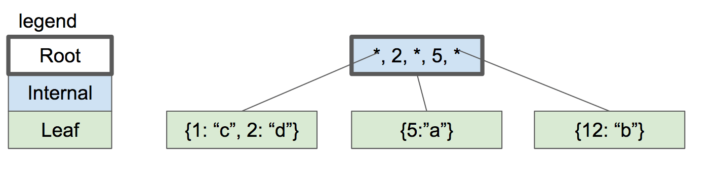
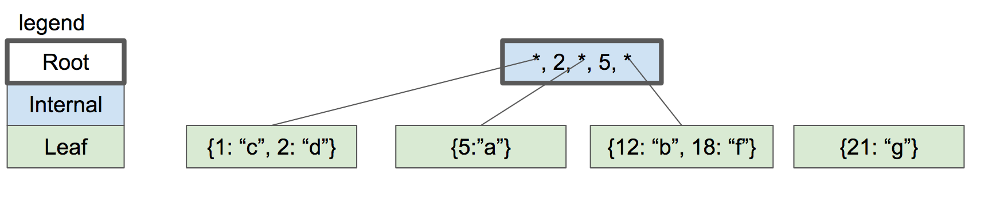
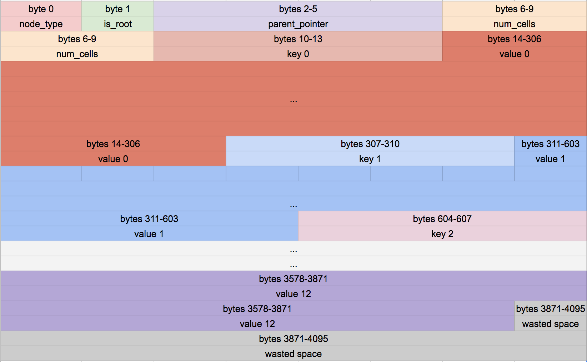

##############################################################################
C 语言从头写一个 SQLite 程序
##############################################################################

.. contents::

******************************************************************************
第 05 部分  持久化到磁盘
******************************************************************************

有了这些变化 ， 我们就能关闭然后重新打开数据库 ， 我们的记录仍然在那里 ！

.. code-block:: C 

    complie: 
    gcc -g -w -Wall -o db simpledb.c

    ~ ./db mydb.db
    db > insert 1 cstack foo@bar.com
    Executed.
    db > insert 2 voltorb volty@example.com
    Executed.
    db > .exit
    ~
    ~ ./db mydb.db
    db > select
    (1, cstack, foo@bar.com)
    (2, voltorb, volty@example.com)
    Executed.
    db > .exit
    ~

为了增加乐趣 ， 让我们看一看 mydb.db ， 看看我们的数据是如何被存储的 。 我将使用 \
vim 作为一个十六进制编辑器来查看文件的内存布局 :

.. code-block:: shell

    vim mydb.db
    :%!xxd

.. image:: img/file-format.png 

Current File Format

前四个字节是第一行的 ID (4个字节 ， 因为我们存储的是 uint32_t) 。 它是以小端 \
(little-endian) 的字节顺序存储的 ， 所以最低字节在前 (01) ， 后面是高序字节 \
(00 00 00) 。 我们使用 ``memcpy()`` 将字节从我们的 Row 结构复制到页面缓存中 ， 所\
以这意味着该结构在内存中是以小端字节顺序排列的 。 这是我编译程序机器的一个属性 。 如\
果我们想在我的机器上写一个数据库文件 ， 然后在大端机器上读取它 ， 我们就必须改变我们\
的 ``serialize_row()`` 和 ``deserialize_row()`` 方法 ， 以便始终以相同的顺序存储\
和读取字节 。 

接下来的 33 个字节将用户名存储为一个空尾字符串 。 显然 ， "cstack" 的 ASCII 码以十\
六进制表示是 63 73 74 61 63 6b ， 后面是一个空字符 (00) 。 其余的 33 个字节没有使\
用 。 

接下来的 256 字节以同样的方式存储电子邮件 。 在这里我们可以看到在结束的空字符之后有\
一些随机的垃圾 。 这很可能是由于我们的 Row 结构中未初始化的内存造成的 。 我们将整个 \
256 字节的电子邮件缓冲区复制到文件中 ， 包括字符串结束后的任何字节 。 当我们分配该结\
构时 ， 内存中的任何东西都还在那里 。 但由于我们使用了一个结束性的空字符 ， 所以它对\
行为没有影响 。 

注意 ： 如果我们想确保所有字节都被初始化 ， 那么在 ``serialize_row`` 中复制行的用户\
名和电子邮件字段时 ， 使用 ``strncpy`` 就足够了 ， 而不是 ``memcpy`` ， 像这样 ： 

.. code-block:: C 

    void serialize_row(Row* source, void* destination)
    {
        memcpy(destination + ID_OFFSET, &(source->id), ID_SIZE);
        strncpy(destination + USERNAME_OFFSET, source->username, USERNAME_SIZE);
        strncpy(destination + EMAIL_OFFSET, source->email, EMAIL_SIZE);
    }

总结 ： 

好了 ！ 我们已经有了持久化 。 这不是最好的实现 。 例如 ， 如果你不输入 ``.exit`` 就\
关闭程序 ， 你就会失去你的改变 。 此外 ， 我们正在把所有的页面写回磁盘 ， 即使是在我\
们从磁盘上读取后没有改变的页面 。 这些问题我们可以在以后解决 。 

下一次我们将介绍 cursors ， 这将使 B 树的实现变得更加容易 。 

在那之前 ! 

`这里[1]`_ 是本节代码的改变 。 

.. _`这里[1]`: https://github.com/Deteriorator/SimpleDB/commit/691460d0a971d3f1a9bc4b60686da2e2c2dd45f9

******************************************************************************
第 06 部分  游标抽象
******************************************************************************

这一部分应该比上一部分短 。 我们只是要重构一下 ， 使之更容易启动 B-Tree 的实现 。 

我们将添加一个 Cursor 对象 ， 它代表了表中的一个位置 。 你可能想用游标做的事情 :

- 在表的开头创建一个游标
- 在表的末端创建一个游标
- 访问光标所指向的行
- 将游标推进到下一行

这些是我们现在要实现的行为 。 以后我们还将想 : 

- 删除游标所指向的行
- 修改游标所指向的记录
- 在表中搜索一个给定的 ID ， 并创建一个游标 ， 指向具有该 ID 的记录 。 

不多说了 ， 这里是光标类型 :

.. code-block:: C 

    typedef struct
    {
        Table* table;
        uint32_t row_num;
        bool end_of_table; // Indicates a position one past the last element
    } Cursor;

考虑到我们目前的表数据结构 ， 你只需要确定表中的一个位置就是行号 。 

一个游标也有一个对它所在表的引用 (所以我们的游标函数可以只接受游标作为参数) 。 

最后 ， 它有一个叫做 ``end_of_table`` 的布尔值 。 这是为了让我们能够表示一个超过表\
尾的位置 (这是我们可能想要插入一条记录的地方) 。 

``table_start()`` 和 ``table_end()`` 创建新的游标 : 

.. code-block:: C 

    Cursor* table_start(Table* table)
    {
        Cursor* cursor = malloc(sizeof(Cursor));
        cursor->table = table;
        cursor->row_num = 0;
        cursor->end_of_table = (table->num_rows == 0);

        return cursor;
    }

    Cursor* table_end(Table* table)
    {
        Cursor* cursor = malloc(sizeof(Cursor));
        cursor->table = table;
        cursor->row_num = table->num_rows;
        cursor->end_of_table = true;

        return cursor;
    }

我们的 ``row_slot()`` 函数将变成 ``cursor_value()`` ， 它返回一个指针到游标描述的\
位置 : 

.. code-block:: C 

    void* cursor_value(Cursor* cursor)
    {
        uint32_t row_num = cursor->row_num;
        uint32_t page_num = row_num / ROWS_PER_PAGE;
        void* page = get_page(cursor->table->pager, page_num);
        uint32_t row_offset = row_num % ROWS_PER_PAGE;
        uint32_t byte_offset = row_offset * ROW_SIZE;
        return page + byte_offset;
    }

在我们当前的表结构中推进游标 ， 就像增加行号一样简单 。 在 B 型树中 ， 这将是一个比\
较复杂的过程 。 

.. code-block:: C 

    void* cursor_advance(Cursor* cursor)
    {
        cursor->row_num += 1;
        if (cursor->row_num >= cursor->table->num_rows)
        {
            cursor->end_of_table = true;
        }
    }

最后我们可以改变我们的 "虚拟机" 方法来使用游标抽象 。 当插入一行时 ， 我们在表的末端\
打开一个游标 ， 写到该游标位置 ， 然后关闭游标 。 

.. code-block:: C 

    ExecuteResult execute_insert(Statement* statement, Table* table)
    {
        if (table->num_rows >= TABLE_MAX_ROWS)
        {
            return EXECUTE_TABLE_FULL;
        }
        Row* row_to_insert = &(statement->row_to_insert);
        Cursor* cursor = table_end(table);
        serialize_row(row_to_insert, cursor_value(cursor));
        table->num_rows += 1;
        free(cursor);
        return EXECUTE_SUCCESS;
    }

当选择表中的所有行时 ， 我们在表的开始处打开一个光标 ， 打印该行 ， 然后将光标推进到\
下一行 。 重复这个过程 ， 直到我们到达表的末端 。 

.. code-block:: c

    ExecuteResult execute_select(Statement* statement, Table* table)
    {
        Cursor* cursor = table_start(table);
        Row row;
        while (!(cursor->end_of_table))
        {
            deserialize_row(cursor_value(cursor), &row);
            print_row(&row);
            cursor_advance(cursor);
        }
        free(cursor);
        return EXECUTE_SUCCESS;
    }

好了就这样吧 ! 就像我说的 ， 这是一个较短的重构 ， 当我们把表的数据结构重写成 \
B-Tree 时 ， 它应该能帮助我们 。 ``execute_select()`` 和 ``execute_insert()`` \
可以完全通过游标与表进行交互 ， 而不需要假设任何关于表的存储方式 。 

`这里[2]`_ 是这部分的完整差异 。 

.. _`这里[2]`: https://github.com/Deteriorator/SimpleDB/commit/d0f57e79a1485cd202ffd3e28cd159747d0b5696

******************************************************************************
第 07 部分  B 型树简介
******************************************************************************

B 树是 SQLite 用来表示表和索引的数据结构 ， 所以它是一个相当核心的概念 。 这篇文章\
将只是介绍这个数据结构 ， 所以不会有任何代码 。 

为什么说树是数据库的一个好的数据结构 ? 

- 搜索一个特定的值是快速的 (对数时间) 。
- 插入 / 删除一个你已经找到的值是快速的 (重新平衡的时间是恒定的) 。
- 遍历一个值的范围是快速的 (不像哈希图) 。 

B 树不同于二进制树 ("B"可能代表发明者的名字 ， 但也可能代表 "平衡") 。 下面是一个 \
B 树的例子 : 

.. image:: img/B-tree.svg

example B-Tree (https://en.wikipedia.org/wiki/File:B-tree.svg)

与二叉树不同 ， B 树中的每个节点可以有 2 个以上的子节点 。 每个节点最多可以有 m 个子\
节点 ， 其中 m 被称为树的 "顺序" 。 为了保持树的基本平衡 ， 我们还说节点必须至少有 \
m/2 个子节点 (四舍五入) 。

异常情况 ： 

- 叶子结点有 0 个孩子
- 根节点可以有少于 m 个子节点 ， 但必须至少有 2 个子节点
- 如果根节点是一个叶子节点 (唯一的节点) ， 它仍然有 0 个子节点

上面的图片是一个 B 树 ， SQLite 用它来存储索引 。 为了存储表 ， SQLite 使用了一种叫\
做 B+ 树的变体 。 

=============================  ================  ===================
Rows                           **B-tree**        **B+tree**  
=============================  ================  ===================
Pronounced                     "Bee Tree"        "Bee Plus Tree"
Used to store                  Indexes           Tables
Internal nodes store keys      Yes               Yes
Internal nodes store values    Yes               No
Number of children per node    Less              More
Internal nodes vs. leaf nodes  Same structure	 Different structure
=============================  ================  ===================

在我们实现索引之前 ， 我只谈 B+ 树 ， 但我只把它称为 B 树或 btree 。 

有子节点的节点被称为 "内部" 节点 。 内部节点和叶子结点的结构是不同的 。 

======================  =============================  ===================
For an order-m tree...  Internal Node                  Leaf Node
======================  =============================  ===================
Stores                  keys and pointers to children  keys and values
Number of keys          up to m-1                      as many as will fit
Number of pointers      number of keys + 1             none
Number of values        none                           number of keys
Key purpose             used for routing               paired with value
Stores values?          No                             Yes
======================  =============================  ===================

让我们通过一个例子来看看当你插入元素时 ， B 树是如何增长的 。 为了简单起见 ， 这棵树\
将是 3 阶的 。 这意味着 : 

- 每个内部节点最多有 3 个子节点
- 每个内部节点最多两个键
- 每个内部节点至少有 2 个子节点
- 每个内部节点至少有 1 个键

一个空的 B 树只有一个节点 ： 根节点 。 根节点开始时是一个叶子节点 ， 有零个键 / 值对 \
。 

.. image:: img/btree1.png 

empty btree

如果我们插入几个键 / 值对 ， 它们会按排序顺序存储在叶子节点中 。 

.. image:: img/btree2.png 

one-node btree

比方说一个叶子节点的容量是两个键 / 值对 。 当我们插入另一个节点时 ， 我们必须拆分叶\
子节点 ， 把一半的键值对放在每个节点中 。 这两个节点都成为一个新的内部节点的子节点 \
， 这个内部节点现在将是根节点 。 

.. image:: img/btree3.png 

two-level btree

内部节点有 1 个键和 2 个指向子节点的指针 。 如果我们想查找一个小于或等于 5 的键 ， \
我们在左边的子节点中查找 。 如果我们想查找一个大于 5 的键 ， 我们就在右边的子节点中\
查找 。 

现在让我们插入键 "2" 。 首先 ， 我们查找它在哪个叶子节点中 ， 如果它是存在的 ， 我们\
到达左边的叶子节点 。 这个节点已经满了 ， 所以我们把叶子节点拆开 ， 在父节点中创建一\
个新条目 。 

four-node btree

让我们继续添加 Key : 18 和 21 。 我们到了必须再次分割的地步 ， 但在父节点中没有空间\
容纳另一个键 / 指针对 。 

no room in internal node

解决办法是将根节点分成两个内部节点 ， 然后创建新的根节点作为它们的父节点 。 

.. image:: img/btree6.png 

three-level btree

只有当我们分割根节点时 ， 树的深度才会增加 。 每个叶子节点都有相同的深度和接近相同数\
量的键 / 值对 ， 所以树保持平衡和快速搜索 。 

在我们实现插入之前 ， 我将暂不讨论从树上删除键的问题 。 

当我们实现这个数据结构时 ， 每个节点将对应于一个页面 。 根节点将存在于第 0 页 。 子\
节点的指针将只是包含子节点的页号 。 

下一节 ， 我们开始实现 btree ! 

******************************************************************************
第 08 部分  B 型树叶子节点格式
******************************************************************************

我们正在改变我们的表的格式 ， 从一个无序的行数组到一个 B-Tree 。 这是一个相当大的变\
化 ， 需要多篇文章来实现 。 在本文结束时 ， 我们将定义叶子节点的布局 ， 并支持将键 \
/ 值对插入单节点树中 。 但首先 ， 让我们回顾一下切换到树形结构的原因 。 

8.1 备用的表格式
==============================================================================

在目前的格式下 ， 每个页面只存储行 (没有元数据) ， 所以它的空间效率相当高 。 插入的\
速度也很快 ， 因为我们只是追加到最后 。 然而要找到某一行 ， 只能通过扫描整个表来完成 \
。 而且如果我们想删除某一行 ， 我们必须通过移动它后面的每一行来填补这个漏洞 。 

如果我们将表存储为一个数组 ， 但将行按 id 排序 ， 我们可以使用二进制搜索来找到一个特\
定的 id 。 然而插入的速度会很慢 ， 因为我们必须移动大量的行来腾出空间 。 

相反我们要用一个树形结构 。 树中的每个节点可以包含数量不等的行 ， 所以我们必须在每个\
节点中存储一些信息来跟踪它包含多少行 。 另外还有所有内部节点的存储开销 ， 这些节点不\
存储任何行 。 作为对较大数据库文件的交换 ， 我们得到了快速插入 、 删除和查询 。 

=============  ======================  ====================  ================================
Row            Unsorted Array of rows  Sorted Array of rows  Tree of nodes
=============  ======================  ====================  ================================
Pages contain  only data               only data             metadata, primary keys, and data
Rows per page  more                    more                  fewer
Insertion      O(1)                    O(n)                  O(log(n))
Deletion       O(n)                    O(n)                  O(log(n))
Lookup by id   O(n)                    O(log(n))             O(log(n))
=============  ======================  ====================  ================================

8.1 节点头部格式
==============================================================================

叶子结点和内部结点有不同的布局 。 让我们做一个枚举来跟踪节点的类型 : 

.. code-block:: C 

    typedef enum
    {
        NODE_INTERNAL, NODE_LEAF
    } NodeType;

每个节点将对应于一个页面 。 内部节点将通过存储子节点的页号来指向它们的子节点 。 \
btree 向 pager 询问一个特定的页码 ， 并得到一个进入页面缓存的指针 。 页面按照页码的\
顺序一个接一个地存储在数据库文件中 。 

节点需要在页面开头的头中存储一些元数据 。 每个节点都将存储它是什么类型的节点 ， 它是\
否是根节点 ， 以及它的父节点的指针 (以便于找到节点的兄弟姐妹) 。 我为每个头字段的大\
小和偏移量定义了常数 。 

.. code-block:: C 

    /*
    * Common Node Header Layout
    */
    const uint32_t NODE_TYPE_SIZE = sizeof(uint8_t);
    const uint32_t NODE_TYPE_OFFSET = 0;
    const uint32_t IS_ROOT_SIZE = sizeof(uint8_t);
    const uint32_t IS_ROOT_OFFSET = NODE_TYPE_SIZE;
    const uint32_t PARENT_POINTER_SIZE = sizeof(uint32_t);
    const uint32_t PARENT_POINTER_OFFSET = IS_ROOT_OFFSET + IS_ROOT_SIZE;
    const uint8_t COMMON_NODE_HEADER_SIZE = NODE_TYPE_SIZE + IS_ROOT_SIZE + PARENT_POINTER_SIZE;

8.2 叶子节点格式
==============================================================================

除了这些常见的头字段外 ， 叶子节点还需要存储它们包含多少个 "单元" 。 一个单元是一个\
键 / 值对 。 

.. code-block:: C 

    /*
    * Leaf Node Header Layout
    */
    const uint32_t LEAF_NODE_NUM_CELLS_SIZE = sizeof(uint32_t);
    const uint32_t LEAF_NODE_NUM_CELLS_OFFSET = COMMON_NODE_HEADER_SIZE;
    const uint32_t LEAF_NODE_HEADER_SIZE = COMMON_NODE_HEADER_SIZE + LEAF_NODE_NUM_CELLS_SIZE;

叶子节点的主体是一个单元格的数组 。 每个单元格是一个键 ， 后面是一个值 (一个序列化的\
行) 。 

.. code-block:: C 

/*
 * Leaf Node Body Layout
 */
const uint32_t LEAF_NODE_KEY_SIZE = sizeof(uint32_t);
const uint32_t LEAF_NODE_KEY_OFFSET = 0;
const uint32_t LEAF_NODE_VALUE_SIZE = ROW_SIZE;
const uint32_t LEAF_NODE_VALUE_OFFSET = LEAF_NODE_KEY_OFFSET + LEAF_NODE_KEY_SIZE;
const uint32_t LEAF_NODE_CELL_SIZE = LEAF_NODE_KEY_SIZE + LEAF_NODE_VALUE_SIZE;
const uint32_t LEAF_NODE_SPACE_FOR_CELLS = PAGE_SIZE - LEAF_NODE_HEADER_SIZE;
const uint32_t LEAF_NODE_MAX_CELLS = LEAF_NODE_SPACE_FOR_CELLS / LEAF_NODE_CELL_SIZE;

基于这些常数 ， 下面是一个叶子节点的布局 ， 目前看起来是这样的 : 

Our leaf node format

在 header 里每个布尔值使用一整个字节 ， 这样空间利用率低 ， 但这使得编写访问这些值的\
代码更容易 。 

还注意到在最后有一些浪费的空间 。 我们在 header 之后尽可能多地存储单元格 ， 但剩下的\
空间不能容纳整个单元格 。 我们把它留空 ， 以避免在节点之间分割单元格 。 

8.3 访问叶子节点字段
==============================================================================

访问键 、 值和元数据的代码都涉及到使用我们刚刚定义的常数的指针运算 。 

.. code-block:: C 

    uint32_t* leaf_node_num_cells(void* node)
    {
        return node + LEAF_NODE_NUM_CELLS_OFFSET;
    }

    void* leaf_node_cell(void* node, uint32_t cell_num)
    {
        return node + LEAF_NODE_HEADER_SIZE + cell_num * LEAF_NODE_CELL_SIZE;
    }

    uint32_t* leaf_node_key(void* node, uint32_t cell_num)
    {
        return leaf_node_cell(node, cell_num);
    }

    void* leaf_node_value(void* node, uint32_t cell_num)
    {
        return leaf_node_cell(node, cell_num) + LEAF_NODE_KEY_SIZE;
    }

    void initialize_leaf_node(void* node)
    {
        *leaf_node_num_cells(node) = 0;
    }

这些方法返回一个指向相关值的指针 ， 所以它们既可以作为一个获取器 ， 也可以作为一个设\
置器使用 。 

未完待续 ...

上一篇文章 ： `上一篇`_

下一篇文章 ： `下一篇`_ 

.. _`上一篇`: Database-In-C-03.rst
.. _`下一篇`: Database-In-C-05.rst
