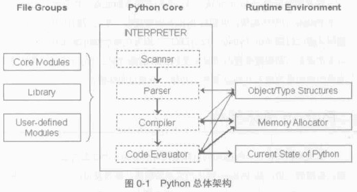
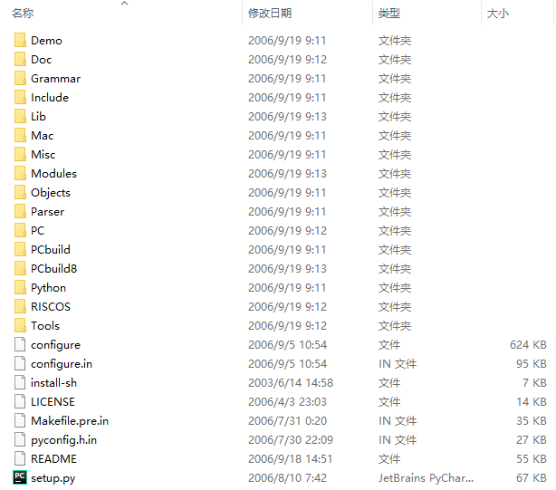
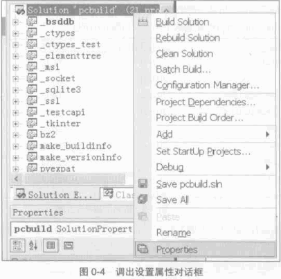
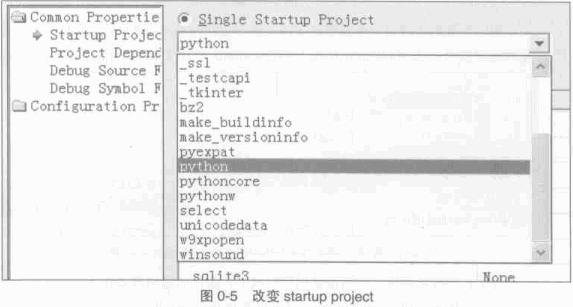
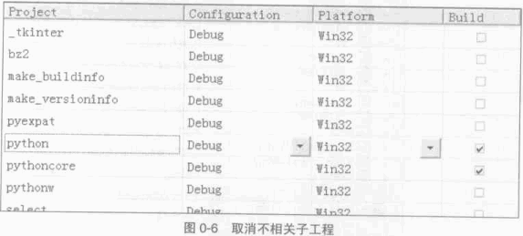
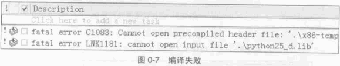
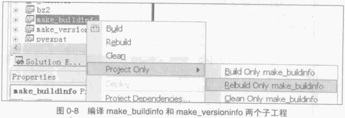

..
    # with overline, for parts
    * with overline, for chapters
    =, for sections
    -, for subsections
    ^, for subsubsections
    ", for paragraphs

##############################################################################
Python 源码阅读系列 1
##############################################################################

此文档为学习 《Python 源码剖析》 笔记 。 代码基于 Python 2.5 。

.. note::

    本文档 (reStructuredText) 约定 : 每篇 500 行 (500 +/- 5) ， 有 5 行是可移动范围 \
    。 495 / 505 行是包含不可见文字的 ， 如果有大篇幅代码片段 ， 可突破 505 行限制 ， \
    但是代码后的文字需移动到下一篇文章中 。 

全书目录 :

- 前言部分  
    - 第 0 章  Python 源码剖析 - 编译 Python 

- 第一部分  Python 内建对象 
    - 第 1 章  Python 对象初探
    - 第 2 章  Python 中的整数对象 
    - 第 3 章  Python 中的字符串对象 
    - 第 4 章  Python 中的 List 对象 
    - 第 5 章  Python 中的 Dict 对象 
    - 第 6 章  最简单的 Python 模拟 - Small Python 

- 第二部分  Python 虚拟机
    - 第 7 章  Python 的编译结果 - Code 对象与 pyc 文件 
    - 第 8 章  Python 虚拟机框架
    - 第 9 章  Python 虚拟机中的一般表达式
    - 第 10 章  Python 虚拟机中的控制流
    - 第 11 章  Python 虚拟机中的函数机制
    - 第 12 章  Python 虚拟机中的类机制

- 第三部分  Python 高级话题
    - 第 13 章  Python 运行环境初始化
    - 第 14 章  Python 模块的动态加载机制
    - 第 15 章  Python 多线程机制
    - 第 16 章  Python 的内存管理机制  

.. contents::

******************************************************************************
第 0 章  Python 源码剖析 - 编译 Python 
******************************************************************************

0.1 Python 总体架构
==============================================================================

Python 的整体架构可以分为三个主要的部分 ， 整个架构如图 0-1 所示 。 图左侧是 \
Python 提供的大量的模块 、 库以及用户自定义的模块 。 图右侧是 Python 的运行时环境 ，\
包括对象/类型系统 (Object/Type structure) 、 内存分配器 (Memory Allocator) 和运行\
时状态信息 (Current State of Python) 。 

运行时状态维护了解释器在执行字节码是不同的状态 (如正常状态和异常状态) 之间的切换动作 \
， 将之视为一个巨大而复杂的又穷状态机。 

内存分配器则全权负责 Python 中创建对象时 ， 对内存的申请工作 ， 实际上就是 Python \
运行时与 C 中 malloc 的一层接口 。

对象/类型系统包含了 Python 中存在的各种内建对象 ， 如整数 、 list 和 dict 以及各种\
用户自定义的类型和对象 。

中间部分是 Python 的核心 -- 解释器 (interpreter) 或称为虚拟机 。 在解释器中 ， 箭\
头的方向指示了 Python 运行过程中的数据流方向 。 其中 Scanner 对应词法分析 ， 将文件\
输入的 Python 源代码或从命令行输入的一行行 Python 代码切分为一个个的 token ; \
Parser 对应语法分析 ， 在 Scanner 的分析结果上进行语法分析 ， 建立抽象语法树 (AST) \
; Complier 是根据建立的 AST 生成指令集合 -- Python 字节码 (Byte Code) ， 就像 \
Java 编译器和 C# 编译器所做的工作 ； 最后由 Code Evaluator 执行字节码 。 因此 Code \
Evaluator 又被称为虚拟机 。

图中 ， 在解释器与右边的对象/类型系统 、 内存分配器之间的箭头表示 "使用" 关系 ； 而\
与运行时状态之间的箭头表示 "修改" 关系 ； 即 Python 在执行的过程中会不断修改当前解释\
器所处的状态 ， 在不同的状态之间切换 。 

0.2 Python 源代码组织
==============================================================================

Python 2.5 的代码结构如下：

- **Include** : 该目录下包含了 Python 提供的所有头文件 ， 如果用户需要自己用 C 或 \
  C++ 来编写自定义模块拓展 Python ， 那么久需要用到这里提供的文件 。

- **Lib** : 该目录包含了 Python 自带的所有标准库 ， Lib 中的库都是用 Python 语言编\
  写的 。

- **Modules** : 该目录中包含了所有用 C 语言编写的模块 ， 比如 ``random`` 、 \
  ``cStringIO`` 等 。 ``Modules`` 中的模块是那些对速度要求非常严格的模块 ， 而有一\
  些对速度没有太严格要求的模块 ， 比如 ``os`` ， 就是用 Python 编写 ， 而且放在 \
  Lib 目录下 。

- **Parser** : 该目录中包含了 Python 解释器中的 Scanner 和 Parser 部分 ， 即对 \
  Python 源代码进行词法分析和语法分析的部分，。除了这些， Parser 目录下还包含了一些\
  有用的工具，这些工具能够根据 Python 语言的语法自动生成 Python 语言的词法和语法分\
  析器，于 YACC 非常类似。

- **Objects** : 该目录中包含了所有 Python 的内建对象 ， 包括整数 、 List 、 Dict \
  等 。 同时 ， 该目录还包括了 Python 在运行时所需要的所有的内部使用对象的实现 。

- **Python** : 该目录下包含了 Python 解释器中的 Compiler 和执行引擎部分 ， 是\
  Python 运行的核心所在 。

- **PCBuild** : 包含了 Visual Studio 2003 的工程文件 ， 研究 Python 源代码就\
  从这里开始 （书中使用 VS2003 对 Python 进行编译） 。 

- **PCBuild8** : 包含了 Visual Studio 2005 使用的工程文件

编译的时候只选择 ``pythoncore`` 和 ``python`` 子工程 ， 但是编译的时候仍然会报错 \
， 缺少了一个必要文件 ， 源码包中没有提供 ， 需要编译 ``make_buildinfo`` 和 \
``make_versioninfo`` 子工程生成 。

编译成功后 ， 结果都在 build 文件夹下 ， 主要有两个 ： python25.dll 和 python.exe \
。 Python 解释器的全部代码都在 python25.dll 中 。 对于 WinXP 系统 ， 安装 python \
时 ， python25.dll 会被拷贝到 ``C:\Windows\system32`` 下 。 （此结果来自与书中 ， \
后续我会尝试在本地编译一次试试） 。

0.3 Windows 环境下编译 Python 
==============================================================================

首先配置工程 ， 如图 0-4 所示：

在配置对话框中 ， 首先修改 Startup Project ， Python 2.5 中默认设置的是 _bsddb ， \
需要改为 Python 如图 0-5 所示

只剖析 Python 的 核心部分 ， 不会涉及工程中的一些标准库和其他模块 ， 所以将其从编译列\
表中删除 。 点击配置对话框中的 "Configuration Properties" 后 ， 出现当前配置为需要编\
译的子工程 ， 取消多余的子工程的选中状态 ， 只保留 pythoncore 和 Python 的选中状态 ， \
如图 0-6 所示 ：

做完这些改动之后 ， 不能直接编译 ， 否则仍会失败 。 

这是因为需要一个必要的文件 ， 这个文件需要通过编译 make_buildinfo 和 \
make_versioninfo 子工程 (如图 0-8所示) 才能完成 ：

编译的结果都放在 build 文件夹下 ， 主要有两个 ： python25.dll 和 Python.exe 。 实\
际 python.exe 非常小 ， Python 解释器的全部代码都在 python25.dll 中 。 对于 WinXP \
操作系统 ， 在安装时 ， python25.dll 会被拷贝到 C:\Windows\system32 目录下 。 

0.4 Unix/Linux 环境下编译 Python
==============================================================================

- ./configure --prefix=<期望 Python 安装的目录路径>

- make 

- make install

三个步骤执行完毕后 ， 指定的路径下会显示 Python 安装的结果 。 bin 下存放的是可执行文\
件 ； 目录 lib 下存放的是 Python 的标准库 ； lib/python2.5/config 下存放的是 \
libpython2.5.a ， 用 C 语言对 Python 进行拓展时需要用到这个静态库 。 

0.5 修改 Python 源代码
==============================================================================

书中修改了一个函数的源代码，它的原始代码在 Objects/intobject.c 里面，代码如下：

.. code-block:: c

    [Objects/intobject.c]

    static int
    int_print(PyIntObject *v, FILE *fp, int flags)
    /* flags -- not used but required by interface */
    {
        fprintf(fp, "%ld", v->ob_ival);
        return 0;
    }

然后借用 Python 的 C API 中提供的输出对象接口，代码在 Include/object.h 文件里 ， \
代码如下 ：

.. code-block:: c

    [Include/object.h]

    PyAPI_FUNC(int) PyObject_Print(PyObject *, FILE *, int);

修改后的代码如下 ：

.. code-block:: c

    static int
    int_print(PyIntObject *v, FILE *fp, int flags)
        /* flags -- not used but required by interface */
    {
      
        PyObject* str = PyString_FromString("i am in int_print");
        PyObject_Print(str, stdout, 0);
        printf("\n");

        fprintf(fp, "%ld", v->ob_ival);
        return 0;
    }

``PyString_FromString`` 是 Python 提供的 C API ， 用于从 C 中的原生字符数组创建\
出 Python 中的字符串对象 。 ``PyObject_Print`` 函数中第二个参数指明的是输出目标 。 \
代码中使用的是 ``stdout`` ， 即指定的输出目标是标准输出 。

重定向输出 ：

.. code-block:: c 

    static PyObject *
    int_repr(PyIntObject *v)
    {
        char buf[64];
        PyOS_snprintf(buf, sizeof(buf), "%ld", v->ob_ival);
        return PyString_FromString(buf);
    }

添加重定向输出后的代码 ：

.. code-block:: c 

    static PyObject *
    int_repr(PyIntObject *v)
    {
        if(PyInt_AsLong(v) == -999){
            PyObject* str = PyString_FromString("i am in int_repr");
            PyObject* out = PySys_GetObject("stdout");
            if (out != NULL) {
                PyObject_Print(str, stdout, 0);
                printf("\n");
            }
        }

        char buf[64];
        PyOS_snprintf(buf, sizeof(buf), "%ld", v->ob_ival);
        return PyString_FromString(buf);
    }

``PyInt_AsLong`` 的功能是将 Python 的整数对象转换为 C 中的 int 值 。

0.6 通往 Python 之路
==============================================================================

将精力放在虚拟机 ， 对于词法解析 ， 语法解析和编译并不涉及。

- 第一部分 ： Python 内建对象

- 第二部分 ： Python 虚拟机

- 第三部分 ： Python 高级话题

0.7 注意事项
==============================================================================

通常 Python 的源代码中会使用 PyObject_GC_New , PyObject_GC_Malloc, PyMem_MALLOC \
, PyObject_MALLOC 等 API ， 只需坚持一个原则，即凡是以 New 结尾的 ， 都以 C++ 中的 \
new 操作符视之 ； 凡是以 Malloc 结尾的 ， 都以 C 中的 malloc 操作符视之 。 （C++ \
中的 new 我不知道啊 ^_^! , 找时间了解一下） 。 例如 ：

.. code-block:: c 

    [PyString_FromString() in stringobject.c]

    op = (PyStringObject *)PyObject_MALLOC(sizeof(PyStringObject) + size);

    等效于：
    
    PyStringObject* op = (PyStringObject*)malloc(sizeof(PyStringObject) + size)

    [PyList_New() in listobject.c]
    
    op = PyObject_GC_New(PyListObject, &PyList_Type);
    
    等效于：
    
    PyListObject* op = new PyList_Type();

    op->ob_item = (PyObject **) PyMem_MALLOC(nbytes);
    
    等效于：
    
    op->ob_item = (PyObject **)malloc(nbytes);

******************************************************************************
第 1 章  Python 对象初探
******************************************************************************

1.1 Python 内的对象
==============================================================================

对象是数据以及基于这些数据的操作的集合 。 在计算机中 ， 一个对象实际上就是一片被分配\
的内存空间 ， 这些内存可能是连续的 ， 也可能是离散的 ， 这并不重要 ， 重要的是这片内\
存在更高层次上可以作为一个整体来考虑 ， 这个整体就是一个对象 。 在这片内存中 ， 存储\
着一系列的数据以及可以对这些数据进行修改或读取操作的一系列代码 。

在 Python 中 ， 对象就是为 C 中的结构体在堆上申请的一块内存 ， 一般来说 ， 对象是不\
能被静态初始化的 ， 而且也不能在栈空间上生存 。 唯一的例外就是类型对象 ， Python 中\
所有的内建的类型对象 （如整数类型对象 ， 字符串类型对象） 都是被静态初始化的 。

在 Python 中 ， 一个对象一旦被创建 ， 它在内存中的大小就是不变的了 。 这意味着那些\
需要容纳可变长度数据的对象只能在对象内维护一个指向一块可变大小的内存区域的指针 。 

1.1.1 Python 对象的基石 - PyObject
------------------------------------------------------------------------------

在 Python 中 ， 所有的东西都是对象 ， 而所有的对象都拥有一些相同的内容 ， 这些内容在 \
PyObject 中定义 ， PyObject 是整个 Python 对象机制的核心 。

.. code-block:: c

    [Include/object.h]

    typedef struct _object {
        PyObject_HEAD
    } PyObject;

这个结构体是 Python 对象机制的核心基石 ， 从代码中可以看到 ， Python 对象的秘密都隐\
藏在 PyObject_HEAD 这个宏中 。

.. code-block:: c

    [Include/object.h]

    #ifdef Py_TRACE_REFS
    /* Define pointers to support a doubly-linked list of all live heap objects. */
    #define _PyObject_HEAD_EXTRA		\
        struct _object *_ob_next;	\
        struct _object *_ob_prev;

    #define _PyObject_EXTRA_INIT 0, 0,

    #else
    #define _PyObject_HEAD_EXTRA
    #define _PyObject_EXTRA_INIT
    #endif

    /* PyObject_HEAD defines the initial segment of every PyObject. */
    #define PyObject_HEAD			\
        _PyObject_HEAD_EXTRA		\
        Py_ssize_t ob_refcnt;		\
        struct _typeobject *ob_type;

Release 编译 Python 的时候 ， 是不会定义符号 Py_TRACE_REFS 的 。 所以在实际发布的 \
Python 中 ， PyObject 的定义非常简单 ： 

.. code-block:: c

    [Include/object.h]

    typedef struct _object {
        Py_ssize_t ob_refcnt;		// 书中是 int ob_refcnt; 对此我有点而疑惑
        struct _typeobject *ob_type;
    } PyObject;    

在 PyObject 的定义中 ， 整型变量 ob_refcnt (目前不确定是不是整型 ， 但是书中是的) \
与 Python 的内存管理机制有关 ， 它实现了基于引用计数的垃圾搜集机制 。 对于某一个对象 \
A ， 当有一个新的 PyObject * 引用该对象时 ， A 的引用计数应该增加 ； 而当这个 \
PyObject * 被删除时 ， A 的引用计数应该减少 。 当 A 的引用计数减少到 0 时 ， A 就\
可以从堆上被删除 ， 以释放出内存供别的对象使用 。

ob_type 是一个指向 _typeobject 结构体的指针 ， _typeobject 结构体对应着 Python 内\
部的一种特殊对象 ， 用来指定一个对象类型的类型对象 。

由此可以看出 ， 在 Python 中 ， 对象机制的核心其实非常简单 ， 一个是引用计数 ， 一个\
就是类型信息 。

在 PyObject 中定义了每个 Python 对象都必须有的内容 ， 这些内容将出现在每个 Python \
对象所占有的内存的最开始的字节中 。 例如 ： 

.. code-block:: c

    [Include/intobject.h]

    typedef struct {
        PyObject_HEAD
        long ob_ival;
    } PyIntObject;

Python 的整数对象中 ， 除了 PyObject ， 还有一个额外的 long 变量 ， 整数的值就保存\
在 ob_ival 中 。 同样 ， 字符串对象 、 list对象 、 dict对象 、 其他对象 ， 都在 \
PyObject 之外保存了属于自己的特殊信息 。

1.1.2 定长对象和变长对象
------------------------------------------------------------------------------

整数对象的特殊信息是一个 C 中的整型变量 ， 无论这个整数对象的值有多大 ， 都可以保存在\
这个整型变量 ( ob_ival ) 中 。 Python 在 PyObject 对象之外，还有一个表示这类对象的\
结构体 - PyVarObject :

.. code-block:: c 

    [Include/object.h]

    #define PyObject_VAR_HEAD		\
        PyObject_HEAD			\
        Py_ssize_t ob_size; /* Number of items in variable part */
        // 此处书中是 int ob_size
    
    typedef struct {
        PyObject_VAR_HEAD
    } PyVarObject;

把整数对象这样不包含可变数据的对象称为 "定长对象" ， 而字符串对象这样的包含了可变数据\
的对象称为 "变长对象" 。 区别在于定长对象的不同对象占用的内存大小是一样的，而变长对象\
的不同对象占用的内存可能是不一样的 。 比如 ， 整数对象 "1" 和 "100" 占用的内存大小都\
是 sizeof(PyIntObject) ， 而字符串对象 "Python" 和 "Ruby" 占用的内存大小就不同了 \
。 正是这种区别导致了 PyVarObject 对象中 ob_size 的出现 。 变长对象通常都是容器 ， \
ob_size 这个成员实际上就是指明了变长对象中一共容纳了多少个元素 。 注意 ， ob_size 指\
明的是所容纳元素的个数 ， 而不是字节的数量 。 例如 ， Python 中最常用的 list 就是一\
个 PyVarObject 对象 ， 如果 list 中有 5 个元素 ， 那么 ob_size 的值就是 5 。

从 PyObject_VAR_HEAD 的定义可以看出 ， PyVarObject 实际上只是对 PyObject 的一个拓\
展 。 因此对于任何一个 PyVarObject ， 其所占用的内存 ， 开始部分的字节的意义和 \
PyObject 是一样的 。 在 Python 内部 ， 每个对象都拥有相同的对象头部 ， 这使得 \
Python 中对对象的引用变得非常统一 ， 只需要用一个 PyObject * 指针就可以引用任意的一\
个对象 ， 不论该对象实际是什么对象 。

.. image:: img/pyobject-1-1.png

1.2 类型对象
==============================================================================

当在内存中分配空间 ， 创建对象的时候 ， 必须要知道申请多大的空间 。 显然 ， 这不是一\
个定值 ， 因为不同的对象需要不同的空间 。 对象所需的内存空间的大小信息虽然不显见于 \
PyObject 的定义中 ， 但它却隐身于 PyObject 中 。

实际上 ， 占用内存空间的大小是对象的一种元信息 ， 这样的元信息是与对象所属类型密切相\
关的 ， 因此一定会出现在与对象所对应的类型对象中 ， 详细考察一下类型对象 _typeobject :

.. code-block:: c 

    [Include/object.h]

    typedef struct _typeobject {
        PyObject_VAR_HEAD
        const char *tp_name; /* For printing, in format "<module>.<name>" */
        Py_ssize_t tp_basicsize, tp_itemsize; /* For allocation */

        /* Methods to implement standard operations */

        destructor tp_dealloc;
        printfunc tp_print;
        getattrfunc tp_getattr;
        setattrfunc tp_setattr;
        cmpfunc tp_compare;
        reprfunc tp_repr;

        /* Method suites for standard classes */

        PyNumberMethods *tp_as_number;
        PySequenceMethods *tp_as_sequence;
        PyMappingMethods *tp_as_mapping;

        /* More standard operations (here for binary compatibility) */

        hashfunc tp_hash;
        ternaryfunc tp_call;
        reprfunc tp_str;
        getattrofunc tp_getattro;
        setattrofunc tp_setattro;

        /* Functions to access object as input/output buffer */
        PyBufferProcs *tp_as_buffer;

        /* Flags to define presence of optional/expanded features */
        long tp_flags;

        const char *tp_doc; /* Documentation string */

        /* Assigned meaning in release 2.0 */
        /* call function for all accessible objects */
        traverseproc tp_traverse;

        /* delete references to contained objects */
        inquiry tp_clear;

        /* Assigned meaning in release 2.1 */
        /* rich comparisons */
        richcmpfunc tp_richcompare;

        /* weak reference enabler */
        Py_ssize_t tp_weaklistoffset;

        /* Added in release 2.2 */
        /* Iterators */
        getiterfunc tp_iter;
        iternextfunc tp_iternext;

        /* Attribute descriptor and subclassing stuff */
        struct PyMethodDef *tp_methods;
        struct PyMemberDef *tp_members;
        struct PyGetSetDef *tp_getset;
        struct _typeobject *tp_base;
        PyObject *tp_dict;
        descrgetfunc tp_descr_get;
        descrsetfunc tp_descr_set;
        Py_ssize_t tp_dictoffset;
        initproc tp_init;
        allocfunc tp_alloc;
        newfunc tp_new;
        freefunc tp_free; /* Low-level free-memory routine */
        inquiry tp_is_gc; /* For PyObject_IS_GC */
        PyObject *tp_bases;
        PyObject *tp_mro; /* method resolution order */
        PyObject *tp_cache;
        PyObject *tp_subclasses;
        PyObject *tp_weaklist;
        destructor tp_del;

    #ifdef COUNT_ALLOCS
        /* these must be last and never explicitly initialized */
        Py_ssize_t tp_allocs;
        Py_ssize_t tp_frees;
        Py_ssize_t tp_maxalloc;
        struct _typeobject *tp_prev;
        struct _typeobject *tp_next;
    #endif
    } PyTypeObject;

未完待续...
