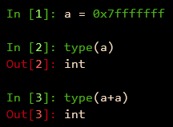
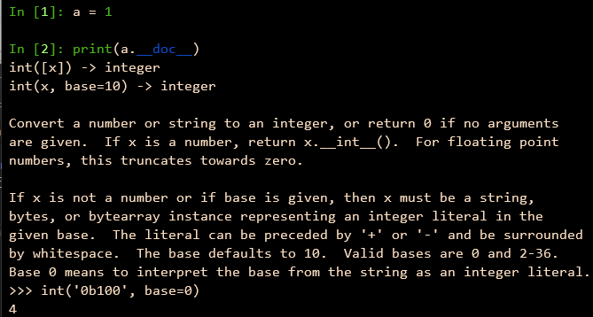
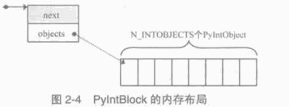
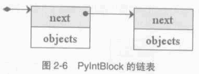

Python 源码阅读系列 2
---------------------------------

前言
===================

承接上文。

在 Python 的实现中，对某些会频繁执行的代码，都会同时提供函数和宏两种版本，比如上午中的 \
PyInt_AS_LONG ， 与之对应的还有一个函数 PyInt_AsLong 。宏版本的 PyInt_AS_LONG 可以省\
去一次函数调用的开销，但是其牺牲了类被安全，因为其参数 op 完全可以不是一个 PyIntObject \
对象， intobject.c 中的函数版 PyInt_AsLong 则会多方检查类型安全性，但是牺牲了执行效率。

从 PyIntObject 对象的加法操作的实现可以清晰地看到 PyIntObject 是一个 immutable 的对\
象， 因为操作完成后，原来参与操作的任何一个对象都没有发生改变，取而代之的是一个全新的 \
PyIntObject 对象诞生。

如果加法结果溢出，其结果就不是一个 PyIntObject 对象，而是一个 PyLongObject 对象。例如：

.. image:: img/2-1.png 

图 2-1 加法溢出的例中

图 2-1-0 Python 3.7.7 版本实际结果

另一个有趣的元信息是 PyIntObject 对象的文档信息，其维护在 int_doc 域中。文档无缝地集成在语\
言中。可以在 Python 的交互环境下通过 PyIntObject 对象的 __doc__ 属性看到 int_doc 维护的\
文档：

图 2-2 整数文档信息

.. code-block:: c 

    [Include/Python.h]

    /* Define macros for inline documentation. */
    #define PyDoc_VAR(name) static char name[]
    #define PyDoc_STRVAR(name,str) PyDoc_VAR(name) = PyDoc_STR(str)
    #ifdef WITH_DOC_STRINGS
    #define PyDoc_STR(str) str
    #else
    #define PyDoc_STR(str) ""
    #endif

    [Objects/intobject.c]

    PyDoc_STRVAR(int_doc,
    "int(x[, base]) -> integer\n\
    \n\
    Convert a string or number to an integer, if possible.  A floating point\n\
    argument will be truncated towards zero (this does not include a string\n\
    representation of a floating point number!)  When converting a string, use\n\
    the optional base.  It is an error to supply a base when converting a\n\
    non-string. If the argument is outside the integer range a long object\n\
    will be returned instead.");

2.2 PyIntObject 对象的创建和维护
==================================

2.2.1 对象创建的 3 种途径
++++++++++++++++++++++++++++++++++

在 Python 自身的实现中，几乎都是调用 C API 来创建内建实例对象。而内建对象即便是通过内建类\
型对象中的 tp_new , tp_init 操作创建实例对象，实际上最终还是会调用 Python 为特定对象准备\
的 C API 。

在 intobject.h 中可以看到，为了创建 PyIntObject 对象， Python 提供了 3 条途径，分别从 \
long 值， 从字符串以及 Py_UNICODE 对象生成 PyIntObject 对象。 

.. code-block:: c 

    PyAPI_FUNC(PyObject *) PyInt_FromString(char*, char**, int);
    #ifdef Py_USING_UNICODE
    PyAPI_FUNC(PyObject *) PyInt_FromUnicode(Py_UNICODE*, Py_ssize_t, int);
    #endif
    PyAPI_FUNC(PyObject *) PyInt_FromLong(long);

只考察从 long 值生成 PyIntObject 对象。因为 PyInt_FromString 和 PyInt_FromUnicode \
实际上都是先将字符串或 Py_UNICODE 对象转换成浮点数。然后再调用 PyInt_FromFloat。 它们\
不过利用了 Adaptor Pattern 的思想对整数对象的核心创建函数 PyInt_FromFloat 进行了接口\
转换罢了。

.. code-block:: c 

    PyObject *
    PyInt_FromString(char *s, char **pend, int base)
    {
        char *end;
        long x;
        Py_ssize_t slen;
        PyObject *sobj, *srepr;

        if ((base != 0 && base < 2) || base > 36) {
            PyErr_SetString(PyExc_ValueError,
                    "int() base must be >= 2 and <= 36");
            return NULL;
        }

        while (*s && isspace(Py_CHARMASK(*s)))
            s++;
        errno = 0;

        // 将字符串转换为 long 
        if (base == 0 && s[0] == '0') {
            x = (long) PyOS_strtoul(s, &end, base);
            if (x < 0)
                return PyLong_FromString(s, pend, base);
        }
        else
            x = PyOS_strtol(s, &end, base);
        if (end == s || !isalnum(Py_CHARMASK(end[-1])))
            goto bad;
        while (*end && isspace(Py_CHARMASK(*end)))
            end++;
        if (*end != '\0') {
    bad:
            slen = strlen(s) < 200 ? strlen(s) : 200;
            sobj = PyString_FromStringAndSize(s, slen);
            if (sobj == NULL)
                return NULL;
            srepr = PyObject_Repr(sobj);
            Py_DECREF(sobj);
            if (srepr == NULL)
                return NULL;
            PyErr_Format(PyExc_ValueError,
                    "invalid literal for int() with base %d: %s",
                    base, PyString_AS_STRING(srepr));
            Py_DECREF(srepr);
            return NULL;
        }
        else if (errno != 0)
            return PyLong_FromString(s, pend, base);
        if (pend)
            *pend = end;
        return PyInt_FromLong(x);
    }

2.2.2 小整数对象
++++++++++++++++++++++++

在 Python 中，对于小整数对象使用了对象池技术。

.. code-block:: c 

    [Objects/intobject.c]

    #ifndef NSMALLPOSINTS
        #define NSMALLPOSINTS		257
    #endif
    #ifndef NSMALLNEGINTS
        #define NSMALLNEGINTS		5
    #endif
    #if NSMALLNEGINTS + NSMALLPOSINTS > 0
        /* References to small integers are saved in this array so that they
        can be shared.
        The integers that are saved are those in the range
        -NSMALLNEGINTS (inclusive) to NSMALLPOSINTS (not inclusive).
        */
        static PyIntObject *small_ints[NSMALLNEGINTS + NSMALLPOSINTS];
    #endif

这个毫不起眼的 small_ints 就是举足轻重的小整数对象的对象池，准确地说，是 PyIntObject * \
池， 不过一般称其为小整数对象池。在 Python 2.5 中，将小整数集合的范围默认为 [-5, 257)。\
可以通过修改 NSMALLPOSINTS 和 NSMALLNEGINTS 重新编译 Python ，从而将这个范围向两端\
伸展或收缩。

2.2.3 大整数对象
+++++++++++++++++++++++++++

对于小整数，在小整数对象池中完全缓存了 PyIntObject 对象。而对于其他整数， Python 运行\
环境提供了一块内存空间，由大整数轮流使用。在 Python 中， 有一个 PyIntBlock 结构，在这\
基础上，实现了一个单向列表。

.. code-block:: c

    [Objects/intobject.c]

    #define BLOCK_SIZE	1000	/* 1K less typical malloc overhead */
    #define BHEAD_SIZE	8	/* Enough for a 64-bit pointer */
    #define N_INTOBJECTS	((BLOCK_SIZE - BHEAD_SIZE) / sizeof(PyIntObject))

    struct _intblock {
        struct _intblock *next;
        PyIntObject objects[N_INTOBJECTS];
    };

    typedef struct _intblock PyIntBlock;

    static PyIntBlock *block_list = NULL;
    static PyIntObject *free_list = NULL;

PyIntBlock 这个结构里维护了一块内存 (block)，其中保存了一些 PyIntObject 对象。从定义中\
可以看出一个 PyIntBlock 中维护着 N_INTOBJECTS 个对象，计算后是 82 个。这里也可以动态调整。

PyIntBlock 的单向列表通过 block_list 维护，每个 block 中都维护了一个 PyIntObject 数组\
-- objects ， 这就是真正用于存储被缓存的 PyIntObject 对象的内存。 Python 使用一个单向\
链表来管理全部 block 的 objects 中所有的空闲内存，这个自由内存链表的表头就是 free_list 。 
最开始时，两个指针都被设置为空指针。

2.2.4 添加和删除
++++++++++++++++++++++++

下面通过 PyInt_FromLong 进行细致入微的考察，真实展现一个个 PyIntObject 对象的产生。

.. code-block:: c

    [Objects/intobject.c]

    PyObject *
    PyInt_FromLong(long ival)
    {
        register PyIntObject *v;
    #if NSMALLNEGINTS + NSMALLPOSINTS > 0
    // [1] ：尝试使用小整数对象池
        if (-NSMALLNEGINTS <= ival && ival < NSMALLPOSINTS) {
            v = small_ints[ival + NSMALLNEGINTS];
            Py_INCREF(v);
    #ifdef COUNT_ALLOCS
            if (ival >= 0)
                quick_int_allocs++;
            else
                quick_neg_int_allocs++;
    #endif
            return (PyObject *) v;
        }
    #endif
    // [2]： 为通用整数对象池申请新的内存空间
        if (free_list == NULL) {
            if ((free_list = fill_free_list()) == NULL)
                return NULL;
        }
        /* Inline PyObject_New */
        // [3] ： (inline) 内联 PyObject_New 的行为
        v = free_list;
        free_list = (PyIntObject *)v->ob_type;
        PyObject_INIT(v, &PyInt_Type);
        v->ob_ival = ival;
        return (PyObject *) v;
    }

PyIntObject 对象的创建通过两步完成(上述代码是 Python 2.5 代码，与书中有出入)：

.. code-block::

    PyObject *
    PyInt_FromLong(long ival)
    {
        register PyIntObject *v;
    #if NSMALLNEGINTS + NSMALLPOSINTS > 0
    // [1] ：尝试使用小整数对象池
        if (-NSMALLNEGINTS <= ival && ival < NSMALLPOSINTS) {
            v = small_ints[ival + NSMALLNEGINTS];
            Py_INCREF(v);
            return (PyObject *) v;
        }
    #endif
    // [2]： 为通用整数对象池申请新的内存空间
        if (free_list == NULL) {
            if ((free_list = fill_free_list()) == NULL)
                return NULL;
        }
        /* Inline PyObject_New */
        // [3] ： (inline) 内联 PyObject_New 的行为
        v = free_list;
        free_list = (PyIntObject *)v->ob_type;
        PyObject_INIT(v, &PyInt_Type);
        v->ob_ival = ival;
        return (PyObject *) v;
    }

- 如果小整数对象池机制被激活，则尝试使用小整数对象池；
- 如果不能使用小整数对象池，则使用通用的整数对象池。

2.2.4.1 使用小整数对象池
**********************************

如果 NSMALLNEGINTS + NSMALLPOSINTS > 0 ， Python 认为小整数对象池机制被激活， \
PyInt_FromLong 会首先在 [1] 处检查传入的 long 值是否属于小整数范围，如果是小整数，只\
需要返回小整数对象池中的对应的对象就可以了。

如果小整数对象池机制没有被激活，或传入的 long 值不是小整数， Python 就会转向由 \
block_list 维护的通用整数对象池。

2.2.4.2 创建通用整数对象池
+++++++++++++++++++++++++++++

首次调用 PyInt_FromLong 时， free_list 为 NULL ， 这时 Python 会在 [2] 处调用 \
fill_free_list 创建新的 block ，从而创建新的空闲内存。Python 对 fill_free_list \
的调用不光会发生在 PyInt_FromLong 的首次调用时，在 Python 运行期间，只要所有 block \
的空闲内存被使用完，就会导致 free_list 变为 NULL ，从而在下一次 PyInt_FromLong 的调\
用时激发对 fill_free_list 的调用。

.. code-block:: c 

    static PyIntObject *
    fill_free_list(void)
    {
        PyIntObject *p, *q;
        /* Python's object allocator isn't appropriate for large blocks. */
        // [1]: 申请大小为 sizeof(PyIntBlock) 的内存空间，并链接到已有的 block_list 中
        p = (PyIntObject *) PyMem_MALLOC(sizeof(PyIntBlock));
        if (p == NULL)
            return (PyIntObject *) PyErr_NoMemory();
        ((PyIntBlock *)p)->next = block_list;
        block_list = (PyIntBlock *)p;
        /* Link the int objects together, from rear to front, then return
        the address of the last int object in the block. */
        // [2]: 将PyIntBlock 中的 PyIntObject 数组--objects--转变成单向链表
        p = &((PyIntBlock *)p)->objects[0];
        q = p + N_INTOBJECTS;
        while (--q > p)
            q->ob_type = (struct _typeobject *)(q-1);
        q->ob_type = NULL;
        return p + N_INTOBJECTS - 1;
    }

在 fill_free_list 中，在 [1] 处申请一个新的 PyIntBlock 结构。

注意: 途中的虚线并表示指针关系，虚线表示 objects 的更详细的表示方式

这时 block 中的 objects 还仅仅是一个 PyIntObject 对象的数组，然后 Python 将 Objects \
中的所有 PyIntObject 对象通过指针依次连接起来，从而将数组变成一个单向链表，这是 [2] 处\
的行为。从 objects 数组最后一个元素开始链接， 在链接过程中， Python 使用了 PyObject \
中的 ob_type 指针作为链接指针。

图 2-5 展示了 [2] 处的链表转换动作完成之后的 block ，其中用虚线箭头展示了 [2] 开始时 \
p 和 q 的初始状态。当链表转换完成之后， free_list 也出现在它该出现的位置。 从 \
free_list 开始，沿着 ob_type 指针，就可以遍历刚刚创建的 PyIntBlock 中多有空闲的为 \
PyIntBlock 准备的内存了。

.. image:: img/2-5.png

当一个 block 中还有剩余的内存没有被一个 PyIntBlock 占用时， free_list 就不会指向 \
NULL 。这种情况下调用 PyInt_FromLong 不会申请新的 block 。只有所有 block 中的内存都被\
占用了， PyInt_FromLong 才会再次调用 fill_free_list 申请新的空间，为新的 PyIntObject \
创建新的家园。

Python 通过 block_list 维护整个整数对象的通用对象池。新创建的 block 必须加入到 block_list \
所维护的链表中，这个动作在 [1] 处完成。 图 2-6 显示了两次申请 block 后 block_list 所维\
护的链表的情况。 block_list 始终指向最新创建的 PyIntBlock 对象。

2.2.4.3 使用通用整数对象池
+++++++++++++++++++++++++++++

在 PyInt_FromLong 中，必要的空间申请之后， Python 会从当前有 free_list 所维护的自由内存\
链表中划出一块，并在这块内存上创建所需要的新的 PyIntObject 对象， 同时，还会对 PyIntObject \
对象完成必要的初始化工作。 Python 还将调整 free_list 指针，使其指向下一块还没有被使用的内存。

在图 2-6 中，两个 PyIntBlock 处于同一个链表中，但是每个 PyIntBlock 中至关重要的存放 \
PyIntObject 对象的 objects 却是分离的，这样的结构存在着隐患：

有两个 PyIntBlock 对象， PyIntBlock1 和 PyIntBlock2 ， PyIntBlock1 中的 objects 已经被 \
PyIntObject 对象填满， 而 PyIntBlock2 中的 object 只填充了一部分。所以现在 free_list 指\
针指向的时 PyIntBlock2.objects 中空闲的内存块。假设现在 PyIntBlock1.objects 中的一个 \
PyIntObject 对象被删除了，这意味着 PyIntBlock1 中出现了一块空闲的内存，那么下次创建新的 \
PyIntObject 对象时应该使用 PyIntBlock1 中的这块内存。倘若不然，就意味着所有的内存只能使用\
一次，这跟内存泄漏也没什么区别了。

在 Python 对象机制中，每个对象都有一个引用计数与之相关联，当这个引用计数减为 0 时，就意\
味着这个世上再也没有谁需要它了，于是 Python 会负责将这个对象销毁。 Python 中不同对象在\
销毁时会进行不同的动作，销毁动作在与对象对应的类型对象中被定义，这个关键的操作就是类型对\
象中的 tp_dealloc 。 看一下 PyIntObject 对象的 tp_dealloc 操作：

.. code-block:: c 

    [Objects/intobject.c]

    static void
    int_dealloc(PyIntObject *v)
    {
        if (PyInt_CheckExact(v)) {
            v->ob_type = (struct _typeobject *)free_list;
            free_list = v;
        }
        else
            v->ob_type->tp_free((PyObject *)v);
    }

