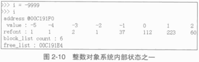
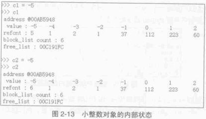

Python 源码阅读系列 3
---------------------------------

前言
===================

承接上文。

2.3 Hack PyIntObject
++++++++++++++++++++++++++

在初始化小整数缓冲池时，对于 block_list 及每个 PyIntBlock 的 objects ， 都是从后往前开始\
填充的，所以在初始化完成后， -5 应该在最后一个 PyIntBlock 对象的 objects 内最后一块内存，\
需要顺藤摸瓜一直找到最后一块内存才能观察从 -5 到 4 这 10 个小整数。

创建一个 PyIntObject 对象 -9999 ， 从图中可以看到，小整数对象被 Python 自身使用多次。

现在的 free_list 指向地址为 00C191E4 的内存， 更具对 PyIntObject 的分析，那么下一个 \
PyIntObject 会在这个地址安身立命。再创建两个 PyIntObject 对象， 值分别为 -12345 ：

.. image:: img/2-11.png

从图示可以看到 a 的地址正是创建 i 后 free_list 所指向的地址，而 b 的地址也正是创建 a 后 \
free_list 所指的地址。 虽然 a 和 b 的值都是一样的，但是他们确实是两个完全没有关系的 \
PyIntObject 对象，这点儿可以从内存地址上看清楚。

现在删除 b ， 结果如下：

.. image:: img/2-12.png

删除 b 后， free_list 回退到 a 创建后 free_list 的位置，这点儿与之前的分析是一致的。

最后看一下小整数对象的监控，连续两次创建 PyIntObject 对象 -5 ， 结果如图所示：

可以看到，两次创建的 PyIntObject 对象 c1 和 c2 的地址都是 00AB5948 ， 这证明它们实际上\
是同一个对象。同时，可以看到小整数对象池中 -5 的引用计数发生了变化，这证明 c1 和 c2 实际\
上都是指向这个对象。此外， free_list 没有发生任何变化，与分析相符。

3 Python 中的字符串对象
========================

再对 PyIntObject 的分析中， Python 中具有不可变长度数据的对象（定长对象）。在 Python 中，\
还大量存在着另一种对象，即具有可变长度数据的对象（变长对象）。与定长对象不同，变长对象维护的\
数据的长度在对象定义时是不知道的。

整数对象 PyIntObject 其维护的数据的长度在对象定义时就已经确定了，是一个 C 中 long 变量的长\
度； 而可变对象维护的数据的长度只能在对象创建时才能确定，例如只能在创建一个字符串或一个列表\
时才知道它们所维护的数据的长度，在此之前，一无所知。

在变长对象中，实际上还可以分为可变对象和不可变对象。可变对象维护的数据子啊对象被创建后还能\
变化，比如一个 list 被创建后，可以向其中添加元素或删除对象，这些操作都会改变其维护的数据；\
而不可变对象所维护的数据在对象创建之后就不能在改变了， 比如 Python 中的 string 和 tuple ，\
他们都不支持添加或删除操作。

3.1 PyStringObject 与 PyString_Type
+++++++++++++++++++++++++++++++++++++++

