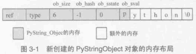

##############################################################################
Python 源码阅读系列 5
##############################################################################

.. contents::

******************************************************************************
第 3 章  Python 中的字符串对象
******************************************************************************

3.2 创建 PyStringObject 对象
==============================================================================

承接上文代码段 。 

显然 ， 传给 PyString_FromString 的参数必须是一个指向 NUL ('\0') 结尾的字符串指针 \
。 在从一个原生字符串创建 PyStringObject 时 ， 首先 [1] 处检查该字符数组的长度 ， \
如果长度大于了 PY_SSIZE_T_MAX ， Python 将不会创建对应的 PyStringObject 对象 。 \
PY_SSIZE_T_MAX 是一个与平台相关的值 ， 在 Win32 系统下 ， 该值为 2 147 483 647 \
， 即 2 GB 。 

在 [2] 处 ， 检查传入的字符串是否是一个空串 ， 对于空串 ， Python 并不是每次都会创\
建相应的 PyStringObject 。 Python 运行时有一个 PyStringObject 对象指针 \
nullstring 专门负责处理空的字符数组 。 如果第一次在一个空字符串基础上创建 \
PyStringObject ， 由于 nullstring 指针被初始化为 NULL ， 所以 Python 会为这个空字\
符建立一个 PyStringObject 对象 ， 将这个 PyStringObject 对象通过 intern 机制进行\
共享 ， 然后将 nullstring 指向这个被共享的对象 。 如果在以后 Python 检查到需要为一\
个空字符串创建 PyStringObject 对象 ， 这时 nullstring 已经存在了 ， 就直接返回 \
nullstring 的引用 。

如果不是创建空字符串对象 ， 接下来的进行的动作就是申请内存 ， 创建 PyStringObject \
对象 。 [4] 处申请的内存除了 PyStringObject 的内存 ， 还有为字符数组内的元素申请的\
额外内存 。 然后将 hash 缓存值设为 -1 ， 将 intern 标志设为 SSTATE_NOT_INTERNED \
。 最后将参数 str 指向字符数组内的字符拷贝到 PyStringObject 所维护的空间中 ， 在拷\
贝的过程中 ， 将字符数组最后的 '\0' 字符也拷贝了 。 假如对字符数组 "Python" 建立 \
PyStringObject 对象 ， 那么对象建立完成后在内存中的状态如图 ： 

在 PyString_FromString 之外 ， 还有一条创建 PyStringObject 对象的途径 - \
PyString_FromStringAndSize :

.. code-block:: c 

    [Objects/stringobject.c]
    
    [书中的代码]

    PyObject* PyString_FromStringAndSize(const char *str, Py_ssize_t size)
    {
        register PyStringObject *op;
        // 处理 null string
        if (size == 0 && (op = nullstring) != NULL) {
            return (PyObject *)op;
        }
        // 处理字符
        if (size == 1 && str != NULL &&
            (op = characters[*str & UCHAR_MAX]) != NULL)
        {
            return (PyObject *)op;
        }
        // 创建新的 PyStringObject 对象， 并初始化
        /* Inline PyObject_NewVar */
        op = (PyStringObject *)PyObject_MALLOC(sizeof(PyStringObject) + size);
        if (op == NULL)
            return PyErr_NoMemory();
        PyObject_INIT_VAR(op, &PyString_Type, size);
        op->ob_shash = -1;
        op->ob_sstate = SSTATE_NOT_INTERNED;
        if (str != NULL)
            Py_MEMCPY(op->ob_sval, str, size);
        op->ob_sval[size] = '\0';
        /* share short strings */
        if (size == 0) {
            PyObject *t = (PyObject *)op;
            PyString_InternInPlace(&t);
            op = (PyStringObject *)t;
            nullstring = op;
            Py_INCREF(op);
        } else if (size == 1 && str != NULL) {
            PyObject *t = (PyObject *)op;
            PyString_InternInPlace(&t);
            op = (PyStringObject *)t;
            characters[*str & UCHAR_MAX] = op;
            Py_INCREF(op);
        }
        return (PyObject *) op;
    }

    [代码包中的代码]    

    PyObject *
    PyString_FromStringAndSize(const char *str, Py_ssize_t size)
    {
        register PyStringObject *op;
        assert(size >= 0);
        if (size == 0 && (op = nullstring) != NULL) {
    #ifdef COUNT_ALLOCS
            null_strings++;
    #endif
            Py_INCREF(op);
            return (PyObject *)op;
        }
        if (size == 1 && str != NULL &&
            (op = characters[*str & UCHAR_MAX]) != NULL)
        {
    #ifdef COUNT_ALLOCS
            one_strings++;
    #endif
            Py_INCREF(op);
            return (PyObject *)op;
        }

        /* Inline PyObject_NewVar */
        op = (PyStringObject *)PyObject_MALLOC(sizeof(PyStringObject) + size);
        if (op == NULL)
            return PyErr_NoMemory();
        PyObject_INIT_VAR(op, &PyString_Type, size);
        op->ob_shash = -1;
        op->ob_sstate = SSTATE_NOT_INTERNED;
        if (str != NULL)
            Py_MEMCPY(op->ob_sval, str, size);
        op->ob_sval[size] = '\0';
        /* share short strings */
        if (size == 0) {
            PyObject *t = (PyObject *)op;
            PyString_InternInPlace(&t);
            op = (PyStringObject *)t;
            nullstring = op;
            Py_INCREF(op);
        } else if (size == 1 && str != NULL) {
            PyObject *t = (PyObject *)op;
            PyString_InternInPlace(&t);
            op = (PyStringObject *)t;
            characters[*str & UCHAR_MAX] = op;
            Py_INCREF(op);
        }
        return (PyObject *) op;
    }

PyString_FromStringAndSize 的操作过程和 PyString_FromString 一般无二 ， 只是有一\
点 ， PyString_FromString 传入的参数必须是以 NUL ('\0') 结尾的字符数组的指针 ， \
而 PyString_FromStringAndSize 没有这样的要求 ， 因为通过传入的 size 参数就可以确定\
需要拷贝的字符的个数 。 

3.3 字符串对象的 intern 机制
==============================================================================

无论是 PyString_FromString 还是 PyString_FromStringAndSize ， 当字符数组的长度为 \
0 或 1 时 ， 需要进行一个特别的动作 ： PyString_InternInPlace 。 就是前文中提到的 \
intern 机制 。

.. code-block:: c 

    [Objects/stringobject.c]

    PyObject *
    PyString_FromString(const char *str)
    {
        register size_t size;
        register PyStringObject *op;

        // [1]: 判断字符串长度
        size = strlen(str);
        if (size > PY_SSIZE_T_MAX) {
            return NULL;
        }

        // [2]: 处理 NULL string
        if (size == 0 && (op = nullstring) != NULL) {
            return (PyObject *)op;
        }

        // [3]: 处理字符
        if (size == 1 && (op = characters[*str & UCHAR_MAX]) != NULL) {
            return (PyObject *)op;
        }

        /* Inline PyObject_NewVar */
        // [4]: 创建新的 PyStringObject 对象， 并初始化
        op = (PyStringObject *)PyObject_MALLOC(sizeof(PyStringObject) + size);
        PyObject_INIT_VAR(op, &PyString_Type, size);
        op->ob_shash = -1;
        op->ob_sstate = SSTATE_NOT_INTERNED;
        Py_MEMCPY(op->ob_sval, str, size+1);
        /* share short strings */
        // intern (共享) 长度较短的 PyStringObject 对象
        if (size == 0) {
            PyObject *t = (PyObject *)op;
            PyString_InternInPlace(&t);
            op = (PyStringObject *)t;
            nullstring = op;
            Py_INCREF(op);
        } else if (size == 1) {
            PyObject *t = (PyObject *)op;
            PyString_InternInPlace(&t);
            op = (PyStringObject *)t;
            characters[*str & UCHAR_MAX] = op;
            Py_INCREF(op);
        }
        return (PyObject *) op;
    }

PyStringObject 对象的 intern 机制的目的是 ： 对于被 intern 之后的字符串 ， 比如 \
"Ruby" ， 在整个 Python 的运行期间 ， 系统中都只有唯一的一个与字符串 "Ruby" 对应的 \
PyStringObject 对象 。 这样当判断两个 PyStringObject 对象是否相同时 ， 如果他们都\
被 intern 了 ， 那么只需要简单地检查它们对应的 PyObject* 是否相同即可 。 这个机制既\
节省了空间 ， 又简化了对 PyStringObject 对象的比较 。 PyString_InternInPlace 负责\
完成对一个对象进行 intern 操作的函数 。

.. code-block:: c

    [Objects/stringobject.c]

    void
    PyString_InternInPlace(PyObject **p)
    {
        register PyStringObject *s = (PyStringObject *)(*p);
        PyObject *t;
        if (s == NULL || !PyString_Check(s))
            Py_FatalError("PyString_InternInPlace: strings only please!");
        /* If it's a string subclass, we don't really know what putting
        it in the interned dict might do. */
        if (!PyString_CheckExact(s))
            return;
        if (PyString_CHECK_INTERNED(s))
            return;
        if (interned == NULL) {
            interned = PyDict_New();
            if (interned == NULL) {
                PyErr_Clear(); /* Don't leave an exception */
                return;
            }
        }
        t = PyDict_GetItem(interned, (PyObject *)s);
        if (t) {
            Py_INCREF(t);
            Py_DECREF(*p);
            *p = t;
            return;
        }

        if (PyDict_SetItem(interned, (PyObject *)s, (PyObject *)s) < 0) {
            PyErr_Clear();
            return;
        }
        /* The two references in interned are not counted by refcnt.
        The string deallocator will take care of this */
        s->ob_refcnt -= 2;
        PyString_CHECK_INTERNED(s) = SSTATE_INTERNED_MORTAL;
    }

    [上述代码是代码包中的代码，下面的是书中的代码]

    void
    PyString_InternInPlace(PyObject **p)
    {
        register PyStringObject *s = (PyStringObject *)(*p);
        PyObject *t;
        // 对 PyStringObject 进行类型和状态检查
        if (!PyString_CheckExact(s))
            return;
        if (PyString_CHECK_INTERNED(s))
            return;
        // 创建记录经 intern 机制处理后的 PyStringObject 的 dict
        if (interned == NULL) {
            interned = PyDict_New();
        }
        // [1] : 检查 PyStringObject 对象 S 是否存在对应的 intern 后的 PyStringObject 对象
        t = PyDict_GetItem(interned, (PyObject *)s);
        if (t) {
            // 注意这里对引用计数的调整
            Py_INCREF(t);
            Py_DECREF(*p);
            *p = t;
            return;
        }

        // [2] : 在 interned 中记录检查 PyStringObject 对象 S 
        PyDict_SetItem(interned, (PyObject *)s, (PyObject *)s);

        /* The two references in interned are not counted by refcnt.
        The string deallocator will take care of this */
        // [3] : 注意这里对引用计数的调整
        s->ob_refcnt -= 2;
        // [4] : 调整 S 中的 intern 状态标志
        PyString_CHECK_INTERNED(s) = SSTATE_INTERNED_MORTAL;
    }

PyString_InternInPlace 首先会进行一系列的检查， 其中包括：

- 检查传入的对象是否是一个 PyStringObject 对象 ， intern 机制只能应用在 \
  PyStringObject 对象上 ， 甚至对于他的派生类对象系统都不会应用 intern 机制 。 

- 检查传入的 PyStringObject 对象是否已经被 intern 机制处理过了 ， Python 不会对同\
  一个 PyStringObject 对象进行一次以上的 intern 操作 。 

intern 机制的核心在于 interned ， interned 在 stringobject.c 中被定义为 ： \
`static PyObject *interned` 。

在代码中 interned 实际指向的是 PyDict_New 创建的一个对象 。 PyDict_New 实际上创建\
了一个 PyDictObject 对象 ， 即 Python 中常用的 dict 。 可以看作是 C++ 中的 map \
， 即 map<PyObject*, PyObject*> 。 C++ 我不懂，先记下笔记 。 

interned 机制的关键就是在系统中有一个 key value 映射关系的集合 ， 集合的名称叫做 \
interned 。 其中记录着被 intern 机制处理过的 PyStringObject 对象 。 当对一个 \
PyStringObject 对象 a 应用 intern 机制时 ， 首先会在 interned 这个 dict 中检查是\
否有满足以下条件的对象 b ： b 中维护的原生字符串与 a 相同 。 如果确实存在对象 b ， \
那么指向 a 的 PyObject 指针会指向 b ， 而 a 的引用计数减 1 ， 而 a 只是一个被临时\
创建的对象 。 如果 interned 中不存在这样的 b ， 那么就在 [2] 处将 a 记录到 \
interned 中 。 

下图展示了如果 interned 中存在这样的对象 b ， 再对 a 进行 intern 操作时， 原本指\
向 a 的 PyObject* 指针的变化 ： 

.. image:: img/3-2.png

对于被 intern 机制处理的 PyStringObject 对象 ， Python 采用了特殊的引用计数机制 \
。 在将一个 PyStringObject 对象 a 的 PyObject 指针作为 key 和 value 添加到 \
interned 中时 PyDictObject 对象会通过这两个指针对 a 的引用计数进行两次加 1 的操作 \
。 但是 Python 的设计者规定在 interned 中 a 的指针不能被视为对象 a 的有效引用 ， \
因为如果是有效引用的话 ， 那么 a 的引用计数在 Python 结束之前永远不能为 0 ， 因为 \
interned 中至少有两个指针引用了 a ， 那么删除 a 就永远不可能了 。

因此 interned 中的指针不能作为 a 的有效引用 。 这就是代码中 [3] 处会将引用计数减 \
2 的原因 。 在 A 的引用计数在某个时刻减为 0 之后 ， 系统将会销毁对象 a ， 同时会在 \
interned 中删除指向 a 的指针 ， 在 string_dealloc 代码中得到验证 ： 

.. code-block:: c 

    [Objects/stringobject.c]

    static void
    string_dealloc(PyObject *op)
    {
        switch (PyString_CHECK_INTERNED(op)) {
            case SSTATE_NOT_INTERNED:
                break;

            case SSTATE_INTERNED_MORTAL:
                /* revive dead object temporarily for DelItem */
                op->ob_refcnt = 3;
                if (PyDict_DelItem(interned, op) != 0)
                    Py_FatalError(
                        "deletion of interned string failed");
                break;

            case SSTATE_INTERNED_IMMORTAL:
                Py_FatalError("Immortal interned string died.");

            default:
                Py_FatalError("Inconsistent interned string state.");
        }
        op->ob_type->tp_free(op);
    }

Python 在创建一个字符串的时候 ， 会首先在 interned 中检查是否已经有改字符串对应的 \
PyStringObject 对象了 ， 如有 ， 则不用创建新的 。 这样会节省内存空间 ， 但是 \
Python 并不是在创建 PyStringObject 时就通过 interned 实现了节省空间的目的 。 事实\
上