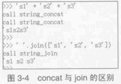
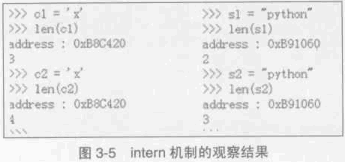
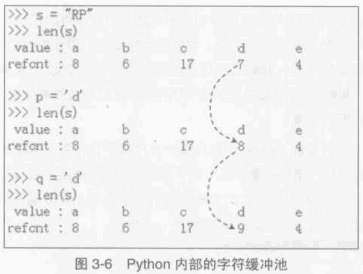

##############################################################################
Python 源码阅读系列 6
##############################################################################

.. contents::

******************************************************************************
第 3 章  Python 中的字符串对象
******************************************************************************

3.5 PyStringObject 效率相关问题
==============================================================================

承接上文字符串连接 。

通过 "+" 操作符对字符串进行连接时 ， 会调用 string_concat 函数 ：

.. code-block:: c 

    static PyObject *
    string_concat(register PyStringObject *a, register PyObject *bb)
    {
        register Py_ssize_t size;
        register PyStringObject *op;
        if (!PyString_Check(bb)) {
    #ifdef Py_USING_UNICODE
            if (PyUnicode_Check(bb))
                return PyUnicode_Concat((PyObject *)a, bb);
    #endif
            PyErr_Format(PyExc_TypeError,
                    "cannot concatenate 'str' and '%.200s' objects",
                    bb->ob_type->tp_name);
            return NULL;
        }
    #define b ((PyStringObject *)bb)
        /* Optimize cases with empty left or right operand */
        if ((a->ob_size == 0 || b->ob_size == 0) &&
            PyString_CheckExact(a) && PyString_CheckExact(b)) {
            if (a->ob_size == 0) {
                Py_INCREF(bb);
                return bb;
            }
            Py_INCREF(a);
            return (PyObject *)a;
        }
        // 计算字符串连接后的长度 size 
        size = a->ob_size + b->ob_size;
        if (size < 0) {
            PyErr_SetString(PyExc_OverflowError,
                    "strings are too large to concat");
            return NULL;
        }
        
        /* Inline PyObject_NewVar */
        // 创建新的 PyStringObject 对象 ， 其维护的用于存储字符的内存长度为 size
        op = (PyStringObject *)PyObject_MALLOC(sizeof(PyStringObject) + size);
        if (op == NULL)
            return PyErr_NoMemory();
        PyObject_INIT_VAR(op, &PyString_Type, size);
        op->ob_shash = -1;
        op->ob_sstate = SSTATE_NOT_INTERNED;
        // 将 a 和 b 中的字符拷贝到新建的 PyStringObject 中 
        Py_MEMCPY(op->ob_sval, a->ob_sval, a->ob_size);
        Py_MEMCPY(op->ob_sval + a->ob_size, b->ob_sval, b->ob_size);
        op->ob_sval[size] = '\0';
        return (PyObject *) op;
    #undef b
    }

对于任意两个 PyStringObject 对象的连接 ， 就会进行一次内存申请的动作 。 而如果利用 \
PyStringObject 对象的 join 操作 ， 则会进行如下的动作 (假设是对 list 中的 \
PyStringObject 对象进行连接) ：

.. code-block:: c  

    static PyObject *
    string_join(PyStringObject *self, PyObject *orig)
    {
        char *sep = PyString_AS_STRING(self);
        // 假设调用 "abc".join(list) ， 那么 self 就是 "abc" 对应的 PyStringObject 
        // 对象 ， 所以 seplen 中存储着 abc 的长度 。 
        const Py_ssize_t seplen = PyString_GET_SIZE(self);
        PyObject *res = NULL;
        char *p;
        Py_ssize_t seqlen = 0;
        size_t sz = 0;
        Py_ssize_t i;
        PyObject *seq, *item;

        seq = PySequence_Fast(orig, "");
        if (seq == NULL) {
            return NULL;
        }
        
        // 获取 list 中 PyStringObject 对象的个数， 保存在 seqlen 中
        seqlen = PySequence_Size(seq);
        if (seqlen == 0) {
            Py_DECREF(seq);
            return PyString_FromString("");
        }
        if (seqlen == 1) {
            item = PySequence_Fast_GET_ITEM(seq, 0);
            if (PyString_CheckExact(item) || PyUnicode_CheckExact(item)) {
                Py_INCREF(item);
                Py_DECREF(seq);
                return item;
            }
        }

        /* There are at least two things to join, or else we have a subclass
        * of the builtin types in the sequence.
        * Do a pre-pass to figure out the total amount of space we'll
        * need (sz), see whether any argument is absurd, and defer to
        * the Unicode join if appropriate.
        */
        // 遍历 list 中每个字符串 ， 累加获得 连接 list 中所有字符串后的长度
        for (i = 0; i < seqlen; i++) {
            const size_t old_sz = sz;
            // seq为python 中的 list 对象 ， 这里获取其中第 i 个字符串 。
            item = PySequence_Fast_GET_ITEM(seq, i);
            if (!PyString_Check(item)){
    #ifdef Py_USING_UNICODE
                if (PyUnicode_Check(item)) {
                    /* Defer to Unicode join.
                    * CAUTION:  There's no gurantee that the
                    * original sequence can be iterated over
                    * again, so we must pass seq here.
                    */
                    PyObject *result;
                    result = PyUnicode_Join((PyObject *)self, seq);
                    Py_DECREF(seq);
                    return result;
                }
    #endif
                PyErr_Format(PyExc_TypeError,
                        "sequence item %zd: expected string,"
                        " %.80s found",
                        i, item->ob_type->tp_name);
                Py_DECREF(seq);
                return NULL;
            }
            sz += PyString_GET_SIZE(item);
            if (i != 0)
                sz += seplen;
            if (sz < old_sz || sz > PY_SSIZE_T_MAX) {
                PyErr_SetString(PyExc_OverflowError,
                    "join() result is too long for a Python string");
                Py_DECREF(seq);
                return NULL;
            }
        }

        /* Allocate result space. */
        // 创建长度为 sz 的 PyStringObject 对象 
        res = PyString_FromStringAndSize((char*)NULL, sz);
        if (res == NULL) {
            Py_DECREF(seq);
            return NULL;
        }

        /* Catenate everything. */
        // 将 list 中的字符串拷贝到新创建的 PyStringObject 对象中 
        p = PyString_AS_STRING(res);
        for (i = 0; i < seqlen; ++i) {
            size_t n;
            item = PySequence_Fast_GET_ITEM(seq, i);
            n = PyString_GET_SIZE(item);
            Py_MEMCPY(p, PyString_AS_STRING(item), n);
            p += n;
            if (i < seqlen - 1) {
                Py_MEMCPY(p, sep, seplen);
                p += seplen;
            }
        }

        Py_DECREF(seq);
        return res;
    }

执行 join 操作时 ， 会先统计 list 中共有多少个 PyStringObject 对象 ， 并统计这些 \
PyStringObject 对象所维护的字符串一共的长度 ， 然后申请内存 ， 将 list 中所有的 \
PyStringObject 对象维护的字符串都拷贝到新开辟的内存空间中 。 这里只进行了一次内存申\
请就完成了 N 个 PyStringObject 对象的连接操作 。 相比于 "+" 提升了效率 。

通过在 string_concat 和 string_join 中添加输出代码 ， 可以清晰看到两种字符串连接的\
的区别 ：

3.6 Hack PyStringObject
==============================================================================

对 PyStringObject 对象的运行时的行为进行两项观察 。 首先观察 intern 机制 ， 在 \
Python Interactive 环境中 ， 创建一个 PyStringObject 对象后 ， 会对这个 \
PyStringObject 对象进行 intern 操作 ， 因此期望内容相同的 PyStringObject 对象在 \
intern 后应该是同一个对象 ， 观察结果 ：

通过在 string_length 中添加打印地址和引用计数的代码 ， 可以在 Python 运行期间获得\
每一个 PyStringObject 对象的地址及引用计数 (在 address 下一行输出的不是字符串的长\
度信息 ， 已将其更换为引用计数信息) 。 归于一般的字符串及单个字符 ， intern 机制最终\
会使不同的 PyStringObject* 指针指向相同的对象 。 

观察进行缓冲处理的字符对象 ， 同样在 string_length 中添加代码 ， 打印出缓冲池中从 \
a 到 e 的字符对象的引用计数信息 。 为了避免执行 len() 对引用计数的影响 ， 不会对 a \
到 e 的字符对象调用 len 操作 ， 而是对另外的 PyStringObject 对象调用 len 操作 ： 

.. code-block:: c 

    static Py_ssize_t
    string_length(PyStringObject *a)
    {
        return a->ob_size;
    }

上述代码是 string_length 函数的原始代码 ， 修改为如下 ：

.. code-block:: c 

    static void ShowCharacter()
    {
        char chA = 'a';
        PyStringObject** posA = characters + (unsigned short)chA;
        int i;
        char value[5];
        int refcnts[5];
        for (i=0; i<5; ++i)
        {
            PyStringObject* strObj = posA[i];
            value[i] = strObj->ob_sval[0];
            refcnts[i] = strObj->ob_refcnt;
        }
        printf(" value: ");
        for (i=0;i<5;++i)
        {
            printf("%c\t", value[i]);
        }
        printf("\nrefcnt: ");
        for (i=0;i<5;++i)
        {
            printf("%d\t", refcnts[i]);
        }
        printf("\n");
    }

图 3-6 展示了观察的结果 ， 在创建字符对象时 ， Python 确实只使用了缓冲池里的对象 ， \
没有创建新的对象 。 

