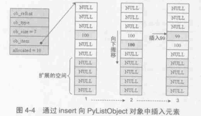
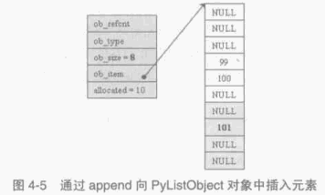
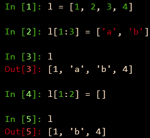
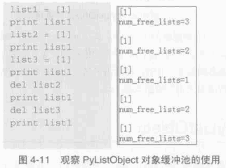
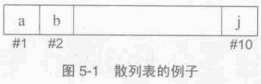

##############################################################################
Python 源码阅读系列 6
##############################################################################

.. contents::

******************************************************************************
第 4 章  Python 中的 List 对象
******************************************************************************

4.2 PyListObject 对象的创建与维护
==============================================================================

4.2.3 插入元素
------------------------------------------------------------------------------

Python 内部通过调用 PyList_Insert 来完成元素的插入动作 ， 而 PyList_Insert 实际上\
调用了 Python 内部的 ins1 。 在 ins1 中为了完成元素的插入工作 ， 必须首先保证一个条\
件得到满足 ， PyListObject 对象必须有足够的内存来容纳插入的元素 。 [1] 处调用了 \
list_resize 函数来保证该条件一定能成立 。 这个函数改变了 PyListObject 所维护的 \
PyObject* 列表的大小 。

.. code-block:: c 

    [Objects/listobject.c]

    static int
    list_resize(PyListObject *self, Py_ssize_t newsize)
    {
        PyObject **items;
        size_t new_allocated;
        Py_ssize_t allocated = self->allocated;

        /* Bypass realloc() when a previous overallocation is large enough
        to accommodate the newsize.  If the newsize falls lower than half
        the allocated size, then proceed with the realloc() to shrink the list.
        */
        // 不需要重新申请内存
        if (allocated >= newsize && newsize >= (allocated >> 1)) {
            assert(self->ob_item != NULL || newsize == 0);
            self->ob_size = newsize;
            return 0;
        }

        /* This over-allocates proportional to the list size, making room
        * for additional growth.  The over-allocation is mild, but is
        * enough to give linear-time amortized behavior over a long
        * sequence of appends() in the presence of a poorly-performing
        * system realloc().
        * The growth pattern is:  0, 4, 8, 16, 25, 35, 46, 58, 72, 88, ...
        */
        // 计算重新申请的内存大小
        new_allocated = (newsize >> 3) + (newsize < 9 ? 3 : 6) + newsize;
        if (newsize == 0)
            new_allocated = 0;
        // 拓展列表
        items = self->ob_item;
        if (new_allocated <= ((~(size_t)0) / sizeof(PyObject *)))
            PyMem_RESIZE(items, PyObject *, new_allocated);
            // 最终调用 C 中的 realloc
        else
            items = NULL;
        if (items == NULL) {
            PyErr_NoMemory();
            return -1;
        }
        self->ob_item = items;
        self->ob_size = newsize;
        self->allocated = new_allocated;
        return 0;
    }

在调整 PyListObject 对象所维护的列表的内存时 ， Python 分两种情况处理 ： 

- newsize < allocated && newsize > allocated/2 : 简单调整 ob_size 值 ； 

- 其他情况 ， 调用 realloc 重新分配空间 。 

在第二中情况下 ， 当 newsize < allocated/2 时 ， Python 会通过 realloc 来收缩列\
表的内存空间 。

将 PyListObject 的空间调整后 ， 函数 ins1 在实际插入元素之前还需在 [2] 处确定元素\
的插入点 。 Python 的 list 操作灵活 ， 支持负值索引 ， 比如一个 n 个元素的 list: \
lst[n] ， 那么 lst[-1] 就是 lst[n-1] 。 

在确定了插入的位置之后 ， [3] 处开始搬动元素 ， 将插入点之后的所有元素向下挪动一个\
位置 ， 这样在插入点就能空出一个位置来 。 一旦搬移元素的工作完成 ， 实际上就大功告成\
了 ， 想插入的元素就又容身之地了 。 

值得注意的是 ， 通过与 vector 类似的内存管理机制 ， PyListObject 的 allocated 已\
经变成 10 了 ， 而 ob_size 却只有 7 。

在 Python 中 ， list 还有另一个被广泛使用的插入操作 append 。 与上面的插入操作类\
似 ： 

.. code-block:: c 

    [Objects/listobject.c]

    // Python 提供的 C API
    int
    PyList_Append(PyObject *op, PyObject *newitem)
    {
        if (PyList_Check(op) && (newitem != NULL))
            return app1((PyListObject *)op, newitem);
        PyErr_BadInternalCall();
        return -1;
    }

    // 与 append 对对应的 C 函数
    static PyObject *
    listappend(PyListObject *self, PyObject *v)
    {
        if (app1(self, v) == 0)
            Py_RETURN_NONE;
        return NULL;
    }

    static int
    app1(PyListObject *self, PyObject *v)
    {
        Py_ssize_t n = PyList_GET_SIZE(self);

        assert (v != NULL);
        if (n == PY_SSIZE_T_MAX) {
            PyErr_SetString(PyExc_OverflowError,
                "cannot add more objects to list");
            return -1;
        }

        if (list_resize(self, n+1) == -1)
            return -1;

        Py_INCREF(v);
        PyList_SET_ITEM(self, n, v);  // 设置操作
        return 0;
    }

在进行 append 动作的时候 ， 添加的元素是添加在第 ob_size + 1 个位置上的 (即 \
list[ob_size] 处) ， 而不是第 allocated 个位置上 。 

在 app1 中调用 list_resize 时 ， 由于 newsize(8) 在 5 和 10 之间 ， 所以不需要在\
分配内存空间了 。 直接将 101 放置到第 8 个位置上即可 。 

4.2.3 删除元素
------------------------------------------------------------------------------

对于一个容器而言 ， 创建 、 设置 、 插入和删除操作是必需的 。 

.. image:: img/4-6.png

图 4-6 删除元素的例子

当 Python 执行 lst.remove(3) 时 ， PyListObject 中的 listremove 操作会被激活 ：

.. code-block:: c 

    [Objects/listobject.c]

    static PyObject *
    listremove(PyListObject *self, PyObject *v)
    {
        Py_ssize_t i;

        for (i = 0; i < self->ob_size; i++) {
            // 比较 list 中的元素与待删除的元素 v
            int cmp = PyObject_RichCompareBool(self->ob_item[i], v, Py_EQ);
            if (cmp > 0) {
                if (list_ass_slice(self, i, i+1,
                        (PyObject *)NULL) == 0)
                    Py_RETURN_NONE;
                return NULL;
            }
            else if (cmp < 0)
                return NULL;
        }
        PyErr_SetString(PyExc_ValueError, "list.remove(x): x not in list");
        return NULL;
    }

在遍历 PyListObject 中所有元素的过程中 ， 将待删除的元素与 PyListObject 中的每个元\
素一一进行比较 ， 比较操作通过 PyObject_RichCompareBool 完成 ， 如果其返回值大于 0 \
， 则表示列表中的某个元素与待删除的元素匹配 。 一旦在列表中发现匹配的元素 ， Python \
会立即调用 list_ass_slice 删除给元素 。 其函数原型如下 ： 

.. code-block:: c 

    [Objects/listobject.c]

    static int
    list_ass_slice(PyListObject *a, Py_ssize_t ilow, Py_ssize_t ihigh, PyObject *v)
    {
        /* Because [X]DECREF can recursively invoke list operations on
        this list, we must postpone all [X]DECREF activity until
        after the list is back in its canonical shape.  Therefore
        we must allocate an additional array, 'recycle', into which
        we temporarily copy the items that are deleted from the
        list. :-( */
        PyObject *recycle_on_stack[8];
        PyObject **recycle = recycle_on_stack; /* will allocate more if needed */
        PyObject **item;
        PyObject **vitem = NULL;
        PyObject *v_as_SF = NULL; /* PySequence_Fast(v) */
        Py_ssize_t n; /* # of elements in replacement list */
        Py_ssize_t norig; /* # of elements in list getting replaced */
        Py_ssize_t d; /* Change in size */
        Py_ssize_t k;
        size_t s;
        int result = -1;	/* guilty until proved innocent */
    #define b ((PyListObject *)v)
        if (v == NULL)
            n = 0;
        else {
            if (a == b) {
                /* Special case "a[i:j] = a" -- copy b first */
                v = list_slice(b, 0, b->ob_size);
                if (v == NULL)
                    return result;
                result = list_ass_slice(a, ilow, ihigh, v);
                Py_DECREF(v);
                return result;
            }
            v_as_SF = PySequence_Fast(v, "can only assign an iterable");
            if(v_as_SF == NULL)
                goto Error;
            n = PySequence_Fast_GET_SIZE(v_as_SF);
            vitem = PySequence_Fast_ITEMS(v_as_SF);
        }
        if (ilow < 0)
            ilow = 0;
        else if (ilow > a->ob_size)
            ilow = a->ob_size;

        if (ihigh < ilow)
            ihigh = ilow;
        else if (ihigh > a->ob_size)
            ihigh = a->ob_size;

        norig = ihigh - ilow;
        assert(norig >= 0);
        d = n - norig;
        if (a->ob_size + d == 0) {
            Py_XDECREF(v_as_SF);
            return list_clear(a);
        }
        item = a->ob_item;
        /* recycle the items that we are about to remove */
        s = norig * sizeof(PyObject *);
        if (s > sizeof(recycle_on_stack)) {
            recycle = (PyObject **)PyMem_MALLOC(s);
            if (recycle == NULL) {
                PyErr_NoMemory();
                goto Error;
            }
        }
        memcpy(recycle, &item[ilow], s);

        if (d < 0) { /* Delete -d items */
            memmove(&item[ihigh+d], &item[ihigh],
                (a->ob_size - ihigh)*sizeof(PyObject *));
            list_resize(a, a->ob_size + d);
            item = a->ob_item;
        }
        else if (d > 0) { /* Insert d items */
            k = a->ob_size;
            if (list_resize(a, k+d) < 0)
                goto Error;
            item = a->ob_item;
            memmove(&item[ihigh+d], &item[ihigh],
                (k - ihigh)*sizeof(PyObject *));
        }
        for (k = 0; k < n; k++, ilow++) {
            PyObject *w = vitem[k];
            Py_XINCREF(w);
            item[ilow] = w;
        }
        for (k = norig - 1; k >= 0; --k)
            Py_XDECREF(recycle[k]);
        result = 0;
    Error:
        if (recycle != recycle_on_stack)
            PyMem_FREE(recycle);
        Py_XDECREF(v_as_SF);
        return result;
    #undef b
    }

list_ass_slice 实际上并不是一个专用于删除操作的函数 ， 它的完整功能如下 ：

- a[ilow:ihigh] = v if v != NULL.

- del a[ilow:ihigh] if v == NULL.

它实际上有着 replace 和 remove 两种语义 ， 决定使用哪种语义的是最后一个参数 v 决定 。

图 4-7 list_ass_slice 的不同语义

当执行 l[1:3] = ['a', 'b'] 时 ， Python 内部就调用了 list_ass_slice ， 而其参数\
为 ilow=1 ， ihigh=3 ， v=['a', 'b'] 。

而当 list_ass_slice 的参数 v 为 NULL 时 ， Python 会将默认的 replace 语义替换为 \
remove 语义 ， 删除 [ilow, ihigh] 范围内的元素 ， 正是 listremove 期望的动作 。 \

在 list_ass_slice 中 ， 当进行元素的删除动作时 ， 实际上时通过 memmove 简单地搬移\
内存实现的 。 当调用 list 的 remove 操作删除 list 中的元素时 ， 一定会触发内存搬移\
的动作 。

.. image:: img/4-8.png

4.3 PyListObject 对象缓冲池
==============================================================================

free_lists 中所缓冲的 PyListObject 对象是在一个 PyListObject 被销毁的过程中 。 

.. code-block:: c 

    static void
    list_dealloc(PyListObject *op)
    {
        Py_ssize_t i;
        PyObject_GC_UnTrack(op);
        Py_TRASHCAN_SAFE_BEGIN(op)
        // [1]: 销毁 PyListObject 对象维护的元素列表
        if (op->ob_item != NULL) {
            /* Do it backwards, for Christian Tismer.
            There's a simple test case where somehow this reduces
            thrashing when a *very* large list is created and
            immediately deleted. */
            i = op->ob_size;
            while (--i >= 0) {
                Py_XDECREF(op->ob_item[i]);
            }
            PyMem_FREE(op->ob_item);
        }
        // [2]: 释放 PyListObject 自身
        if (num_free_lists < MAXFREELISTS && PyList_CheckExact(op))
            free_lists[num_free_lists++] = op;
        else
            op->ob_type->tp_free((PyObject *)op);
        Py_TRASHCAN_SAFE_END(op)
    }

在创建一个新的 list 时 ， 过程实际分离为两步 ， 首先创建 PyListObject 对象 ， 然后\
创建 PyListObject 对象所维护的元素列表 。 相应的销毁一个 list 首先销毁 \
PyListObject 对象维护的元素列表 ， 然后释放 PyListObject 对象自身 。 

[1] 处的工作是为了 list 中的每个原始改变其引用计数 ， 然后释放内存 ； [2] 处 \
PyListObject 对象的缓冲池出现了 。 在删除 PyListObject 自身时 ， Python 会检查 \
free_lists ， 检查其中缓存的 PyListObject 的数量是否已经满了 。 如未满 ， 将该待删\
除的 PyListObject 对象放到缓冲池中 ， 以备后用 。 

在 Python 启动时空荡荡的缓冲池都是被本应该死去的 PyListObject 对象给填充了 ， 在创\
建新的 PyListObject 的时候 ， Python 会优先唤醒这些已经 "死去" 的 PyListObject \
。 需要注意的是 ， 这里缓存的仅仅是 PyListObject 对象 ， 没有这个对象曾经拥有的 \
PyObject* 元素列表 ， 因为它们的引用计数已经减少了 ， 这些指针所指的对象不再被 \
PyListObject 所给予的那个引用计数所束缚 。 PyListObject 如果继续维护一个指向这些指\
针的列表 ， 就可能产生空悬指针的问题 。 所以 PyObject* 列表占用的空间必须还给系统 。 

.. image:: img/4-9.png

图中显示了如果删除前面创建的那个 list ， PyListObject 对象的缓冲池示意图 。 

在 Python 下一次创建新的 list 时 ， 这个 PyListObject 对象将重新被唤醒 ， 重新分\
配 PyObject* 元素列表占用的内存 ， 重新拥抱新的对象 。 

4.4 Hack PyListObject 
==============================================================================

在 PyListObject 的输出操作 list_print 中 ， 添加如下代码 ， 以观察 PyListObject \
对内存的管理 ：

.. code-block:: c 

    printf("\nallocated=%d, ob_size=%d\n", op->allocated, op->ob_size);

观察结果如图所示 。

.. image:: img/4-10.png

首先创建一个包含一个元素的 list ， 这时 ob_size 和 allocated 都是 1 。 list 中用\
有的所有内存空间都已经使用完毕 ， 下一次插入元素就一定会调整 list 的内存空间 。 

在 list 末尾追加元素 2 ， 调整内存空间的动作发生了 。 allocated 变成了 5 ， 而 \
ob_size 则变成了 2 ，  继续在 list 末尾追加 3 、 4 、 5 ， 在追加了元素 5 之后 \
， list 所拥有的内存空间又被使用完了 ， 下一次再追加或插入元素时 ， 内存空间调整的\
动作又会再一次发生 。 如果在追加元素 3 之后就删除元素 2 ， 可以看到 ob_size 发生了\
变化 ， 而 allocated 则不发生变化 ， 它始终如一地维护着当前 list 所拥有的全部内存\
数量 。
观察 PyListObject 对象的创建和删除对于 Python 维护的 PyListObject 对象缓冲池的影\
响 。 

为消除 Python 交互环境执行时对 PyListObject 对象缓冲池的影响 ， 通过执行 py 脚本\
文件来观察 。 从图中可以看到 ， 当创建新的 PyListObject 对象时 ， 如果缓冲池中有可\
用的 PyListObject 对象 ， 则会使用缓冲池中的对象 ； 而销毁一个 PyListObject 对象\
时 ， 确实将这个对象放到缓冲池中 。 

******************************************************************************
第 5 章  Python 中的 Dict 对象
******************************************************************************

元素和元素之间通常可能存在某种联系 ， 这种联系是本来好不相关的两个元素被捆绑在一起 ，\
而别的元素则被排斥在外 。 为了刻画这种对应关系 ， 现代编程语言通常都在语言级或标准库\
中提供某种关联式的容器 。 关联式的容器中存储着一对对符合该容器所代表的关联规则的元素\
对 。 其中的元素通常是以键 (key) 或值 (value) 的形式存在 。 

关联容器的设计总会极大地关注键的搜索效率 ， 因为通常使用关联容器都是希望根据手中已有\
的某个元素来快速获得与之有关系的另一个元素 。 一般而言 ， 关联容器的实现都会基于设计\
良好的数据结构 。 如 C++ 的 STL 中的 map 就是一种关联容器 ， map 的实现基于 \
RB-tree (红黑树) 。 RB-tree 是一种平衡二元树 ， 能提供良好的搜索效率 ， 理论上搜索\
时间复杂度为 O(logN) 。 

Python 提供了关联式容器 ， 即 PyDictObject 对象 (也称 dict) 。 与 map 不同的是 \
， PyDictObject 对搜索的效率要求极其苛刻 ， 这也是因为 PyDictObject 对象在 Python \
本身的实现中被大量采用 。 如 Python 会通过 PyDictObject 来建立执行 Python 字节码的\
运行环境 ， 其中会存放变量名和变量值的元素对 ， 通过查找变量名获得变量值 。 因此 ， \
PyDictObject 没有如 map 一样采用平衡二元树 ， 而是采用了散列表 (hash table) ， 因\
此理论上 ， 在最优情况下 ， 散列表能提供 O(1) 复杂度的搜索效率 。 

5.1 散列表概述
==============================================================================

散列表是通过一定的函数将需搜索的键值映射为一个整数 ， 将这个整数视为索引值去访问某片\
连续的内存区域 。 例如 ， 有 10 个整数 1 ， 2 ， ... ， 10 ， 其依次对应 a ， b \
， ... ， j 。 申请一块连续内存 ， 并依次存储 a ， b ， ... ， j ：

当需要寻找与 2 对应的字母时 ， 只需通过一定的函数将其映射为整数 ， 可以使用这样的映\
射函数 f(n) = n ， 那么 2 的映射值就是 2 。 然后访问这片连续内存的第二个位置 ， 就\
能得到与 2 对应的字母 b 。 

对散列表这种数据结构的采用是以加速键的搜索过程为终极目标的 ， 于是将原始映射为整数\
的过程对于 Python 中 dict 的实现就显得尤为关键 。 用于映射的函数称为散列函数 \
(hash function) ， 而映射后的值称为元素的散列值 (hash value) 。 在散列表的实现\
中 ， 所选择的散列函数的优劣将直接决定所实现的散列表的搜索笑了的高低 。 

在使用散列表的过程中 ， 不同的对象经过散列函数的作用 ， 可能被映射为相同的散列值 \
。 而且随着需要存储的数据的增多 ， 这样的冲突就会发生得越来越频繁 。 散列冲突是散\
列技术与生俱来的问题 。 这里需要提到散列表中与散列冲突相关的概念 -- 装载率 。 装载\
率是散列表中已使用空间和总空间的比值 。 如果散列表一共可以容纳 10 个元素 ， 而当前\
已经装入了 6 个元素 ， 那么装载率就是 6/10 。 研究表明 ， 当散列表的装载率大于 \
2/3 时 ， 散列冲突发生得概率就会大大增加 。 

解决散列冲突的方法 ： 开链法 ， 这是 SGI STL 中的 hash table 所采用的方法 ， 而 \
Python 中所采用的是开放定址法 。

当产生散列冲突时 ， Python 会通过一个二次探测函数 f ， 计算下一个候选位置 addr \
， 如果 addr 可用 ， 则可将待插入元素放到位置 addr ； 如果位置 addr 不可用 ， 则 \
Python 会再次使用探测函数 f ， 获得下一个候选位置 ， 如此不断探测总会找到一个可用\
位置 。

通过多次探测函数 f ， 从一个位置出发就可以一次到达多个位置 ， 这些位置就形成了一\
个 "冲突探测链" (或简称探测序列) 。 当需要删除某条探测链上的某个元素时 ， 问题就\
产生了 ， 假如这条链的首元素位置为 a ， 尾元素的位置为 c ， 现在需要删除中间的某\
个位置 b 上的元素 。 如果直接将位置 b 上的元素删除 ， 则会导致探测链的断裂 ， 造\
成严重后果 。 

因为想象一下 ， 在下次的搜索位置 c 的元素时 ， 会从位置 a 开始 ， 通过探测函数 \
， 沿着探测链一步一步向位置 c 靠近 ， 但是在到达位置 b 时 ， 发现这个位置上的元素\
不属于这个探测链 ， 因此探测函数会以为探测链到此结束 ， 导致不能到达位置 c ， 自然\
不能搜索到位置 c 上的元素 ， 所以结果是搜索失败 。 而实际上待搜索元素确实存在于散\
列表中 。

所以在采用开放定址的冲突解决策略的散列表中 ， 删除某条探测链上的元素时不能进行真正\
的删除 ， 而是进行一种 "伪删除" 操作 ， 必须要让该元素还存在于探测链上 ， 担当承前\
启后的重任 。 

5.2 PyDictObject
==============================================================================

5.2.1 关联容器的 entry
------------------------------------------------------------------------------

将关联容器中的一个 (键 ， 值) 元素对称为一个 entry 或 slot 。 在 Python 中一个 \
entry 的定义如下 ：

.. code-block:: c 

    typedef struct {
        /* Cached hash code of me_key.  Note that hash codes are C longs.
        * We have to use Py_ssize_t instead because dict_popitem() abuses
        * me_hash to hold a search finger.
        */
        Py_ssize_t me_hash;
        PyObject *me_key;
        PyObject *me_value;
    } PyDictEntry;

可以看到 ， 在 PyDictObject 中确实存放的都是 PyObject* ， 这也是 Python 中的 \
dict 什么都能装得下的原因 ， 因为在 Python 中 ， 无论什么东西归根结底都是一个 \
PyObject 对象 。 

未完待续 ...