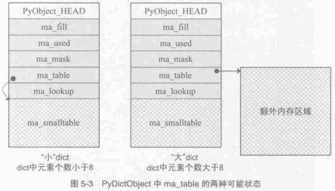

##############################################################################
Python 源码阅读系列 8
##############################################################################

.. contents::

******************************************************************************
第 5 章  Python 中的 Dict 对象
******************************************************************************

5.2 PyDictObject
==============================================================================

5.2.1 关联容器的 entry
------------------------------------------------------------------------------

在 PyDictEntry 中 ， me_hash 域存储的是 me_key 的散列值 ， 利用一个域来记录这个散\
列值可以避免每次查询的时候都要重新计算一遍散列值 。

在 Python 中一个 PyDictObject 对象生存变化的过程中 ， 其中的 entry 会在不同的状态\
间转换 。 PyDictObject 中 entry 可以在 3 种状态间转换 ： Unused 态 、 Active 态\
和 Dummy 态 。

- 当一个 entry 的 me_key 和 me_value 都是 NULL 时 ， entry 处于 Unused 态 。 \
  Unused 态表明目前该 entry 中并没有存储 (key ， value) 对 ， 而且在此之前 ， 也\
  没有存储过它们 。 每个 entry 在初始化的时候都会处于这种状态 ， 而且只有在 Unused \
  态下 ， entry 的 me_key 域才会为 NULL 。

- 当 entry 中存储一个 (key ， value) 对时， entry 便转换到了 Active 态 。 在 \
  Active 态 。 在 Active 态下 ， me_key 和 me_value 都不能为 NULL 。 更进一步地\
  说 ， me_key 不能是 dummy 对象 。 

- 当 entry 中存储的 (key ， value) 对被删除后 ， entry 的状态不能直接从 Active 态\
  转为 Unused 态 ， 否则会导致冲突探测链的中断 。 相反 ， entry 中的 me_key 将指\
  向 dummy 对象 ， entry 进入 Dummy 态 ， 这就是 "伪删除" 技术 。 当 Python 沿着\
  某条冲突链搜索时 ， 如果发现一个 entry 处于 Dummy 态 ， 说明目前该 entry 虽然是\
  无效的 ， 但是其后的 entry 可能是有效的 ， 是应该搜索的 。 这样就保证了冲突探测链\
  的连续性 。

.. image:: img/5-2.png

5.2.2 关联容器的实现
------------------------------------------------------------------------------

在 Python 中 ， 关联容器是通过 PyDictObject 对象来实现的 。 而一个 PyDictObject \
对象实际上是一大堆 entry 的集合 ， 总控这些集合的结构如下 ： 

.. code-block:: c 

    [Include/dictobject.h]

    #define PyDict_MINSIZE 8
    typedef struct _dictobject PyDictObject;
    struct _dictobject {
        PyObject_HEAD
        Py_ssize_t ma_fill;  /* # Active + # Dummy */
        Py_ssize_t ma_used;  /* # Active */

        /* The table contains ma_mask + 1 slots, and that's a power of 2.
        * We store the mask instead of the size because the mask is more
        * frequently needed.
        */
        Py_ssize_t ma_mask;

        /* ma_table points to ma_smalltable for small tables, else to
        * additional malloc'ed memory.  ma_table is never NULL!  This rule
        * saves repeated runtime null-tests in the workhorse getitem and
        * setitem calls.
        */
        PyDictEntry *ma_table;
        PyDictEntry *(*ma_lookup)(PyDictObject *mp, PyObject *key, long hash);
        PyDictEntry ma_smalltable[PyDict_MINSIZE];
    };

从注释中可以清楚看到 ma_fill 域中维护着从 PyDictObject 对象创建开始直到现在 ， 曾\
经及正处于 Active 态的 entry 个数 ， 而 ma_used 则维护者当前正处于 Active 态的 \
entry 的数量 。 

在 PyDictObject 定义的最后 ， 有一个名为 ma_smalltable 的 PyDictEntry 数组 。 这\
个数组意味着当创建一个 PyDictObject 对象时 ， 至少有 PyDict_MINSIZE 个 entry 被同\
时创建 。 在 dictobject.h 中 ， 这个值被设定为 8 ， 这个值被认为是通过大量的实验得\
出的最佳值 。 既不会太浪费内存空间 ， 又能很好地满足 Python 内部大量使用 \
PyDictObject 的环境需求 ， 不需要在使用的过程中再次调用 malloc 申请内存空间 。

PyDictObject 中的 ma_table 域是关联对象的关键所在 ， 这个类型为 PyDictEntry* 的变\
量指向一片作为 PyDictEntry 集合的内存的开始位置 。 当一个 PyDictObject 对象是一个\
比较小的 dict 时 ， 即 entry 数量少于 8 个 ， ma_table 域将指向 ma_smalltable 这\
个与生俱来的 8 个 entry 的起始地址 。 当 PyDictObject 中 entry 数量大于 8 个时 \
， Python 认为是一个大 dict 将会申请额外的内存空间 ， 并将 ma_table 指向这块空间 \
。 无论何时 ， ma_table 域都不会为 NULL ， 总是有效的 。 

下图分别显示了 Python 中的 "大" ， "小" 两种 dict :

最后 ， PyDictObject 中的 ma_mask 实际上记录了一个 PyDictObject 对象中所拥有的 \
entry 的数量 。 

5.3 PyDictObject 的创建和维护
==============================================================================

5.3.1 PyDictObject 对象创建
------------------------------------------------------------------------------

Python 内部通过 PyDict_New 来创建一个新的 dict 对象 。 

.. code-block:: c 

    typedef PyDictEntry dictentry;
    typedef PyDictObject dictobject;

    #define INIT_NONZERO_DICT_SLOTS(mp) do {				\
      (mp)->ma_table = (mp)->ma_smalltable;				\
      (mp)->ma_mask = PyDict_MINSIZE - 1;				\
        } while(0)

    #define EMPTY_TO_MINSIZE(mp) do {					\
      memset((mp)->ma_smalltable, 0, sizeof((mp)->ma_smalltable));	\
      (mp)->ma_used = (mp)->ma_fill = 0;				\
      INIT_NONZERO_DICT_SLOTS(mp);					\
        } while(0)

    PyObject *
    PyDict_New(void)
    {
      register dictobject *mp;
      //[1] : 自动创建 dummy 对象
      if (dummy == NULL) { /* Auto-initialize dummy */
        dummy = PyString_FromString("<dummy key>");
        if (dummy == NULL)
          return NULL;
    #ifdef SHOW_CONVERSION_COUNTS
        Py_AtExit(show_counts);
    #endif
      }
      if (num_free_dicts) {
        // [2]: 使用缓冲池
        mp = free_dicts[--num_free_dicts];
        assert (mp != NULL);
        assert (mp->ob_type == &PyDict_Type);
        _Py_NewReference((PyObject *)mp);
        if (mp->ma_fill) {
          EMPTY_TO_MINSIZE(mp);
        }
        assert (mp->ma_used == 0);
        assert (mp->ma_table == mp->ma_smalltable);
        assert (mp->ma_mask == PyDict_MINSIZE - 1);
      } else {
        // [3]: 创建 PyDictObject 对象
        mp = PyObject_GC_New(dictobject, &PyDict_Type);
        if (mp == NULL)
          return NULL;
        EMPTY_TO_MINSIZE(mp);
      }
      mp->ma_lookup = lookdict_string;
    #ifdef SHOW_CONVERSION_COUNTS
      ++created;
    #endif
      _PyObject_GC_TRACK(mp);
      return (PyObject *)mp;
    }

第一次调用 PyDict_New 时 ， 在 [1] 处会创建前文中的 dummy 对象 。 它是一个 \
PyStringObject 对象 ， 实际上用来作为一种指示标志 ， 表明该 entry 曾被使用过 ， 且\
探测序列下一个位置的 entry 有可能是有效的 ， 从而防止探测序列中断 。 

从 num_free_dicts 可以看出 Python 中 dict 的实现同样适用了缓冲池 。 

如果 PyDictObject 对象的缓冲池不可用 ， 那么 Python 将首先从系统堆中为新的 \
PyDictObject 对象申请合适的内存空间 ， 然后通过两个宏完成对新生的 PyDictObject 对\
象的初始化工作 ：

- EMPTY_TO_MINSIZE : 将 ma_smalltable 清零 ， 同时设置 ma_size 和 ma_fill ， 当\
  然在一个 PyDictObject 对象刚被创建的时候 ， 这两个变量都应该是 0 。

- INIT_NONZERO_DICT_SLOTS : 将 ma_table 指向 ma_smalltable ， 并设置 ma_mask \
  为 7 。

ma_mask 的初始化值为 PyDict_MINSIZE - 1 ， 确实与一个 PyDictObject 对象中的 \
entry 的数量有关 。 在创建过程的最后 ， 将 lookdict_string 赋给 ma_lookup 。 正\
是 ma_lookup 指向了 PyDictObject 在 entry 集合中搜索某一特定 entry 时需要进行的动\
作 ， 在 ma_lookup 中包含了散列函数和发生冲突时二次探测函数的具体实现 ， 它是 \
PyDictObject 的搜索策略 。 

5.3.2 PyDictObject 中的元素搜索
------------------------------------------------------------------------------

Python 为 PyDictObject 对象提供了两种搜索策略 ， lookdict 和 lookdict_string 。 \
实际上这两种策略使用的是相同的算法 ， lookdict_string 只是 lookdict 的一种针对 \
PyStringObject 对象的特殊形式 。 PyStringObject 对象作为 PyDictObject 对象中 \
entry 的键在 Python 中很广泛 ， 所以 lookdict_string 也就成为 PyDictObject 创建\
时默认采用的搜索策略 。 

首先分析一下通用搜索策略 lookdict ， 一旦清晰地了解了通用搜索策略 ， \
lookdict_string 也就一目了然 。 

.. code-block:: c 

    [Objects/dictobject.c]

    static dictentry *
    lookdict(dictobject *mp, PyObject *key, register long hash)
    {
      register size_t i;
      register size_t perturb;
      register dictentry *freeslot;
      register size_t mask = (size_t)mp->ma_mask;
      dictentry *ep0 = mp->ma_table;
      register dictentry *ep;
      register int cmp;
      PyObject *startkey;
      // [1]: 散列， 定位冲突探测链的第一个entry
      i = (size_t)hash & mask;
      ep = &ep0[i];

      // [2]:
      // 1. entry处于 Unused 态
      // 2. entry中的key与待搜索的key匹配
      if (ep->me_key == NULL || ep->me_key == key)
        return ep;

      // [3]: 第一个 entry 处于 Dummy 态 ， 设置 freeslot
      if (ep->me_key == dummy)
        freeslot = ep;
      else {
        // [4]： 检查 Active 态 entry 
        if (ep->me_hash == hash) {
          startkey = ep->me_key;
          cmp = PyObject_RichCompareBool(startkey, key, Py_EQ);
          if (cmp < 0)
            return NULL;
          if (ep0 == mp->ma_table && ep->me_key == startkey) {
            if (cmp > 0)
              return ep;
          }
          else {
            /* The compare did major nasty stuff to the
            * dict:  start over.
            * XXX A clever adversary could prevent this
            * XXX from terminating.
            */
            return lookdict(mp, key, hash);
          }
        }
        freeslot = NULL;
      }

      /* In the loop, me_key == dummy is by far (factor of 100s) the
        least likely outcome, so test for that last. */
      for (perturb = hash; ; perturb >>= PERTURB_SHIFT) {
        i = (i << 2) + i + perturb + 1;
        ep = &ep0[i & mask];
        if (ep->me_key == NULL)
          return freeslot == NULL ? ep : freeslot;
        if (ep->me_key == key)
          return ep;
        if (ep->me_hash == hash && ep->me_key != dummy) {
          startkey = ep->me_key;
          cmp = PyObject_RichCompareBool(startkey, key, Py_EQ);
          if (cmp < 0)
            return NULL;
          if (ep0 == mp->ma_table && ep->me_key == startkey) {
            if (cmp > 0)
              return ep;
          }
          else {
            /* The compare did major nasty stuff to the
            * dict:  start over.
            * XXX A clever adversary could prevent this
            * XXX from terminating.
            */
            return lookdict(mp, key, hash);
          }
        }
        else if (ep->me_key == dummy && freeslot == NULL)
          freeslot = ep;
      }
    }

这里列出的只是 Python 对冲突链上第一个 entry 所进行的动作 。 PyDictObject 中维护\
的 entry 的数量是有限的 ， 而传入 lookdict 中的 key 的 hash 值却并不一定会在这个范\
围内 ， 所以这就要求 lookdict 将 hash 值映射到某个 entry 上去 。 lookdict 采取的\
策略很简单 ， 直接将 hash 值与 entry 的数量做一个与操作 ， 结果自然落到 entry 的数\
量之下 。 [1] 处实现了这个过程 ， 由于 ma_mask 会被用来进行大量的与操作 ， 所以这个\
与 entry 数量相关的变量被命名为 ma_mask 而不是 ma_size 。 

无论是 lookdict_string 还是 lookdict 都不会返回 NULL ， 如果在 PyDictObject 中搜\
索不到待查找的 key ， 同样会返回一个 entry ， 这个 entry 的 me_value 为 NULL 。 \
这个 entry 指示搜索失败 ， 而且该 entry 是一个空闲的 entry ， 马上就可以被 Python \
所使用 。 

在搜索的过程中 ， [3] 处所操纵的 freeslot 是一个重要的变量 。 如果在探测链中的某个\
位置上 ， entry 处于 Dummy 态 ， 那么如果在这个序列中搜索不成功 ， 就会返回这个处\
于 Dummy 态的 entry 。 处于 Dummy 态的 entry 其 me_value 是为 NULL ， 所以这个返\
回结果指示了搜索失败 ； 同时返回的 entry 也是一个可以立即被使用的 entry ， 因为 \
Dummy 态的 entry 并没有维护一个有效的 (key ， value) 对 。 这个 freeslot 是用来\
指向探测链序列中第一个处于 Dummy 态的 entry ， 如果搜索失败 freeslot 就会提供一个\
指示失败并立即可用的 entry 。 如果探测链序列中并没有 Dummy 态 entry ， 搜索失败时\
一定是在一个处于 Unused 态的 entry 上结束搜索过程的 ， 这时会返回这个处于 Unused \
态的 entry ， 同样是一个能指示失败且立即可用的 entry 。 

在 Python 的 dict 中 ， "相同" 实际上包含两层含义 ： 

1. 引用相同 ；

#. 值相同 。

dict 正是建立在这两层含义之上的 。 引用相同是指两个符号引用的是内存中的同一个地址 \
， 这个检查是 [2] 处的 "ep->me_key == key" 所完成的 ； 而所谓的值相同是说两个 \
PyObject* 指针实际上指向了不同的对象 ， 即内存中的不同的位置 ， 但是两个对象的值相\
同 。

例如在整数对象中 ， 小整数对象是共享的 ， 而大整数对象并不是共享的 ， 

