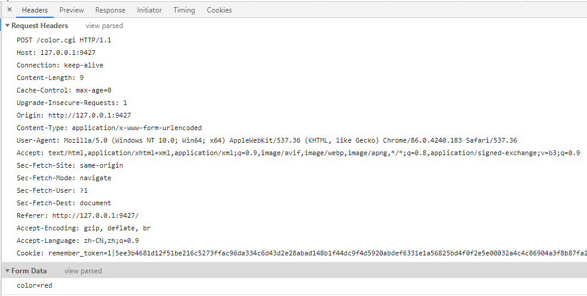
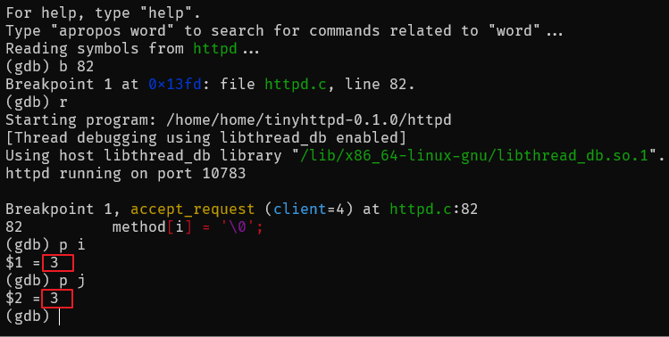

##############################################################################
tiny-httpd-0.1.0 源码阅读
##############################################################################

.. contents::

******************************************************************************
第 2 部分  开始源码阅读
******************************************************************************

2.4 accept_request 函数
==============================================================================

在继续向下解析 accept_request 函数之前 ， 在这里先了解一下 HTTP 请求相关的知识 ： 

.. image:: img/2-1.png 

上图是一个 HTTP 请求结构图 ， 客户端发送一个 HTTP 请求到服务器的请求消息包括以下格\
式 ： 请求行 （request line） 、 请求头部 （header） 、 空行和请求数据四个部分组\
成 ， 请求方法就是 GET 、 POST 等方法 。 

上述是客户端请求消息的过程 ， 接下来是服务器响应消息 ： 

.. image:: img/2-2.png 

HTTP 响应也由四个部分组成 ， 分别是 ： 状态行 、 消息报头 、 空行和响应正文 。 此报\
文来自于 TinyHTTPd 服务器请求数据 color=red 时的响应报文 。 其客户端请求如下 ： 

可以看到这个请求报文与 HTTP 请求结构图一致 ， 有很多请求头应该是 Chrome 自动添加的 \
。 现在可以回到代码中了 。

.. code-block:: C  

    [void accept_request(int client)]
    while (!ISspace(buf[j]) && (i < sizeof(method) - 1)) {
            method[i] = buf[j];
            i++;
            j++;
    }

既然知道了 HTTP 请求结构图 ， 那么这里的逻辑就很清晰了 ， 就是从请求报文的第一行获取\
请求方法 ， 循环判断 buf 中的数据 ， 一旦为空值 ， 就表示拿到了请求方法 ， 因为第一\
行的第一个空值就是在请求方法之后 。 那这个的 i 和 j 就为 3 ， 注意我这里 **以请求首页为\
例** ， method 为 GET 。 使用 GDB 调试结果如下 ： 

然后在 method 后添加一个空值 '\0' ， 作为字符串的结束标志 。 

.. code-block:: C 

    [void accept_request(int client)]
    if (strcasecmp(method, "GET") && strcasecmp(method, "POST")) {
            unimplemented(client);
            return;
    }

``int strcasecmp(const char *s1, const char *s2);`` 函数的功能是忽略大小写比较字\
符串 ， 若参数 s1 和 s2 字符串相等返回 0 ， s1 大于 s2 则返回大于 0 的值 ， s1 小\
于 s2 则返回小于 0 的值 。 

只有 method 与 "GET" 或 "POST" 相等时 ， 才会跳过这个判断 ， 因为相等时返回值为 0 \
， 在与另一个返回值进行与运算 (&&) 的时候值仍然为 0 ， 条件为假 ， 内部的步骤才不会\
继续执行 。 否则就会执行 unimplemented() 函数 ， 并返回空值 。 unimplemented 函数\
这里先不解析 。 等下文解析 。 

.. code-block:: C 

    [void accept_request(int client)]
    if (strcasecmp(method, "POST") == 0)
        cgi = 1;

执行到此处 ， 判断是否是 "POST" 方法 ， 如果是 strcasecmp 函数返回 0 ， 同时将 cgi \
置为 1 ， 方便后面执行 CGI 程序 。 

.. code-block:: C 

    [void accept_request(int client)]
    i = 0;
    while (ISspace(buf[j]) && (j < sizeof(buf)))
        j++;
    while (!ISspace(buf[j]) && (i < sizeof(url) - 1) && (j < sizeof(buf))) {
        url[i] = buf[j];
        i++;
        j++;
    }
    url[i] = '\0';

这里则是从请求报文中提取 URL 。 首先判断 buf[j] 是否是空白字符 ， ISspace 判断某个\
字符是空白字符的时候 ， 返回非 0 数字 ， 否则返回 0 。

.. code-block:: shell

    (gdb) p buf
    $4 = "GET / HTTP/1.1\n", '\000' <repeats 25 times>, "\363\365|\377\377\177\000\000\001", '\000' <repeats 15 times>,

这一段代码开始的时候 ， 将 i 的值重新置为 0 了 ， 而 j 的值仍然是读取 method 之后的\
值 3 ， 因此 buf[3] = " " ， ISspace 会返回一个非 0 数字 ， 因此执行到此分支 ， j \
的值自增 1 为 4 。 

到下面的 while 循环 ， 与之前获取 method 一致 ， 从非空字符读取到空白字符就是 URL \
的值 ， 因此 url[0] = '/' ， 此时 i = 1 ， j = 5 ， 最后 url[1] = '\0' ， 表示 \
url 字符串到此结束 。 

开始进行下一段代码分析 。 

.. code-block:: C 

    [void accept_request(int client)]
    if (strcasecmp(method, "GET") == 0) {
        query_string = url;
        while ((*query_string != '?') && (*query_string != '\0'))
            query_string++;
        if (*query_string == '?') {
            cgi = 1;
            *query_string = '\0';
            query_string++;
        }
    }

当 method 与 "GET" 相等时 ， strcasecmp 返回值为 0 ， 局部变量 query_string 被赋\
值为 url 的值 ， 那么 ``query_string`` 代表的是指向 url 起始的指针 ， 即 url[0] \
， 那么 while 循环的功能就是读取到 url 结束 ， 如果字符等于 "?" ， 表明后面是 url \
的参数 ； 如果等于 "\0" 表明 url 到此结束 。 这个 while 循环执行完毕后 ， \
query_string = url[2] = '\0' 。 后面的 if 分支不在执行 ， 因为不等于 '?' 。 

.. code-block:: C  

    [void accept_request(int client)]
    sprintf(path, "htdocs%s", url);
    if (path[strlen(path) - 1] == '/')
        strcat(path, "index.html");
    if (stat(path, &st) == -1) {
        while ((numchars > 0) && strcmp("\n", buf)) /* read & discard headers */
            numchars = get_line(client, buf, sizeof(buf));
        not_found(client);
    } else {
        if ((st.st_mode & S_IFMT) == S_IFDIR)
            strcat(path, "/index.html");
        if ((st.st_mode & S_IXUSR) ||
            (st.st_mode & S_IXGRP) ||
            (st.st_mode & S_IXOTH))
            cgi = 1;
        if (!cgi)
            serve_file(client, path);
        else
            execute_cgi(client, path, method, query_string);
    }

sprintf 函数会将格式化后的字符串追加到 path 字符串中 ， 那么 path = "htdocs/" 。 \
首先判断 path 最后一个字符是不是 '/' ， 如果是的话说明访问是首页 ， 需要返回 \
index.html ， ``strcat(path, "index.html");`` 就是拼接 path ， 将 "index.html" \
追加到 path 后 。 

之后判断 path 路径代表的文件的状态 ， \
``stat(const char * file_name, struct stat *buf)`` 函数用来将参数 file_name 所\
指的文件状态 ， 复制到参数 buf 所指的结构中 。 执行成功则返回 0 ， 失败返回 -1 ， \
错误代码存于 errno 。 如果执行失败说明不存在这个文件 ， 那么就会执行 if 分支语句 \
， numchars 就是 buf 中存储的字节的数量 ， 是大于零的值 ， 同时 \
``strcmp("\n", buf)`` 不相等 ， 执行 while 分支 ， 逐行读取请求报文 ， 直到 \
``strcmp("\n", buf)`` 为零 ， 即相等 。 然后执行 not_found 函数 ， 该函数后面解\
析 。 这种情况可以将 index.html 删除或重命名为其他名字就可以复现 。 

正常情况下是执行 else 分支 。 之前的步骤中已经将 path 代表的文件属性赋值给 st ， \
st.st_mode 与 S_IFMT 相与之后其值等于 S_IFDIR ， 再次向 path 后追加 "index.html" \
， 正常情况下执行 else 分支 。 

S_IXUSR 表示用户可执行权限 ， S_IXGRP 表示用户组可执行权限 ， S_IXOTH 表示 other \
可执行权限 。 总之只要拥有可执行权限 ， 就将 cgi 置为 1 ， 表明该文件是 CGI 程序 。

一开始 cgi 是假值 ， 只有请求的文件具备可执行权限的时候才会将 cgi 置为真值 。 那么\
访问首页的时候 ， index.html 没有可执行权限 ， 所以会执行 if 分支 ， 否则会执行 \
else 分支 ， 通过是否是 CGI 程序来决定到底执行什么方法进行服务 。 

accept_request 方法的详细解析到此完成 ， 但是它调用的几个方法并没有详细解析 ， 放在\
下文进行解析 。 

2.5 get_line 函数
==============================================================================

详细解析一下 accept_request 函数中使用的 get_line 函数 ：

.. code-block:: C 

    int get_line(int sock, char *buf, int size) {
        int i = 0;
        char c = '\0';
        int n;

        while ((i < size - 1) && (c != '\n')) {
            n = recv(sock, &c, 1, 0);
            /* DEBUG printf("%02X\n", c); */
            if (n > 0) {
                if (c == '\r') {
                    n = recv(sock, &c, 1, MSG_PEEK);
                    /* DEBUG printf("%02X\n", c); */
                    if ((n > 0) && (c == '\n'))
                        recv(sock, &c, 1, 0);
                    else
                        c = '\n';
                }
                buf[i] = c;
                i++;
            } else
                c = '\n';
        }
        buf[i] = '\0';

        return (i);
    }

直接进入正题 ， 变量的声明就不说了 。 这个函数有三个参数 : sock ， buf 和 size ， \
在 accept_request 函数中 ， ``sock = client`` ， ``*buf=buf[1024]`` ， \
``size=sizeof(buf)`` 即 1024 。 

i 初始值为 0 ， c 初始值为 '\0' ， 因此直接进入 while 循环分支 。 n 赋值为 recv 函\
数值 ， ``recv(int sockfd, void *buf, size_t len, int flags);`` 用于已连接的数\
据报或流式套接字接口进行数据的接收 。 通常 flags 都设置为 0 ， 此时 recv 函数读取 \
tcp buffer 中的数据到 buf 中 ， 并从 tcp buffer 中移除已读取的数据 。 把 flags \
设置为 MSG_PEEK ， 仅把 tcp buffer 中的数据读取到 buf 中 ， 并不把已读取的数据从 \
tcp buffer 中移除 ， 再次调用 recv 仍然可以读到刚才读到的数据 。 若无错误发生 ， \
recv 返回读入的字节数 。 如果连接已中止 ， 返回 0 。 如果发生错误 ， 返回 -1 ， 应\
用程序可通过 perror() 获取相应错误信息 。 

在代码中就是一个字节一个字节的读取 ， 因为缓冲区长度就是 1 。 开始循环读取 ， 直到读\
取到缓冲区 c 为换行符 '\n' ， 因此这个函数的功能就是逐行读取客户端发送的请求 。 在 \
while 内部 ， 判断缓冲区 c 是不是回车键 '\r' ， 在之前 HTTP 请求结构图中可以知道 : \
每行的结尾是回车键加上换行符 ， 即 "\r\n" 。 只要读取到 '\r' ， 说明已经要到行尾了 \
。 然后接受一个字节 ， flags 为 MSG_PEEK 。 判断接收的字节是否大于 0 ， 且存储在缓\
冲区中的数据是换行符 ， 若是就再接受一个字节存储到缓冲区中 ， 但是需要注意的是 : \
flags 在上一步中是 MSG_PEEK ， 表明上一步接收后 ， TCP Buffer 中的数据没有被清除 \
， 仍然是 '\n' ， 所以在这个 ``if ((n > 0) && (c == '\n'))`` 分支中 ， recv 函数\
接收的仍然是 '\n' 。 另外如果 c != '\n' ， 手动将 c 置为 '\n' ， 这是因为 '\r\n' \
在 HTTP 请求中是一起的 。 

读取一个字节后就将缓冲区中的字符存入到 buf 中 ， 同时将 i 自增一 。 

在 buf 的最后添加字符串结束符 '\0' 。 并最终返回一行读取完毕后 ， 接收了多少字节 。 

2.6 unimplemented 函数
==============================================================================

从上向下继续 accept_request 函数解析 ， 这一节解析 unimplemented 函数 ：

.. code-block:: C 

    void unimplemented(int client) {
        char buf[1024];

        sprintf(buf, "HTTP/1.0 501 Method Not Implemented\r\n");
        send(client, buf, strlen(buf), 0);
        sprintf(buf, SERVER_STRING);
        send(client, buf, strlen(buf), 0);
        sprintf(buf, "Content-Type: text/html\r\n");
        send(client, buf, strlen(buf), 0);
        sprintf(buf, "\r\n");
        send(client, buf, strlen(buf), 0);
        sprintf(buf, "<HTML><HEAD><TITLE>Method Not Implemented\r\n");
        send(client, buf, strlen(buf), 0);
        sprintf(buf, "</TITLE></HEAD>\r\n");
        send(client, buf, strlen(buf), 0);
        sprintf(buf, "<BODY>
HTTP request method not supported.\r\n");
        send(client, buf, strlen(buf), 0);
        sprintf(buf, "</BODY></HTML>\r\n");
        send(client, buf, strlen(buf), 0);
    }

这个函数相对简单 ， 主要就是用了 send 函数 ， ``send(sockfd, buf, len, flags);`` \
函数用于向一个已经连接的 socket 发送数据 ， 适用于已连接的数据包或流式套接口发送数\
据 。 若无错误发生 ， send() 返回所发送数据的总数 （数字可能小于 len 中所规定的大\
小） 。 否则的话 ， 返回 -1 并设置 errno 的值 。 

该函数使用 sprintf 格式化一个字符串后 ， 就将格式化后的字符串发送到已连接的客户端套\
接字中 。 

2.7 not_found 函数
==============================================================================

not_found 函数是在找不到 index.html 文件的时候执行 ， 这里详细解析一下它 ： 

.. code-block:: C 

    void not_found(int client) {
        char buf[1024];

        sprintf(buf, "HTTP/1.0 404 NOT FOUND\r\n");
        send(client, buf, strlen(buf), 0);
        sprintf(buf, SERVER_STRING);
        send(client, buf, strlen(buf), 0);
        sprintf(buf, "Content-Type: text/html\r\n");
        send(client, buf, strlen(buf), 0);
        sprintf(buf, "\r\n");
        send(client, buf, strlen(buf), 0);
        sprintf(buf, "<HTML><TITLE>Not Found</TITLE>\r\n");
        send(client, buf, strlen(buf), 0);
        sprintf(buf, "<BODY>
The server could not fulfill\r\n");
        send(client, buf, strlen(buf), 0);
        sprintf(buf, "your request because the resource specified\r\n");
        send(client, buf, strlen(buf), 0);
        sprintf(buf, "is unavailable or nonexistent.\r\n");
        send(client, buf, strlen(buf), 0);
        sprintf(buf, "</BODY></HTML>\r\n");
        send(client, buf, strlen(buf), 0);
    }

这个函数的实现类似于 unimplemented 函数 ， 所不同的是发送的字符串不同 。 

2.8 serve_file 函数
==============================================================================

该函数是在 index.html 文件不具备可执行权限时执行的 ， 这里详细解析 ： 

.. code-block:: C 

    void serve_file(int client, const char *filename) {
        FILE *resource = NULL;
        int numchars = 1;
        char buf[1024];

        buf[0] = 'A';
        buf[1] = '\0';
        while ((numchars > 0) && strcmp("\n", buf)) /* read & discard headers */
            numchars = get_line(client, buf, sizeof(buf));

        resource = fopen(filename, "r");
        if (resource == NULL)
            not_found(client);
        else {
            headers(client, filename);
            cat(client, resource);
        }
        fclose(resource);
    }

该函数有两个参数 ， 一个是套接字 ， 另一个是文件名字符串 。 

函数初始化 resource 为 FILE 类型的一个对象 ， 类型 FILE 包含了所有用来控制流的必要\
的信息 ； numchars 初始为 1 ； 缓冲区 buf[1024] 为 1024 字节长度 ； 对 buf 的前两\
个字节进行了初始化 ， 防止第一个字符就是 '\n' 。

然后在 while 循环中读取请求头 ， 知道读取的字节数为 0 ， 因为 strcmp("\n", buf) 不\
可能相等 。 

然后打开传入的文件名 ， fopen 如果执行成功会返回一个指针 ， 否则返回 NULL 。 如果为\
空 ， 则执行 not_found 函数 ； 否则执行 headers 函数和 cat 函数 。 最后关闭这个文\
件流 。 

