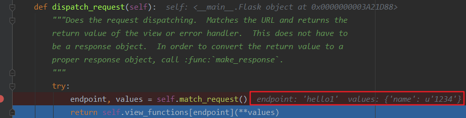
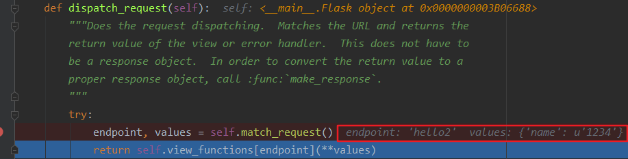

##############################################################################
Python Web 模块之 Flask v0.1
##############################################################################

.. contents::

******************************************************************************
第 2 部分  源码阅读准备 
******************************************************************************

2.3 Flask 工作流程与机制
==============================================================================

2.3.1 Flask 中的请求相应循环
------------------------------------------------------------------------------

2.3.1.1 程序启动
^^^^^^^^^^^^^^^^^^^^^^^^^^^^^^^^^^^^^^^^^^^^^^^^^^^^^^^^^^^^^^^^^^^^^^^^^^^^^^

.. code-block:: python

    class Flask(object):
        def run(self, host='localhost', port=5000, **options):
            from werkzeug import run_simple
            if 'debug' in options:
                self.debug = options.pop('debug')
            options.setdefault('use_reloader', self.debug)
            options.setdefault('use_debugger', self.debug)
            return run_simple(host, port, self, **options)    # run_simple

    [werkzeug/serving.py]

    def run_simple(hostname, port, application, use_reloader=False,
                use_debugger=False, use_evalex=True,
                extra_files=None, reloader_interval=1, threaded=False,
                processes=1, request_handler=None, static_files=None,
                passthrough_errors=False, ssl_context=None):
        if use_debugger: # 判断是否使用调试器
            from werkzeug.debug import DebuggedApplication
            application = DebuggedApplication(application, use_evalex)
        if static_files:
            from werkzeug.wsgi import SharedDataMiddleware
            application = SharedDataMiddleware(application, static_files)

        def inner():
            make_server(hostname, port, application, threaded,
                        processes, request_handler,
                        passthrough_errors, ssl_context).serve_forever()

        if os.environ.get('WERKZEUG_RUN_MAIN') != 'true':
            display_hostname = hostname != '*' and hostname or 'localhost'
            if ':' in display_hostname:
                display_hostname = '[%s]' % display_hostname
            _log('info', ' * Running on %s://%s:%d/', ssl_context is None
                and 'http' or 'https', display_hostname, port)
        if use_reloader: # 判断是否使用重载器
            # Create and destroy a socket so that any exceptions are raised before
            # we spawn a separate Python interpreter and lose this ability.
            test_socket = socket.socket(socket.AF_INET, socket.SOCK_STREAM)
            test_socket.setsockopt(socket.SOL_SOCKET, socket.SO_REUSEADDR, 1)
            test_socket.bind((hostname, port))
            test_socket.close()
            run_with_reloader(inner, extra_files, reloader_interval)
        else:
            inner()

run() 函数最后一行是 ``return run_simple(host, port, self, **options)`` ， 而 \
run_simple() 函数的第三个参数是 application ， 实际使用的时候是 self ， 指的是 \
Flask 对象本身 ， 因此会调用当前对象的 __call__() 方法进行请求的处理 ， 这时就会运\
行 wsgi_app 。 

在这里使用了两个 Werkzeug 提供的中间件 ， 如果 use_debugger 为 Ture ， 也就是开启\
调试模式 ， 那么就使用 DebuggedApplication 中间件为程序添加调试功能 。 如果 \
static_files 为 True ， 就使用 SharedDataMiddleware 中间件为程序添加提供 \
（serve） 静态文件的功能 。 

这个方法最终会调用 inner() 函数 ， 函数中的代码和之前创建的 WSGI 程序末尾很像 。 它\
使用 make_server() 方法创建服务器 ， 然后调用 serve_forever() 方法运行服务器 。 \
为了避免偏离重点 ， 中间在 Werkzeug 和其他模块的调用我们不再分析 。 我们在前面学习\
过 WSGI 的内容 ， 当接收到请求时 ， WSGI 服务器会调用 Web 程序中提供的可调用对象 \
， 这个对象就是我们的程序实例 app 。 现在 ， 第一个请求进入了 。 

2.3.1.2 请求 In
^^^^^^^^^^^^^^^^^^^^^^^^^^^^^^^^^^^^^^^^^^^^^^^^^^^^^^^^^^^^^^^^^^^^^^^^^^^^^^

Flask类实现了 __call__() 方法 ， 当程序实例被调用时会执行这个方法 ， 而这个方法内\
部调用了 Flask.wsgi_app() 方法 ， 如下所示 。 

.. code-block:: python 

    [flask.py]

    class Flask(object):

        def wsgi_app(self, environ, start_response):
            with self.request_context(environ):
                rv = self.preprocess_request()
                if rv is None:
                    rv = self.dispatch_request()
                response = self.make_response(rv)
                response = self.process_response(response)
                return response(environ, start_response)

        def __call__(self, environ, start_response):
            """Shortcut for :attr:`wsgi_app`"""
            return self.wsgi_app(environ, start_response)

通过 wsgi_app() 方法接收的参数可以看出来 ， 这个 wsgi_app() 方法就是隐藏在 Flask \
中的那个 WSGI 程序 。 这里将 WSGI 程序实现在单独的方法中 ， 而不是直接实现在 \
__call__() 方法中 ， 主要是为了在方便附加中间件的同时保留对程序实例的引用 。 WSGI \
程序调用了 preprocess_request() 方法对请求进行预处理 （request preprocessing） \
， 这会执行所有使用 before_request 钩子注册的函数 。 

如果预处理没有结果 ， 即为空 ， 然后执行 dispatch_request ， 用于请求调度 ， 它会\
匹配并调用对应的视图函数 ， 获取其返回值 ， 在这里赋值给rv 。 请求调度的具体细节我\
们会在后面了解 。 最后 ， 接收视图函数返回值的 make_response 会使用这个值来生成响\
应 。 完整的调度在 wsgi_app 中已经写明了 。

2.3.1.3 响应 Out
^^^^^^^^^^^^^^^^^^^^^^^^^^^^^^^^^^^^^^^^^^^^^^^^^^^^^^^^^^^^^^^^^^^^^^^^^^^^^^

而最终的处理也是在 wsgi_app 中 ， 如下 ：

.. code-block:: python 

    def wsgi_app(self, environ, start_response):
        with self.request_context(environ):
            rv = self.preprocess_request()
            if rv is None:
                rv = self.dispatch_request()
            response = self.make_response(rv)
            response = self.process_response(response)
            return response(environ, start_response)

在函数的最后三行 ， 使用 Flask 类中的 make_response() 方法生成响应对象 ， 然后调\
用 process_response() 方法处理响应 。 返回作为响应的 response 后 ， 代码执行流程\
就回到了 wsgi_app() 方法 ， 最后返回响应对象 ， WSGI 服务器接收这个响应对象 ， 并\
把它转换成 HTTP 响应报文发送给客户端 。 就这样 ， Flask 中的请求 - 循环之旅结束了 。 

2.3.2 路由系统
------------------------------------------------------------------------------

2.3.2.1 注册路由
^^^^^^^^^^^^^^^^^^^^^^^^^^^^^^^^^^^^^^^^^^^^^^^^^^^^^^^^^^^^^^^^^^^^^^^^^^^^^^

路由系统内部是由 Werkzeug 实现的 ， 为了更好地了解 Flask 中的相关代码 ， 需要先看一\
下路由功能在 Werkzeug 中是如何实现的 。 下面的代码用于创建路由表 Map ， 并添加三个 \
URL 规则 ： 

.. code-block:: bash

    >>> from werkzeug.routing import Map, Rule
    >>> m = Map()
    >>> rule1 = Rule('/', endpoint='index')
    >>> rule2 = Rule('/downloads/', endpoint='downloads/index')
    >>> rule3 = Rule('/downloads/<int:id>', endpoint='downloads/show')
    >>> m
    Map([[]])
    >>> m.add(rule1)
    >>> m.add(rule2)
    >>> m.add(rule3)
    >>> m
    Map([[<Rule '/' -> index>,
    <Rule '/downloads/' -> downloads/index>,
    <Rule '/downloads/<id>' -> downloads/show>]])
    >>>

在 Flask 中 ， 我们使用 route() 装饰器来将试图函数注册为路由 ： 

.. code-block:: python  

    @app.route('/')
    def hello():
        return 'Hello, Flask!'

Flask.route() 是 Flask 类的类方法 ， 如代码清单所示 。 

.. code-block:: python  

    [flask.py]

    class Flask(object):

        def route(self, rule, **options):
            def decorator(f):
                self.add_url_rule(rule, f.__name__, **options)
                self.view_functions[f.__name__] = f
                return f
            return decorator

可以看到 route 装饰器的内部调用了 add_url_rule() 来添加 URL 规则 ， 所以注册路由\
也可以直接使用 add_url_rule 实现 。 add_url_rule() 方法如代码清单所示 ： 

.. code-block:: python  

    [flask.py]

    class Flask(object):

        def add_url_rule(self, rule, endpoint, **options):
            options['endpoint'] = endpoint
            options.setdefault('methods', ('GET',))
            self.url_map.add(Rule(rule, **options))

这个方法的重点是 ``self.url_map.add(Rule(rule, **options))`` ， 这里引入了 \
url_map 。 而在 route 函数中则引入了 view_functions 对象 。 

url_map 是 Werkzeug 的 Map 类实例 （werkzeug.routing.Map） 。 它存储了 URL 规则\
和相关配置 ， 这里的 rule 是 Werkzeug 提供的 Rule 实例 (werkzeug.routing.Rule) \
， 其中保存了端点和 URL 规则的映射关系 。

而 view_function 则是 Flask 类中定义的一个字典 ， 它存储了端点和视图函数的映射关\
系 。 看到这里你大概已经发现端点是如何作为中间人连接起 URL 规则和视图函数的 。 如果\
回过头看本节开始提供的 Werkzeug 中的路由注册代码 ， 你会发现 add_url_rule() 方法中\
的这些代码做了同样的事情 ： 

.. code-block:: python  

    [flask.py]
    self.url_map.add(Rule(rule, **options))

2.3.2.2 URL 匹配
^^^^^^^^^^^^^^^^^^^^^^^^^^^^^^^^^^^^^^^^^^^^^^^^^^^^^^^^^^^^^^^^^^^^^^^^^^^^^^

在上面的 Werkzeug 路由注册代码示例中 ， 我们创建了路由表 m ， 并使用 add() 方法添\
加了三个路由规则 。 现在 ， 来看看如何在 Werkzeug 中进行 URL 匹配 ， URL 匹配的示\
例如下所示 ： 

.. code-block:: bash

    >>> from werkzeug.routing import Map, Rule
    >>> m = Map()
    >>> rule1 = Rule('/', endpoint='index')
    >>> rule2 = Rule('/downloads/', endpoint='downloads/index')
    >>> rule3 = Rule('/downloads/<int:id>', endpoint='downloads/show')
    >>> m
    Map([[]])
    >>> m.add(rule1)
    >>> m.add(rule2)
    >>> m.add(rule3)
    >>> m
    Map([[<Rule '/' -> index>,
    <Rule '/downloads/' -> downloads/index>,
    <Rule '/downloads/<id>' -> downloads/show>]])
    >>> urls = m.bind('example.com')
    >>> urls.match('/', 'GET')
    ('index', {})
    >>> urls.match('/downloads/42')
    ('downloads/show', {'id': 42})
    >>> urls.match('/downloads')
    Traceback (most recent call last):
    File "<stdin>", line 1, in <module>
    File "C:\Anaconda3\envs\python27\lib\site-packages\werkzeug\routing.py", line 1261, in match
        url_quote(path_info.lstrip('/'), self.map.charset)
    werkzeug.routing.RequestRedirect: 301: Moved Permanently
    >>> urls.match('/missing')
    Traceback (most recent call last):
    File "<stdin>", line 1, in <module>
    File "C:\Anaconda3\envs\python27\lib\site-packages\werkzeug\routing.py", line 1302, in match
        raise NotFound()
    werkzeug.exceptions.NotFound: 404: Not Found
    >>>

Map.bind() 方法和 Map.bind_to_environ() 都会返回一个 MapAdapter 对象 ， 它负责匹\
配和构建 URL 。 MapAdapter 类的 match 方法用来判断传入的 URL 是否匹配 Map 对象中\
存储的路由规则 （存储在 self.map._rules 列表中） 。 上面的例子中分别展示了几种常见\
的匹配情况 。 匹配成功后会返回一个包含 URL 端点和 URL 变量的元组 。 

为了确保 URL 的唯一 ， Werkzeug 使用下面的规则来处理尾部斜线问题 ： 当你定义的 URL \
规则添加了尾部斜线时 ， 用户访问未加尾部斜线的 URL 时会被自动重定向到正确的 URL ； \
反过来 ， 如果定义的 URL 不包含尾部斜线 ， 用户访问的 URL 添加了尾部斜线则会返回 \
404 错误 。 MapAdapter 类的 build() 方法用于创建 URL ， 我们用来生成 URL 的 \
url_for() 函数内部就是通过 build() 方法实现的 。 下面是一个简单的例子 ： 

.. code-block:: bash

    接着上文 ：
    >>> urls.build('index', {})
    '/'
    >>> urls.build('downloads/show', {'id': 42})
    '/downloads/42'
    >>> urls.build('downloads/show', {'id': 42}, force_external=True)
    'http://example.com/downloads/42'
    >>>

关于 Werkzeug 的路由系统 ， 这里只是简单介绍 ， 具体可以查看 Werkzeug 的文档 \
（http://werkzeug.pocoo.org/docs/latest/routing/） 及相关代码 。 

在上一节 ， 注册路由后 ， 两个对应关系分别存储到 url_map 和 view_functions 中 ， \
前者存储了 URL 到端点的映射关系 ， 后者则存储了端点和视图函数的映射关系 。 下面我们\
会了解在客户端发送请求时 ， Flask 是如何根据请求的 URL 找到对应的视图函数的 。 在上\
一节分析 Flask 中的请求响应循环时 ， 我们曾说过 ， 请求的处理最终交给了 \
dispatch_request() 方法 ， 这个方法如代码清单所示 :

.. code-block:: python  

    [flask.py]

    class Flask(object):

        def dispatch_request(self):
            try:
                endpoint, values = self.match_request()
                return self.view_functions[endpoint](**values)
            except HTTPException, e:
                handler = self.error_handlers.get(e.code)
                if handler is None:
                    return e
                return handler(e)
            except Exception, e:
                handler = self.error_handlers.get(500)
                if self.debug or handler is None:
                    raise
                return handler(e)

从名字可以看出来 ， 这个方法负责请求调度 （request dispatching） 。 正是 \
dispatch_request() 方法实现了从请求的 URL 找到端点 ， 再从端点找到对应的视图函数并\
调用的过程 。 view_functions 在注册路由时 ， 由 Rule 类表示的 rule 对象由 \
route() 装饰器传入的参数创建 。 如上文中的描述 ： view_function 是 Flask 类中定义\
的一个字典 ， 它存储了端点和视图函数的映射关系 。 

而这里先调用 match_request() 方法得到处理的 endpoint 和 values ， 如下最简单的示例\
代码 ， 如果我请求的是 http://localhost:5000/hello/world/test ， 则结果为 ： \  endpoint='hello_test' ， values={'name':'world'} ， 调试信息如下图 ： 

.. code-block:: python

    [直接在flask.py文件中添加代码测试]

    app = Flask(__name__)

    @app.route('/hello/<name>/test', methods=['POST', 'GET'])
    def hello_test(name):
        if name == "Test":
            return 'Test'
        else:
            return 'hello'

    @app.route('/hello/<name>', methods=['POST', 'GET'])
    def hello(name):
        if name == "Test":
            return 'Test'
        else:
            return 'hello'

    @app.route('/')
    def index():
        return "This is index page"

    if __name__ == '__main__':
        app.run()

如果我请求的是 http://localhost:5000/hello/world ， 则结果为 ： endpoint=\
'hello' ， values={'name':'world'} ， 调试信息如下图 ：

由此可见 endpoint 就是视图函数的名称 ， values 则是注册路由时 ， 路径的可变参数的名\
称与值组成的字典 。 

那么我们来仔细看一下 view_functions 对象 ， view_functions 在 Flask 对象初始化的\
时候是空字典 ： 

.. code-block:: python 

    class Flask(object):

        def __init__(self, package_name):
            ...
            self.view_functions = {}
            ...

第一次出现变化的是在添加路由的时候 ， 即在 Flask.route() 函数内部出现了首次变化 。 

.. code-block:: python  

    [flask.py]

    class Flask(object):

        def route(self, rule, **options):
            def decorator(f):
                self.add_url_rule(rule, f.__name__, **options)
                self.view_functions[f.__name__] = f
                return f
            return decorator

将试图函数装饰一下 ， 把视图函数本身对象复制给以视图函数名为 key ， 形式如下 ： 

:: 

    {'func_name': func(Object)}

因此在 dispatch_request 函数最后一行 \
``return self.view_functions[endpoint](**values)`` 中 ， \
self.view_functions[endpoint] 代表的是视图函数对象本身 ， 后面的 ``(**values)`` \
可以表示为 endpoint_obj(name=value) ， 即是执行视图函数 。 

虽然已经通过调试知道 match_request 函数的执行结果 ， 但还需要通过源码理解一番 。 

.. code-block:: python  

    [flask.py]

    class Flask(object):

        def match_request(self):
            rv = _request_ctx_stack.top.url_adapter.match()
            request.endpoint, request.view_args = rv
            return rv

通过上面的代码可以看到 ， 最终是调用了请求的 match() 方法来获取到 endpoint 和参数 \
， 而调用者 url_adapter = url_map.bind_to_environ(environ) ， 在 \
_RequestContext 类的初始化函数中可以看到 ： 

.. code-block:: python 

    class _RequestContext(object):

        def __init__(self, app, environ):
            self.app = app
            self.url_adapter = app.url_map.bind_to_environ(environ)
            self.request = app.request_class(environ)
            self.session = app.open_session(self.request)
            self.g = _RequestGlobals()
            self.flashes = None

self.url_adapter = app.url_map.bind_to_environ(environ) ， 也就是说实际获取 \
endpoint 与参数是通过调用 url_map.bind_to_environ(environ).match() 来获取的 。 \
通过前面的介绍我们已经知道 ， url_map 中存储的是 url 与 endpoint 之间的映射关系 \
， 这种映射关系是通过 @app.route() 进行指定的 。 而 environ 为单次请求信息 ， 内部\
包含请求的 url 。 可以理解为存储信息的对象 url_map 绑定特定的请求信息 environ ， \
然后进行匹配 match() ， 即可得到请求对应的 endpoint 和参数 value 。 也因此说明 \
match_request 在本地上下文中使用 ， 每次请求 url 创建请求上下午对象时都会执行该函\
数 。 

可以看到 endpoint 和 view_args 属性就在这个方法中创建 。 这个方法调用了 \
_request_ctx_stack.top.url_adapter.match() 来获取 endpoint 和 view_args 。 这\
里的 url_adapter 属性在 _RequestContext 的构造函数中定义 ， 其值为 \
app.url_map.bind_to_environ(environ) 

.. code-block:: python 

    [flask.py]

    class _RequestContext(object):
        """The request context contains all request relevant information.  It is
        created at the beginning of the request and pushed to the
        `_request_ctx_stack` and removed at the end of it.  It will create the
        URL adapter and request object for the WSGI environment provided.
        """

        def __init__(self, app, environ):
            self.app = app
            self.url_adapter = app.url_map.bind_to_environ(environ)
            self.request = app.request_class(environ)
            self.session = app.open_session(self.request)
            self.g = _RequestGlobals()
            self.flashes = None

        def __enter__(self):
            _request_ctx_stack.push(self)

        def __exit__(self, exc_type, exc_value, tb):
            # do not pop the request stack if we are in debug mode and an
            # exception happened.  This will allow the debugger to still
            # access the request object in the interactive shell.
            if tb is None or not self.app.debug:
                _request_ctx_stack.pop()

我们知道 url_map 属性是一个 Map 对象 ， 可以看出它最后调用了 bind() 或 \
bind_to_environ() 方法 ， 最终会返回一个 MapAdapter 类实例 。 

match_request() 方法通过调用 MapAdapter.match() 方法来匹配请求 URL ， 返回结果包\
含 endpoint 属性 ， 存储着匹配成功的端点值 。 

在 dispatch_request() 最后这一行代码中，通过在 view_functions 字典中根据端点作为\
键即可找到对应的视图函数对象 ， 并调用它 ： 

::
    
    return self.view_functions[endpoint](**values)

调用视图函数时传递的参数 ``**values`` 包含 URL 中解析出的变量值 ， 也就是 match() \
函数返回的第二个值 。 这时代码执行流程才终于走到视图函数中 。 

2.3.3 本地上下文
------------------------------------------------------------------------------

Flask 提供了两种上下文 ， 请求上下文和程序上下文 ， 这两种上下文分别包含 request \
、 session 和 current_app 、 g 这四个变量 ， 这些变量是实际对象的本地代理 \
(local proxy) ， 因此被称为本地上下文 (context locals) 。 这些代理对象定义在脚\
本中 。

获取当前请求的信息是从 _request_ctx_stack.top 中获取出来的 ， 也就是说请求会被加入\
请求栈中 ， 栈顶的就是当前请求 。 可以看一下这个请求栈 _request_ctx_stack 的定义 ： 

.. code-block:: python 

    _request_ctx_stack = LocalStack()
    current_app = LocalProxy(lambda: _request_ctx_stack.top.app)
    request = LocalProxy(lambda: _request_ctx_stack.top.request)
    session = LocalProxy(lambda: _request_ctx_stack.top.session)
    g = LocalProxy(lambda: _request_ctx_stack.top.g)

我们在程序中从 flask 包直接导入的 request 和 session 就是定义在这里的全局对象 ， \
这两个对象是对实际的 request 变量和 session 变量的代理 。

未完待续 ...

上一篇文章 ： `上一篇`_

下一篇文章 ： `下一篇`_ 

.. _`上一篇`: flask-0.1-01.rst
.. _`下一篇`: flask-0.1-03.rst
