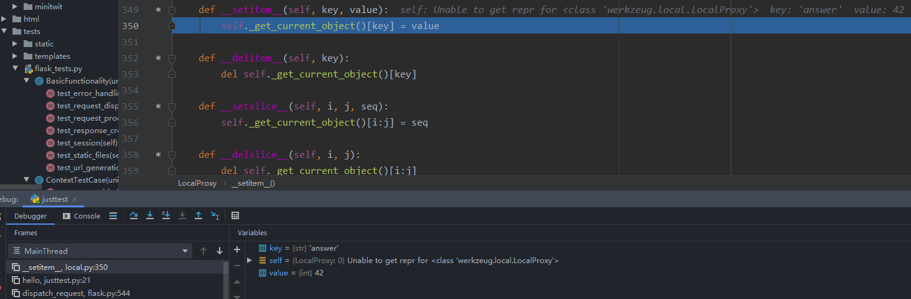
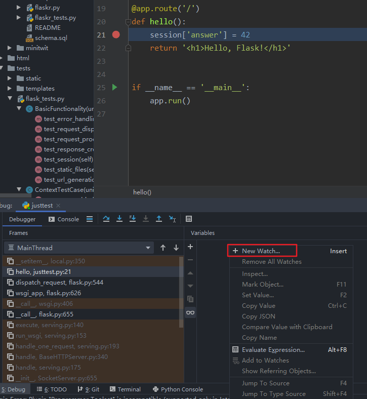
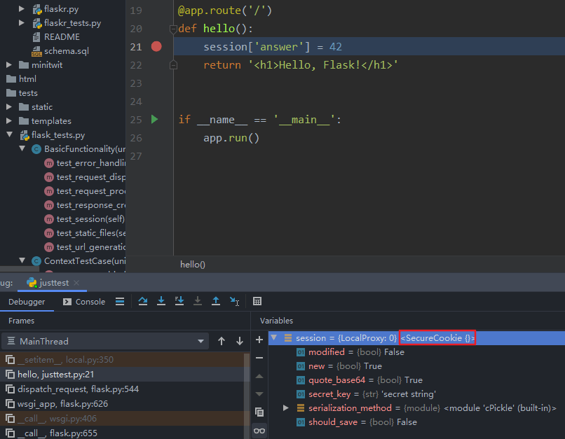

##############################################################################
Python Web 模块之 Flask v0.1
##############################################################################

.. contents::

******************************************************************************
第 2 部分  源码阅读准备 
******************************************************************************

2.3 Flask 工作流程
==============================================================================

2.3.4 请求与响应对象
------------------------------------------------------------------------------

2.3.4.1 请求对象
^^^^^^^^^^^^^^^^^^^^^^^^^^^^^^^^^^^^^^^^^^^^^^^^^^^^^^^^^^^^^^^^^^^^^^^^^^^^^^

承接上文 ， 溯源代码如下 : 

.. code-block:: python 

    [flask.py]

    class _RequestContext(object):

        def __init__(self, app, environ):
            self.request = app.request_class(environ)
            ...
    
    class Flask(object):

        request_class = Request
        ...

    class Request(RequestBase):
        """The request object used by default in flask.  Remembers the
        matched endpoint and view arguments.

        It is what ends up as :class:`~flask.request`.  If you want to replace
        the request object used you can subclass this and set
        :attr:`~flask.Flask.request_class` to your subclass.
        """

        def __init__(self, environ):
            RequestBase.__init__(self, environ)
            self.endpoint = None
            self.view_args = None
    
    from werkzeug import Request as RequestBase, Response as ResponseBase, \
         LocalStack, LocalProxy, create_environ, cached_property, \
         SharedDataMiddleware

    [flask/wrappers.py：Request]

    class Request(BaseRequest, AcceptMixin, ETagRequestMixin,
              UserAgentMixin, AuthorizationMixin,
              CommonRequestDescriptorsMixin):
        """Full featured request object implementing the following mixins:

        - :class:`AcceptMixin` for accept header parsing
        - :class:`ETagRequestMixin` for etag and cache control handling
        - :class:`UserAgentMixin` for user agent introspection
        - :class:`AuthorizationMixin` for http auth handling
        - :class:`CommonRequestDescriptorsMixin` for common headers
        """

Request 类继承 Werkzeug 提供的 Request 类 。 请求对象 request 的大部分属性都直接\
继承 Werkzeug 中 Request 类的属性 ， 比如 method 、 args 等 。 Flask 中的这个 \
Request 类主要添加了一些 Flask 特有的属性 ， 比如为了方便获取当前端点的 endpoint \
属性等 。 

Flask 允许自定义请求类 ， 通常情况下 ， 我们会子类化这个 Request 类 ， 并添加一些自\
定义的设置 ， 然后把这个自定义请求类赋值给程序实例的 request_class 属性 。 

2.3.4.2 响应对象
^^^^^^^^^^^^^^^^^^^^^^^^^^^^^^^^^^^^^^^^^^^^^^^^^^^^^^^^^^^^^^^^^^^^^^^^^^^^^^

一般情况下 ， 在编写程序时我们并不需要直接与响应打交道 。 在 Flask 中的请求 - 响应\
循环中 ， 我们知道响应是在 wsgi_app() 方法中生成的 ， 它调用了 \
flask.Flask.make_response() 方法生成响应对象 ， 传入的 rv 参数是 \
dispatch_request() 的返回值 ， 也就是视图函数的返回值 。 

在前面介绍过 ， 视图函数可以返回多种类型的返回值 。 完整的合法返回值如表所示 。 

.. image:: img/2-5.png

这个 Flask.make_response() 方法主要的工作就是判断返回值是表中的哪一种类型 ， 最后\
根据类型做相应处理 ， 最后生成一个响应对象并返回它 。 响应对象为 Response 类的实例 \
， Response 类的定义如代码清单所示 。 

.. code-block:: python 

    [flask.py]

    class Response(ResponseBase):
        """The response object that is used by default in flask.  Works like the
        response object from Werkzeug but is set to have a HTML mimetype by
        default.  Quite often you don't have to create this object yourself because
        :meth:`~flask.Flask.make_response` will take care of that for you.

        If you want to replace the response object used you can subclass this and
        set :attr:`~flask.Flask.request_class` to your subclass.
        """
        default_mimetype = 'text/html'

和 Request 类相似 ， 这个响应对象继承 Werkzeug 中的 Response 类 。 这个类比 \
Request 类更简单 ， 只是设置了默认的 MIME 类型 。 

Flask 也允许你自定义响应类 ， 自定义的响应类通常会继承自内置的 Response 类 ， 然后\
赋值给 flask.Flask.response_class 属性 。 

2.3.5 Session 
------------------------------------------------------------------------------

在开始介绍 session 的实现之前 ， 有必要再重申一下措辞问题 。 我会使用下面的方式来表\
述三个与 session 相关的内容 ： Flask 提供了 "session 变量/对象" 来操作 "用户会话 \
(Session)" ， 它把用户会话保存在 "一块名/键为 session 的 cookie" 中 。 

在 Flask 中使用 session 非常简单 ， 只需要设置好密钥 ， 就可以在视图函数中操作 \
session 对象 ： 

.. code-block:: python  

    from flask import Flask, session
    app = Flask(__name__)
    app.secret_key = 'secret string'

    @app.route('/')
    def hello():
        session['answer'] = 42
        return '<h1>Hello, Flask!</h1>'

当第一次介绍 session 时我们曾说它 "可以记住请求间的值" ， 很多人会对这句话感到困惑 \
。 就这个例子来说 ， 当用户访问 hello 视图时 ， 会把数字 42 存储到 session 对象里 \
， 以 answer 作为键 。 假如我再定义一个 bingo 视图 ， 当用户访问 bingo 视图时 ， \
我们可以在 bingo 视图里再次从 session 通过 answer 键获取这个数字 。 这一存一取背后\
的逻辑是这样的 ：

向 session 中存储值时 ， 会生成加密的 cookie 加入响应 。 这时用户的浏览器接收到响应\
会将 cookie 存储起来 。 当用户再次发起请求时 ， 浏览器会自动在请求报文中加入这个 \
cookie 值 。 Flask 接收到请求会把 session cookie 的值解析到 session 对象里 。 这\
时我们就可以再次从 session 中读取内容 。 

在向session中存数字的这行代码设置断点：

:: 

    session['answer'] = 42

2.3.5.1 操作 session
^^^^^^^^^^^^^^^^^^^^^^^^^^^^^^^^^^^^^^^^^^^^^^^^^^^^^^^^^^^^^^^^^^^^^^^^^^^^^^

在前面学习过 ， session 变量在 flask 中的定义 ：

.. code-block:: python 

    session = LocalProxy(lambda: _request_ctx_stack.top.session)

从上面的代码中可以看到 Flask 从请求上下文堆栈的栈顶 (_request_ctx_stack.top) 获取\
请求上下文 ， 可以看出 session 是请求上下文对象 (即 _RequestContext) 的一个属性 \
， 这也就意味着 ， session 变量是在生成请求上下文的时候创建的 ， 后面我们会详细了解\
它的生成过程 。 

继续步进代码后 ， 会执行 LocalProxy 类的 __setitem__() 方法 ， 它会把设置操作转发\
给真实的 session 对象 ： 

.. code-block:: python 

    class LocalProxy(object):
        ...
        def __setitem__(self, key, value):
            self._get_current_object()[key] = value

这时在调试工具栏右侧的变量列表中可以看到已经被代理的 session 对象实际上是 \
werkzeug.contrib.securecookie 模块中的 SecureCookie 类的实例 。 

查看步骤 ： 

1. 鼠标选择 'hello' , 在 variable 中添加 watch

2. 添加 'session'

在 Werkzeug 中进行一系列查询工作后 ， 最终执行了 SecureCookie 类中的 \
load_cookie() 方法 。

.. code-block:: python 

    [werkzeug/contrib/securecookie.py]

    class SecureCookie(ModificationTrackingDict):

        @classmethod
        def load_cookie(cls, request, key='session', secret_key=None):
            data = request.cookies.get(key)
            if not data:
                return cls(secret_key=secret_key)
            return cls.unserialize(data, secret_key)

        @classmethod
        def unserialize(cls, string, secret_key):
            if isinstance(string, unicode):
                string = string.encode('utf-8', 'ignore')
            try:
                base64_hash, data = string.split('?', 1)
            except (ValueError, IndexError):
                items = ()
            else:
                items = {}
                mac = hmac(secret_key, None, cls.hash_method)
                for item in data.split('&'):
                    mac.update('|' + item)
                    if not '=' in item:
                        items = None
                        break
                    key, value = item.split('=', 1)
                    # try to make the key a string
                    key = url_unquote_plus(key)
                    try:
                        key = str(key)
                    except UnicodeError:
                        pass
                    items[key] = value

                # no parsing error and the mac looks okay, we can now
                # sercurely unpickle our cookie.
                try:
                    client_hash = base64_hash.decode('base64')
                except Exception:
                    items = client_hash = None
                if items is not None and client_hash == mac.digest():
                    try:
                        for key, value in items.iteritems():
                            items[key] = cls.unquote(value)
                    except UnquoteError:
                        items = ()
                    else:
                        if '_expires' in items:
                            if time() > items['_expires']:
                                items = ()
                            else:
                                del items['_expires']
                else:
                    items = ()
            return cls(items, secret_key, False)

Werkzeug 提供了很多有用的数据结构 ， 这些数据结构都定义在 \
werkzeug.datastructures 模块中 。

当我们对 session 进行写入和更新操作时 ， Flask 需要将新的值写入到 cookie 中 ， 这\
是如何做到的呢 ？ 我们再返回到调用流程 ， wsgi_app 中调用 make_response() 方法来生\
成响应对象 ， 最后调用了 process_response() 对响应对象进行预处理 ， session 的更新\
操作就在 process_response() 函数中 ， 如代码清单所示 。 

.. code-block:: python 

    [flask.py]

    class Flask(object):

        def process_response(self, response):
            """Can be overridden in order to modify the response object
            before it's sent to the WSGI server.  By default this will
            call all the :meth:`after_request` decorated functions.

            :param response: a :attr:`response_class` object.
            :return: a new response object or the same, has to be an
                    instance of :attr:`response_class`.
            """
            session = _request_ctx_stack.top.session
            if session is not None:
                self.save_session(session, response)
            for handler in self.after_request_funcs:
                response = handler(response)
            return response

process_response() 方法首先获取请求上下文对象 ， 然后会先检查 session 是不是无效\
的 。 如果返回 True 就调用 save_session() 方法来保存 session ， 如代码清单所示 。 

.. code-block:: python 

    [flask.py]

    class Flask(object):

        def save_session(self, session, response):
            """Saves the session if it needs updates.  For the default
            implementation, check :meth:`open_session`.

            :param session: the session to be saved (a
                            :class:`~werkzeug.contrib.securecookie.SecureCookie`
                            object)
            :param response: an instance of :attr:`response_class`
            """
            if session is not None:
                session.save_cookie(response, self.session_cookie_name)

在 save_session() 方法的最后对传入的请求对象调用 save_cookie 方法设置 cookie ， \
这个方法的定义在 werkzeug.contrib.SecureCookie 中 ， save_cookie 最后调用了 \
set_cookie() 函数 ， set_cookie 接收的一系列设置参数都是通过 Flask 内置的配置键设\
置的 ， 如表所示 。 

.. code-block:: python 

    [werkzeug/contrib/securecookie.py]

    class SecureCookie(ModificationTrackingDict):
        def save_cookie(self, response, key='session', expires=None,
                        session_expires=None, max_age=None, path='/', domain=None,
                        secure=None, httponly=False, force=False):
            """Saves the SecureCookie in a cookie on response object.  All
            parameters that are not described here are forwarded directly
            to :meth:`~BaseResponse.set_cookie`.

            :param response: a response object that has a
                            :meth:`~BaseResponse.set_cookie` method.
            :param key: the name of the cookie.
            :param session_expires: the expiration date of the secure cookie
                                    stored information.  If this is not provided
                                    the cookie `expires` date is used instead.
            """
            if force or self.should_save:
                data = self.serialize(session_expires or expires)
                response.set_cookie(key, data, expires=expires, max_age=max_age,
                                    path=path, domain=domain, secure=secure,
                                    httponly=httponly)

.. image:: img/2-9.png

在这些配置键中 ， SESSION_COOKIE_NAME 也可以通过 Flask 类的属性来设置 ， 分别为 \
session_cookie_name ， 但是 PERMANENT_SESSION_LIFETIME \
(permanent_session_lifetime) 在 0.1 版本中并不存在 。 session cookie 的值 \
(value) 由下面这行代码生成 ： 

.. code-block:: python 

    data = self.serialize(session_expires or expires)

    def serialize(self, expires=None):
        """Serialize the secure cookie into a string.

        If expires is provided, the session will be automatically invalidated
        after expiration when you unseralize it. This provides better
        protection against session cookie theft.

        :param expires: an optional expiration date for the cookie (a
                        :class:`datetime.datetime` object)
        """
        if self.secret_key is None:
            raise RuntimeError('no secret key defined')
        if expires:
            self['_expires'] = _date_to_unix(expires)
        result = []
        mac = hmac(self.secret_key, None, self.hash_method)
        for key, value in sorted(self.items()):
            result.append('%s=%s' % (
                url_quote_plus(key),
                self.quote(value)
            ))
            mac.update('|' + result[-1])
        return '%s?%s' % (
            mac.digest().encode('base64').strip(),
            '&'.join(result)
        )

在 0.10 版本以前 ， session 序列化为 cookie 的格式为 pickle 。 之后更换为 JSON \
格式是为了增强安全性 ， 避免密钥泄露导致的攻击 。 

2.3.5.2 Session 起源
^^^^^^^^^^^^^^^^^^^^^^^^^^^^^^^^^^^^^^^^^^^^^^^^^^^^^^^^^^^^^^^^^^^^^^^^^^^^^^

在上一节我们知道 ， session 变量在请求上下文中创建 ， 因此为了探寻 session 的起源 \
， 我们需要将断点设置到创建请求上下文之前 ， 比如在Flask类的 __call__ 方法中 。 不\
过 ， 这样的话整个过程就掺杂了太多不相关的操作 ， 需要频繁使用 Step Out 按钮 ， 作\
为替代 ， 可以采取手动探索的方式来探寻 session 的起源 。 

既然 session 变量在 _RequestContext 中创建 ， 那么生成 session 对象的操作也应该在\
这里 。 打开搜索功能 ， 找到 _RequestContext 的定义后发现相关的代码在 __init__方法\
中 ， 如代码清单所示 。 

.. code-block:: python 

    class _RequestContext(object):

        def __init__(self, app, environ):
            self.app = app
            self.url_adapter = app.url_map.bind_to_environ(environ)
            self.request = app.request_class(environ)
            self.session = app.open_session(self.request)
            self.g = _RequestGlobals()
            self.flashes = None

请求上下文的 __init__() 方法中调用了 open_session() 方法来创建 session ， 也就是\
说 ， 一旦接收到请求 ， 就会创建 session 对象 。 open_session() 方法接收程序实例和\
请求对象作为参数 ， 我们可以猜想到 ， 程序实例是用来获取密钥验证 session 值 ， 而请\
求对象参数是用于获取请求中的 cookie 。 open_session() 方法的定义如代码清单所示 。 

.. code-block:: python 

    [flask.py]

    class Flask(object):

        def open_session(self, request):
            """Creates or opens a new session.  Default implementation stores all
            session data in a signed cookie.  This requires that the
            :attr:`secret_key` is set.

            :param request: an instance of :attr:`request_class`.
            """
            key = self.secret_key
            if key is not None:
                return SecureCookie.load_cookie(request, self.session_cookie_name,
                                                secret_key=key)

在这个方法中 ， 如果请求的 cookie 里包含 session 数据 ， 就解析数据到 session 对象\
里 ， 否则就生成一个空的 session 。 这里要注意的是 ， 如果没有设置秘钥 ， \
open_session() 会返回 None ， 这时在 push() 方法中会调用 make_null_session 来生\
成一个无效的 session 对象 (NullSession 类) ， 对其执行字典操作时会显示警告 。 最终\
返回的 session ， 就是我们一开始在视图函数里使用的那个 session 对象 ， 这就是 \
session 的整个生命轨迹 。 

签名可以确保 session cookie 的内容不被篡改 ， 但这并不意味着没法获取加密前的原始数\
据 。 事实上 ， session cookie 的值可以轻易地被解析出来 (即使不知道密钥) ， 这就是\
为什么我们曾频繁提到 session 中不能存入敏感数据 。 下面是使用 itsdangerous 解析 \
session 内容的示例 ： 

.. code-block:: python 

    >>> from itsdangerous import base64_decode
    >>> s = 'eyJjc3JmX3Rva2VuIjp7IiBiI...'
    >>> data, timstamp, secret = s.split('.')
    >>> base64_decode(data)
    '{"answer":42}'

Flask 提供的 session 将用户会话存储在客户端 ， 和这种存储在客户端的方式相反 ， 另一\
种实现用户会话的方式是在服务器端存储用户会话 ， 而客户端只存储一个 session ID 。 当\
接收到客户端的请求时 ， 可以根据 cookie 中的 session ID 来找到对应的用户会话内容 \
。 这种方法更为安全和强健 ， 你可以使用扩展 Flask-Session \
(https://github.com/fengsp/flask-session) 来实现这种方式的 session 。 

2.3.6 模板渲染 
------------------------------------------------------------------------------

在视图函数中 ， 我们使用 render_template() 函数来渲染模板 ， 传入模板的名称和需要\
注入模板的关键词参数 ： 

.. code-block:: python 

    [example]

    from flask import Flask, render_template
    app = Flask(__name__)

    @app.route('/hello')
    def hello():
        name = 'Flask'
        return render_template('hello.html', name=name)

我们在 return 语句这一行设置断点 ， 程序运行到断点后的第一次步进会调用 \
render_template() 函数 。 render_template() 函数的定义在脚本中 ， 如下所示 。 

.. code-block:: python 

    [flask]

    def render_template(template_name, **context):
        """Renders a template from the template folder with the given
        context.

        :param template_name: the name of the template to be rendered
        :param context: the variables that should be available in the
                        context of the template.
        """
        current_app.update_template_context(context)
        return current_app.jinja_env.get_template(template_name).render(context)

这个函数接收的 template_name 参数是文件名 ， 而 ``**context`` 参数是我们调用 \
render_template() 函数时传入的上下文参数 。 

这个函数先获取程序上下文 ， 然后调用程序实例的 Flask.update_template_context() 方\
法更新模板上下文 ， update_template_context() 的定义如代码所示 。 

.. code-block:: python 

    [flask.py]

    class Flask(object):

        def update_template_context(self, context):
            """Update the template context with some commonly used variables.
            This injects request, session and g into the template context.

            :param context: the context as a dictionary that is updated in place
                            to add extra variables.
            """
            reqctx = _request_ctx_stack.top
            for func in self.template_context_processors:
                context.update(func())

未完待续 ...

上一篇文章 ： `上一篇`_

下一篇文章 ： `下一篇`_ 

.. _`上一篇`: flask-0.1-03.rst
.. _`下一篇`: flask-0.1-05.rst