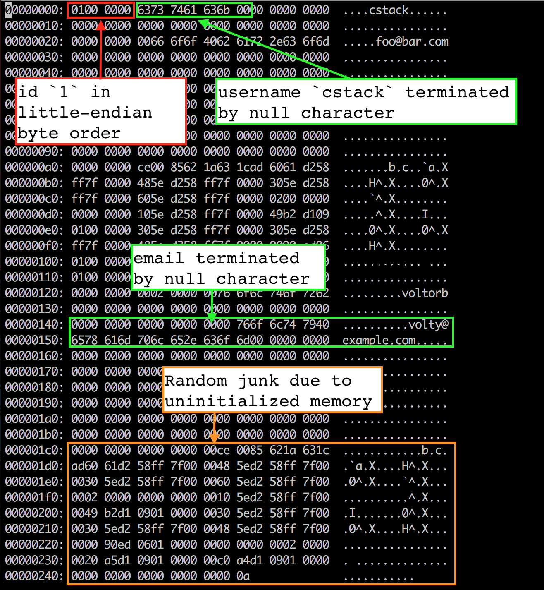
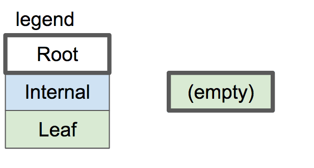
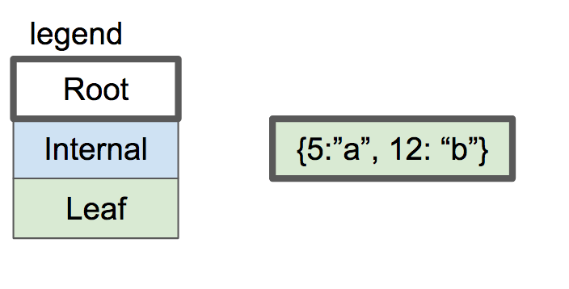
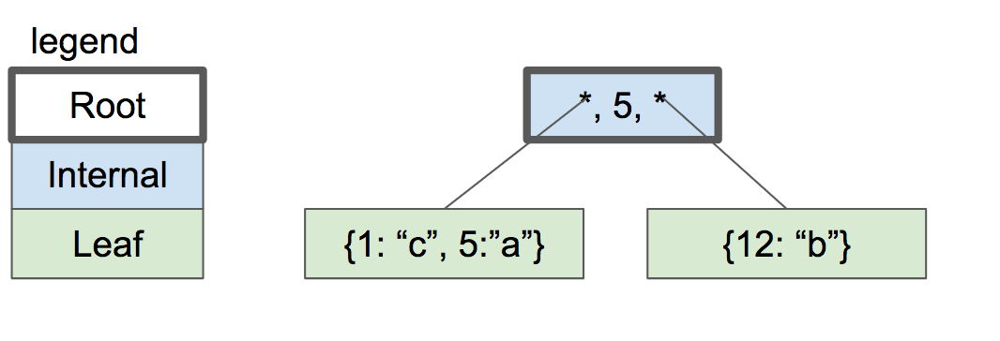
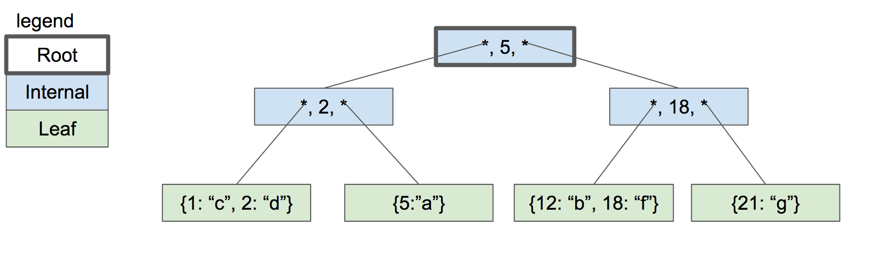
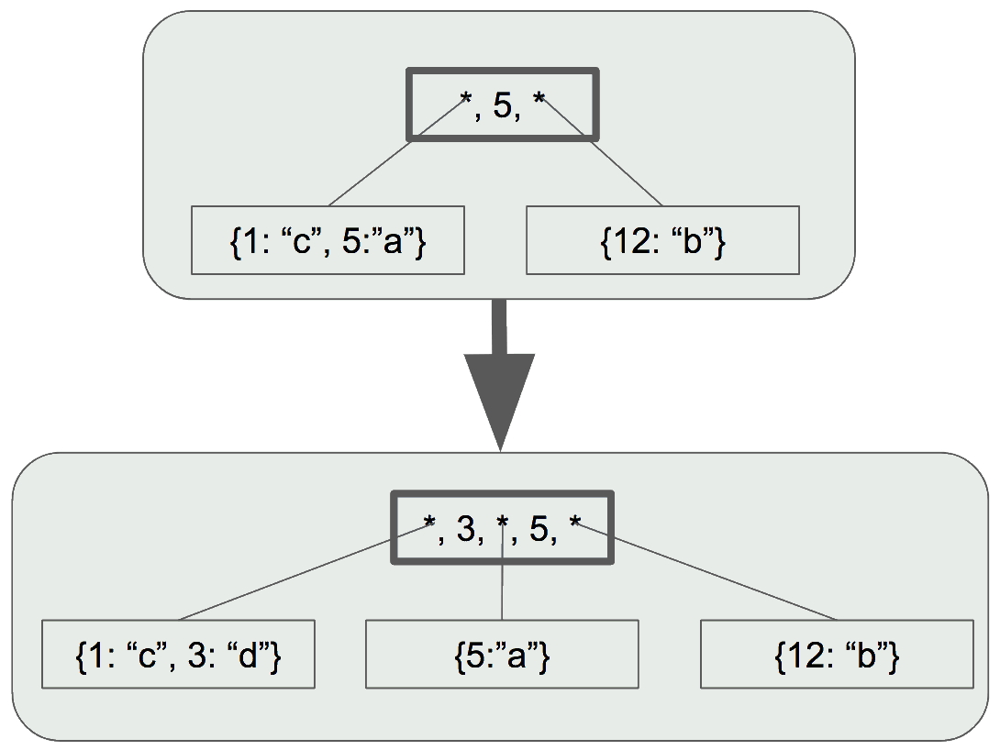

###############################################################################
C 语言从头写一个 SQLite 程序
###############################################################################

源项目来自于: https://cstack.github.io/db_tutorial/， 被 `cstack`_ 维护。 本仓库\
仅作为本人学习时文档， 全部以中文书写， 相当于翻译。 

.. _`cstack`: https://github.com/cstack

.. contents:: 目录
    :depth: 3
    :backlinks: top

*******************************************************************************
第 00 部分  数据库是怎么工作的
*******************************************************************************

- 数据是以什么格式存储的? (在内存中和硬盘中)
- 它什么时候从内存中移动到磁盘?
- 为什么一个数据表只能有一个主键 (primary key)?
- 回滚是如何进行的?
- 索引的格式是怎样的?
- 全表扫描是何时以及如何进行的?
- 准备好的报表是以什么格式保存的?

总而言之， 一个数据库是怎么工作的?

为了理解数据库工作原理， 我正在用 C 语言从头开始建立一个克隆的 SQLite， 我将在文档中\
记录我的过程。 

    "What I cannot create, I do not understand." – Richard Feynman

   
    sqlite architecture (https://www.sqlite.org/arch.html)

*******************************************************************************
第 01 部分  REPL 的介绍和设置
*******************************************************************************

作为一个 Web 开发者， 在工作中我每天使用关系型数据库， 但是它们对于我来说是一个黑盒\
。 我有一些问题： 

- 数据是以什么格式存储的? (在内存中和硬盘中)
- 它什么时候从内存中移动到磁盘?
- 为什么一个数据表只能有一个主键 (primary key)?
- 回滚是如何进行的?
- 索引的格式是怎样的?
- 全表扫描是何时以及如何进行的?
- 准备好的报表是以什么格式保存的?

总而言之， 一个数据库是怎么工作的?

为了弄清这些问题， 我正在从头开始写一个数据库。 它以 SQLite 为模型， 因为它被设计成\
比 MySQL 或 PostgreSQL 更小的功能， 所以我有更好的希望了解它。 整个数据库被存储在一\
个文件中。

1.1 SQLite
===============================================================================

SQLite 官方网站上有很多关于 SQLite 的 `内部文档`_， 另外我还有一本 \
`《SQLite 数据库系统： 设计与实现》`_。

.. _`内部文档`: https://www.sqlite.org/arch.html
.. _`《SQLite 数据库系统： 设计与实现》`: https://play.google.com/store/books/details?id=9Z6IQQnX1JEC

.. figure:: img/arch1.gif
    :align: center

    sqlite architecture (https://www.sqlite.org/zipvfs/doc/trunk/www/howitworks.wiki)

一个查询要经过一连串的组件， 以检索或修改数据。 前端由以下部分组成: 

- tokenizer
- parser
- code generator

前端的输入是一个 SQL 查询。 输出是 sqlite 虚拟机字节码 (基本上是一个可以在数据库上操\
作的编译程序)。 

后端由以下部分组成: 

- virtual machine
- B-tree
- pager
- os interface

虚拟机把由前端生成的字节码作为指令。 然后它可以对一个或多个表或索引进行操作， 每个表\
或索引都存储在一个叫做 B 树的数据结构中。 虚拟机本质上是一个关于字节码指令类型的大开\
关语句。 

每个 B 型树由许多节点组成。 每个节点都是一个页面的长度。 B 树可以通过向 pager 发出命\
令从磁盘上检索一个页面或将其保存回磁盘。 

pager 接收读取或写入数据页的命令。 它负责在数据库文件的适当偏移处进行读 / 写。 它还\
在内存中保存最近访问的页面的缓存， 并决定这些页面何时需要写回磁盘。 

系统接口是根据 SQLite 是在哪个操作系统上编译而不同的一层。 在本教程中， 我不打算支持\
多个平台。 

千里之行始于足下， 所以让我们从更直接的东西开始： REPL。 

1.2 制作一个简单的 REPL
===============================================================================

当你从命令行启动 SQLite 时， 它会启动一个读取-执行-打印的循环。 

.. code-block:: shell

    ~ sqlite3
    SQLite version 3.16.0 2016-11-04 19:09:39
    Enter ".help" for usage hints.
    Connected to a transient in-memory database.
    Use ".open FILENAME" to reopen on a persistent database.
    sqlite> create table users (id int, username varchar(255), email varchar(255));
    sqlite> .tables
    users
    sqlite> .exit
    ~

为了做到这一点， 我们的主函数将有一个无限循环， 打印提示信息， 获得一行输入， 然后处\
理这一行输入。 

.. code-block:: C 

    int main(int argc, char* argv[]) {
        InputBuffer* input_buffer = new_input_buffer();
        while (true) {
            print_prompt();
            read_input(input_buffer);

            if (strcmp(input_buffer->buffer, ".exit") == 0) {
                close_input_buffer(input_buffer);
                exit(EXIT_SUCCESS);
            } else {
                printf("Unrecognized command '%s'.\n", input_buffer->buffer);
            }
        }
    }

我们将定义 InputBuffer 作为一个小的围绕我们需要存储的状态的包装， 与 ``getline()`` \
进行交互。 稍后会有更多关于这个问题的内容。 

接下来， ``print_prompt()`` 向用户打印一个提示。 我们在读取每一行的输入之前做这个。 

.. code-block:: C 

    void print_prompt() { printf("db > "); }

使用 ``getline()`` 读取一行输入:

.. code-block:: C 

    ssize_t getline(char **lineptr, size_t *n, FILE *stream);

lineptr: 指向变量的指针， 我们用它来指向包含读行的缓冲区。 如果它被设置为 NULL ， 那\
么它就会被 ``getline`` 所 ``mallocat``， 因此应该被用户释放， 即使命令失败。 

n: 一个指向变量的指针， 我们用它来保存分配的缓冲区的大小。 

stream: 读取的输入流。 我们将从标准输入中读取。 

返回值: 读取的字节数， 这可能小于缓冲区的大小。 

我们告诉 ``getline`` 在 ``input_buffer->buffer`` 中存储读取的行， 在 \
``input_buffer->buffer_length`` 中存储分配的缓冲区的大小。 我们将返回值存储在 \
``input_buffer->input_length`` 中。

buffer 开始时是空的， 所以 ``getline`` 分配了足够的内存来容纳这一行的输入， 并使 \
buffer 指向它。 

.. code-block:: C 

    void read_input(InputBuffer* input_buffer) {
        ssize_t bytes_read =
                getline(&(input_buffer->buffer), &(input_buffer->buffer_length), stdin);

        if (bytes_read <= 0) {
            printf("Error reading input\n");
            exit(EXIT_FAILURE);
        }

        // Ignore trailing newline
        input_buffer->input_length = bytes_read - 1;
        input_buffer->buffer[bytes_read - 1] = 0;
    }

现在应该定义一个函数， 用于释放为 ``InputBuffer *`` 实例和相应结构的缓冲区元素分配的\
内存 (``getline`` 在 ``read_input`` 中为 ``input_buffer->buffer`` 分配内存)。

.. code-block:: C 

    void close_input_buffer(InputBuffer* input_buffer) {
        free(input_buffer->buffer);
        free(input_buffer);
    }

最后， 我们解析并执行该命令。 现在只有一个公认的命令： ``.exit``， 它可以终止程序。 \
否则， 我们会打印一个错误信息并继续循环。 

.. code-block:: C 

    if (strcmp(input_buffer->buffer, ".exit") == 0) {
        close_input_buffer(input_buffer);
        exit(EXIT_SUCCESS);
    } else {
        printf("Unrecognized command '%s'.\n", input_buffer->buffer);
    }

让我们来试试吧! 

.. code-block:: shell

    ~ ./db
    db > .tables
    Unrecognized command '.tables'.
    db > .exit
    ~

好了， 我们已经有了一个可工作的 REPL。 在下一部分， 我们将开始开发我们的命令语言。 同\
时， 这里是本部分的整个程序:

.. code-block:: C 

    #include <stdlib.h>
    #include <stdio.h>
    #include <string.h>
    #include <stdbool.h>

    typedef struct {
        char* buffer;
        size_t buffer_length;
        ssize_t input_length;
    } InputBuffer;

    InputBuffer* new_input_buffer() {
        InputBuffer* input_buffer = (InputBuffer*)malloc(sizeof(InputBuffer));
        input_buffer->buffer = NULL;
        input_buffer->buffer_length = 0;
        input_buffer->input_length = 0;

        return input_buffer;
    }

    void print_prompt() { printf("db > "); }

    void read_input(InputBuffer* input_buffer) {
        ssize_t bytes_read =
                getline(&(input_buffer->buffer), &(input_buffer->buffer_length), stdin);

        if (bytes_read <= 0) {
            printf("Error reading input\n");
            exit(EXIT_FAILURE);
        }

        // Ignore trailing newline
        input_buffer->input_length = bytes_read - 1;
        input_buffer->buffer[bytes_read - 1] = 0;
    }

    void close_input_buffer(InputBuffer* input_buffer) {
        free(input_buffer->buffer);
        free(input_buffer);
    }

    int main(int argc, char* argv[]) {
        InputBuffer* input_buffer = new_input_buffer();
        while (true) {
            print_prompt();
            read_input(input_buffer);

            if (strcmp(input_buffer->buffer, ".exit") == 0) {
                close_input_buffer(input_buffer);
                exit(EXIT_SUCCESS);
            } else {
                printf("Unrecognized command '%s'.\n", input_buffer->buffer);
            }
        }
    }

*******************************************************************************
第 02 部分  世界上最简单的 SQL 编译器和虚拟机 
*******************************************************************************

我们正在制作一个 SQLite 的克隆体， SQLite 的前端是一个 SQL 编译器， 用于解析一个字\
符串， 输出一个叫做字节码的内部表示法。 

这个字节码被传递给虚拟机， 由它来执行。 

    sqlite architecture (https://www.sqlite.org/arch.html)

像这样把事情分成两步来做有几个好处:

- 减少每个部分的复杂性 (例如， 虚拟机不担心语法错误)。
- 允许对常见的查询进行一次编译， 并对字节码进行缓存以提高性能。

考虑到这一点， 让我们重构我们的主函数， 并在这个过程中支持两个新的关键字。

.. code-block:: C 

    int main(int argc, char* argv[])
    {
        InputBuffer* input_buffer = new_input_buffer();
        while (true)
        {
            print_prompt();
            read_input(input_buffer);

            if (input_buffer->buffer[0]) == '.')
            {
                switch (do_meta_command(input_buffer))
                {
                    case (META_COMMAND_SUCCESS):
                        continue;
                    case (META_COMMAND_UNRECOGNIZED_COMMAND):
                        printf("Unrecognized command '%s'.\n", input_buffer->buffer);
                        continue;
                }
            }
            Statement statement;
            switch (prepare_statement(input_buffer, &statement))
            {
                case (PREPARE_SUCCESS):
                    break;
                case (PREPARE_UNRECOGNIZED_STATEMENT):
                    printf("Unrecognized keyword at start of '%s'.\n", input_buffer->buffer);
                    continue;
            }
            execute_statement(&statement);
            printf("Executed.\n");

        }
    }

像 ``.exit`` 这样的非 SQL 语句被称为 "元命令"。 它们都以点开始， 所以我们检查它们并\
在一个单独的函数中处理它们。 

接下来， 我们添加一个步骤， 将输入行转换为我们内部的语句表示。 这就是我们的黑客版本\
的 SQLite 前端。 

最后， 我们将准备好的语句传递给 ``execute_statement``。 这个函数最终将成为我们的虚\
拟机。 

请注意， 我们的两个新函数返回的枚举表示成功或失败。 

.. code-block:: C 

    typedef enum {
        META_COMMAND_SUCCESS,
        META_COMMAND_UNRECOGNIZED_COMMAND
    } MetaCommandResult;

    typedef enum { 
        PREPARE_SUCCESS, 
        PREPARE_UNRECOGNIZED_STATEMENT 
    } PrepareResult;

"Unrecognized statement"? 这似乎有点像一个异常。 但是异常是不好的 (而且 C 语言甚至\
不支持异常)， 所以我在实用的地方使用枚举结果代码。 如果我的 switch 语句没有处理枚举的\
成员， C 编译器会抱怨， 所以我们可以放心地处理函数的每个结果。 预计将来会有更多的结果\
代码加入。 

``do_meta_command`` 只是对现有功能的一个包装， 为更多的命令留下了空间。 

.. code-block:: C  

    MetaCommandResult do_meta_command(InputBuffer* input_buffer) {
        if (strcmp(input_buffer->buffer, ".exit") == 0) {
            exit(EXIT_SUCCESS);
        } else {
            return META_COMMAND_UNRECOGNIZED_COMMAND;
        }
    }

我们的 "prepared statement" 现在只包含一个有两个可能值的枚举。 当我们允许语句中的参\
数时， 它将包含更多的数据。 

.. code-block:: C 

    typedef enum {
        STATEMENT_INSERT,
        STATEMENT_SELECT
    } StatementType;

    typedef struct {
        StatementType type;
    } Statement;

``prepare_statement`` (我们的 "SQL 编译器") 现在还不理解 SQL。 事实上， 它只理解两\
个词。 

.. code-block:: C  

    PrepareResult prepare_statement(InputBuffer* input_buffer, Statement* statement)
    {
        if (strncmp(input_buffer->buffer, "insert", 6) == 0)
        {
            statement->type = STATEMENT_INSERT;
            return PREPARE_SUCCESS;
        }
        if (strcmp(input_buffer->buffer, "select") == 0)
        {
            statement->type = STATEMENT_SELECT;
            return PREPARE_SUCCESS;
        }

        return PREPARE_UNRECOGNIZED_STATEMENT;
    }

注意， 我们用 strncmp 来表示 "insert" 命令， 因为 "insert" 关键词后面会有数据。 (\
例如: ``insert 1 cstack foo@bar.com``)

最后， ``execute_statement`` 包含一些步骤。 

.. code-block:: C 

    void execute_statement(Statement* statement)
    {
        switch (statement->type)
        {
            case (STATEMENT_INSERT):
                printf("This is where we would do an insert.\n");
                break;
            case (STATEMENT_SELECT):
                printf("This is where we would do a select.\n");
                break;
        }
    }

请注意， 它没有返回任何错误代码， 因为还没有什么可能出错。 

通过这些重构， 我们现在可以识别两个新的关键词了!

.. code-block:: bash

    ~ ./db
    db > insert foo bar
    This is where we would do an insert.
    Executed.
    db > delete foo
    Unrecognized keyword at start of 'delete foo'.
    db > select
    This is where we would do a select.
    Executed.
    db > .tables
    Unrecognized command '.tables'
    db > .exit
    ~

我们的数据库的骨架正在形成 ...... 如果它能存储数据， 那不是很好吗? 在下一部分 ， 我\
们将实现插入和选择， 创建世界上最糟糕的数据存储。 同时， `这里[1]`_ 是本部分的全部内\
容。 

.. _这里[1]: https://github.com/iloeng/SimpleDB/commit/81af30cabcec1b9700f72472fb668cc3c02d602c

*******************************************************************************
第 03 部分  一个内存中的只加单表的数据库
*******************************************************************************

我们将从小处着手， 给我们的数据库设置很多限制。 就目前而言， 它将:

- 支持两种操作： 插入行和打印所有行 
- 只存在于内存中 (不存在于磁盘中)。
- 支持单独的硬编码的表格。 

我们的硬编码表将存储用户， 看起来像这样：

====================  ============  
**Column**            **Type**    
====================  ============  
id                    integer     
username              varchar(32)
email                 varchar(255)
====================  ============

这是一个简单的模式， 但它让我们支持多种数据类型和多种尺寸的文本数据类型。 

insert 语句现在看起来是这样的:

.. code-block:: shell

    insert 1 cstack foo@bar.com

这意味着我们需要升级我们的 ``prepare_statement`` 函数以解析参数:

.. code-block:: C  

    PrepareResult prepare_statement(InputBuffer* input_buffer, Statement* statement)
    {
        if (strncmp(input_buffer->buffer, "insert", 6) == 0)
        {
            statement->type = STATEMENT_INSERT;
            int args_assigned = sscanf(
                    input_buffer->buffer, 
                    "insert %d %s %s",
                    &(statement->row_to_insert.id),
                    statement->row_to_insert.username,
                    statement->row_to_insert.email
            )
            if (args_assigned < 3)
            {
                return PREPARE_SYNTAX_ERROR;
            }
            return PREPARE_SUCCESS;
        }
        if (strcmp(input_buffer->buffer, "select") == 0)
        {
            statement->type = STATEMENT_SELECT;
            return PREPARE_SUCCESS;
        }

        return PREPARE_UNRECOGNIZED_STATEMENT;
    }

我们将这些被解析的参数存储到语句对象内部的一个新的 Row 数据结构中: 

.. code-block:: C  

    #define COLUMN_USERNAME_SIZE 32
    #define COLUMN_EMAIL_SIZE 255

    typedef struct
    {
        uint32_t id;
        char username[COLUMN_USERNAME_SIZE];
        char email[COLUMN_EMAIL_SIZE];
    } Row;

    typedef struct
    {
        StatementType type;
        Row row_to_insert;  // only used by insert statement
    } Statement;

现在我们需要将这些数据复制到代表该表的一些数据结构中。 SQLite 使用 B 树来进行快速查\
找、 插入和删除。 我们将从更简单的东西开始。 像 B 树一样， 它将把行分组到页中， 但不\
是把这些页作为树状排列， 而是把它们作为数组排列。 

我的计划是这样的：

- 将行存储在称为页的内存块中
- 每页存储的行数越多越好
- 行被序列化为一个紧凑的表示， 每页都有
- 页面只在需要时分配
- 保持一个固定大小的页面指针数组

首先我们要定义行的紧凑表示法： 

.. code-block:: C 

    #define size_of_attribute(Struct, Attribute) sizeof(((Struct*)0)->Attribute)

    const uint32_t ID_SIZE = size_of_attribute(Row, id);
    const uint32_t USERNAME_SIZE = size_of_attribute(Row, username);
    const uint32_t EMAIL_SIZE = size_of_attribute(Row, email);
    const uint32_t ID_OFFSET = 0;
    const uint32_t USERNAME_OFFSET = ID_OFFSET + ID_SIZE;
    const uint32_t EMAIL_OFFSET = USERNAME_OFFSET + USERNAME_SIZE;
    const uint32_t ROW_SIZE = ID_SIZE + USERNAME_SIZE + EMAIL_SIZE;

这意味着一个序列化的行的布局将看起来像这样:

============  ================  ==========
**Column**    **Size (Bytes)**  **offset**  
============  ================  ==========
id            integer           0
username      varchar(32)       4
email         varchar(255)      36
total         291
============  ================  ==========

我们还需要代码来转换为紧凑表示法和从紧凑表示法转换。 

.. code-block:: C 

    void serialize_row(Row* source, void* destination)
    {
        memcpy(destination + ID_OFFSET, &(source->id), ID_SIZE);
        memcpy(destination + USERNAME_OFFSET, &(source->username), USERNAME_SIZE);
        memcpy(destination + EMAIL_OFFSET, &(source->email), EMAIL_SIZE);
    }

    void deserialize_row(void* source, Row* destination)
    {
        memcpy(&(destination->id), source + ID_OFFSET, ID_SIZE);
        memcpy(&(destination->username), source + USERNAME_OFFSET, USERNAME_SIZE);
        memcpy(&(destination->email), source + EMAIL_OFFSET, EMAIL_SIZE);
    }

接下来是一个表结构， 它指向行的页面并记录有多少行。 

.. code-block:: C  

    const uint32_t PAGE_SIZE = 4096;
    #define TABLE_MAX_PAGES 100
    const uint32_t ROWS_PER_PAGE = PAGE_SIZE / ROW_SIZE;
    const uint32_t TABLE_MAX_ROWS = ROWS_PER_PAGE * TABLE_MAX_PAGES;

    typedef struct
    {
        uint32_t num_rows;
        void* pages[TABLE_MAX_PAGES];
    } Table;

我将我们的页面大小定为4千字节， 因为它与大多数计算机架构的虚拟内存系统中使用的页面大\
小相同。 这意味着我们数据库中的一个页面对应于操作系统使用的一个页面。 操作系统会将页\
面作为一个完整的单元移入和移出内存， 而不是将它们拆开。 

我设置了一个分配 100 个页面的独断的限制。 当我们切换到树状结构时， 我们的数据库的最大\
尺寸将只受文件最大尺寸的限制。 虽然我们仍然会限制我们一次在内存中保留多少页。

行不应该跨越页的边界。 由于页面在内存中可能不会彼此相邻， 这个假设使读 / 写行变得更容\
易。 

说到这里， 我们是如何计算出某一行在内存中的读 / 写位置的:

.. code-block:: C 

    void* row_slot(Table* table, uint32_t row_num)
    {
        uint32_t page_num = row_num / ROWS_PER_PAGE;
        void* page = table->pages[page_num];
        if (page == NULL) {
            // Allocate memory only when we try to access page
            page = table->pages[page_num] = malloc(PAGE_SIZE);
        }
        uint32_t row_offset = row_num % ROWS_PER_PAGE;
        uint32_t byte_offset = row_offset * ROW_SIZE;
        return page + byte_offset;
    }

现在我们可以使 ``execute_statement`` 从我们的表结构中读 / 写。 

.. code-block:: C  

    ExecuteResult execute_insert(Statement* statement, Table* table)
    {
        if (table->num_rows >= TABLE_MAX_ROWS)
        {
            return EXECUTE_TABLE_FULL;
        }
        Row* row_to_insert = &(statement->row_to_insert);
        serialize_row(row_to_insert, row_slot(table, table->num_rows));
        table->num_rows += 1;
        return EXECUTE_SUCCESS;
    }

    ExecuteResult execute_select(Statement* statement, Table* table)
    {
        Row row;
        for (uint32_t i = 0; i < table->num_rows; i++)
        {
            deserialize_row(row_slot(table, i), &row);
            print_row(&row);
        }
        return EXECUTE_SUCCESS
    }

    ExecuteResult execute_statement(Statement* statement, Table* table)
    {
        switch (statement->type)
        {
            case (STATEMENT_INSERT):
                return execute_insert(statement, table);
            case (STATEMENT_SELECT):
                return execute_select(statement, table);
        }
    }

最后， 我们需要初始化表， 创建相应的内存释放函数， 并处理一些更多的错误情况。 

.. code-block:: C 

    Table* new_table() 
    {
        Table* table = malloc(sizeof(Table));
        table->num_rows = 0;
        for (uint32_t i = 0; i < TABLE_MAX_PAGES; i++) 
        {
            table->pages[i] = NULL;
        }
        return table;
    }

    void free_table(Table* table) 
    {
        for (int i = 0; table->pages[i]; i++) 
        {
            free(table->pages[i]);
        }
        free(table);
    }

    int main(int argc, char* argv[])
    {
        Table* table = new_table();
        InputBuffer* input_buffer = new_input_buffer();
        while (true)
        {
            print_prompt();
            read_input(input_buffer);

            if (input_buffer->buffer[0] == '.')
            {
                switch (do_meta_command(input_buffer, table))
                {
                    case (META_COMMAND_SUCCESS):
                        continue;
                    case (META_COMMAND_UNRECOGNIZED_COMMAND):
                        printf("Unrecognized command '%s'.\n", input_buffer->buffer);
                        continue;
                }
            }
            Statement statement;
            switch (prepare_statement(input_buffer, &statement))
            {
                case (PREPARE_SUCCESS):
                    break;
                case PREPARE_SYNTAX_ERROR:
                    printf("Syntax error. Could not parse statement.\n");
                    continue;
                case (PREPARE_UNRECOGNIZED_STATEMENT):
                    printf("Unrecognized keyword at start of '%s'.\n", input_buffer->buffer);
                    continue;
            }
            switch (execute_statement(&statement, table))
            {
                case (EXECUTE_SUCCESS):
                    printf("Executed!\n");
                    break;
                case (EXECUTE_TABLE_FULL):
                    printf("Error: Table full.\n");
                    break;
            }
        }
    }

有了这些变化， 我们就可以在我们的数据库中实际保存数据了! 

.. code-block:: shell

    ~ ./db
    db > insert 1 cstack foo@bar.com
    Executed.
    db > insert 2 bob bob@example.com
    Executed.
    db > select
    (1, cstack, foo@bar.com)
    (2, bob, bob@example.com)
    Executed.
    db > insert foo bar 1
    Syntax error. Could not parse statement.
    db > .exit
    ~

现在是写一些测试的好时机， 有几个原因:

- 我们正计划大幅改变存储我们表格的数据结构， 而测试会捕捉回归。
- 有几个边缘情况我们还没有手动测试 (例如: 填表)。 

我们将在下一部分中解决这些问题。 现在， `这里[2]`_ 是本部分的完整差异。 

.. _这里[2]: https://github.com/Deteriorator/SimpleDB/commit/86cc806da9e94391498c9c5a15f04fe4f2c90d56

*******************************************************************************
第 04 部分  第一个测试 (和 BUG)
*******************************************************************************

我们已经具备了向数据库插入行和打印出所有行的能力。 让我们花点时间来测试一下我们目前得\
到的东西。 

我打算用 rspec_ 来写我的测试， 因为我对它很熟悉， 而且语法也相当可读。 

.. _rspec: http://rspec.info/

我将定义一个简短的辅助工具， 向我们的数据库程序发送一个命令列表， 然后对输出进行断言:

.. code-block:: ruby 

    describe 'database' do
        def run_script(commands)
            raw_output = nil
            IO.popen("./db", "r+") do |pipe|
            commands.each do |command|
                pipe.puts command
            end

            pipe.close_write

            # Read entire output
            raw_output = pipe.gets(nil)
            end
            raw_output.split("\n")
        end

        it 'inserts and retrieves a row' do
            result = run_script([
                "insert 1 user1 person1@example.com",
                "select",
                ".exit",
            ])
            expect(result).to match_array([
                "db > Executed.",
                "db > (1, user1, person1@example.com)",
                "Executed.",
                "db > ",
            ])
        end
    end

这个简单的测试确保了我们的投入能得到回报。 而事实上， 它通过了:

.. code-block:: shell

    bundle exec rspec
    .

    Finished in 0.00871 seconds (files took 0.09506 seconds to load)
    1 example, 0 failures

现在， 测试向数据库插入大量的行是可行的。 

.. code-block:: ruby

    it 'prints error message when table is full' do
        script = (1..1401).map do |i|
            "insert #{i} user#{i} person#{i}@example.com"
        end
        script << ".exit"
        result = run_script(script)
        expect(result[-2]).to eq('db > Error: Table full.')
    end

再次运行测试 ... 

.. code-block:: shell 

    bundle exec rspec
    ..

    Finished in 0.01553 seconds (files took 0.08156 seconds to load)
    2 examples, 0 failures

很好， 成功了! 我们的数据库现在可以容纳 1400 行， 因为我们把最大的页数设置为 100， \
而 14 行可以放在一个页面中。 

通过阅读我们到目前为止的代码， 我意识到我们可能没有正确处理存储文本字段。 用这个例子\
很容易测试:

.. code-block:: ruby

    it 'allows inserting strings that are the maximum length' do
        long_username = "a"*32
        long_email = "a"*255
        script = [
            "insert 1 #{long_username} #{long_email}",
            "select",
            ".exit",
        ]
        result = run_script(script)
        expect(result).to match_array([
            "db > Executed.",
            "db > (1, #{long_username}, #{long_email})",
            "Executed.",
            "db > ",
        ])
    end

然而测试失败了! 

.. code-block:: shell 

    Failures:

    1) database allows inserting strings that are the maximum length
        Failure/Error: raw_output.split("\n")

        ArgumentError:
        invalid byte sequence in UTF-8
        # ./spec/main_spec.rb:14:in `split`
        # ./spec/main_spec.rb:14:in `run_script`
        # ./spec/main_spec.rb:48:in `block (2 levels) in <top (required)>`

如果我们自己尝试一下， 就会发现当我们试图打印出这一行时， 有一些奇怪的字符。 (我对长\
字符串进行了缩写)。 

.. code-block:: shell

    db > insert 1 aaaaa... aaaaa...
    Executed.
    db > select
    (1, aaaaa...aaa\�, aaaaa...aaa\�)
    Executed.
    db >

发生了什么事? 如果你看一下我们对行的定义， 我们为用户名分配了正好 32 个字节， 为电子\
邮件分配了正好 255 个字节。 但是， C 语言的字符串应该以空字符结束， 而我们并没有为它\
分配空间。 解决的办法是多分配一个字节:

.. code-block:: C 

    typedef struct
    {
        uint32_t id;
        char username[COLUMN_USERNAME_SIZE + 1];
        char email[COLUMN_EMAIL_SIZE + 1];
    } Row;

而这确实解决了这个问题。 

.. code-block:: shell

    bundle exec rspec
    ...

    Finished in 0.0188 seconds (files took 0.08516 seconds to load)
    3 examples, 0 failures

我们不应该允许插入比列大小更长的用户名或电子邮件。 这方面的规范是这样的:

.. code-block:: ruby

    it 'prints error message if strings are too long' do
        long_username = "a"*33
        long_email = "a"*256
        script = [
            "insert 1 #{long_username} #{long_email}",
            "select",
            ".exit",
        ]
        result = run_script(script)
        expect(result).to match_array([
            "db > String is too long.",
            "db > Executed.",
            "db > ",
        ])
    end

为了做到这一点， 我们需要升级我们的分析器。 作为提醒， 我们目前正在使用 ``sscanf()``。

.. code-block:: C 

    if (strncmp(input_buffer->buffer, "insert", 6) == 0)
    {
        statement->type = STATEMENT_INSERT;
        int args_assigned = sscanf(
                input_buffer->buffer,
                "insert %d %s %s",
                &(statement->row_to_insert.id),
                statement->row_to_insert.username,
                statement->row_to_insert.email
        );
        if (args_assigned < 3)
        {
            return PREPARE_SYNTAX_ERROR;
        }
        return PREPARE_SUCCESS;
    }

但是 ``sscanf`` 也有一些 `缺点`_。 如果它所读取的字符串大于它所读入的缓冲区， 它将导\
致缓冲区溢出， 并开始写到意外的地方。 我们想在复制到 Row 结构之前检查每个字符串的长度\
。 而要做到这一点， 我们需要将输入的内容除去空格。 

.. _缺点: https://stackoverflow.com/questions/2430303/disadvantages-of-scanf

我将使用 ``strtok()`` 来做这件事。 我想， 如果你看到它的实际效果， 就会更容易理解。

.. code-block:: C 

    PrepareResult prepare_insert(InputBuffer* input_buffer, Statement* statement)
    {
        statement->type = STATEMENT_INSERT;

        char* keyword = strtok(input_buffer->buffer, " ");
        char* id_string = strtok(NULL, " ");
        char* username = strtok(NULL, " ");
        char* email = strtok(NULL, " ");

        if (id_string == NULL || username == NULL || email == NULL)
        {
            return PREPARE_SYNTAX_ERROR;
        }

        int id = atoi(id_string);
        if (strlen(username) > COLUMN_USERNAME_SIZE)
        {
            return PREPARE_STRING_TOO_LONG;
        }
        if (strlen(email) > COLUMN_EMAIL_SIZE)
        {
            return PREPARE_STRING_TOO_LONG;
        }

        statement->row_to_insert.id = id;
        strcpy(statement->row_to_insert.username, username);
        strcpy(statement->row_to_insert.email, email);

        return PREPARE_SUCCESS;
    }

    PrepareResult prepare_statement(InputBuffer* input_buffer, Statement* statement)
    {
        if (strncmp(input_buffer->buffer, "insert", 6) == 0)
        {
            return prepare_insert(input_buffer, statement);
        }
        if (strcmp(input_buffer->buffer, "select") == 0)
        {
            statement->type = STATEMENT_SELECT;
            return PREPARE_SUCCESS;
        }

        return PREPARE_UNRECOGNIZED_STATEMENT;
    }

在输入缓冲区上连续调用 ``strtok`` 将其分成子串， 每当它到达一个分隔符 (在我们的例子\
中是空格) 时插入一个空字符。 它返回一个指向子串起点的指针。 

我们可以对每个文本值调用 ``strlen()`` 函数， 看看它是否太长。 

我们可以像处理其他错误代码一样处理这个错误。 

.. code-block:: C 

    typedef enum
    {
        PREPARE_SUCCESS,
        PREPARE_STRING_TOO_LONG,
        PREPARE_SYNTAX_ERROR,
        PREPARE_UNRECOGNIZED_STATEMENT
    } PrepareResult;

    //[main]
    switch (prepare_statement(input_buffer, &statement))
    {
        case (PREPARE_SUCCESS):
            break;
        case (PREPARE_STRING_TOO_LONG):
            printf("String is too long.\n");
            continue;
        case PREPARE_SYNTAX_ERROR:
            printf("Syntax error. Could not parse statement.\n");
            continue;
        case (PREPARE_UNRECOGNIZED_STATEMENT):
            printf("Unrecognized keyword at start of '%s'.\n", input_buffer->buffer);
            continue;
    }

这使得我们的测试通过: 

.. code-block:: ruby

    bundle exec rspec
    ....

    Finished in 0.02284 seconds (files took 0.116 seconds to load)
    4 examples, 0 failures

既然我们在这里， 我们不妨再处理一个错误案例。 

.. code-block:: ruby

    it 'prints an error message if id is negative' do
        script = [
            "insert -1 cstack foo@bar.com",
            "select",
            ".exit",
        ]
        result = run_script(script)
        expect(result).to match_array([
            "db > ID must be positive.",
            "db > Executed.",
            "db > ",
        ])
    end

    typedef enum
    {
        PREPARE_SUCCESS,
        PREPARE_NEGATIVE_ID,
        PREPARE_STRING_TOO_LONG,
        PREPARE_SYNTAX_ERROR,
        PREPARE_UNRECOGNIZED_STATEMENT
    } PrepareResult;

    [prepare_insert]
    int id = atoi(id_string);
    if (id < 0)
    {
        return PREPARE_NEGATIVE_ID;
    }
    if (strlen(username) > COLUMN_USERNAME_SIZE)
    {
        return PREPARE_STRING_TOO_LONG;
    }

    [main]
    switch (prepare_statement(input_buffer, &statement))
    {
        case (PREPARE_SUCCESS):
            break;
        case (PREPARE_NEGATIVE_ID):
            printf("ID must be positive.\n");
            continue;
        case (PREPARE_STRING_TOO_LONG):
            printf("String is too long.\n");
            continue;
        case PREPARE_SYNTAX_ERROR:
            printf("Syntax error. Could not parse statement.\n");
            continue;
        case (PREPARE_UNRECOGNIZED_STATEMENT):
            printf("Unrecognized keyword at start of '%s'.\n", input_buffer->buffer);
            continue;
    }

好了， 现在的测试就到此为止。 接下来是一个非常重要的功能： 持久性。 我们要把我们的数\
据库保存到一个文件中， 然后再把它读出来。 

这将会是很好的。 

这是这部分的 `完整差异`_ 。

.. _完整差异: https://github.com/iloeng/SimpleDB/commit/4252a9ba1dc5493df75601774c305fa4b42f2b80#diff-337fddf8c00f79f08b214c804fab533b9e07b92fb88e5629015421cb32887a27

我们还增加了 `测试`_ 。

.. _测试: https://github.com/iloeng/SimpleDB/commit/4252a9ba1dc5493df75601774c305fa4b42f2b80#diff-cd059b64c879760da651c87b92f415003bbadb2e3b4c49ef961d7ba26b8f80a8

*******************************************************************************
第 05 部分  持久化到磁盘
*******************************************************************************

.. 

    "Nothing in the world can take the place of persistence." – `Calvin Coolidge`_

.. _`Calvin Coolidge`: https://en.wikiquote.org/wiki/Calvin_Coolidge

我们的数据库允许你插入记录并读出它们， 但只有在你保持程序运行的情况下。 如果你关闭程\
序并重新启动它， 你的所有记录就会消失。 下面是我们想要的行为规范:

.. code-block:: ruby

    it 'keeps data after closing connection' do
        result1 = run_script([
            "insert 1 user1 person1@example.com",
            ".exit",
        ])
        expect(result1).to match_array([
            "db > Executed.",
            "db > ",
        ])
        result2 = run_script([
            "select",
            ".exit",
        ])
        expect(result2).to match_array([
            "db > (1, user1, person1@example.com)",
            "Executed.",
            "db > ",
        ])
    end

像 SQLite 一样， 我们将通过把整个数据库保存到一个文件中来持久化记录。 

我们已经通过将行序列化为页面大小的内存块来为自己做准备了。 为了增加持久性， 我们可以\
简单地将这些内存块写入一个文件， 并在下次程序启动时将其读回内存中。 

为了使这个问题更简单， 我们要做一个抽象的东西， 叫做 pager。 我们向 pager 索取第 x \
页， pager 给我们返回一个内存块。 它首先在其缓存中寻找。 在缓存缺失时， 它将数据从磁\
盘复制到内存中 (通过读取数据库文件)。 

.. figure:: img/arch-part5.gif
    :align: center

    我们的程序是如何与 SQLite 架构相匹配的

Pager 访问页面缓存和文件。 表对象通过 pager 对页面发出请求:

.. code-block:: C  

    typedef struct {
        int file_descriptor;
        uint32_t file_length;
        void* pages[TABLE_MAX_PAGES];
    } Pager;

    typedef struct
    {
        Pager* pager;
        uint32_t num_rows;
    } Table;

我把 ``new_table()`` 重命名为 ``db_open()``， 因为它现在具有打开数据库连接的效果\
。 我所说的打开连接是指:

- 打开数据库文件
- 初始化一个 pager 数据结构
- 初始化一个 table 数据结构

.. code-block:: C 

    Table* db_open(const char* filename)
    {
        Pager* pager = pager_open(filename);
        uint32_t num_rows = pager->file_length / ROW_SIZE;
        Table* table = malloc(sizeof(Table));
        table->pager = pager;
        table->num_rows = num_rows;
        return table;
    }

``db_open()`` 依次调用 ``pager_open()``， 它打开数据库文件并跟踪其大小。 它还将页\
面缓存全部初始化为 NULL。 

.. code-block:: C 

    Pager* pager_open(const char* filename){
        int fd = open(filename,
                O_RDWR |    // Read/Write mode
                O_CREAT,          // Create file if it does not exist
                S_IWUSR |         // User write permission
                S_IRUSR           // User read permission
        );

        if (fd == -1){
            printf("Unable to open file\n");
            exit(EXIT_FAILURE);
        }

        off_t file_length = lseek(fd, 0, SEEK_END);

        Pager* pager = malloc(sizeof(Pager));
        pager->file_descriptor = fd;
        pager->file_length = file_length;

        for (uint32_t i = 0; i < TABLE_MAX_PAGES; i++) {
            pager->pages[i] = NULL;
        }
        return pager;
    }

按照我们新的抽象逻辑， 我们把获取页面的逻辑移到自己的方法中：

.. code-block:: C  

    void* row_slot(Table* table, uint32_t row_num)
    {
        uint32_t page_num = row_num / ROWS_PER_PAGE;
        void* page = get_page(table->pager, page_num);
        uint32_t row_offset = row_num % ROWS_PER_PAGE;
        uint32_t byte_offset = row_offset * ROW_SIZE;
        return page + byte_offset;
    }

``get_page()`` 方法有处理缓存丢失的逻辑。 我们假设页面是一个接一个地保存在数据库文件\
中。 第 0 页在偏移量 0 处， 第 1 页在偏移量 4096 处， 第 2 页在偏移量 8192 处等等\
。 如果请求的页面位于文件的边界之外， 我们知道它应该是空白的， 所以我们只是分配一些内\
存并将其返回。 当我们稍后刷新缓存到磁盘时， 该页将被添加到文件中。 

.. code-block:: C 

    void* get_page(Pager* pager, uint32_t page_num)
    {
        if (page_num > TABLE_MAX_PAGES)
        {
            printf("Tried to fetch page number out of bounds. %d > %d\n",
                    page_num, TABLE_MAX_PAGES);
            exit(EXIT_FAILURE);
        }

        if (pager->pages[page_num] == NULL)
        {
            // Cache miss. Allocate memory and load from file.
            void* page = malloc(PAGE_SIZE);
            uint32_t  num_pages = pager->file_length / PAGE_SIZE;

            // We might save a partial page at the end of the file
            if (pager->file_length % PAGE_SIZE)
            {
                num_pages += 1;
            }

            if (page_num <= num_pages)
            {
                lseek(pager->file_descriptor, page_num * PAGE_SIZE, SEEK_SET);
                ssize_t bytes_read = read(pager->file_descriptor, page, PAGE_SIZE);
                if (bytes_read == -1)
                {
                    printf("Error reading file: %d\n", errno);
                    exit(EXIT_FAILURE);
                }
            }
            pager->pages[page_num] = page;
        }
        return pager->pages[page_num];
    }

现在我们将等待缓存刷入磁盘， 直到用户关闭与数据库的连接。 当用户退出时， 我们将调用一\
个叫做 ``db_close()`` 的新方法:

- 将页面缓存刷入磁盘
- 关闭数据库文件
- 释放 Pager 和 Table 数据结构的内存

.. code-block:: C 

    void db_close(Table* table)
    {
        Pager* pager = table->pager;
        uint32_t num_full_pages = table->num_rows / ROWS_PER_PAGE;
        for (uint32_t i = 0; i < num_full_pages; i++)
        {
            if (pager->pages[i] == NULL)
            {
                    continue;
            }
            pager_flush(pager, i, PAGE_SIZE);
            free(pager->pages[i]);
            pager->pages[i] = NULL;
        }
        // There may be a partial page to write to the end of the file
        // This should not be needed after we switch to a B-tree
        uint32_t num_additional_rows = table->num_rows % ROWS_PER_PAGE;
        if (num_additional_rows > 0)
        {
            uint32_t page_num = num_full_pages;
            if (pager->pages[page_num] != NULL)
            {
                pager_flush(pager, page_num, num_additional_rows * ROW_SIZE);
                free(pager->pages[page_num]);
                pager->pages[page_num] = NULL;
            }
        }
        int result = close(pager->file_descriptor);
        if (result == -1)
        {
            printf("Error closing db file.\n");
            exit(EXIT_FAILURE);
        }
        for (uint32_t i = 0; i < TABLE_MAX_PAGES; i++)
        {
            void* page = pager->pages[i];
            if (page)
            {
                free(page);
                pager->pages[i] = NULL;
            }
        }
        free(pager);
        free(table);
    }

    MetaCommandResult do_meta_command(InputBuffer* input_buffer, Table *table)
    {
        if (strcmp(input_buffer->buffer, ".exit") == 0)
        {
    //        close_input_buffer(input_buffer);
            db_close(table);
            exit(EXIT_SUCCESS);
        } else {
            return META_COMMAND_UNRECOGNIZED_COMMAND;
        }
    }

在我们目前的设计中， 文件的长度编码了数据库中的行数， 所以我们需要在文件的最后写入部\
分页面。 这就是为什么 ``pager_flush()`` 同时需要一个页码和一个大小。 这不是最好的设\
计， 但是当我们开始实现 B-tree 时， 它将很快消失。 

.. code-block:: C 

    void pager_flush(Pager* pager, uint32_t page_num, uint32_t size)
    {
        if (pager->pages[page_num] == NULL)
        {
            printf("Tried to flush null page\n");
            exit(EXIT_FAILURE);
        }
        off_t offset = lseek(pager->file_descriptor, page_num * PAGE_SIZE, SEEK_SET);
        if (offset == -1)
        {
            printf("Error seeking: %d\n", errno);
            exit(EXIT_FAILURE);
        }
        ssize_t bytes_written = write(pager->file_descriptor, pager->pages[page_num], size);
        if (bytes_written == -1)
        {
            printf("Error writing: %d\n", errno);
            exit(EXIT_FAILURE);
        }
    }

最后我们需要接受文件名作为一个命令行参数。 不要忘了也给 ``do_meta_command`` 添加额\
外的参数。 

.. code-block:: C 

    int main(int argc, char* argv[])
    {
        if (argc < 2)
        {
            printf("Must supply a database filename.\n");
            exit(EXIT_FAILURE);
        }

        char* filename = argv[1];
        Table* table = db_open(filename);

        InputBuffer* input_buffer = new_input_buffer();
        while (true)
        {
            print_prompt();
            read_input(input_buffer);

            if (input_buffer->buffer[0] == '.')
            {
                switch (do_meta_command(input_buffer, table))
                {
                    case (META_COMMAND_SUCCESS):
                        continue;
                    case (META_COMMAND_UNRECOGNIZED_COMMAND):
                        printf("Unrecognized command '%s'.\n", input_buffer->buffer);
                        continue;
                }
            }
            Statement statement;
            switch (prepare_statement(input_buffer, &statement))
            {
                case (PREPARE_SUCCESS):
                    break;
                case (PREPARE_NEGATIVE_ID):
                    printf("ID must be positive.\n");
                    continue;
                case (PREPARE_STRING_TOO_LONG):
                    printf("String is too long.\n");
                    continue;
                case PREPARE_SYNTAX_ERROR:
                    printf("Syntax error. Could not parse statement.\n");
                    continue;
                case (PREPARE_UNRECOGNIZED_STATEMENT):
                    printf("Unrecognized keyword at start of '%s'.\n", input_buffer->buffer);
                    continue;
            }
            // execute_statement(&statement);
            // printf("Executed.\n");
            switch (execute_statement(&statement, table))
            {
                case (EXECUTE_SUCCESS):
                    printf("Executed!\n");
                    break;
                case (EXECUTE_TABLE_FULL):
                    printf("Error: Table full.\n");
                    break;
            }
        }
    }

有了这些变化， 我们就能关闭然后重新打开数据库， 我们的记录仍然在那里！

.. code-block:: bash 

    complie: 
    gcc -g -w -Wall -o db simpledb.c

    ~ ./db mydb.db
    db > insert 1 cstack foo@bar.com
    Executed.
    db > insert 2 voltorb volty@example.com
    Executed.
    db > .exit
    ~
    ~ ./db mydb.db
    db > select
    (1, cstack, foo@bar.com)
    (2, voltorb, volty@example.com)
    Executed.
    db > .exit
    ~

为了增加乐趣， 让我们看一看 ``mydb.db``， 看看我们的数据是如何被存储的。 我将使用 \
vim 作为一个十六进制编辑器来查看文件的内存布局:

.. code-block:: shell

    vim mydb.db
    :%!xxd

    Current File Format

前四个字节是第一行的 ID (4 个字节， 因为我们存储的是 ``uint32_t``)。 它是以小端 (\
``little-endian``) 的字节顺序存储的， 所以最低字节在前 (``01``)， 后面是高序字节 \
(``00 00 00``)。 我们使用 ``memcpy()`` 将字节从我们的 Row 结构复制到页面缓存中， \
所以这意味着该结构在内存中是以小端字节顺序排列的。 这是我编译程序机器的一个属性。 如\
果我们想在我的机器上写一个数据库文件， 然后在大端机器上读取它， 我们就必须改变我们的 \
``serialize_row()`` 和 ``deserialize_row()`` 方法， 以便始终以相同的顺序存储和读\
取字节。 

接下来的 33 个字节将用户名存储为一个空尾字符串。 显然 "cstack" 的 ASCII 码以十六进\
制表示是 ``63 73 74 61 63 6b`` ， 后面是一个空字符 (00)。 其余的 33 个字节没有使用。 

接下来的 256 字节以同样的方式存储电子邮件。 在这里我们可以看到在结束的空字符之后有一\
些随机的垃圾。 这很可能是由于我们的 Row 结构中未初始化的内存造成的。 我们将整个 256 \
字节的电子邮件缓冲区复制到文件中， 包括字符串结束后的任何字节。 当我们分配该结构时， \
内存中的任何东西都还在那里。 但由于我们使用了一个结束性的空字符， 所以它对行为没有影响。 

注意： 如果我们想确保所有字节都被初始化， 那么在 ``serialize_row`` 中复制行的用户名\
和电子邮件字段时， 使用 ``strncpy`` 就足够了， 而不是 ``memcpy``， 像这样： 

.. code-block:: C 

    void serialize_row(Row* source, void* destination)
    {
        memcpy(destination + ID_OFFSET, &(source->id), ID_SIZE);
        strncpy(destination + USERNAME_OFFSET, source->username, USERNAME_SIZE);
        strncpy(destination + EMAIL_OFFSET, source->email, EMAIL_SIZE);
    }

总结： 

好了！ 我们已经有了持久化。 这不是最好的实现。 例如， 如果你不输入 ``.exit`` 就关闭\
程序， 你就会失去你的改变。 此外， 我们正在把所有的页面写回磁盘， 即使是在我们从磁盘\
上读取后没有改变的页面。 这些问题我们可以在以后解决。 

下一次我们将介绍 cursors， 这将使 B 树的实现变得更加容易。 

在那之前! 

`这里[3]`_ 是本节代码的改变 。 

.. _`这里[3]`: https://github.com/iloeng/SimpleDB/commit/691460d0a971d3f1a9bc4b60686da2e2c2dd45f9

*******************************************************************************
第 06 部分  游标抽象
*******************************************************************************

这一部分应该比上一部分短。 我们只是要重构一下， 使之更容易启动 B-Tree 的实现。 

我们将添加一个 Cursor 对象， 它代表了表中的一个位置。 你可能想用游标做的事情:

- 在表的开头创建一个游标
- 在表的末端创建一个游标
- 访问光标所指向的行
- 将游标推进到下一行

这些是我们现在要实现的行为。 以后我们还将想: 

- 删除游标所指向的行
- 修改游标所指向的记录
- 在表中搜索一个给定的 ID， 并创建一个游标， 指向具有该 ID 的记录。 

不多说了， 这里是光标类型:

.. code-block:: C 

    typedef struct
    {
        Table* table;
        uint32_t row_num;
        bool end_of_table; // Indicates a position one past the last element
    } Cursor;

考虑到我们目前的表数据结构， 你只需要确定表中的一个位置就是行号。 

一个游标也有一个对它所在表的引用 (所以我们的游标函数可以只接受游标作为参数)。 

最后， 它有一个叫做 ``end_of_table`` 的布尔值。 这是为了让我们能够表示一个超过表尾的\
位置 (这是我们可能想要插入一条记录的地方)。 

``table_start()`` 和 ``table_end()`` 创建新的游标: 

.. code-block:: C 

    Cursor* table_start(Table* table)
    {
        Cursor* cursor = malloc(sizeof(Cursor));
        cursor->table = table;
        cursor->row_num = 0;
        cursor->end_of_table = (table->num_rows == 0);

        return cursor;
    }

    Cursor* table_end(Table* table)
    {
        Cursor* cursor = malloc(sizeof(Cursor));
        cursor->table = table;
        cursor->row_num = table->num_rows;
        cursor->end_of_table = true;

        return cursor;
    }

我们的 ``row_slot()`` 函数将变成 ``cursor_value()``， 它返回一个指针到游标描述的位\
置: 

.. code-block:: C 

    void* cursor_value(Cursor* cursor)
    {
        uint32_t row_num = cursor->row_num;
        uint32_t page_num = row_num / ROWS_PER_PAGE;
        void* page = get_page(cursor->table->pager, page_num);
        uint32_t row_offset = row_num % ROWS_PER_PAGE;
        uint32_t byte_offset = row_offset * ROW_SIZE;
        return page + byte_offset;
    }

在我们当前的表结构中推进游标， 就像增加行号一样简单。 在 B 型树中， 这将是一个比较复\
杂的过程。 

.. code-block:: C 

    void* cursor_advance(Cursor* cursor)
    {
        cursor->row_num += 1;
        if (cursor->row_num >= cursor->table->num_rows)
        {
            cursor->end_of_table = true;
        }
    }

最后我们可以改变我们的 "虚拟机" 方法来使用游标抽象。 当插入一行时， 我们在表的末端打\
开一个游标， 写到该游标位置， 然后关闭游标。 

.. code-block:: C 

    ExecuteResult execute_insert(Statement* statement, Table* table)
    {
        if (table->num_rows >= TABLE_MAX_ROWS)
        {
            return EXECUTE_TABLE_FULL;
        }
        Row* row_to_insert = &(statement->row_to_insert);
        Cursor* cursor = table_end(table);
        serialize_row(row_to_insert, cursor_value(cursor));
        table->num_rows += 1;
        free(cursor);
        return EXECUTE_SUCCESS;
    }

当选择表中的所有行时， 我们在表的开始处打开一个光标， 打印该行， 然后将光标推进到下一\
行。 重复这个过程， 直到我们到达表的末端。 

.. code-block:: c

    ExecuteResult execute_select(Statement* statement, Table* table)
    {
        Cursor* cursor = table_start(table);
        Row row;
        while (!(cursor->end_of_table))
        {
            deserialize_row(cursor_value(cursor), &row);
            print_row(&row);
            cursor_advance(cursor);
        }
        free(cursor);
        return EXECUTE_SUCCESS;
    }

好了就这样吧! 就像我说的， 这是一个较短的重构， 当我们把表的数据结构重写成 B-Tree 时\
， 它应该能帮助我们。 ``execute_select()`` 和 ``execute_insert()`` 可以完全通过游\
标与表进行交互， 而不需要假设任何关于表的存储方式。 

`这里[4]`_ 是这部分的完整差异。 

.. _`这里[4]`: https://github.com/iloeng/SimpleDB/commit/d0f57e79a1485cd202ffd3e28cd159747d0b5696

*******************************************************************************
第 07 部分  B 型树简介
*******************************************************************************

B 树是 SQLite 用来表示表和索引的数据结构， 所以它是一个相当核心的概念。 这篇文章将只\
是介绍这个数据结构， 所以不会有任何代码。 

为什么说树是数据库的一个好的数据结构? 

- 搜索一个特定的值是快速的 (对数时间)。
- 插入 / 删除一个你已经找到的值是快速的 (重新平衡的时间是恒定的)。
- 遍历一个值的范围是快速的 (不像哈希图)。 

B 树不同于二进制树 ("B"可能代表发明者的名字， 但也可能代表 "平衡")。 下面是一个 B 树\
的例子: 

.. figure:: img/B-tree.svg
    :align: center

    example B-Tree (https://en.wikipedia.org/wiki/File:B-tree.svg)

与二叉树不同， B 树中的每个节点可以有 2 个以上的子节点。 每个节点最多可以有 m 个子节\
点， 其中 m 被称为树的 "顺序"。 为了保持树的基本平衡， 我们还说节点必须至少有 m/2 个\
子节点 (四舍五入)。

异常情况： 

- 叶子结点有 0 个孩子
- 根节点可以有少于 m 个子节点， 但必须至少有 2 个子节点
- 如果根节点是一个叶子节点 (唯一的节点)， 它仍然有 0 个子节点

上面的图片是一个 B 树， SQLite 用它来存储索引。 为了存储表， SQLite 使用了一种叫做 \
B+ 树的变体。 

=============================  ================  ===================
Rows                           **B-tree**        **B+tree**  
=============================  ================  ===================
Pronounced                     "Bee Tree"        "Bee Plus Tree"
Used to store                  Indexes           Tables
Internal nodes store keys      Yes               Yes
Internal nodes store values    Yes               No
Number of children per node    Less              More
Internal nodes vs. leaf nodes  Same structure	 Different structure
=============================  ================  ===================

在我们实现索引之前， 我只谈 B+ 树， 但我只把它称为 B 树或 btree。 

有子节点的节点被称为 "内部" 节点。 内部节点和叶子结点的结构是不同的。 

======================  =============================  ===================
For an order-m tree...  Internal Node                  Leaf Node
======================  =============================  ===================
Stores                  keys and pointers to children  keys and values
Number of keys          up to m-1                      as many as will fit
Number of pointers      number of keys + 1             none
Number of values        none                           number of keys
Key purpose             used for routing               paired with value
Stores values?          No                             Yes
======================  =============================  ===================

让我们通过一个例子来看看当你插入元素时， B 树是如何增长的。 为了简单起见， 这棵树将\
是 3 阶的。 这意味着: 

- 每个内部节点最多有 3 个子节点
- 每个内部节点最多两个键
- 每个内部节点至少有 2 个子节点
- 每个内部节点至少有 1 个键

一个空的 B 树只有一个节点： 根节点。 根节点开始时是一个叶子节点， 有零个键 / 值对。 

    empty btree

如果我们插入几个键 / 值对， 它们会按排序顺序存储在叶子节点中。 

    one-node btree

比方说一个叶子节点的容量是两个键 / 值对。 当我们插入另一个节点时， 我们必须拆分叶子节\
点， 把一半的键值对放在每个节点中。 这两个节点都成为一个新的内部节点的子节点， 这个内\
部节点现在将是根节点。 

    two-level btree

内部节点有 1 个键和 2 个指向子节点的指针。 如果我们想查找一个小于或等于 5 的键， 我\
们在左边的子节点中查找。 如果我们想查找一个大于 5 的键， 我们就在右边的子节点中查找。 

现在让我们插入键 "2"。 首先， 我们查找它在哪个叶子节点中， 如果它是存在的， 我们到达\
左边的叶子节点。 这个节点已经满了， 所以我们把叶子节点拆开， 在父节点中创建一个新条目。 

.. figure:: img/btree4.png
    :align: center

    four-node btree

让我们继续添加 Key: 18 和 21。 我们到了必须再次分割的地步， 但在父节点中没有空间容纳\
另一个键 / 指针对。 

.. figure:: img/btree5.png 
    :align: center

    no room in internal node

解决办法是将根节点分成两个内部节点， 然后创建新的根节点作为它们的父节点。 

    three-level btree

只有当我们分割根节点时， 树的深度才会增加。 每个叶子节点都有相同的深度和接近相同数量\
的键 / 值对， 所以树保持平衡和快速搜索。 

在我们实现插入之前， 我将暂不讨论从树上删除键的问题。 

当我们实现这个数据结构时， 每个节点将对应于一个页面。 根节点将存在于第 0 页。 子节点\
的指针将只是包含子节点的页号。 

下一节， 我们开始实现 btree! 

*******************************************************************************
第 08 部分  B 型树叶子节点格式
*******************************************************************************

我们正在改变我们的表的格式， 从一个无序的行数组到一个 B-Tree。 这是一个相当大的变化\
， 需要多篇文章来实现。 在本文结束时， 我们将定义叶子节点的布局， 并支持将键 / 值对插\
入单节点树中。 但首先， 让我们回顾一下切换到树形结构的原因。 

8.1 备用的表格式
===============================================================================

在目前的格式下， 每个页面只存储行 (没有元数据)， 所以它的空间效率相当高。 插入的速度\
也很快， 因为我们只是追加到最后。 然而要找到某一行， 只能通过扫描整个表来完成。 而且\
如果我们想删除某一行， 我们必须通过移动它后面的每一行来填补这个漏洞。 

如果我们将表存储为一个数组， 但将行按 ``id`` 排序， 我们可以使用二进制搜索来找到一个\
特定的 ``id``。 然而插入的速度会很慢， 因为我们必须移动大量的行来腾出空间。 

相反我们要用一个树形结构。 树中的每个节点可以包含数量不等的行， 所以我们必须在每个节\
点中存储一些信息来跟踪它包含多少行。 另外还有所有内部节点的存储开销， 这些节点不存储\
任何行。 作为对较大数据库文件的交换， 我们得到了快速插入、 删除和查询。 

=============  ======================  ====================  ================================
Row            Unsorted Array of rows  Sorted Array of rows  Tree of nodes
=============  ======================  ====================  ================================
Pages contain  only data               only data             metadata, primary keys, and data
Rows per page  more                    more                  fewer
Insertion      O(1)                    O(n)                  O(log(n))
Deletion       O(n)                    O(n)                  O(log(n))
Lookup by id   O(n)                    O(log(n))             O(log(n))
=============  ======================  ====================  ================================

8.2 节点头部格式
===============================================================================

叶子结点和内部结点有不同的布局。 让我们做一个枚举来跟踪节点的类型: 

.. code-block:: C 

    typedef enum
    {
        NODE_INTERNAL, NODE_LEAF
    } NodeType;

每个节点将对应于一个页面。 内部节点将通过存储子节点的页号来指向它们的子节点。 btree \
向 pager 询问一个特定的页码， 并得到一个进入页面缓存的指针。 页面按照页码的顺序一个接\
一个地存储在数据库文件中。 

节点需要在页面开头的头中存储一些元数据。 每个节点都将存储它是什么类型的节点， 它是否\
是根节点， 以及它的父节点的指针 (以便于找到节点的兄弟姐妹)。 我为每个头字段的大小和偏\
移量定义了常数。 

.. code-block:: C 

    /*
    * Common Node Header Layout
    */
    const uint32_t NODE_TYPE_SIZE = sizeof(uint8_t);
    const uint32_t NODE_TYPE_OFFSET = 0;
    const uint32_t IS_ROOT_SIZE = sizeof(uint8_t);
    const uint32_t IS_ROOT_OFFSET = NODE_TYPE_SIZE;
    const uint32_t PARENT_POINTER_SIZE = sizeof(uint32_t);
    const uint32_t PARENT_POINTER_OFFSET = IS_ROOT_OFFSET + IS_ROOT_SIZE;
    const uint8_t COMMON_NODE_HEADER_SIZE = NODE_TYPE_SIZE + IS_ROOT_SIZE + PARENT_POINTER_SIZE;

8.3 叶子节点格式
===============================================================================

除了这些常见的头字段外， 叶子节点还需要存储它们包含多少个 "单元"。 一个单元是一个键 \
/ 值对。 

.. code-block:: C 

    /*
    * Leaf Node Header Layout
    */
    const uint32_t LEAF_NODE_NUM_CELLS_SIZE = sizeof(uint32_t);
    const uint32_t LEAF_NODE_NUM_CELLS_OFFSET = COMMON_NODE_HEADER_SIZE;
    const uint32_t LEAF_NODE_HEADER_SIZE = COMMON_NODE_HEADER_SIZE + LEAF_NODE_NUM_CELLS_SIZE;

叶子节点的主体是一个单元格的数组。 每个单元格是一个键， 后面是一个值 (一个序列化的行)。 

.. code-block:: C 

    /*
    * Leaf Node Body Layout
    */
    const uint32_t LEAF_NODE_KEY_SIZE = sizeof(uint32_t);
    const uint32_t LEAF_NODE_KEY_OFFSET = 0;
    const uint32_t LEAF_NODE_VALUE_SIZE = ROW_SIZE;
    const uint32_t LEAF_NODE_VALUE_OFFSET = LEAF_NODE_KEY_OFFSET + LEAF_NODE_KEY_SIZE;
    const uint32_t LEAF_NODE_CELL_SIZE = LEAF_NODE_KEY_SIZE + LEAF_NODE_VALUE_SIZE;
    const uint32_t LEAF_NODE_SPACE_FOR_CELLS = PAGE_SIZE - LEAF_NODE_HEADER_SIZE;
    const uint32_t LEAF_NODE_MAX_CELLS = LEAF_NODE_SPACE_FOR_CELLS / LEAF_NODE_CELL_SIZE;

基于这些常数， 下面是一个叶子节点的布局， 目前看起来是这样的: 

.. figure:: img/leaf-node-format.png 
    :align: center

    Our leaf node format

在 header 里每个布尔值使用一整个字节， 这样空间利用率低， 但这使得编写访问这些值的代\
码更容易。 

还注意到在最后有一些浪费的空间。 我们在 header 之后尽可能多地存储单元格， 但剩下的空\
间不能容纳整个单元格。 我们把它留空， 以避免在节点之间分割单元格。 

8.4 访问叶子节点字段
===============================================================================

访问键、 值和元数据的代码都涉及到使用我们刚刚定义的常数的指针运算。 

.. code-block:: C 

    uint32_t* leaf_node_num_cells(void* node)
    {
        return node + LEAF_NODE_NUM_CELLS_OFFSET;
    }

    void* leaf_node_cell(void* node, uint32_t cell_num)
    {
        return node + LEAF_NODE_HEADER_SIZE + cell_num * LEAF_NODE_CELL_SIZE;
    }

    uint32_t* leaf_node_key(void* node, uint32_t cell_num)
    {
        return leaf_node_cell(node, cell_num);
    }

    void* leaf_node_value(void* node, uint32_t cell_num)
    {
        return leaf_node_cell(node, cell_num) + LEAF_NODE_KEY_SIZE;
    }

    void initialize_leaf_node(void* node)
    {
        *leaf_node_num_cells(node) = 0;
    }

这些方法返回一个指向相关值的指针， 所以它们既可以作为一个获取器， 也可以作为一个设置\
器使用。 

8.5 Pager 和 Table 对象的变化
===============================================================================

每一个节点都将正好占用一个页面， 即使它不是满的。 这意味着我们的 Pager 不再需要支持\
读 / 写部分页面。 

.. code-block:: C 

    void pager_flush(Pager* pager, uint32_t page_num)
    {
        if (pager->pages[page_num] == NULL)
        {
            printf("Tried to flush null page\n");
            exit(EXIT_FAILURE);
        }
        off_t offset = lseek(pager->file_descriptor, page_num * PAGE_SIZE, SEEK_SET);
        if (offset == -1)
        {
            printf("Error seeking: %d\n", errno);
            exit(EXIT_FAILURE);
        }
        ssize_t bytes_written = write(pager->file_descriptor, pager->pages[page_num], PAGE_SIZE);
        if (bytes_written == -1)
        {
            printf("Error writing: %d\n", errno);
            exit(EXIT_FAILURE);
        }
    }

    void db_close(Table* table)
    {
        Pager* pager = table->pager;
        for (uint32_t i = 0; i < pager->num_pages; i++)
        {
            if (pager->pages[i] == NULL)
            {
                    continue;
            }
            pager_flush(pager, i);
            free(pager->pages[i]);
            pager->pages[i] = NULL;
        }

        int result = close(pager->file_descriptor);
        if (result == -1)
        {
            printf("Error closing db file.\n");
            exit(EXIT_FAILURE);
        }
        for (uint32_t i = 0; i < TABLE_MAX_PAGES; i++)
        {
            void* page = pager->pages[i];
            if (page)
            {
                free(page);
                pager->pages[i] = NULL;
            }
        }
        free(pager);
        free(table);
    }

现在在我们的数据库中存储页数比存储行数更有意义。 页数应该与 pager 对象相关联， 而不是\
与表相关联， 因为它是数据库使用的页数， 而不是一个特定的表。 一个 btree 是由它的根节\
点的页数来识别的， 所以表对象需要跟踪它。 

.. code-block:: C 

    const uint32_t PAGE_SIZE = 4096;
    const uint32_t TABLE_MAX_PAGES = 100;

    typedef struct
    {
        int file_descriptor;
        uint32_t file_length;
        uint32_t num_pages;
        void* pages[TABLE_MAX_PAGES];
    } Pager;

    typedef struct
    {
        Pager* pager;
        uint32_t root_page_num;
    } Table;

    void* get_page(Pager* pager, uint32_t page_num)
    {
        if (page_num > TABLE_MAX_PAGES)
        {
            printf("Tried to fetch page number out of bounds. %d > %d\n",
                    page_num, TABLE_MAX_PAGES);
            exit(EXIT_FAILURE);
        }

        if (pager->pages[page_num] == NULL)
        {
            // Cache miss. Allocate memory and load from file.
            void* page = malloc(PAGE_SIZE);
            uint32_t  num_pages = pager->file_length / PAGE_SIZE;

            // We might save a partial page at the end of the file
            if (pager->file_length % PAGE_SIZE)
            {
                num_pages += 1;
            }

            if (page_num <= num_pages)
            {
                lseek(pager->file_descriptor, page_num * PAGE_SIZE, SEEK_SET);
                ssize_t bytes_read = read(pager->file_descriptor, page, PAGE_SIZE);
                if (bytes_read == -1)
                {
                    printf("Error reading file: %d\n", errno);
                    exit(EXIT_FAILURE);
                }
            }
            pager->pages[page_num] = page;

            if (page_num >= pager->num_pages)
            {
                pager->num_pages = page_num + 1;
            }
        }
        return pager->pages[page_num];
    }

    Pager* pager_open(const char* filename)
    {
        int fd = open(filename,
                O_RDWR |      // Read/Write mode
                O_CREAT,  // Create file if it does not exist
                S_IWUSR |     // User write permission
                S_IRUSR   // User read permission
                );

        if (fd == -1)
        {
            printf("Unable to open file\n");
            exit(EXIT_FAILURE);
        }

        off_t file_length = lseek(fd, 0, SEEK_END);

        Pager* pager = malloc(sizeof(Pager));
        pager->file_descriptor = fd;
        pager->file_length = file_length;
        pager->num_pages = (file_length / PAGE_SIZE);

        if (file_length % PAGE_SIZE !=0)
        {
            printf("Db file is not a whole number of pages. Corrupt file.\n");
            exit(EXIT_FAILURE);
        }

        for (uint32_t i = 0; i < TABLE_MAX_PAGES; i++)
        {
            pager->pages[i] = NULL;
        }
        return pager;
    }

8.6 Cursor 对象的变化
===============================================================================

一个游标代表了表中的一个位置。 当我们的表是一个简单的行数组时， 我们可以通过行号来访\
问一个行。 现在它是一棵树， 我们通过节点的页码和该节点中的单元格编号来确定一个位置。 

.. code-block:: C 

    typedef struct
    {
        Table* table;
        uint32_t page_num;
        uint32_t cell_num;
        bool end_of_table; // Indicates a position one past the last element
    } Cursor;

    Cursor* table_start(Table* table)
    {
        Cursor* cursor = malloc(sizeof(Cursor));
        cursor->table = table;
        cursor->page_num = table->root_page_num;
        cursor->cell_num = 0;

        void* root_node = get_page(table->pager, table->root_page_num);
        uint32_t num_cells = *leaf_node_num_cells(root_node);
        cursor->end_of_table = (num_cells == 0);

        return cursor;
    }

    Cursor* table_end(Table* table)
    {
        Cursor* cursor = malloc(sizeof(Cursor));
        cursor->table = table;
        cursor->page_num = table->root_page_num;

        void* root_node = get_page(table->pager, table->root_page_num);
        uint32_t num_cells = *leaf_node_num_cells(root_node);
        cursor->cell_num = num_cells;
        cursor->end_of_table = true;

        return cursor;
    }

    void* cursor_value(Cursor* cursor)
    {
        uint32_t page_num = cursor->page_num;
        void* page = get_page(cursor->table->pager, page_num);
        return leaf_node_value(page, cursor->cell_num);
    }

    void* cursor_advance(Cursor* cursor)
    {
        uint32_t page_num = cursor->page_num;
        void* node = get_page(cursor->table->pager, page_num);
        cursor->cell_num += 1;
        if (cursor->cell_num >= (*leaf_node_num_cells(node)))
        {
            cursor->end_of_table = true;
        }
    }

8.7 插入叶子节点
===============================================================================

在这篇文章中， 我们只打算实现足以得到一个单节点的树。 回顾一下上一篇文章， 树开始时是\
一个空的叶子节点:

    empty btree

键 / 值对可以被添加， 直到叶子节点被填满:

    one-node btree

当我们第一次打开数据库时， 数据库文件将是空的， 所以我们将第 0 页初始化为一个空的叶节\
点 (根节点):

.. code-block:: C

    Table* db_open(const char* filename)
    {
        Pager* pager = pager_open(filename);

        Table* table = malloc(sizeof(Table));
        table->pager = pager;
        table->root_page_num = 0;

        if (pager->num_pages == 0)
        {
            // New database file. Initialize page 0 as leaf node.
            void* root_node = get_page(pager, 0);
            initialize_leaf_node(root_node);
        }

        return table;
    }

接下来我们将制作一个函数， 用于将键 / 值对插入到叶子节点中。 它将接受一个光标作为输入\
， 以表示这对键值应被插入的位置。 

.. code-block:: C 

    void leaf_node_insert(Cursor* cursor, uint32_t key, Row* value)
    {
        void* node = get_page(cursor->table->pager, cursor->page_num);
        uint32_t num_cells = *leaf_node_num_cells(node);
        if (num_cells >= LEAF_NODE_MAX_CELLS)
        {
            // Node full
            printf("Need to implement splitting a leaf node.\n");
            exit(EXIT_FAILURE);
        }
        if (cursor->cell_num < num_cells)
        {
            // Make room for new cell
            for (uint32_t i = num_cells; i > cursor->cell_num; i--)
            {
                memcpy(leaf_node_cell(node, i), leaf_node_cell(node, i - 1),LEAF_NODE_CELL_SIZE);
            }
        }
        *(leaf_node_num_cells(node)) += 1;
        *(leaf_node_key(node, cursor->cell_num)) = key;
        serialize_row(value, leaf_node_value(node, cursor->cell_num));
    }

我们还没有实现拆分， 所以如果节点已满会出错。 接下来我们将单元格向右移动一个空格， 为\
新的单元格腾出空间。 然后我们把新的键 / 值写进空位。 

由于我们假设树只有一个节点， 我们的 ``execute_insert()`` 函数只需要调用这个辅助方法:

.. code-block:: C 

    ExecuteResult execute_insert(Statement* statement, Table* table)
    {
        void* node = get_page(table->pager, table->root_page_num);
        if ((*leaf_node_num_cells(node) >= LEAF_NODE_MAX_CELLS))
        {
            return EXECUTE_TABLE_FULL;
        }
        Row* row_to_insert = &(statement->row_to_insert);
        Cursor* cursor = table_end(table);
        leaf_node_insert(cursor, row_to_insert->id, row_to_insert);
        free(cursor);
        return EXECUTE_SUCCESS;
    }

有了这些变化， 我们的数据库应该像以前一样工作了， 除了现在它更快地返回一个 "表满" 的\
错误， 因为我们还不能分割根节点。 

叶子节点可以容纳多少行?

8.8 打印常量的命令
===============================================================================

我正在添加一个新的元命令， 以打印出一些感兴趣的常数。 

.. code-block:: C 

    void print_constants()
    {
        printf("ROW_SIZE: %d\n", ROW_SIZE);
        printf("COMMON_NODE_HEADER_SIZE: %d\n", COMMON_NODE_HEADER_SIZE);
        printf("LEAF_NODE_HEADER_SIZE: %d\n", LEAF_NODE_HEADER_SIZE);
        printf("LEAF_NODE_CELL_SIZE: %d\n", LEAF_NODE_CELL_SIZE);
        printf("LEAF_NODE_SPACE_FOR_CELLS: %d\n", LEAF_NODE_SPACE_FOR_CELLS);
        printf("LEAF_NODE_MAX_CELLS: %d\n", LEAF_NODE_MAX_CELLS);
    }

    MetaCommandResult do_meta_command(InputBuffer* input_buffer, Table *table)
    {
        if (strcmp(input_buffer->buffer, ".exit") == 0)
        {
            close_input_buffer(input_buffer);
            db_close(table);
            exit(EXIT_SUCCESS);
        } else if (strcmp(input_buffer->buffer, ".constants") == 0){
            printf("Constants:\n");
            print_constants();
            return META_COMMAND_SUCCESS;
        } else {
            return META_COMMAND_UNRECOGNIZED_COMMAND;
        }
    }

我还添加了一个测试， 这样当这些常数发生变化时， 我们就会得到提醒:

.. code-block:: ruby

    it 'prints constants' do
        script = [
        ".constants",
        ".exit",
        ]
        result = run_script(script)

        expect(result).to match_array([
        "db > Constants:",
        "ROW_SIZE: 293",
        "COMMON_NODE_HEADER_SIZE: 6",
        "LEAF_NODE_HEADER_SIZE: 10",
        "LEAF_NODE_CELL_SIZE: 297",
        "LEAF_NODE_SPACE_FOR_CELLS: 4086",
        "LEAF_NODE_MAX_CELLS: 13",
        "db > ",
        ])
    end

因此， 我们的表格现在可以容纳 13 行!

8.9 树的可视化
===============================================================================

为了帮助调试和可视化， 我还添加了一个元命令来打印出 btree 的表示。

.. code-block:: C 

    void print_leaf_node(void* node)
    {
        uint32_t num_cells = *leaf_node_num_cells(node);
        printf("leaf (size %d)\n", num_cells);
        for (uint32_t i = 0; i < num_cells; i++) {
            uint32_t key = *leaf_node_key(node, i);
            printf("  - %d : %d\n", i, key);
        }
    }

    MetaCommandResult do_meta_command(InputBuffer* input_buffer, Table *table)
    {
        if (strcmp(input_buffer->buffer, ".exit") == 0)
        {
            close_input_buffer(input_buffer);
            db_close(table);
            exit(EXIT_SUCCESS);
        } else if(strcmp(input_buffer->buffer, ".btree") == 0){
            printf("Tree:\n");
            print_leaf_node(get_page(table->pager, 0));
            return META_COMMAND_SUCCESS;
        } else if(strcmp(input_buffer->buffer, ".constants") == 0){
            printf("Constants:\n");
            print_constants();
            return META_COMMAND_SUCCESS;
        } else {
            return META_COMMAND_UNRECOGNIZED_COMMAND;
        }
    }

和一个测试用例： 

.. code-block:: ruby

    it 'allows printing out the structure of a one-node btree' do
        script = [3, 1, 2].map do |i|
        "insert #{i} user#{i} person#{i}@example.com"
        end
        script << ".btree"
        script << ".exit"
        result = run_script(script)

        expect(result).to match_array([
        "db > Executed.",
        "db > Executed.",
        "db > Executed.",
        "db > Tree:",
        "leaf (size 3)",
        "  - 0 : 3",
        "  - 1 : 1",
        "  - 2 : 2",
        "db > "
        ])
    end

啊哦， 我们还是没有按排序的顺序来存储行。 你会注意到 ``execute_insert()`` 是在 \
``table_end()`` 返回的位置插入叶子节点的。 所以行是按照它们被插入的顺序来存储的， 就\
像以前一样。 

8.10 下一节
===============================================================================

这一切可能看起来像是一种退步。 我们的数据库现在存储的行数比以前少了， 而且我们仍然是\
以未排序的顺序存储行数。 但是就像我一开始说的， 这是一个很大的变化， 重要的是要把它分\
成可管理的步骤。 

下一次， 我们将实现通过主键查找记录， 并开始按排序顺序存储记录。 

`这里[5]`_ 和 `这里[6]`_ 是代码的改变部分 。

.. _`这里[5]`: https://github.com/iloeng/SimpleDB/commit/56b1757aa1872b6130c27209bc215449db02f0a9
.. _`这里[6]`: https://github.com/iloeng/SimpleDB/commit/bf9acafa7a00d68798fbc884e4f16535cbd928c5

*******************************************************************************
第 09 部分  二进制搜索和重复 Key
*******************************************************************************

上次我们注意到， 我们仍然以未排序的顺序存储密钥。 我们将解决该问题， 并检测并拒绝重复\
的键。 

现在我们的 ``execute_insert()`` 函数始终选择在表的末尾插入。 相反， 我们应该在表格\
中搜索正确的要插入的位置， 然后在此处插入。 如果密钥已经存在， 则返回错误。

.. code-block:: C

    ExecuteResult execute_insert(Statement* statement, Table* table)
    {
        void* node = get_page(table->pager, table->root_page_num);
        uint32_t num_cells = (*leaf_node_num_cells(node));
        if (num_cells >= LEAF_NODE_MAX_CELLS)
        {
            return EXECUTE_TABLE_FULL;
        }
        Row* row_to_insert = &(statement->row_to_insert);
        uint32_t key_to_insert = row_to_insert->id;
        Cursor* cursor = table_find(table, key_to_insert);

        if (cursor->cell_num < num_cells)
        {
            uint32_t key_at_index = *leaf_node_key(node, cursor->cell_num);
            if (key_at_index == key_to_insert)
            {
                return EXECUTE_DUPLICATE_KEY;
            }
        }

        leaf_node_insert(cursor, row_to_insert->id, row_to_insert);
        free(cursor);
        return EXECUTE_SUCCESS;
    }

我们不再需要 ``table_end()`` 函数。 

我们将用一个方法来代替它， 在树上搜索一个给定的键。 

.. code-block:: C 

    /*
    Return the position of the given key.
    If the key is not present, return the position
    where it should be inserted
    */
    Cursor* table_find(Table* table, uint32_t key) 
    {
        uint32_t root_page_num = table->root_page_num;
        void* root_node = get_page(table->pager, root_page_num);

        if (get_node_type(root_node) == NODE_LEAF) 
        {
            return leaf_node_find(table, root_page_num, key);
        } else {
            printf("Need to implement searching an internal node\n");
            exit(EXIT_FAILURE);
        }
    }

我正在为内部节点建立分支， 因为我们尚未实现内部节点。 我们可以用二进制搜索来搜索叶节点。 

.. code-block:: C 

    Cursor* leaf_node_find(Table* table, uint32_t page_num, uint32_t key)
    {
        void* node = get_page(table->pager, page_num);
        uint32_t num_cells = *leaf_node_num_cells(node);
        Cursor* cursor = malloc(sizeof(Cursor));
        cursor->table = table;
        cursor->page_num = page_num;

        // Binary search
        uint32_t min_index = 0;
        uint32_t one_past_max_index = num_cells;
        while (one_past_max_index != min_index)
        {
            uint32_t index = (min_index + one_past_max_index) / 2;
            uint32_t key_at_index = *leaf_node_key(node, index);
            if (key == key_at_index)
            {
                cursor->cell_num = index;
                return cursor;
            }
            if (key < key_at_index)
            {
                one_past_max_index = index;
            } else {
                min_index = index + 1;
            }
        }
        cursor->cell_num = min_index;
        return cursor;
    }

这将返回: 

- 键的位置。
- 另一个键的位置， 如果我们想插入新的键， 我们需要移动这个键的位置， 或
- 最后一个键之后的位置

由于我们现在要检查节点类型， 我们需要函数来获取和设置节点中的那个值。 

.. code-block:: C 

    NodeType get_node_type(void* node)
    {
        uint8_t value = *((uint8_t*)(node + NODE_TYPE_OFFSET));
        return (NodeType)value;
    }

    void set_node_type(void* node, NodeType type)
    {
        uint8_t value = type;
        *((uint8_t*)(node + NODE_TYPE_OFFSET)) = value;
    }

我们必须先强制​​转换为 ``uint8_t``， 以确保将其序列化为单个字节。 

我们还需要初始化节点类型。 

.. code-block:: C 

    void initialize_leaf_node(void* node)
    {
        set_node_type(node, NODE_LEAF);
        *leaf_node_num_cells(node) = 0;
    }

最后， 我们需要制作并处理一个新的错误代码。 

.. code-block:: C

    typedef enum
    {
        EXECUTE_SUCCESS,
        EXECUTE_DUPLICATE_KEY,
        EXECUTE_TABLE_FULL
    } ExecuteResult;

    [main]
    switch (execute_statement(&statement, table))
    {
        case (EXECUTE_SUCCESS):
            printf("Executed!\n");
            break;
        case (EXECUTE_DUPLICATE_KEY):
            printf("Error: Duplicate key.\n");
            break;
        case (EXECUTE_TABLE_FULL):
            printf("Error: Table full.\n");
            break;
    }

通过这些更改， 我们的测试可以更改为检查排序顺序： 

.. code-block:: ruby 

    it 'allows printing out the structure of a one-node btree' do
        script = [3, 1, 2].map do |i|
        "insert #{i} user#{i} person#{i}@example.com"
        end
        script << ".btree"
        script << ".exit"
        result = run_script(script)

        expect(result).to match_array([
        "db > Executed.",
        "db > Executed.",
        "db > Executed.",
        "db > Tree:",
        "leaf (size 3)",
        "  - 0 : 1",
        "  - 1 : 2",
        "  - 2 : 3",
        "db > "
        ])
    end

我们可以为重复的键添加新的测试： 

.. code-block:: ruby

    it 'prints an error message if there is a duplicate id' do
        script = [
        "insert 1 user1 person1@example.com",
        "insert 1 user1 person1@example.com",
        "select",
        ".exit",
        ]
        result = run_script(script)
        expect(result).to match_array([
        "db > Executed.",
        "db > Error: Duplicate key.",
        "db > (1, user1, person1@example.com)",
        "Executed.",
        "db > ",
        ])
    end

就是这样！ 下一步： 实现拆分叶节点并创建内部节点。 

`这里[7]`_ 是本节代码所有的改动。 

.. _这里[7]: https://github.com/Deteriorator/SimpleDB/commit/4e0343d37213667a8064a8936c6d8dbe13be0375

*******************************************************************************
第 10 部分  分割叶子节点
*******************************************************************************

我们的 B 树并不像只有一个节点的树。 要解决此问题， 我们需要一些代码把一个叶子节点一分\
为二。 然后， 我们需要创建一个内部节点作为两个叶子节点的父节点。 

基本上， 本文的目标是从此出发： 

    one-node btree

到此： 

    two-level btree

首先， 让我们删除完整叶节点的错误处理： 

.. code-block:: C 

    void leaf_node_insert(Cursor* cursor, uint32_t key, Row* value)
    {
        void* node = get_page(cursor->table->pager, cursor->page_num);
        uint32_t num_cells = *leaf_node_num_cells(node);
        if (num_cells >= LEAF_NODE_MAX_CELLS)
        {
            // Node full
            leaf_node_split_and_insert(cursor, key, value);
            return;
        }
        if (cursor->cell_num < num_cells)
        {
            // Make room for new cell
            for (uint32_t i = num_cells; i > cursor->cell_num; i--)
            {
                memcpy(leaf_node_cell(node, i), leaf_node_cell(node, i - 1),LEAF_NODE_CELL_SIZE);
            }
        }
        *(leaf_node_num_cells(node)) += 1;
        *(leaf_node_key(node, cursor->cell_num)) = key;
        serialize_row(value, leaf_node_value(node, cursor->cell_num));
    }

    ExecuteResult execute_insert(Statement* statement, Table* table)
    {
        void* node = get_page(table->pager, table->root_page_num);
        uint32_t num_cells = (*leaf_node_num_cells(node));

        Row* row_to_insert = &(statement->row_to_insert);
        uint32_t key_to_insert = row_to_insert->id;
        Cursor* cursor = table_find(table, key_to_insert);

        if (cursor->cell_num < num_cells)
        {
            uint32_t key_at_index = *leaf_node_key(node, cursor->cell_num);
            if (key_at_index == key_to_insert)
            {
                return EXECUTE_DUPLICATE_KEY;
            }
        }

        leaf_node_insert(cursor, row_to_insert->id, row_to_insert);
        free(cursor);
        return EXECUTE_SUCCESS;
    }

10.1 分割算法
===============================================================================

简单的部分结束了。 这是我们需要从 《 \
`SQLite 数据库系统执行的操作的描述 ： 设计和实现`_ 》 

.. _`SQLite 数据库系统执行的操作的描述 ： 设计和实现`: https://play.google.com/store/books/details/Sibsankar_Haldar_SQLite_Database_System_Design_and?id=9Z6IQQnX1JEC&hl=en

.. 

    If there is no space on the leaf node, we would split the existing \
    entries residing there and the new one (being inserted) into two equal \
    halves: lower and upper halves. (Keys on the upper half are strictly \
    greater than those on the lower half.) We allocate a new leaf node, and \
    move the upper half into the new node.

让我们获取旧节点的句柄并创建新节点： 

.. code-block:: C

    [void leaf_node_split_and_insert(Cursor* cursor, uint32_t key, Row* value)]
    /*
     * Create a new node and move half the cells over.
     * Insert the new value in one of the two nodes.
     * Update parent or create a new parent.
     */

    void *old_node = get_page(cursor->table->pager, cursor->page_num);
    uint32_t new_page_num = get_unused_page_num(cursor->table->pager);
    void *new_node = get_page(cursor->table->pager, new_page_num);
    initialize_leaf_node(new_node);

接下来， 将每个单元格复制到新位置： 

.. code-block:: C 

    [void leaf_node_split_and_insert(Cursor* cursor, uint32_t key, Row* value)]
    /*
     * All existing keys plus new key should be divided
     * evenly between old (left) and new (right) nodes.
     * Starting from the right, move each key to correct position.
     */
    for (int32_t i = LEAF_NODE_MAX_CELLS; i >= 0; i--)
    {
        void *destination_node;
        if (i >= LEAF_NODE_LEFT_SPLIT_COUNT)
        {
            destination_node = new_node;
        } else {
            destination_node = old_node;
        }
        uint32_t index_within_node = i % LEAF_NODE_LEFT_SPLIT_COUNT;
        void *destination = leaf_node_cell(destination_node, index_within_node);

        if (i == cursor->cell_num)
        {
            serialize_row(value, destination);
        } else if (i > cursor->cell_num)
        {
            memcpy(destination, leaf_node_cell(old_node, i - 1), LEAF_NODE_CELL_SIZE);
        } else {
            memcpy(destination, leaf_node_cell(old_node, i), LEAF_NODE_CELL_SIZE);
        }
    }

更新每个节点 header 中的单元格计数： 

.. code-block:: C 

    [void leaf_node_split_and_insert(Cursor* cursor, uint32_t key, Row* value)]
    /* Update cell count on both leaf nodes */
    *(leaf_node_num_cells(old_node)) = LEAF_NODE_LEFT_SPLIT_COUNT;
    *(leaf_node_num_cells(new_node)) = LEAF_NODE_RIGHT_SPLIT_COUNT;

然后我们需要更新节点的父节点。 如果原始节点是根节点， 则它没有父节点。 在这种情况下\
， 请创建一个新的根节点以充当父节点。 我现在暂存另一个分支： 

.. code-block:: C 

    if (is_node_root(old_node))
    {
        return create_new_root(cursor->table, new_page_num);
    } else {
        printf("Need to implement updating parent after split\n");
        exit(EXIT_FAILURE);
    }

10.2 分配新页面
===============================================================================

让我们回过头来定义一些新的函数和常量。 创建新的叶子节点时， 将其放入由 \
``get_unused_pa​​ge_num()`` 确定的页面中： 

.. code-block:: C 

    /*
    * Until we start recycling free pages, new pages will always
    * go onto the end of the database file
    */
    uint32_t get_unused_page_num(Pager* pager)
    {
        return pager->num_pages;
    }

现在我们假设在具有 N 页的数据库中， 分配了页码 0 到 N-1。 因此我们始终可以为新页面分\
配页码 N。 最终在我们实现删除操作后， 某些页面可能会变空并且其页码未使用。 为了提高效\
率， 我们可以重新分配那些空闲页面。 

10.3 叶节点大小
===============================================================================

为了使树保持平衡， 我们在两个新节点之间平均分配了单元。 如果叶节点可以容纳 N 个单元\
， 则在拆分期间， 我们需要在两个节点之间分配 N + 1 个单元 (N 个原始单元加一个新单元)\
。 如果 N + 1 为奇数， 我将任意选择左侧节点以得到一个单元格。 

.. code-block:: C 

    const uint32_t LEAF_NODE_RIGHT_SPLIT_COUNT = (LEAF_NODE_MAX_CELLS + 1) / 2;
    const uint32_t LEAF_NODE_LEFT_SPLIT_COUNT = (LEAF_NODE_MAX_CELLS + 1) - LEAF_NODE_RIGHT_SPLIT_COUNT;

10.4 创建一个新的根节点
===============================================================================

以下是 `SQLite 数据库系统`_ 如何解释创建新根节点的过程：

.. _`SQLite 数据库系统`: https://play.google.com/store/books/details/Sibsankar_Haldar_SQLite_Database_System_Design_and?id=9Z6IQQnX1JEC&hl=en

..

    令 N 为根节点。 首先分配两个节点， 例如 L 和 R。 将 N 的下半部分移至 L， 将上半\
    部分移至 R。 现在 N 为空。 在 N 中添加 <L,K,R>， 其中 K 是 L 中的最大键。 第 \
    N 页仍然是根。 请注意， 树的深度增加了 1， 但是新树保持了高度平衡， 而没有违反任\
    何 B+ tree 属性。 

至此我们已经分配了合适的子节点并将上半部分移入其中。 我们的函数将右边的子节点作为输入\
， 并分配一个新页面来存储左边的子节点。 

.. code-block:: C 

    [create_new_root(Table* table, uint32_t right_child_page_num)]
    /*
     * Handle splitting the root.
     * Old root copied to new page, becomes left child.
     * Address of right child passed in.
     * Re-initialize root page to contain the new root node.
     * New root node points to two children.
     */

    void* root = get_page(table->pager, table->root_page_num);
    void* right_child = get_page(table->pager, right_child_page_num);
    uint32_t left_child_page_num = get_unused_page_num(table->pager);
    void* left_child = get_page(table->pager, left_child_page_num);

旧的根节点将复制到左子节点， 因此我们可以重用根节点页： 

.. code-block:: C 

    [create_new_root(Table* table, uint32_t right_child_page_num)]
    /* Left child has data copied from old root */
    memcpy(left_child, root, PAGE_SIZE);
    set_node_root(left_child, false);

最后， 我们将根页面初始化为具有两个子节点的新内部节点。 

.. code-block:: C 

    [create_new_root(Table* table, uint32_t right_child_page_num)]
    /* Root node is a new internal node with one key and two children */
    initialize_internal_node(root);
    set_node_root(root, true);
    *internal_node_num_keys(root) = 1;
    *internal_node_child(root, 0) = left_child_page_num;
    uint32_t left_child_max_key = get_node_max_key(left_child);
    *internal_node_key(root, 0) = left_child_max_key;
    *internal_node_right_child(root) = right_child_page_num;

10.5 内部节点格式
===============================================================================

现在我们终于创建了一个内部节点， 我们必须定义它的布局。 它从公共 header 开始， 然后\
是它所包含的键的数量， 然后是它最右边的子节点的页码。 内部节点总是比它们的键多一个子\
节点指针。 这个额外的子节点指针被存储在 header 中。 

.. code-block:: C 

    /*
    * Internal Node Header Layout
    */
    const uint32_t INTERNAL_NODE_NUM_KEYS_SIZE = sizeof(uint32_t);
    const uint32_t INTERNAL_NODE_NUM_KEYS_OFFSET = COMMON_NODE_HEADER_SIZE;
    const uint32_t INTERNAL_NODE_RIGHT_CHILD_SIZE = sizeof(uint32_t);
    const uint32_t INTERNAL_NODE_RIGHT_CHILD_OFFSET = 
            INTERNAL_NODE_NUM_KEYS_OFFSET + INTERNAL_NODE_NUM_KEYS_SIZE;
    const uint32_t INTERNAL_NODE_HEADER_SIZE = COMMON_NODE_HEADER_SIZE +
            INTERNAL_NODE_NUM_KEYS_SIZE +
            INTERNAL_NODE_RIGHT_CHILD_SIZE;

主体是一个单元格数组， 其中每个单元格都包含一个子节点指针和一个键。 每个键应该是子级\
左侧包含的最大键。 

.. code-block:: C 

    /*
    * Internal Node Body Layout
    */
    const uint32_t INTERNAL_NODE_KEY_SIZE = sizeof(uint32_t);
    const uint32_t INTERNAL_NODE_CHILD_SIZE = sizeof(uint32_t);
    const uint32_t INTERNAL_NODE_CELL_SIZE =
            INTERNAL_NODE_CHILD_SIZE + INTERNAL_NODE_KEY_SIZE;

根据这些常数， 以下是内部节点的布局： 

.. figure:: img/internal-node-format.png
    :align: center
    
    Our internal node format

注意我们巨大的分支因子。 由于每个子节点指针 / 键对都非常小， 因此我们可以在每个内部节\
点中容纳 510 个键和 511 个子指针。 这意味着我们将不必遍历树的许多层来找到给定的键！ 

======================  ===================  ======================
# internal node layers  max # leaf nodes     Size of all leaf nodes
======================  ===================  ======================
0                       511^0 = 1            4 KB
1                       511^1 = 512          -2 MB
2                       511^2 = 261,121      -1 GB
3                       511^3 = 133,432,831  -550 GB
======================  ===================  ======================

实际上由于头部 、 键和浪费的空间的开销， 我们不能在每个叶子节点上存储整整 4KB 的数据\
。 但是我们可以通过从磁盘加载 4 个页面来搜索大约 500GB 的数据。 这就是为什么 B 树是\
数据库的一个有用的数据结构。 

下面是对内部节点进行读写的方法:

.. code-block:: C 

    uint32_t* internal_node_num_keys(void* node) 
    {
        return node + INTERNAL_NODE_NUM_KEYS_OFFSET;
    }

    uint32_t* internal_node_right_child(void* node)
    {
        return node + INTERNAL_NODE_RIGHT_CHILD_OFFSET;
    }

    uint32_t* internal_node_cell(void* node, uint32_t cell_num) 
    {
        return node + INTERNAL_NODE_HEADER_SIZE + cell_num * INTERNAL_NODE_CELL_SIZE;
    }

    uint32_t* internal_node_child(void* node, uint32_t child_num) 
    {
        uint32_t num_keys = *internal_node_num_keys(node);
        if (child_num > num_keys) 
        {
            printf("Tried to access child_num %d > num_keys %d\n", child_num, num_keys);
            exit(EXIT_FAILURE);
        } else if (child_num == num_keys) 
        {
            return internal_node_right_child(node);
        } else {
            return internal_node_cell(node, child_num);
        }
    }

    uint32_t* internal_node_key(void* node, uint32_t key_num) 
    {
        return internal_node_cell(node, key_num) + INTERNAL_NODE_CHILD_SIZE;
    }

10.5 内部节点格式
===============================================================================

对于内部节点， 最大键始终是其右键。 对于叶节点， 这是最大索引处的关键： 

.. code-block:: C 

    uint32_t get_node_max_key(void* node) {
        switch (get_node_type(node))
        {
            case NODE_INTERNAL:
                return *internal_node_key(node, *internal_node_num_keys(node) - 1);
            case NODE_LEAF:
                return *leaf_node_key(node, *leaf_node_num_cells(node) - 1);
        }
    }

10.6 追踪根源
===============================================================================

我们最后使用普通节点头中的 ``is_root`` 字段。 回顾一下， 我们用它来决定如何分割一个\
叶子节点: 

.. code-block:: C 

    [leaf_node_split_and_insert(Cursor* cursor, uint32_t key, Row* value)]
    if (is_node_root(old_node))
    {
        return create_new_root(cursor->table, new_page_num);
    } else {
        printf("Need to implement updating parent after split\n");
        exit(EXIT_FAILURE);
    }

这是 ``getter`` 和 ``setter``：

.. code-block:: C 

    bool is_node_root(void* node) 
    {
        uint8_t value = *((uint8_t*)(node + IS_ROOT_OFFSET));
        return (bool)value;
    }

    void set_node_root(void* node, bool is_root) 
    {
        uint8_t value = is_root;
        *((uint8_t*)(node + IS_ROOT_OFFSET)) = value;
    }

初始化这两种类型的节点是应该默认将 ``is_root`` 设置为 ``false``:

.. code-block:: C 

    void initialize_leaf_node(void* node)
    {
        set_node_type(node, NODE_LEAF);
        set_node_root(node, false);
        *leaf_node_num_cells(node) = 0;
    }

    void initialize_internal_node(void* node) 
    {
        set_node_type(node, NODE_INTERNAL);
        set_node_root(node, false);
        *internal_node_num_keys(node) = 0;
    }

我们应该在创建表的第一个节点时将 ``is_root`` 设置为 ``true``:

.. code-block:: C 

    Table* db_open(const char* filename)
    {
        Pager* pager = pager_open(filename);

        Table* table = malloc(sizeof(Table));
        table->pager = pager;
        table->root_page_num = 0;

        if (pager->num_pages == 0)
        {
            // New database file. Initialize page 0 as leaf node.
            void* root_node = get_page(pager, 0);
            initialize_leaf_node(root_node);
            set_node_root(root_node, true);
        }

        return table;
    }

10.7 打印树
===============================================================================

为了帮助我们可视化数据库的状态， 我们应该更新 ``.btree`` 元指令以打印多级树。 

我将替换当前的 ``print_leaf_node()`` 函数。

一个新的递归函数， 该函数接受任何节点， 然后打印该节点及其子节点。 它以缩进级别作为参\
数， 每次递归调用时都会增加。 我还添加了一个小的辅助函数来缩进。 

.. code-block:: C 

    void indent(uint32_t level) 
    {
        for (uint32_t i = 0; i < level; i++) 
        {
            printf("  ");
        }
    }

    void print_tree(Pager* pager, uint32_t page_num, uint32_t indentation_level) 
    {
        void* node = get_page(pager, page_num);
        uint32_t num_keys, child;
        
        switch (get_node_type(node)) 
        {
            case (NODE_LEAF):
                num_keys = *leaf_node_num_cells(node);
                indent(indentation_level);
                printf("- leaf (size %d)\n", num_keys);
                for (uint32_t i = 0; i < num_keys; i++)
                {
                    indent(indentation_level + 1);
                    printf("- %d\n", *leaf_node_key(node, i));
                }
                break;
            case (NODE_INTERNAL):
                num_keys = *internal_node_num_keys(node);
                indent(indentation_level);
                printf("- internal (size %d)\n", num_keys);
                for (uint32_t i = 0; i < num_keys; i++) 
                {
                    child = *internal_node_child(node, i);
                    print_tree(pager, child, indentation_level + 1);
            
                    indent(indentation_level + 1);
                    printf("- key %d\n", *internal_node_key(node, i));
                }
                child = *internal_node_right_child(node);
                print_tree(pager, child, indentation_level + 1);
                break;
        }
    }

并更新对打印函数的调用， 缩进级别为零。

.. code-block:: C

    else if(strcmp(input_buffer->buffer, ".btree") == 0){
            printf("Tree:\n");
            print_tree(table->pager, 0, 0);
            return META_COMMAND_SUCCESS;
        }

这是新打印功能的测试用例！ 

.. code-block:: ruby

    it 'allows printing out the structure of a 3-leaf-node btree' do
        script = (1..14).map do |i|
        "insert #{i} user#{i} person#{i}@example.com"
        end
        script << ".btree"
        script << "insert 15 user15 person15@example.com"
        script << ".exit"
        result = run_script(script)
    
        expect(result[14...(result.length)]).to match_array([
        "db > Tree:",
        "- internal (size 1)",
        "  - leaf (size 7)",
        "    - 1",
        "    - 2",
        "    - 3",
        "    - 4",
        "    - 5",
        "    - 6",
        "    - 7",
        "  - key 7",
        "  - leaf (size 7)",
        "    - 8",
        "    - 9",
        "    - 10",
        "    - 11",
        "    - 12",
        "    - 13",
        "    - 14",
        "db > Need to implement searching an internal node",
        ])
    end

新格式有所简化， 因此我们需要更新现有的 ``.btree`` 测试： 

.. code-block:: ruby

    it 'allows printing out the structure of a one-node btree' do
        script = [3, 1, 2].map do |i|
        "insert #{i} user#{i} person#{i}@example.com"
        end
        script << ".btree"
        script << ".exit"
        result = run_script(script)

        expect(result).to match_array([
        "db > Executed.",
        "db > Executed.",
        "db > Executed.",
        "db > Tree:",
        "- leaf (size 3)",
        "  - 1",
        "  - 2",
        "  - 3",
        "db > "
        ])
    end

这是新测试本身的 ``.btree`` 输出: 

.. code-block:: bash

    Tree:
    - internal (size 1)
        - leaf (size 7)
            - 1
            - 2
            - 3
            - 4
            - 5
            - 6
            - 7
        - key 7
        - leaf (size 7)
            - 8
            - 9
            - 10
            - 11
            - 12
            - 13
            - 14

在最小缩进级别上， 我们看到根节点 （内部节点）。 之所以说是 1 号， 是因为它有一个 \
key。 缩进一个级别， 我们看到一个叶节点， 一个键和另一个叶节点。 根节点 (7) 中的密钥\
是第一个叶节点中的最大密钥。 每个大于 7 的键都在第二个叶子节点中。 

10.8 严重问题
===============================================================================

如果你一直在密切关注， 你可能会发现我们错过了一些重要的东西。 看看如果我们尝试插入一\
个额外的行会发生什么:

.. code-block:: bash

    db > insert 15 user15 person15@example.com
    Need to implement searching an internal node

哎呀！ 谁写了那个 TODO 消息? :P 

接下来， 我们将通过在多级树上执行搜索来继续史诗般的 B 树传奇。 

`这里[8]`_ 是本节代码所有的改动。 

.. _`这里[8]`: https://github.com/iloeng/SimpleDB/commit/6144de6401b24b7848fdd8fe865379c663e241cb

*******************************************************************************
第 11 部分  递归搜索 B 型树
*******************************************************************************

上一节， 我们在插入第 15 行时出错： 

.. code-block:: bash

    db > insert 15 user15 person15@example.com
    Need to implement searching an internal node

首先， 用新的函数调用替换代码:

.. code-block:: C 

    Cursor* table_find(Table* table, uint32_t key)
    {
        uint32_t root_page_num = table->root_page_num;
        void* root_node = get_page(table->pager, root_page_num);

        if (get_node_type(root_node) == NODE_LEAF)
        {
            return leaf_node_find(table, root_page_num, key);
        } else {
            return internal_node_find(table, root_page_num, key);
        }
    }

此函数将执行二进制搜索以查找应包含给定键的子级。 请记住每个子指针右边的键是该子指针包\
含的最大键。 

    three-level btree

因此我们的二进制搜索会比较要查找的键和子指针右侧的键： 

.. code-block:: C 

    Cursor* internal_node_find(Table* table, uint32_t page_num, uint32_t key) 
    {
        void* node = get_page(table->pager, page_num);
        uint32_t num_keys = *internal_node_num_keys(node);

        /* Binary search to find index of child to search */
        uint32_t min_index = 0;
        uint32_t max_index = num_keys; /* there is one more child than key */

        while (min_index != max_index) 
        {
            uint32_t index = (min_index + max_index) / 2;
            uint32_t key_to_right = *internal_node_key(node, index);
            if (key_to_right >= key) 
            {
                max_index = index;
            } else {
                min_index = index + 1;
            }
        }
        
        uint32_t child_num = *internal_node_child(node, min_index);
        void* child = get_page(table->pager, child_num);
        switch (get_node_type(child)) 
        {
            case NODE_LEAF:
                return leaf_node_find(table, child_num, key);
            case NODE_INTERNAL:
                return internal_node_find(table, child_num, key);
        }
    }

还要记住， 内部节点的子节点可以是叶节点， 也可以是更多内部节点。 找到正确的子节点后\
， 在其上调用适当的搜索功能。

11.1 Tests
===============================================================================

现在插入一个 Key 到多节点 btree 不再导致错误。 我们可以更新测试： 

.. code-block:: ruby

    it 'allows printing out the structure of a 3-leaf-node btree' do
        script = (1..14).map do |i|
        "insert #{i} user#{i} person#{i}@example.com"
        end
        script << ".btree"
        script << "insert 15 user15 person15@example.com"
        script << ".exit"
        result = run_script(script)

        expect(result[14...(result.length)]).to match_array([
        "db > Tree:",
        "- internal (size 1)",
        "  - leaf (size 7)",
        "    - 1",
        "    - 2",
        "    - 3",
        "    - 4",
        "    - 5",
        "    - 6",
        "    - 7",
        "  - key 7",
        "  - leaf (size 7)",
        "    - 8",
        "    - 9",
        "    - 10",
        "    - 11",
        "    - 12",
        "    - 13",
        "    - 14",
        "db > Executed.",
        "db > ",
        ])
    end

我也认为是时候重新进行另一项测试了。 尝试插入 1400 行的程序。 它仍然会出错， 但是错误\
消息是新的。 目前程序崩溃时， 我们的测试不能很好地处理它。 如果发生这种情况， 请仅使\
用到目前为止的输出： 

.. code-block:: ruby

    def run_script(commands)
        raw_output = nil
        IO.popen("./db test.db", "r+") do |pipe|
        commands.each do |command|
            begin
            pipe.puts command
            rescue Errno::EPIPE
            break
            end
        end

        pipe.close_write

        # Read entire output
        raw_output = pipe.gets(nil)
        end
        raw_output.split("\n")
    end

同时我们的 1400 行测试输出此错误 ： 

.. code-block:: ruby

    it 'prints error message when table is full' do
        script = (1..1401).map do |i|
        "insert #{i} user#{i} person#{i}@example.com"
        end
        script << ".exit"
        result = run_script(script)
        expect(result.last(2)).to match_array([
        "db > Executed.",
        "db > Need to implement updating parent after split",
        ])
    end

看来这就是我们的待办事项清单上的下一个！ 

`这里[9]`_ 是本节所有的代码改动。 

.. _`这里[9]`: https://github.com/iloeng/SimpleDB/commit/fba4f611f3da1e8688dcc8e5bd1b8205c0a67327

*******************************************************************************
第 12 部分  扫描多层次的 B 型树
*******************************************************************************

我们现在支持构建多级 btree， 但在此过程中， 我们已经破坏了 ``select`` 语句。 这是一\
个测试案例， 该案例插入 15 行， 然后尝试打印它们。 

.. code-block:: ruby

    it 'prints all rows in a multi-level tree' do
        script = []
        (1..15).each do |i|
            script << "insert #{i} user#{i} person#{i}@example.com"
        end
        script << "select"
        script << ".exit"
        result = run_script(script)

        expect(result[15...result.length]).to match_array([
            "db > (1, user1, person1@example.com)",
            "(2, user2, person2@example.com)",
            "(3, user3, person3@example.com)",
            "(4, user4, person4@example.com)",
            "(5, user5, person5@example.com)",
            "(6, user6, person6@example.com)",
            "(7, user7, person7@example.com)",
            "(8, user8, person8@example.com)",
            "(9, user9, person9@example.com)",
            "(10, user10, person10@example.com)",
            "(11, user11, person11@example.com)",
            "(12, user12, person12@example.com)",
            "(13, user13, person13@example.com)",
            "(14, user14, person14@example.com)",
            "(15, user15, person15@example.com)",
            "Executed.", "db > ",
        ])
    end

但是当我们运行该测试用例时， 实际发生的是： 

.. code-block:: ruby

    db > select
    (2, user1, person1@example.com)
    Executed.

那真是怪了。 它仅打印一行， 而该行看起来已损坏 (请注意， 该 ID 与用户名不匹配)。

这种奇怪的现象是因为 ``execute_select()`` 从表头开始， 而我们目前实现的 \
``table_start()`` 返回根节点的 0 号单元格。 但是我们的树的根现在是一个内部节点， 不\
包含任何行。 被打印的数据一定是根节点是叶子时留下的。 ``execute_select()`` 应该真正\
返回最左边叶子节点的 0 号单元格。 

因此需要摆脱旧的执行方式。  

并添加一个新的实现， 搜索键 0 (可能的最小键)。 即使键 0 在表中不存在， 这个方法也会\
返回最低 id 的位置 (最左边的叶子节点的开始)。 

.. code-block:: C 

    Cursor* table_start(Table* table)
    {
        Cursor* cursor = table_find(table, 0);

        void* node = get_page(table->pager, cursor->page_num);
        uint32_t num_cells = *leaf_node_num_cells(node);
        cursor->end_of_table = (num_cells == 0);

        return cursor;
    }

进行了这些更改后， 它仍然只打印出一个节点的行数： 

.. code-block:: bash

    db > select
    (1, user1, person1@example.com)
    (2, user2, person2@example.com)
    (3, user3, person3@example.com)
    (4, user4, person4@example.com)
    (5, user5, person5@example.com)
    (6, user6, person6@example.com)
    (7, user7, person7@example.com)
    Executed.
    db >

我们的 btree 有 15 个条目， 由一个内部节点和两个叶子节点组成， 看起来像这样： 

    structure of our btree

要扫描整个表， 我们需要在到达第一个叶子节点末尾后跳到第二个叶子节点。 为此我们将在叶\
子节点标头中保存一个名为 ``next_leaf`` 的新字段， 该字段将在右侧保留叶子同级节点的页\
码。 最右边的叶子节点的 ``next_leaf`` 值为 0， 表示没有兄弟姐妹 (页面 0 始终为表的\
根节点保留)。

更新叶节点标头格式以包括新字段： 

.. code-block:: C

    const uint32_t LEAF_NODE_NUM_CELLS_SIZE = sizeof(uint32_t);
    const uint32_t LEAF_NODE_NUM_CELLS_OFFSET = COMMON_NODE_HEADER_SIZE;
    const uint32_t LEAF_NODE_NEXT_LEAF_SIZE = sizeof(uint32_t);
    const uint32_t LEAF_NODE_NEXT_LEAF_OFFSET = LEAF_NODE_NUM_CELLS_OFFSET + LEAF_NODE_NUM_CELLS_SIZE;
    const uint32_t LEAF_NODE_HEADER_SIZE = COMMON_NODE_HEADER_SIZE +
            LEAF_NODE_NUM_CELLS_SIZE +
            LEAF_NODE_NEXT_LEAF_SIZE;

添加方法以访问新字段： 

.. code-block:: C 

    uint32_t* leaf_node_next_leaf(void* node) 
    {
        return node + LEAF_NODE_NEXT_LEAF_OFFSET;
    }

初始化新的叶子节点时， 默认将 ``next_leaf`` 设置为 0： 

.. code-block:: C 

    void initialize_leaf_node(void* node)
    {
        set_node_type(node, NODE_LEAF);
        set_node_root(node, false);
        *leaf_node_num_cells(node) = 0;
        *leaf_node_next_leaf(node) = 0;
    }

每当我们拆分叶节点时， 都更新同级指针。 旧叶子的兄弟姐妹变成新叶子， 而新叶子的兄弟姐\
妹变成以前的旧叶子的兄弟姐妹。 

.. code-block:: C 

    void leaf_node_split_and_insert(Cursor* cursor, uint32_t key, Row* value)
    {
        /*
        * Create a new node and move half the cells over.
        * Insert the new value in one of the two nodes.
        * Update parent or create a new parent.
        */

        void *old_node = get_page(cursor->table->pager, cursor->page_num);
        uint32_t new_page_num = get_unused_page_num(cursor->table->pager);
        void *new_node = get_page(cursor->table->pager, new_page_num);
        initialize_leaf_node(new_node);
        *leaf_node_next_leaf(new_node) = *leaf_node_next_leaf(old_node);
        *leaf_node_next_leaf(old_node) = new_page_num;
        ...

添加一个新字段会更改一些常量： 

.. code-block:: ruby

    it 'prints constants' do
        script = [
            ".constants",
            ".exit",
        ]
        result = run_script(script)

        expect(result).to match_array([
            "db > Constants:",
            "ROW_SIZE: 293",
            "COMMON_NODE_HEADER_SIZE: 6",
            "LEAF_NODE_HEADER_SIZE: 14",
            "LEAF_NODE_CELL_SIZE: 297",
            "LEAF_NODE_SPACE_FOR_CELLS: 4082",
            "LEAF_NODE_MAX_CELLS: 13",
            "db > ",
        ])
    end

现在每当我们想把光标推进到一个叶子节点的末端时， 我们可以检查该叶子节点是否有一个兄弟\
姐妹。 如果有就跳到它。 否则我们就到了表的末端。 

.. code-block:: C 

    void* cursor_advance(Cursor* cursor)
    {
        uint32_t page_num = cursor->page_num;
        void* node = get_page(cursor->table->pager, page_num);
        cursor->cell_num += 1;
        if (cursor->cell_num >= (*leaf_node_num_cells(node)))
        {
            /* Advance to next leaf node */
            uint32_t next_page_num = *leaf_node_next_leaf(node);
            if (next_page_num == 0)
            {
                /* This was rightmost leaf */
                cursor->end_of_table = true;
            } else {
                cursor->page_num = next_page_num;
                cursor->cell_num = 0;
            }
        }
    }

更改之后， 我们实际上打印了 15 行 ...

.. code-block:: bash

    db > select
    (1, user1, person1@example.com)
    (2, user2, person2@example.com)
    (3, user3, person3@example.com)
    (4, user4, person4@example.com)
    (5, user5, person5@example.com)
    (6, user6, person6@example.com)
    (7, user7, person7@example.com)
    (8, user8, person8@example.com)
    (9, user9, person9@example.com)
    (10, user10, person10@example.com)
    (11, user11, person11@example.com)
    (12, user12, person12@example.com)
    (13, user13, person13@example.com)
    (1919251317, 14, on14@example.com)
    (15, user15, person15@example.com)
    Executed.
    db >

\... 但是其中一个看上去已损坏 

.. code-block:: ruby

    (1919251317, 14, on14@example.com)

经过一些调试后， 我发现这是由于我们拆分叶节点的方式存在错误所致： 

.. code-block:: C

    [leaf_node_split_and_insert(Cursor* cursor, uint32_t key, Row* value)]
    ...
    uint32_t index_within_node = i % LEAF_NODE_LEFT_SPLIT_COUNT;
    void *destination = leaf_node_cell(destination_node, index_within_node);

    if (i == cursor->cell_num)
    {
        serialize_row(value,
                        leaf_node_value(destination_node, index_within_node));
        *leaf_node_key(destination_node, index_within_node) = key;
    ...

请记住， 叶节点中的每个单元格首先包含一个键， 然后包含一个值： 

.. figure:: img/leaf-node-format.png 
    :align: center

    Original leaf node format

我们正在将新行 (值) 写入单元格的开头， 键应该放在该单元格的开头。 这意味着用户名的一\
部分进入了 ID 部分 (因此出现了特别大的 ID)。 

修复该错误之后， 我们最终按预期打印出了整个表： 

.. code-block:: bash 

    db > select
    (1, user1, person1@example.com)
    (2, user2, person2@example.com)
    (3, user3, person3@example.com)
    (4, user4, person4@example.com)
    (5, user5, person5@example.com)
    (6, user6, person6@example.com)
    (7, user7, person7@example.com)
    (8, user8, person8@example.com)
    (9, user9, person9@example.com)
    (10, user10, person10@example.com)
    (11, user11, person11@example.com)
    (12, user12, person12@example.com)
    (13, user13, person13@example.com)
    (14, user14, person14@example.com)
    (15, user15, person15@example.com)
    Executed.
    db >

呜！ 一个接一个的错误， 但我们正在取得进展。 

下一节再见。 

`这里[10]`_ 是本节所有的代码改动 。 

.. _这里[10]: https://github.com/iloeng/SimpleDB/commit/4f30d2b2cad9f91a1e28033b6d82788701acb0c2

*******************************************************************************
第 13 部分  分割后更新父节点
*******************************************************************************

对于我们史诗般的 b 树实现过程的下一步， 我们将在拆分叶子之后处理修复父节点的问题。 我\
将使用以下示例作为参考： 

    Example of updating internal node

在这个例子中， 我们将 Key "3" 添加到树中。 这导致左叶节点分裂。 拆分后， 我们通过执\
行以下操作来修复树： 

1. 将父级中的第一个键更新为左子级中的最大键 ("3")
2. 在更新的 Key 之后添加新的子指针 / 键对

   - 新指针指向新的子节点
   - 新 Key 是新子节点中的最大密钥 ("5")

所以首先要做的是， 用两个新的函数调用替换我们的代码： 步骤 1 的 \
``update_internal_node_key()`` 和步骤 2 的 ``internal_node_insert()`` 

.. code-block:: C 

    void leaf_node_split_and_insert(Cursor* cursor, uint32_t key, Row* value)
    {
        /*
        * Create a new node and move half the cells over.
        * Insert the new value in one of the two nodes.
        * Update parent or create a new parent.
        */

        void *old_node = get_page(cursor->table->pager, cursor->page_num);
        uint32_t old_max = get_node_max_key(old_node);
        uint32_t new_page_num = get_unused_page_num(cursor->table->pager);
        void *new_node = get_page(cursor->table->pager, new_page_num);
        initialize_leaf_node(new_node);
        *node_parent(new_node) = *node_parent(old_node);
        *leaf_node_next_leaf(new_node) = *leaf_node_next_leaf(old_node);
        *leaf_node_next_leaf(old_node) = new_page_num;

        /*
        * All existing keys plus new key should be divided
        * evenly between old (left) and new (right) nodes.
        * Starting from the right, move each key to correct position.
        */
        for (int32_t i = LEAF_NODE_MAX_CELLS; i >= 0; i--)
        {
            void *destination_node;
            if (i >= LEAF_NODE_LEFT_SPLIT_COUNT)
            {
                destination_node = new_node;
            } else {
                destination_node = old_node;
            }
            uint32_t index_within_node = i % LEAF_NODE_LEFT_SPLIT_COUNT;
            void *destination = leaf_node_cell(destination_node, index_within_node);

            if (i == cursor->cell_num)
            {
                serialize_row(value,
                            leaf_node_value(destination_node, index_within_node));
                *leaf_node_key(destination_node, index_within_node) = key;
            } else if (i > cursor->cell_num)
            {
                memcpy(destination, leaf_node_cell(old_node, i - 1), LEAF_NODE_CELL_SIZE);
            } else {
                memcpy(destination, leaf_node_cell(old_node, i), LEAF_NODE_CELL_SIZE);
            }
        }

        /* Update cell count on both leaf nodes */
        *(leaf_node_num_cells(old_node)) = LEAF_NODE_LEFT_SPLIT_COUNT;
        *(leaf_node_num_cells(new_node)) = LEAF_NODE_RIGHT_SPLIT_COUNT;

        if (is_node_root(old_node))
        {
            return create_new_root(cursor->table, new_page_num);
        } else {
            uint32_t parent_page_num = *node_parent(old_node);
            uint32_t new_max = get_node_max_key(old_node);
            void* parent = get_page(cursor->table->pager, parent_page_num);

            update_internal_node_key(parent, old_max, new_max);
            internal_node_insert(cursor->table, parent_page_num, new_page_num);
            return;
        }
    }

为了获得对父节点的引用， 我们需要在每个节点中开始记录指向其父节点的指针。 

.. code-block:: C  

    uint32_t* node_parent(void* node) 
    { 
        return node + PARENT_POINTER_OFFSET; 
    }

    void create_new_root(Table* table, uint32_t right_child_page_num)
    {
        /*
        * Handle splitting the root.
        * Old root copied to new page, becomes left child.
        * Address of right child passed in.
        * Re-initialize root page to contain the new root node.
        * New root node points to two children.
        */

        void* root = get_page(table->pager, table->root_page_num);
        void* right_child = get_page(table->pager, right_child_page_num);
        uint32_t left_child_page_num = get_unused_page_num(table->pager);
        void* left_child = get_page(table->pager, left_child_page_num);

        /* Left child has data copied from old root */
        memcpy(left_child, root, PAGE_SIZE);
        set_node_root(left_child, false);

        /* Root node is a new internal node with one key and two children */
        initialize_internal_node(root);
        set_node_root(root, true);
        *internal_node_num_keys(root) = 1;
        *internal_node_child(root, 0) = left_child_page_num;
        uint32_t left_child_max_key = get_node_max_key(left_child);
        *internal_node_key(root, 0) = left_child_max_key;
        *internal_node_right_child(root) = right_child_page_num;
        *node_parent(left_child) = table->root_page_num;
        *node_parent(right_child) = table->root_page_num;
    }

现在我们需要在父节点中找到受影响的单元。 这个子节点不知道自己的页码， 因此我们无法找\
到该页码。 但是它确实知道自己的最大 Key， 因此我们可以在父级中搜索该 Key。

.. code-block:: C

    void update_internal_node_key(void* node, uint32_t old_key, uint32_t new_key)
    {
        uint32_t old_child_index = internal_node_find_child(node, old_key);
        *internal_node_key(node, old_child_index) = new_key;
    }

在 ``internal_node_find_child()`` 内部， 我们将重用一些已经在内部节点中查找密钥的\
代码。 重构 ``internal_node_find()`` 以使用新的帮助器方法。 

.. code-block:: C 

    uint32_t internal_node_find_child(void* node, uint32_t key)
    {
        /*Return the index of the child which should contain
        * the given key.
        */

        uint32_t num_keys = *internal_node_num_keys(node);

        /* Binary search */
        uint32_t min_index = 0;
        uint32_t max_index = num_keys; /* there is one more child than key */

        while (min_index != max_index)
        {
            uint32_t index = (min_index + max_index) / 2;
            uint32_t key_to_right = *internal_node_key(node, index);
            if (key_to_right >= key) {
                max_index = index;
            } else {
                min_index = index + 1;
            }
        }

        return min_index;
    }

    Cursor* internal_node_find(Table* table, uint32_t page_num, uint32_t key)
    {
        void* node = get_page(table->pager, page_num);

        uint32_t child_index = internal_node_find_child(node, key);
        uint32_t child_num = *internal_node_child(node, child_index);
        void* child = get_page(table->pager, child_num);
        switch (get_node_type(child))
        {
            case NODE_LEAF:
                return leaf_node_find(table, child_num, key);
            case NODE_INTERNAL:
                return internal_node_find(table, child_num, key);
        }
    }

现在我们开始了解本文的核心， 实现 ``internal_node_insert()``。 我会逐个解释。 

.. code-block:: C 

    void internal_node_insert(Table* table, uint32_t parent_page_num, uint32_t child_page_num) {

        /* Add a new child/key pair to parent that corresponds to child
        */

        void* parent = get_page(table->pager, parent_page_num);
        void* child = get_page(table->pager, child_page_num);
        uint32_t child_max_key = get_node_max_key(child);
        uint32_t index = internal_node_find_child(parent, child_max_key);

        uint32_t original_num_keys = *internal_node_num_keys(parent);
        *internal_node_num_keys(parent) = original_num_keys + 1;

        if (original_num_keys >= INTERNAL_NODE_MAX_CELLS)
        {
            printf("Need to implement splitting internal node\n");
            exit(EXIT_FAILURE);
        }

        uint32_t right_child_page_num = *internal_node_right_child(parent);
        void* right_child = get_page(table->pager, right_child_page_num);

        if (child_max_key > get_node_max_key(right_child)) {
            /* Replace right child */
            *internal_node_child(parent, original_num_keys) = right_child_page_num;
            *internal_node_key(parent, original_num_keys) =
                    get_node_max_key(right_child);
            *internal_node_right_child(parent) = child_page_num;
        } else {
            /* Make room for the new cell */
            for (uint32_t i = original_num_keys; i > index; i--) {
                void* destination = internal_node_cell(parent, i);
                void* source = internal_node_cell(parent, i - 1);
                memcpy(destination, source, INTERNAL_NODE_CELL_SIZE);
            }
            *internal_node_child(parent, index) = child_page_num;
            *internal_node_key(parent, index) = child_max_key;
        }
    }

应在其中插入新单元格 (子项 / Key 对) 的索引取决于新子项中的最大 Key。 在我们查看的示\
例中， ``child_max_key`` 将为 5，索引将为 1。 

如果内部节点中没有其他单元的空间， 则抛出错误。 我们稍后会实现。

现在让我们看一下其余的功能。 

因为我们将最右边的子节点指针与其余的子节点 / Key 对分开存储， 所以如果新的孩子要成为\
最右边的子节点， 我们必须以不同的方式处理事情。 

在我们的示例中， 我们将进入 else 代码块。 首先我们通过将其他单元格向右移动一个空间为\
新单元格腾出空间。 (尽管在我们的示例中， 有 0 个要移动的单元格)

接下来， 我们将新的子指针和键写入由索引确定的单元格中。 

为了减少所需测试用例的大小， 我现在对 ``INTERNAL_NODE_MAX_CELLS`` 进行硬编码:

.. code-block:: C 

    /* Keep this small for testing */
    const uint32_t INTERNAL_NODE_MAX_CELLS = 3;

说到测试， 我们的大数据集测试通过了旧的代码， 并进入了新的代码： 

.. code-block:: ruby

    it 'prints error message when table is full' do
        script = (1..1401).map do |i|
            "insert #{i} user#{i} person#{i}@example.com"
        end
        script << ".exit"
        result = run_script(script)
        expect(result.last(2)).to match_array([
            "db > Executed.",
            "db > Need to implement splitting internal node",
        ])
    end

我很满意。 

我将添加另一个测试， 该测试将打印四节点树。 只是为了让我们测试更多的案例而不是顺序的 \
ID， 此测试将以伪随机顺序添加记录。 

.. code-block:: ruby

    it 'allows printing out the structure of a 4-leaf-node btree' do
        script = [
            "insert 18 user18 person18@example.com",
            "insert 7 user7 person7@example.com",
            "insert 10 user10 person10@example.com",
            "insert 29 user29 person29@example.com",
            "insert 23 user23 person23@example.com",
            "insert 4 user4 person4@example.com",
            "insert 14 user14 person14@example.com",
            "insert 30 user30 person30@example.com",
            "insert 15 user15 person15@example.com",
            "insert 26 user26 person26@example.com",
            "insert 22 user22 person22@example.com",
            "insert 19 user19 person19@example.com",
            "insert 2 user2 person2@example.com",
            "insert 1 user1 person1@example.com",
            "insert 21 user21 person21@example.com",
            "insert 11 user11 person11@example.com",
            "insert 6 user6 person6@example.com",
            "insert 20 user20 person20@example.com",
            "insert 5 user5 person5@example.com",
            "insert 8 user8 person8@example.com",
            "insert 9 user9 person9@example.com",
            "insert 3 user3 person3@example.com",
            "insert 12 user12 person12@example.com",
            "insert 27 user27 person27@example.com",
            "insert 17 user17 person17@example.com",
            "insert 16 user16 person16@example.com",
            "insert 13 user13 person13@example.com",
            "insert 24 user24 person24@example.com",
            "insert 25 user25 person25@example.com",
            "insert 28 user28 person28@example.com",
            ".btree",
            ".exit",
        ]
        result = run_script(script)

照原样， 它将输出以下内容： 

.. code-block:: bash

    - internal (size 3)
    - leaf (size 7)
        - 1
        - 2
        - 3
        - 4
        - 5
        - 6
        - 7
    - key 1
    - leaf (size 8)
        - 8
        - 9
        - 10
        - 11
        - 12
        - 13
        - 14
        - 15
    - key 15
    - leaf (size 7)
        - 16
        - 17
        - 18
        - 19
        - 20
        - 21
        - 22
    - key 22
    - leaf (size 8)
        - 23
        - 24
        - 25
        - 26
        - 27
        - 28
        - 29
        - 30
    db >
 
仔细看， 您会发现一个错误： 

.. code-block:: bash 

    - 5
    - 6
    - 7
  - key 1

Key 应该是 7， 而不是 1！

经过一堆调试， 我发现这是由于一些错误的指针算法造成的。 

``INTERNAL_NODE_CHILD_SIZE`` 为 4。 我的目的是在 ``internal_node_cell()`` 的结果\
中添加 4 个字节， 但是由于 ``internal_node_cell()`` 返回的是 ``uint32_t *``， 因\
此实际上是在添加 ``4 * sizeof(uint32_t)`` 个字节。 在进行算术运算之前， 我通过将其\
强制转换为 ``void *`` 来对其进行了修复。 

注意！ 空指针的指针算术不是 C 标准的一部分， 可能无法与您的编译器一起使用。 以后我可\
能会写一篇关于可移植性的文章， 但现在暂时不做空指针算法。 

好了， 向全面运行 btree 的实现又迈出了一步。 下一步应该是分割内部节点。 直到那时！

`这里[11]`_ 是本节所有的代码改动。 

.. _这里[11]: https://github.com/iloeng/SimpleDB/commit/95b97742f6c1883eba0a09b3fdb0dbd2109b5f85
