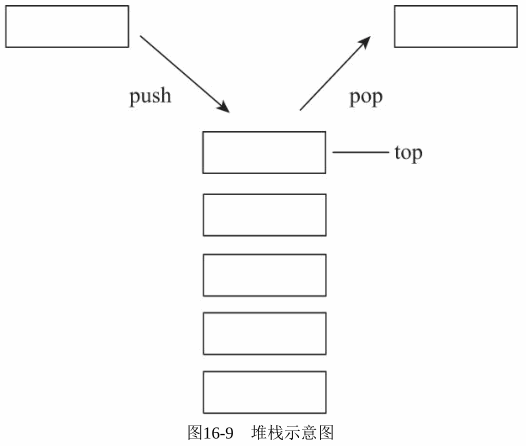

##############################################################################
Python Web 模块之 Flask v0.1
##############################################################################

.. contents::

******************************************************************************
第 2 部分  源码阅读准备 
******************************************************************************

2.3 Flask 工作流程与机制
==============================================================================

2.3.3 本地上下文
------------------------------------------------------------------------------

通过请求栈 _request_ctx_stack 的定义可以看到 ， 确实是一个请求栈 ， 而且是一个多线\
程隔离的请求中 。 在这边我们简单理解 LocalStack 是一个多线程安全的栈 ， 提供 push \
, pop , top 的方法 。 而栈中元素必然就是单个请求了 ， 元素类型为 _RequestContext ： 

.. code-block:: python 

    [flask.py]

    class _RequestContext(object):

        def __init__(self, app, environ):
            self.app = app
            self.url_adapter = app.url_map.bind_to_environ(environ)
            self.request = app.request_class(environ)
            self.session = app.open_session(self.request)
            self.g = _RequestGlobals()
            self.flashes = None

        def __enter__(self):
            _request_ctx_stack.push(self)

        def __exit__(self, exc_type, exc_value, tb):
            # do not pop the request stack if we are in debug mode and an
            # exception happened.  This will allow the debugger to still
            # access the request object in the interactive shell.
            if tb is None or not self.app.debug:
                _request_ctx_stack.pop()

看到单个请求使用 app 和 environ 进行初始化 ， 其中 app 就是 Flask 实例 ， \
environ 为单次请求具体信息 。 其中就包含 url_adapter 属性 ， 前面已经介绍过 ， 就\
是通过 url_adapter.match() 进行匹配后获取到 endpoint 和 values 的 ， 从而获取到\
请求处理的视图函数的 ， 从而与前面的解释相互印证 。 那么现在还剩下一个问题 ， \
flask 是什么时候将 _RequestContext 加入到 _request_ctx_stack 中的呢 ？ 让我们回\
头看一下 wsgi_app() 方法 ， 使用 with 进行调用 ： 

.. code-block:: python

    class Flask(object):

        def wsgi_app(self, environ, start_response):
            with self.request_context(environ):
                rv = self.preprocess_request()
                if rv is None:
                    rv = self.dispatch_request()
                response = self.make_response(rv)
                response = self.process_response(response)
                return response(environ, start_response)

        def request_context(self, environ):
            return _RequestContext(self, environ)

可以看到调用了 request_context() 方法 ， 此方法创建了一个 _RequestContext 对象 \
， 然后使用 with 的调用方式 ， 会执行 _RequestContext 的 __enter__() 魔术方法 ， \
即会发现 _request_ctx_stack.push(self) ， 将创建的 _RequestContext 加入请求栈 \
_request_ctx_stack 中 ， 然后在执行处理结束的时候 ， 执行 __exit__() 方法 ， 将请\
求从请求栈中移除 。 至此 ， 一切豁然开朗 。 

2.3.3.1 本地线程与 Local 
^^^^^^^^^^^^^^^^^^^^^^^^^^^^^^^^^^^^^^^^^^^^^^^^^^^^^^^^^^^^^^^^^^^^^^^^^^^^^^

如果每次只能发送一封电子邮件 （单线程） ， 那么在发送大量邮件时会花费很多时间 ， \
这时就需要使用多线程技术 。 处理 HTTP 请求的服务器也是这样 ， 当我们的程序需要面对\
大量用户同时发起的访问请求时 ， 我们显然不能一个个地处理 。 这时就需要使用多线程技\
术 ， Werkzeug 提供的开发服务器默认会开启多线程支持 。 

在处理请求时使用多线程后 ， 我们会面临一个问题 。 当我们直接导入 request 对象并在\
视图函数中使用时 ， 如何确保这时的 request 对象包含的请求信息就是我们需要的那一\
个 ？ 比如 A 用户和 B 用户在同一时间访问 hello 视图 ， 这时服务器分配了两个线程\
来处理这两个请求 ， 如何确保每个线程内的 request 对象都是各自对应 、 互不干扰的 \
？ 

解决办法就是引入本地线程 （Thread Local） 的概念 ， 在保存数据的同时记录下对应的\
线程 ID ， 获取数据时根据所在线程的 ID 即可获取到对应的数据 。 就像是超市里的存包\
柜 ， 每个柜子都有一个号码 ， 每个号码对应一份物品 。 

Flask 中的本地线程使用 Werkzeug 提供的 Local 类实现 ， 如代码清单 : 

.. code-block:: python

    [wekzeug/local.py]

    try:
        from greenlet import getcurrent as get_current_greenlet
    except ImportError: # pragma: no cover
        try:
            from py.magic import greenlet
            get_current_greenlet = greenlet.getcurrent
            del greenlet
        except:
            # catch all, py.* fails with so many different errors.
            get_current_greenlet = int

    class Local(object):
        __slots__ = ('__storage__', '__lock__')

        def __init__(self):
            object.__setattr__(self, '__storage__', {})
            object.__setattr__(self, '__lock__', allocate_lock())

        def __iter__(self):
            return self.__storage__.iteritems()

        def __call__(self, proxy):
            """Create a proxy for a name."""
            return LocalProxy(self, proxy)

        def __release_local__(self):
            self.__storage__.pop(get_ident(), None)

        def __getattr__(self, name):
            self.__lock__.acquire()
            try:
                try:
                    return self.__storage__[get_ident()][name]
                except KeyError:
                    raise AttributeError(name)
            finally:
                self.__lock__.release()

        def __setattr__(self, name, value):
            self.__lock__.acquire()
            try:
                ident = get_ident()
                storage = self.__storage__
                if ident in storage:
                    storage[ident][name] = value
                else:
                    storage[ident] = {name: value}
            finally:
                self.__lock__.release()

        def __delattr__(self, name):
            self.__lock__.acquire()
            try:
                try:
                    del self.__storage__[get_ident()][name]
                except KeyError:
                    raise AttributeError(name)
            finally:
                self.__lock__.release()

Local 中构造函数定义了两个属性 ， 分别是 __storage__ 属性和 __ident_func__ 属\
性 。 __storage__ 是一个嵌套的字典 ， 外层的字典使用线程 ID 作为键来匹配内部的字\
典 ， 内部的字典的值即真实对象 。 它使用 \
self.__storage__[self.__ident_func__()][name] 来获取数据 ， 一个典型的 Local \
实例中的 __storage__ 属性可能会是这样 ： 

.. code-block::

    { 线程ID: { 名称: 实际数据}}

在存储数据时也会存入对应的线程 ID 。 这里的线程 ID 使用 __ident_func__ 属性定义\
的 get_ident() 方法获取 。 这就是为什么全局使用的上下文对象不会在多个线程中产生混\
乱 。 

这里会优先使用 Greenlet 提供的协程 ID ， 如果 Greenlet 不可用再使用 thread 模块\
获取线程 ID 。 类中定义了一些魔法方法来改变默认行为 。 比如 ， 当类实例被调用时会\
创建一个 LocalProxy 对象 ， 我们在后面会详细了解 。 除此之外 ， 类中还定义了用来\
释放线程/协程的 __release_local__() 方法 ， 它会清空当前线程/协程的数据 。 

在 Python 类中 ， 前后双下划线的方法常被称为魔法方法 （Magic Methods） 。 它们是 \
Python内置的特殊方法 ， 我们可以通过重写这些方法来改变类的行为 。 比如 ， 我们熟悉\
的 __init__() 方法 （构造函数） 会在类被实例化时调用 ， 类中的 __repr__() 方法会\
在类实例被打印时调用 。 Local 类中定义的 __getattr__() 、 __setattr__() 、 \
__delattr__() 方法分别会在类属性被访问 、 设置 、 删除时调用 ； __iter__() 会在\
类实例被迭代时调用 ； __call__() 会在类实例被调用时调用 。 完整的列表可以在 \
Python 文档 （https://docs.python.org/3/reference/datamodel.html） 看到 。 

2.3.3.2 堆栈与 LocalStack 
^^^^^^^^^^^^^^^^^^^^^^^^^^^^^^^^^^^^^^^^^^^^^^^^^^^^^^^^^^^^^^^^^^^^^^^^^^^^^^

堆栈或栈是一种常见的数据结构 ， 它的主要特点就是后进先出 （LIFO，Last In First \
Out） ， 指针在栈顶 （top） 位置 ， 如图 16-9 所示 。 堆栈涉及的主要操作有 push \
（推入） 、 pop （取出） 和 peek （获取栈顶条目） 。 其他附加的操作还有获取条目数\
量 ， 判断堆栈是否为空等 。 使用 Python 列表 （list） 实现的一个典型的堆栈结构如\
代码清单所示 。 

.. code-block:: python 

    [stack.py]

    class Stack:

        def __init__(self):
            self.items = []

        def push(self, item): # 推入条目
            self.items.append(item)

        def pop(self): # 移除并返回栈顶条目
            if self.is_empty:
                return None
            return self.items.pop()

        @property
        def is_empty(self): # 判断是否为空
            return self.items == []

        @property
        def top(self): # 获取栈顶条目
            if self.is_empty:
                return None
            return self.items[-1]

承接上文 ， 其中 push() 方法和 pop() 方法分别用于向堆栈中推入和删除一个条目 。 具\
体的操作示例如下 ：

.. code-block:: python

    >>> class Stack:

            def __init__(self):
                self.items = []

            def push(self, item): # 推入条目
                self.items.append(item)

            def pop(self): # 移除并返回栈顶条目
                if self.is_empty:
                    return None
                return self.items.pop()

            @property
            def is_empty(self): # 判断是否为空
                return self.items == []

            @property
            def top(self): # 获取栈顶条目
                if self.is_empty:
                    return None
                return self.items[-1]

            
    >>> s = Stack()
    >>> s.push(42)
    >>> s.top
    42
    >>> s.push(24)
    >>> s.top
    24
    >>> s.pop()
    24
    >>> s.top
    42
    >>> 

Flask 中的上下文对象正是存储在这一类型的栈结构中 ， flask 这行代码创建了请求上下\
文堆栈 。 

.. code-block:: python 

    # context locals
    _request_ctx_stack = LocalStack()

从这里可以想到 ， 我们平时导入的 request 对象是保存在堆栈里的一个 \
_RequestContext 实例 ， 导入的操作相当于获取堆栈的栈顶 （top） ， 它会返回栈顶的对\
象 （peek操作） ， 但并不删除它 。 

这个堆栈对象使用 Werkzeug 提供的 LocalStack 类创建 ， 如代码清单所示 。 

.. code-block:: python 

    class LocalStack(object):

        def __init__(self):
            self._local = Local()
            self._lock = allocate_lock()

        def __release_local__(self):
            self._local.__release_local__()

        def __call__(self):
            def _lookup():
                rv = self.top
                if rv is None:
                    raise RuntimeError('object unbound')
                return rv
            return LocalProxy(_lookup)

        def push(self, obj):
            """Pushes a new item to the stack"""
            self._lock.acquire()
            try:
                rv = getattr(self._local, 'stack', None)
                if rv is None:
                    self._local.stack = rv = []
                rv.append(obj)
                return rv
            finally:
                self._lock.release()

        def pop(self):
            """Removes the topmost item from the stack, will return the
            old value or `None` if the stack was already empty.
            """
            self._lock.acquire()
            try:
                stack = getattr(self._local, 'stack', None)
                if stack is None:
                    return None
                elif len(stack) == 1:
                    release_local(self._local)
                    return stack[-1]
                else:
                    return stack.pop()
            finally:
                self._lock.release()

        @property
        def top(self):
            """The topmost item on the stack.  If the stack is empty,
            `None` is returned.
            """
            try:
                return self._local.stack[-1]
            except (AttributeError, IndexError):
                return None

简单来说 ， LocalStack 是基于 Local 实现的栈结构 （本地堆栈 ， 即实现了本地线程的\
堆栈） ， 和我们在前面编写的栈结构一样 ， 有 push() 、 pop() 方法以及获取栈顶的 \
top 属性 。 在构造函数中创建了 Local() 类的实例 _local 。 它把数据存储到 Local \
中 ， 并将数据的字典名称设为 'stack' 。 注意这里和 Local 类一样也定义了 __call__ \
方法 ， 当 LocalStack 实例被直接调用时 ， 会返回栈顶对象的代理 ， 即 LocalProxy \
类实例 。 

这时会产生一个疑问 ， 为什么 Flask 使用 LocalStack 而不是直接使用 Local 存储上下\
文对象 。 主要的原因是为了支持多程序共存 。 将程序分离成多个程序很类似蓝本的模块化\
分离 ， 但它们并不是一回事 。 前面我们提到过 ， 使用 Werkzeug 提供的 \
DispatcherMiddleware 中间件就可以把多个程序组合成一个 WSGI 程序运行 。 

在上面的例子中 ， Werkzeug 会根据请求的 URL 来分发给对应的程序处理 。 在这种情况下 \
， 就会有多个上下文对象存在 ， 使用栈结构就可以让多个程序上下文存在 ； 而活动的当前\
上下文总是可以在栈顶获得 ， 所以我们从 _request_ctx_stack.top 属性来获取当前的请求\
上下文对象 。 

2.3.3.3 代理与 LocalProxy 
^^^^^^^^^^^^^^^^^^^^^^^^^^^^^^^^^^^^^^^^^^^^^^^^^^^^^^^^^^^^^^^^^^^^^^^^^^^^^^

代理 （Proxy） 是一种设计模式 ， 通过创建一个代理对象 。 我们可以使用这个代理对象来\
操作实际对象 。 从字面理解 ， 代理就是使用一个中间人来转发操作 。 代码清单是使用 \
Python 实现一个简单的代理类 。 

.. code-block:: python 

    class Proxy(object):

        def __init__(self, obj):
            object.__setattr__(self, '_obj', obj)
    
        def __getattr__(self, name):
            return getattr(self._obj, name)
    
        def __setattr__(self, name, value):
            self._obj[name] = value
    
        def __delattr__(self, name):
            del self._obj[name]

通过定义 __getattr__() 方法 、 __setattr__() 方法和 __delattr__() 方法 ， 它会把\
相关的获取 、 设置和删除操作转发给实例化代理类时传入的对象 。 下面的操作演示了这个代\
理类的使用方法 。 

.. code-block:: python

    >>> class Foo(object):

        def __init__(self, x):
            self.x = x

        def bar(self, y):
            self.x = y

            
    >>> foo = Foo('Peter')
    >>> p = Proxy(foo)
    >>> p.x
    'Peter'
    >>> p
    <__main__.Proxy object at 0x000002A81C6787C0>
    >>> p._obj
    <__main__.Foo object at 0x000002A81C678A00>
    >>> p.bar('Grey')
    >>> p.x
    'Grey'
    >>> foo.x
    'Grey'
    >>> 

Flask 使用 Werkzeug 提供的 LocalProxy 类来实现代理 ， 这是一个基于 Local 的本地代\
理 。 Local 类实例和 LocalStack 实例被调用时都会使用 LocalProxy 包装成一个代理 \
。 因此 ， 下面的代码中的堆栈对象都是代理 。

.. code-block:: python 

    _request_ctx_stack = LocalStack() # 请求上下文堆栈

如果要直接使用 LocalProxy 类实现代理 ， 需要在实例化时传入一个可调用对象 ， 比如传\
入的 lambda: _request_ctx_stack.top.request ： 

.. code-block:: python 

    request = LocalProxy(lambda: _request_ctx_stack.top.request)

LocalProxy 的定义如代码清单所示 : 

.. code-block:: python 

    class LocalProxy(object):

        __slots__ = ('__local', '__dict__', '__name__')

        def __init__(self, local, name=None):
            object.__setattr__(self, '_LocalProxy__local', local)
            object.__setattr__(self, '__name__', name)

        def _get_current_object(self):
            if not hasattr(self.__local, '__release_local__'):
                return self.__local()
            try:
                return getattr(self.__local, self.__name__)
            except AttributeError:
                raise RuntimeError('no object bound to %s' % self.__name__)

        @property
        def __dict__(self):
            try:
                return self._get_current_object().__dict__
            except RuntimeError:
                return AttributeError('__dict__')

        def __repr__(self):
            try:
                obj = self._get_current_object()
            except RuntimeError:
                return '<%s unbound>' % self.__class__.__name__
            return repr(obj)

        def __nonzero__(self):
            try:
                return bool(self._get_current_object())
            except RuntimeError:
                return False

        def __unicode__(self):
            try:
                return unicode(self._get_current_object())
            except RuntimeError:
                return repr(self)

        def __dir__(self):
            try:
                return dir(self._get_current_object())
            except RuntimeError:
                return []

        def __getattr__(self, name):
            if name == '__members__':
                return dir(self._get_current_object())
            return getattr(self._get_current_object(), name)

        def __setitem__(self, key, value):
            self._get_current_object()[key] = value

        def __delitem__(self, key):
            del self._get_current_object()[key]

        def __setslice__(self, i, j, seq):
            self._get_current_object()[i:j] = seq

        def __delslice__(self, i, j):
            del self._get_current_object()[i:j]

        __setattr__ = lambda x, n, v: setattr(x._get_current_object(), n, v)
        __delattr__ = lambda x, n: delattr(x._get_current_object(), n)
        __str__ = lambda x: str(x._get_current_object())
        __lt__ = lambda x, o: x._get_current_object() < o
        __le__ = lambda x, o: x._get_current_object() <= o
        __eq__ = lambda x, o: x._get_current_object() == o
        __ne__ = lambda x, o: x._get_current_object() != o
        __gt__ = lambda x, o: x._get_current_object() > o
        __ge__ = lambda x, o: x._get_current_object() >= o
        __cmp__ = lambda x, o: cmp(x._get_current_object(), o)
        __hash__ = lambda x: hash(x._get_current_object())
        __call__ = lambda x, *a, **kw: x._get_current_object()(*a, **kw)
        __len__ = lambda x: len(x._get_current_object())
        __getitem__ = lambda x, i: x._get_current_object()[i]
        __iter__ = lambda x: iter(x._get_current_object())
        __contains__ = lambda x, i: i in x._get_current_object()
        __getslice__ = lambda x, i, j: x._get_current_object()[i:j]
        __add__ = lambda x, o: x._get_current_object() + o
        __sub__ = lambda x, o: x._get_current_object() - o
        __mul__ = lambda x, o: x._get_current_object() * o
        __floordiv__ = lambda x, o: x._get_current_object() // o
        __mod__ = lambda x, o: x._get_current_object() % o
        __divmod__ = lambda x, o: x._get_current_object().__divmod__(o)
        __pow__ = lambda x, o: x._get_current_object() ** o
        __lshift__ = lambda x, o: x._get_current_object() << o
        __rshift__ = lambda x, o: x._get_current_object() >> o
        __and__ = lambda x, o: x._get_current_object() & o
        __xor__ = lambda x, o: x._get_current_object() ^ o
        __or__ = lambda x, o: x._get_current_object() | o
        __div__ = lambda x, o: x._get_current_object().__div__(o)
        __truediv__ = lambda x, o: x._get_current_object().__truediv__(o)
        __neg__ = lambda x: -(x._get_current_object())
        __pos__ = lambda x: +(x._get_current_object())
        __abs__ = lambda x: abs(x._get_current_object())
        __invert__ = lambda x: ~(x._get_current_object())
        __complex__ = lambda x: complex(x._get_current_object())
        __int__ = lambda x: int(x._get_current_object())
        __long__ = lambda x: long(x._get_current_object())
        __float__ = lambda x: float(x._get_current_object())
        __oct__ = lambda x: oct(x._get_current_object())
        __hex__ = lambda x: hex(x._get_current_object())
        __index__ = lambda x: x._get_current_object().__index__()
        __coerce__ = lambda x, o: x.__coerce__(x, o)
        __enter__ = lambda x: x.__enter__()
        __exit__ = lambda x, *a, **kw: x.__exit__(*a, **kw)

未完待续 ...

上一篇文章 ： `上一篇`_

下一篇文章 ： `下一篇`_ 

.. _`上一篇`: flask-0.1-02.rst
.. _`下一篇`: flask-0.1-04.rst