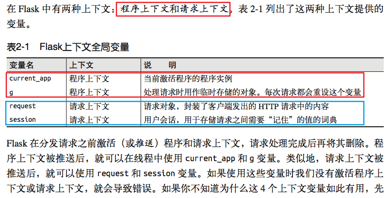
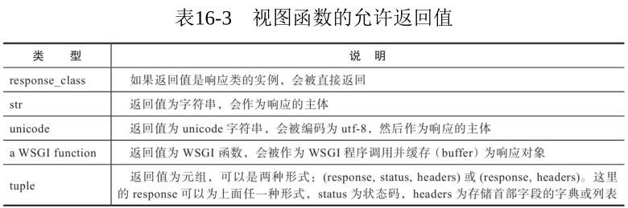
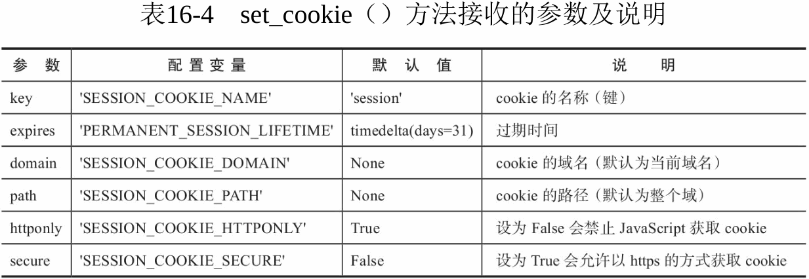

##############################################################################
Python Web 模块之 Flask v0.1
##############################################################################

.. contents::

******************************************************************************
第 2 部分  源码阅读准备 
******************************************************************************

2.3 Flask 工作流程与机制
==============================================================================

2.3.3 本地上下文
------------------------------------------------------------------------------

2.3.3.3 代理与 LocalProxy 
^^^^^^^^^^^^^^^^^^^^^^^^^^^^^^^^^^^^^^^^^^^^^^^^^^^^^^^^^^^^^^^^^^^^^^^^^^^^^^

在 Python 类中 ， __foo 形式的属性会被替换为 _classname__foo 的形式 ， 这种开头加\
双下划线的属性在 Python 中表示类私有属性 （私有程度强于单下划线） 。 这也是为什么在 \
LocalProxy 类的构造函数设置了一个 _LocalProxy__local 属性 ， 而在其他方法中却可以\
简写为 __local 。 

这个代理的实现和我们在上面介绍的简单例子很相似 ， 不过这个代理中定义了更多的魔法方法 \
， 大约有 50 多个 。 而且它还定义了一个 _get_current_object() 方法 ， 可以用来获取\
被代理的真实对象 。 这也是我们在本书第二部分 ， 获取被 current_user 代理的当前用户\
对象的方法 。 

那么 ，为什么 Flask 需要使用代理 ？ 总体来说 ， 在这里使用代理对象是因为这些代理可以\
在线程间共享 ， 让我们可以以动态的方式获取被代理的实际对象 。 具体来说 ， 我们在上节\
介绍过 Flask 的三种状态 ， 当上下文没被推送时 ， 响应的全局代理对象处于未绑定状态 \
。 而如果这里不使用代理 ， 那么在导入这些全局对象时就会尝试获取上下文 ， 然而这时堆\
栈是空的 ， 所以获取到的全局对象只能是 None 。 当请求进入并调用视图函数时 ， 虽然这\
时堆栈里已经推入了上下文 ， 但这里导入的全局对象仍然是 None 。 总而言之 ， 上下文的\
推送和移除是动态进行的 ， 而使用代理可以让我们拥有动态获取上下文对象的能力 。 

另外 ， 一个动态的全局对象 ， 也让多个程序实例并存有了可能 。 这样在不同的程序上下文\
环境中 ， current_app 总是能对应正确的程序实例 。 

2.3.3.4 请求上下文
^^^^^^^^^^^^^^^^^^^^^^^^^^^^^^^^^^^^^^^^^^^^^^^^^^^^^^^^^^^^^^^^^^^^^^^^^^^^^^

在 Flask 中 ， 请求上下文由 _RequestContext 类表示 。 当请求进入时 ， 被作为 \
WSGI 程序调用的 Flask 类实例 （即我们的程序实例 app） 会在 wsgi_app() 方法中调用 \
Flask.request_context() 方法 。 这个方法会实例化 _RequestContext 类作为请求上下\
文对象 ， 接着 wsgi_app() 调用它的 push() 方法来将它推入请求上下文堆栈 。 \
_RequestContext 类的定义如代码清单所示 。 

.. code-block:: python 

    class _RequestContext(object):
        """The request context contains all request relevant information.  It is
        created at the beginning of the request and pushed to the
        `_request_ctx_stack` and removed at the end of it.  It will create the
        URL adapter and request object for the WSGI environment provided.
        """

        def __init__(self, app, environ):
            self.app = app
            self.url_adapter = app.url_map.bind_to_environ(environ)
            self.request = app.request_class(environ)
            self.session = app.open_session(self.request)
            self.g = _RequestGlobals()
            self.flashes = None

        def __enter__(self):
            _request_ctx_stack.push(self)

        def __exit__(self, exc_type, exc_value, tb):
            # do not pop the request stack if we are in debug mode and an
            # exception happened.  This will allow the debugger to still
            # access the request object in the interactive shell.
            if tb is None or not self.app.debug:
                _request_ctx_stack.pop()

构造函数 __init 中创建了 request 和 session 属性 ， request 对象使用 \
app.request_class(environ) 创建 ， 传入了包含请求信息的 environ 字典 。 而 \
session 在构造函数中是 app.open_session(self.request) 。

.. code-block:: python 

    class Flask(object):
        def open_session(self, request):
            """Creates or opens a new session.  Default implementation stores all
            session data in a signed cookie.  This requires that the
            :attr:`secret_key` is set.

            :param request: an instance of :attr:`request_class`.
            """
            key = self.secret_key
            if key is not None:
                return SecureCookie.load_cookie(request, self.session_cookie_name,
                                                secret_key=key)

当设置 secret_key 后 ， self.session 值为 load_cookie 的执行结果 ， 否则为空 。 \
它会在 push() 方法中被调用 ， 即在请求上下文被推入请求上下文堆栈时创建 。  

魔法方法 __enter__() 和 __exit__() 分别在进入和退出 with 语句时调用 ， 这里用来\
在 with 语句调用前后分别推入和移出请求上下文 ， 具体见 PEP 343 \
（https://www.python.org/dev/peps/pep-0343/） 。 

请求上下文在 Flask 类的 wsgi_app 方法的开头创建 ， 在这个方法的最后调用 pop() 方法\
来移除 。 也就是说 ， 请求上下文的生命周期开始于请求进入调用 wsgi_app() 时 ， 结束\
于响应生成后 。 

__exit__ 这个方法里添加了一个 if 判断 ， 用来确保没有异常发生时才调用 pop() 方法移\
除上下文 。 异常发生时需要保持上下文以便进行相关操作 ， 比如在页面的交互式调试器中执\
行操作或是测试 。 

2.3.3.5 程序上下文
^^^^^^^^^^^^^^^^^^^^^^^^^^^^^^^^^^^^^^^^^^^^^^^^^^^^^^^^^^^^^^^^^^^^^^^^^^^^^^

在 v0.1 版本中并没有声明程序上下文的类定义 (以后的版本中出现了) ， 也就是说不存在程\
序上下文的类 。 但是在代码中有两个全局变量可以认为是程序上下文变量 。 

也是在请求上下文中进行了初始化 ， current_app 变量指向的 app 属性和 g 变量指向的 \
g 属性 ， 你也许会困惑代理对象 current_app 和 request 命名的不一致 ， 这是因为如果\
将当前程序的代理对象命名为 app 会和程序实例的名称相冲突 。 你可以把 request 理解成 \
current request （当前请求） 。 有两种方式创建程序上下文 ， 一种是自动创建 ， 当请\
求进入时 ， 程序上下文会随着请求上下文一起被创建 。 在 _RequestContext 类中 ， 程序\
上下文和请求上下文一起初始化然后推入 ， 在请求上下文移除之后移除 。 

用来构建 URL 的 url_for() 函数会使用请求上下文对象提供的 url_adapter 。

g 使用保存在 _request_ctx_stack.top.g 属性的 _RequestGlobals() 类表示 ， 是一个\
普通的类字典对象 。 可以把它看作 “增加了本地线程支持的全局变量” 。 有一个常见的疑问\
是 ， 为什么说每次请求都会重设 g ？ 这是因为 g 保存在程序上下文中 ， 而程序上下文的\
生命周期是伴随着请求上下文产生和销毁的 。 每个请求都会创建新的请求上下文堆栈 ， 同样\
也会创建新的程序上下文堆栈 ， 所以 g 会在每个新请求中被重设 。 

程序上下文和请求上下文的联系非常紧密 （在代码中就可以看出） 。 阅读 0.1 版本的代码 \
， 你会发现在 flask.py 底部 ， 全局对象创建时只存在一个请求上下文堆栈 。 四个全局对\
象都从请求上下文中获取 。 可以说程序上下文是请求上下文的衍生物 。 这样做的原因主要是\
为了更加灵活 。 程序中确实存在着两种明显的状态 ， 分离开可以让上下文的结构更加清晰合\
理 。 这也方便了测试等不需要请求存在的使用场景 ， 这时只需要单独推送程序上下文 ， 而\
且这个分离催生出了 Flask 的程序运行状态 。 

2.3.3.6 总结
^^^^^^^^^^^^^^^^^^^^^^^^^^^^^^^^^^^^^^^^^^^^^^^^^^^^^^^^^^^^^^^^^^^^^^^^^^^^^^

Flask 中的上下文由表示请求上下文的 _RequestContext 类实例和表示程序上下文的 \
current_app 和 g 组成 。 请求上下文对象存储在请求上下文堆栈 (_request_ctx_stack) \
中 ， 程序上下文对象存储在请求上下文堆栈 (_request_ctx_stack) 中 。 request 、 g \
、 session 和 current_app 都是保存在 _RequestContext 中的变量 。 当然 ， \
request 、 session 、 current_app 、 g 变量所指向的实际对象都有相应的类 ： 

- request —— Request
- session —— SecureCookieSession
- current_app —— Flask
- g —— _RequestGlobals

当第一个请求发来的时候 ： 

1. 需要保存请求相关的信息 —— 有了请求上下文 。 
#. 为了更好地分离程序的状态 ， 应用起来更加灵活 —— 有了程序上下文 。 
#. 为了让上下文对象可以在全局动态访问 ， 而不用显式地传入视图函数 ， 同时确保线程安\
   全 —— 有了 Local （本地线程） 。 
#. 为了支持多个程序 —— 有了 LocalStack （本地堆栈） 。
#. 为了支持动态获取上下文对象 —— 有了 LocalProxy （本地代理） 。
#. ……
#. 为了让这一切愉快的工作在一起 —— 有了Flask 。 

2.3.4 请求与响应对象
------------------------------------------------------------------------------

2.3.4.1 请求对象
^^^^^^^^^^^^^^^^^^^^^^^^^^^^^^^^^^^^^^^^^^^^^^^^^^^^^^^^^^^^^^^^^^^^^^^^^^^^^^

一个请求从客户端发出 ， 假如忽略掉更深的细节 ， 它大致经过了这些变化 ： 从 HTTP 请求\
报文 ， 到符合 WSGI 规定的 Python 字典 ， 再到 Werkzeug 中的 \
werkzeug.wrappers.Request 对象 ， 最后再到 Flask 中我们熟悉的请求对象 request 。 

前面说过 ， 从 flask 中导入的 request 是代理 ， 被代理的实际对象是请求上下文 \
_RequestContext 对象的 request 属性 ， 这个属性存储的是 Request 类实例 ， 这个 \
Request 才是表示请求的请求对象 ， 如代码清单所示 。 

承接上文 ， 溯源代码如下 : 

.. code-block:: python 

    [flask.py]

    class _RequestContext(object):

        def __init__(self, app, environ):
            self.request = app.request_class(environ)
            ...
    
    class Flask(object):

        request_class = Request
        ...

    class Request(RequestBase):
        """The request object used by default in flask.  Remembers the
        matched endpoint and view arguments.

        It is what ends up as :class:`~flask.request`.  If you want to replace
        the request object used you can subclass this and set
        :attr:`~flask.Flask.request_class` to your subclass.
        """

        def __init__(self, environ):
            RequestBase.__init__(self, environ)
            self.endpoint = None
            self.view_args = None
    
    from werkzeug import Request as RequestBase, Response as ResponseBase, \
         LocalStack, LocalProxy, create_environ, cached_property, \
         SharedDataMiddleware

    [flask/wrappers.py：Request]

    class Request(BaseRequest, AcceptMixin, ETagRequestMixin,
              UserAgentMixin, AuthorizationMixin,
              CommonRequestDescriptorsMixin):
        """Full featured request object implementing the following mixins:

        - :class:`AcceptMixin` for accept header parsing
        - :class:`ETagRequestMixin` for etag and cache control handling
        - :class:`UserAgentMixin` for user agent introspection
        - :class:`AuthorizationMixin` for http auth handling
        - :class:`CommonRequestDescriptorsMixin` for common headers
        """

Request 类继承 Werkzeug 提供的 Request 类 。 请求对象 request 的大部分属性都直接\
继承 Werkzeug 中 Request 类的属性 ， 比如 method 、 args 等 。 Flask 中的这个 \
Request 类主要添加了一些 Flask 特有的属性 ， 比如为了方便获取当前端点的 endpoint \
属性等 。 

Flask 允许自定义请求类 ， 通常情况下 ， 我们会子类化这个 Request 类 ， 并添加一些自\
定义的设置 ， 然后把这个自定义请求类赋值给程序实例的 request_class 属性 。 

2.3.4.2 响应对象
^^^^^^^^^^^^^^^^^^^^^^^^^^^^^^^^^^^^^^^^^^^^^^^^^^^^^^^^^^^^^^^^^^^^^^^^^^^^^^

一般情况下 ， 在编写程序时我们并不需要直接与响应打交道 。 在 Flask 中的请求 - 响应\
循环中 ， 我们知道响应是在 wsgi_app() 方法中生成的 ， 它调用了 \
flask.Flask.make_response() 方法生成响应对象 ， 传入的 rv 参数是 \
dispatch_request() 的返回值 ， 也就是视图函数的返回值 。 

在前面介绍过 ， 视图函数可以返回多种类型的返回值 。 完整的合法返回值如表所示 。 

这个 Flask.make_response() 方法主要的工作就是判断返回值是表中的哪一种类型 ， 最后\
根据类型做相应处理 ， 最后生成一个响应对象并返回它 。 响应对象为 Response 类的实例 \
， Response 类的定义如代码清单所示 。 

.. code-block:: python 

    [flask.py]

    class Response(ResponseBase):
        """The response object that is used by default in flask.  Works like the
        response object from Werkzeug but is set to have a HTML mimetype by
        default.  Quite often you don't have to create this object yourself because
        :meth:`~flask.Flask.make_response` will take care of that for you.

        If you want to replace the response object used you can subclass this and
        set :attr:`~flask.Flask.request_class` to your subclass.
        """
        default_mimetype = 'text/html'

和 Request 类相似 ， 这个响应对象继承 Werkzeug 中的 Response 类 。 这个类比 \
Request 类更简单 ， 只是设置了默认的 MIME 类型 。 

Flask 也允许你自定义响应类 ， 自定义的响应类通常会继承自内置的 Response 类 ， 然后\
赋值给 flask.Flask.response_class 属性 。 

2.3.5 Session 
------------------------------------------------------------------------------

在开始介绍 session 的实现之前 ， 有必要再重申一下措辞问题 。 我会使用下面的方式来表\
述三个与 session 相关的内容 ： Flask 提供了 "session 变量/对象" 来操作 "用户会话 \
(Session)" ， 它把用户会话保存在 "一块名/键为 session 的 cookie" 中 。 

在 Flask 中使用 session 非常简单 ， 只需要设置好密钥 ， 就可以在视图函数中操作 \
session 对象 ： 

.. code-block:: python  

    from flask import Flask, session
    app = Flask(__name__)
    app.secret_key = 'secret string'

    @app.route('/')
    def hello():
        session['answer'] = 42
        return '<h1>Hello, Flask!</h1>'

当第一次介绍 session 时我们曾说它 "可以记住请求间的值" ， 很多人会对这句话感到困惑 \
。 就这个例子来说 ， 当用户访问 hello 视图时 ， 会把数字 42 存储到 session 对象里 \
， 以 answer 作为键 。 假如我再定义一个 bingo 视图 ， 当用户访问 bingo 视图时 ， \
我们可以在 bingo 视图里再次从 session 通过 answer 键获取这个数字 。 这一存一取背后\
的逻辑是这样的 ：

向 session 中存储值时 ， 会生成加密的 cookie 加入响应 。 这时用户的浏览器接收到响应\
会将 cookie 存储起来 。 当用户再次发起请求时 ， 浏览器会自动在请求报文中加入这个 \
cookie 值 。 Flask 接收到请求会把 session cookie 的值解析到 session 对象里 。 这\
时我们就可以再次从 session 中读取内容 。 

在向session中存数字的这行代码设置断点：

:: 

    session['answer'] = 42

2.3.5.1 操作 session
^^^^^^^^^^^^^^^^^^^^^^^^^^^^^^^^^^^^^^^^^^^^^^^^^^^^^^^^^^^^^^^^^^^^^^^^^^^^^^

在前面学习过 ， session 变量在 flask 中的定义 ：

.. code-block:: python 

    session = LocalProxy(lambda: _request_ctx_stack.top.session)

从上面的代码中可以看到 Flask 从请求上下文堆栈的栈顶 (_request_ctx_stack.top) 获取\
请求上下文 ， 可以看出 session 是请求上下文对象 (即 _RequestContext) 的一个属性 \
， 这也就意味着 ， session 变量是在生成请求上下文的时候创建的 ， 后面我们会详细了解\
它的生成过程 。 

继续步进代码后 ， 会执行 LocalProxy 类的 __setitem__() 方法 ， 它会把设置操作转发\
给真实的 session 对象 ： 

.. code-block:: python 

    class LocalProxy(object):
        ...
        def __setitem__(self, key, value):
            self._get_current_object()[key] = value

.. image:: img/2-6.png

这时在调试工具栏右侧的变量列表中可以看到已经被代理的 session 对象实际上是 \
werkzeug.contrib.securecookie 模块中的 SecureCookie 类的实例 。 

查看步骤 ： 

1. 鼠标选择 'hello' , 在 variable 中添加 watch

.. image:: img/2-7.png

2. 添加 'session'

.. image:: img/2-8.png

在 Werkzeug 中进行一系列查询工作后 ， 最终执行了 SecureCookie 类中的 \
load_cookie() 方法 。

.. code-block:: python 

    [werkzeug/contrib/securecookie.py]

    class SecureCookie(ModificationTrackingDict):

        @classmethod
        def load_cookie(cls, request, key='session', secret_key=None):
            data = request.cookies.get(key)
            if not data:
                return cls(secret_key=secret_key)
            return cls.unserialize(data, secret_key)

        @classmethod
        def unserialize(cls, string, secret_key):
            if isinstance(string, unicode):
                string = string.encode('utf-8', 'ignore')
            try:
                base64_hash, data = string.split('?', 1)
            except (ValueError, IndexError):
                items = ()
            else:
                items = {}
                mac = hmac(secret_key, None, cls.hash_method)
                for item in data.split('&'):
                    mac.update('|' + item)
                    if not '=' in item:
                        items = None
                        break
                    key, value = item.split('=', 1)
                    # try to make the key a string
                    key = url_unquote_plus(key)
                    try:
                        key = str(key)
                    except UnicodeError:
                        pass
                    items[key] = value

                # no parsing error and the mac looks okay, we can now
                # sercurely unpickle our cookie.
                try:
                    client_hash = base64_hash.decode('base64')
                except Exception:
                    items = client_hash = None
                if items is not None and client_hash == mac.digest():
                    try:
                        for key, value in items.iteritems():
                            items[key] = cls.unquote(value)
                    except UnquoteError:
                        items = ()
                    else:
                        if '_expires' in items:
                            if time() > items['_expires']:
                                items = ()
                            else:
                                del items['_expires']
                else:
                    items = ()
            return cls(items, secret_key, False)

Werkzeug 提供了很多有用的数据结构 ， 这些数据结构都定义在 \
werkzeug.datastructures 模块中 。

当我们对 session 进行写入和更新操作时 ， Flask 需要将新的值写入到 cookie 中 ， 这\
是如何做到的呢 ？ 我们再返回到调用流程 ， wsgi_app 中调用 make_response() 方法来生\
成响应对象 ， 最后调用了 process_response() 对响应对象进行预处理 ， session 的更新\
操作就在 process_response() 函数中 ， 如代码清单所示 。 

.. code-block:: python 

    [flask.py]

    class Flask(object):

        def process_response(self, response):
            """Can be overridden in order to modify the response object
            before it's sent to the WSGI server.  By default this will
            call all the :meth:`after_request` decorated functions.

            :param response: a :attr:`response_class` object.
            :return: a new response object or the same, has to be an
                    instance of :attr:`response_class`.
            """
            session = _request_ctx_stack.top.session
            if session is not None:
                self.save_session(session, response)
            for handler in self.after_request_funcs:
                response = handler(response)
            return response

process_response() 方法首先获取请求上下文对象 ， 然后会先检查 session 是不是无效\
的 。 如果返回 True 就调用 save_session() 方法来保存 session ， 如代码清单所示 。 

.. code-block:: python 

    [flask.py]

    class Flask(object):

        def save_session(self, session, response):
            """Saves the session if it needs updates.  For the default
            implementation, check :meth:`open_session`.

            :param session: the session to be saved (a
                            :class:`~werkzeug.contrib.securecookie.SecureCookie`
                            object)
            :param response: an instance of :attr:`response_class`
            """
            if session is not None:
                session.save_cookie(response, self.session_cookie_name)

在 save_session() 方法的最后对传入的请求对象调用 save_cookie 方法设置 cookie ， \
这个方法的定义在 werkzeug.contrib.SecureCookie 中 ， save_cookie 最后调用了 \
set_cookie() 函数 ， set_cookie 接收的一系列设置参数都是通过 Flask 内置的配置键设\
置的 ， 如表所示 。 

.. code-block:: python 

    [werkzeug/contrib/securecookie.py]

    class SecureCookie(ModificationTrackingDict):
        def save_cookie(self, response, key='session', expires=None,
                        session_expires=None, max_age=None, path='/', domain=None,
                        secure=None, httponly=False, force=False):
            """Saves the SecureCookie in a cookie on response object.  All
            parameters that are not described here are forwarded directly
            to :meth:`~BaseResponse.set_cookie`.

            :param response: a response object that has a
                            :meth:`~BaseResponse.set_cookie` method.
            :param key: the name of the cookie.
            :param session_expires: the expiration date of the secure cookie
                                    stored information.  If this is not provided
                                    the cookie `expires` date is used instead.
            """
            if force or self.should_save:
                data = self.serialize(session_expires or expires)
                response.set_cookie(key, data, expires=expires, max_age=max_age,
                                    path=path, domain=domain, secure=secure,
                                    httponly=httponly)

未完待续 ...

上一篇文章 ： `上一篇`_

下一篇文章 ： `下一篇`_ 

.. _`上一篇`: flask-0.1-03.rst
.. _`下一篇`: flask-0.1-05.rst