###############################################################################
Chapter 00 - Python 源码剖析 - 编译 Python 
###############################################################################

..
    # with overline, for parts
    * with overline, for chapters
    =, for sections
    -, for subsections
    ^, for subsubsections
    ", for paragraphs

.. note::

    本文档使用 reStructuredText 进行编写， 使用 Sphinx 进行展示 

全书目录 :

- 第一部分  Python 内建对象 
    - 第 1 章  Python 对象初探
    - 第 2 章  Python 中的整数对象 
    - 第 3 章  Python 中的字符串对象 
    - 第 4 章  Python 中的 List 对象 
    - 第 5 章  Python 中的 Dict 对象 
    - 第 6 章  最简单的 Python 模拟 - Small Python 

- 第二部分  Python 虚拟机
    - 第 7 章  Python 的编译结果 - Code 对象与 pyc 文件 
    - 第 8 章  Python 虚拟机框架
    - 第 9 章  Python 虚拟机中的一般表达式
    - 第 10 章  Python 虚拟机中的控制流
    - 第 11 章  Python 虚拟机中的函数机制
    - 第 12 章  Python 虚拟机中的类机制

- 第三部分  Python 高级话题
    - 第 13 章  Python 运行环境初始化
    - 第 14 章  Python 模块的动态加载机制
    - 第 15 章  Python 多线程机制
    - 第 16 章  Python 的内存管理机制  

.. contents::

*******************************************************************************
0.1 Python 总体架构
*******************************************************************************

Python 的整体架构可以分为三个主要的部分， 整体架构如图 0-1 所示。 图左侧是 \
Python 提供的大量的模块、 库以及用户自定义的模块。 图右侧是 Python 的运行时环境\
， 包括对象/类型系统 (Object/Type structure)、 内存分配器 (Memory Allocator) 和\
运行时状态信息 (Current State of Python)。 

运行时状态维护了解释器在执行字节码是不同的状态 (如正常状态和异常状态) 之间的切换\
动作， 将之视为一个巨大而复杂的有穷状态机。 

内存分配器则全权负责 Python 中创建对象时， 对内存的申请工作， 实际上就是 \
Python 运行时与 C 中 ``malloc`` 的一层接口。

对象/类型系统包含了 Python 中存在的各种内建对象， 如 ``int``、 ``list`` 和 \
``dict`` 以及各种用户自定义的类型和对象。

中间部分是 Python 的核心 - 解释器 (interpreter) 或称为虚拟机。 在解释器中， 箭\
头的方向指示了 Python 运行过程中的数据流方向。 其中 **Scanner** 对应词法分析， \
将文件输入的 Python 源代码或从命令行输入的一行行 Python 代码切分为一个个的 \
token; **Parser** 对应语法分析， 在 **Scanner** 的分析结果上进行语法分析， 建立\
抽象语法树 (AST); **Complier** 是根据建立的 `AST` 生成指令集合 -- Python 字节\
码 (Byte Code)， 就像 Java 编译器和 C# 编译器所做的工作； 最后由 \
**Code Evaluator** 执行字节码。 因此 **Code Evaluator** 又被称为虚拟机。

在解释器与右边的对象/类型系统、 内存分配器之间的箭头表示 "使用" 关系； 而与运行\
时状态之间的箭头表示 "修改" 关系； 即 Python 在执行的过程中会不断修改当前解释器\
所处的状态， 在不同的状态之间切换。 

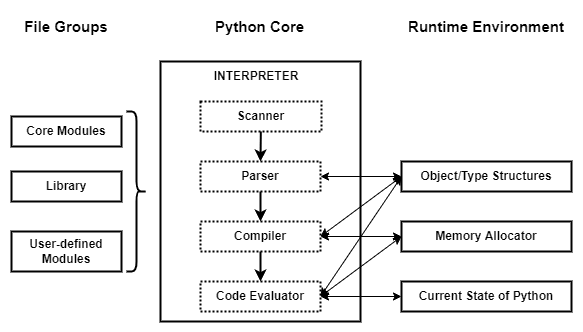

    图 0-1 Python 总体架构

*******************************************************************************
0.2 Python 源代码组织
*******************************************************************************

Python 2.5 的代码结构如下：

.. figure:: img/0-3-code-structure.png
    :align: center

    图 0-2 Python 目录结构

- **Include**: 该目录下包含了 Python 提供的所有头文件， 如果用户需要自己用 C \
  或 C++ 来编写自定义模块拓展 Python， 那么就需要用到这里提供的头文件。

- **Lib**: 该目录包含了 Python 自带的所有标准库， **Lib** 中的库都是用 Python \
  语言编写的。

- **Modules**: 该目录中包含了所有用 C 语言编写的模块， 比如 ``random``、 \
  ``cStringIO`` 等。 **Modules** 中的模块是那些对速度要求非常严格的模块， 而有\
  一些对速度没有太严格要求的模块， 比如 ``os``， 就是用 Python 编写， 而且放在 \
  **Lib** 目录下。

- **Parser**: 该目录中包含了 Python 解释器中的 **Scanner** 和 **Parser** 部分\
  ， 即对 Python 源代码进行词法分析和语法分析的部分。 除了这些， **Parser** 目\
  录下还包含了一些有用的工具， 这些工具能够根据 Python 语言的语法自动生成 \
  Python 语言的词法和语法分析器， 于 **YACC** 非常类似。

- **Objects**: 该目录中包含了所有 Python 的内建对象， 包括 ``int``、 ``List``\
  、 ``Dict`` 等。 同时该目录还包括了 Python 在运行时所需要的所有的内部使用对象\
  的实现。

- **Python**: 该目录下包含了 Python 解释器中的 **Compiler** 和执行引擎部分， \
  是 Python 运行的核心所在。

- **PCBuild**: 包含了 Visual Studio 2003 的工程文件， 研究 Python 源代码就从这\
  里开始 （书中使用 VS2003 对 Python 进行编译）。 

- **PCBuild8**: 包含了 Visual Studio 2005 使用的工程文件。

.. note:: 

    编译的时候只选择 ``pythoncore`` 和 ``python`` 子工程， 但是编译的时候仍然会报\
    错， 缺少了一个必要文件， 源码包中没有提供， 需要编译 ``make_buildinfo`` 和 \
    ``make_versioninfo`` 子工程生成。 详细步骤见下一节。

    编译成功后， 结果都在 **PCBuild** 文件夹下， 主要有两个： `python25.dll` \
    和 `python.exe`。 Python 解释器的全部代码都在 `python25.dll` 中。 对于 \
    WinXP 系统， 安装 python 时， python25.dll 会被拷贝到 \
    ``C:\Windows\system32`` 下。

*******************************************************************************
0.3 Windows 环境下编译 Python 
*******************************************************************************

使用 Visual Studio .Net 2003 打开 **PCBuild** 目录下的工程文件。

.. note:: 

    本人实际操作时使用的是 Visual Studio .Net 2003。

首先配置工程， 刚打开工程文件如图 0-4 所示：

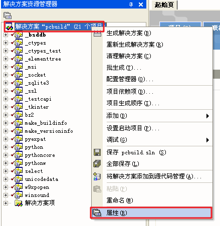

    图 0-4 调出设置属性对话框

在配置对话框中， 首先修改 Startup Project （启动项目）， Python-2.5 中默认设置\
的是 ``_bsddb``， 需要改为 ``python``， 如图 0-5 所示。

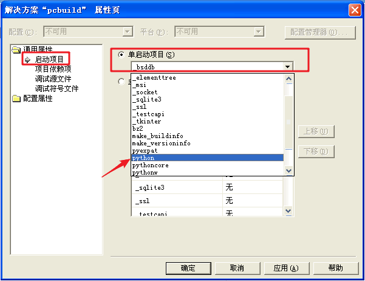

    图 0-5 改变 startup project

由于只剖析 Python 的核心部分， 不会涉及工程中的一些标准库和其他模块， 所以将它们\
从编译列表中删除。 点击配置对话框中的 "Configuration Properties" (配置管理器) \
后， 会出现当前配置为需要编译的子工程， 取消多余的子工程的选中状态， 只保留 \
**pythoncore** 和 **python** 的选中状态， 如图 0-6 所示：

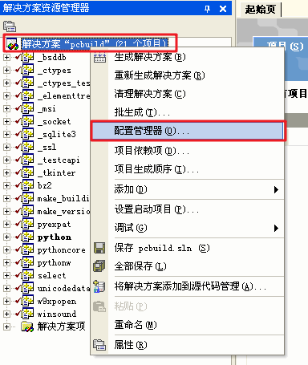

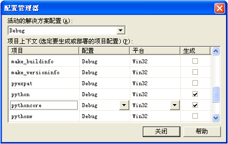

    图 0-6 取消不相关子工程

做完这些改动之后， 直接编译仍会失败。 

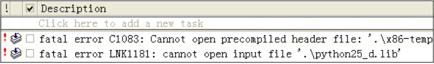

    图 0-7 编译失败(书中的错误信息)

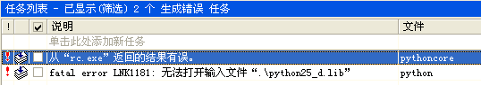

    图 0-7-1 编译失败(实操的错误信息)

这是因为需要一个必要的文件， 这个文件需要通过编译 **make_buildinfo** 和 \
**make_versioninfo** 子工程 (如图 0-8 所示) 才能完成：

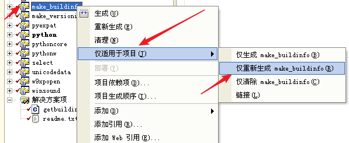

    图 0-8 编译 make_buildinfo 和 make_versioninfo 两个子工程

再次编译， 编译的结果都放在 **PCBuild** 文件夹下， 主要文件有两个： \
**python25.dll** 和 **python.exe**。 实际 **python.exe** 非常小， Python 解释\
器的全部代码都在 **python25.dll** 中。 对于 WinXP 操作系统， 在安装时 \
**python25.dll** 会被拷贝到 ``C:\Windows\system32`` 目录下。

.. note:: 

    我们现在操作的步骤只是编译， 并不是安装。

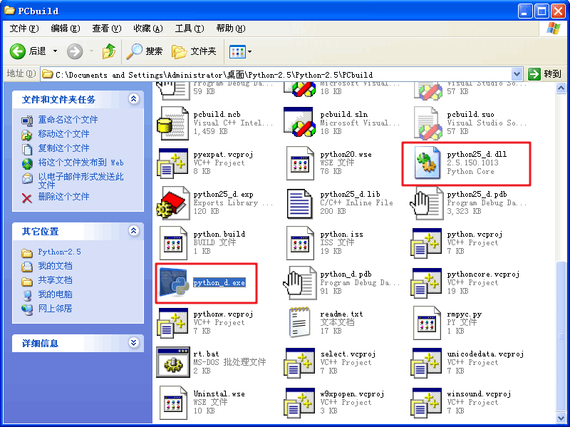

    图 0-9-1 编译成功(Debug模式)

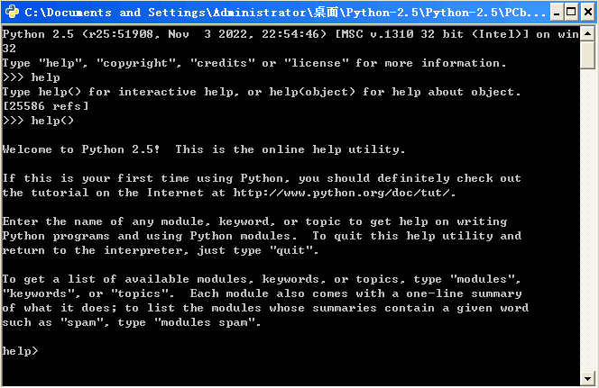

    图 0-9-2 运行 Python-2.5

*******************************************************************************
0.4 Unix/Linux 环境下编译 Python
*******************************************************************************

- ``./configure --prefix=<期望 Python 安装的目录路径>``

- ``make`` 

- ``make install``

三个步骤执行完毕后， 指定的路径下会显示 Python 安装的结果。 **bin** 下存放的是\
可执行文件； 目录 **lib** 下存放的是 Python 的标准库； \
**lib/python2.5/config** 下存放的是 **libpython2.5.a**， 用 C 语言对 Python 进\
行拓展时需要用到这个静态库。 

.. note:: 

    并没有实际操作

*******************************************************************************
0.5 修改 Python 源代码
*******************************************************************************

书中修改了一个函数的源代码， 它的原始代码在 ``Objects/intobject.c`` 里面， 代码\
如下：

.. topic:: [Objects/intobject.c]
    
    .. code:: c

        static int
        int_print(PyIntObject *v, FILE *fp, int flags)
        /* flags -- not used but required by interface */
        {
            fprintf(fp, "%ld", v->ob_ival);
            return 0;
        }
   

然后借用 Python 的 C API 中提供的输出对象接口， 代码在 ``Include/object.h`` 文\
件里， 代码如下：

.. topic:: [Include/object.h]

    .. code-block:: c

        PyAPI_FUNC(int) PyObject_Print(PyObject *, FILE *, int);

修改后的代码如下：

.. topic:: [Objects/intobject.c]

    .. code-block:: c

        static int
        int_print(PyIntObject *v, FILE *fp, int flags)
        /* flags -- not used but required by interface */
        {
        
            PyObject* str = PyString_FromString("i am in int_print");
            PyObject_Print(str, stdout, 0);
            printf("\n");

            fprintf(fp, "%ld", v->ob_ival);
            return 0;
        }

``PyString_FromString`` 是 Python 提供的 C API， 用于从 C 中的原生字符数组创建\
出 Python 中的字符串对象。 ``PyObject_Print`` 函数中第二个参数指明的是输出目标\
。 代码中使用的是 ``stdout``， 即指定的输出目标是标准输出。

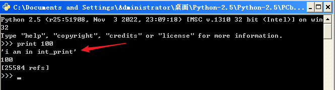

    图 0-10 在 Python 源码中输出额外信息

在 ``PyObject_Print`` 中， 第二个参数指明的是输出目标。 上面的例子使用了 \
``stdout``， 指定了输出目标为标准输出， 当我们从命令行环境中激活 Python 时， 没\
有问题， 但是如果使用 IDLE 的话， 就会发现输出的信息没有了。 原因是 IDLE 的输出\
目标已经不是 ``stdout`` 了， 说明加入的输出代码失效了。 在 Python 中， 有一个特\
性 -- 可以自己重定向标准输出， 考虑图 0-11 所示的例子：

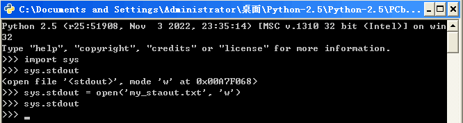

    图 0-11 重定向标准输出

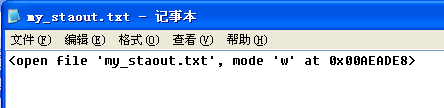

    图 0-12 重定向后的标准输出 - my_stdout.txt

如果想让自己添加的代码输出到 IDLE 中， 我们也必须使用重定向之后的标准输出， 而不\
能再使用 stdout 这个系统标准输出了。 

重定向输出：

.. code-block:: c 

    static PyObject *
    int_repr(PyIntObject *v)
    {
        char buf[64];
        PyOS_snprintf(buf, sizeof(buf), "%ld", v->ob_ival);
        return PyString_FromString(buf);
    }

添加重定向输出后的代码：

.. code-block:: c 

    static PyObject *
    int_repr(PyIntObject *v)
    {
        if(PyInt_AsLong(v) == -999){
            PyObject* str = PyString_FromString("i am in int_repr");
            PyObject* out = PySys_GetObject("stdout");
            if (out != NULL) {
                PyObject_Print(str, stdout, 0);
                printf("\n");
            }
        }

        char buf[64];
        PyOS_snprintf(buf, sizeof(buf), "%ld", v->ob_ival);
        return PyString_FromString(buf);
    }

``PyInt_AsLong`` 的功能是将 Python 的整数对象转换为 C 中的 int 值。

*******************************************************************************
0.6 通往 Python 之路
*******************************************************************************

将精力放在虚拟机， 对于词法解析， 语法解析和编译并不涉及。

- 第一部分： Python 内建对象

- 第二部分： Python 虚拟机

- 第三部分： Python 高级话题

*******************************************************************************
0.7 注意事项
*******************************************************************************

通常 Python 的源代码中会使用 ``PyObject_GC_New``, ``PyObject_GC_Malloc``, \
``PyMem_MALLOC``, ``PyObject_MALLOC`` 等 API， 只需坚持一个原则， 即凡是以 \
``New`` 结尾的， 都以 C++ 中的 ``new`` 操作符视之； 凡是以 ``Malloc`` 结尾的， \
都以 C 中的 ``malloc`` 操作符视之。 （C++ 中的 ``new`` 我不知道啊 ^_^!, 找时间\
了解一下）。 例如：

.. code-block:: c 

    //[PyString_FromString() in stringobject.c]

    op = (PyStringObject *)PyObject_MALLOC(sizeof(PyStringObject) + size);

    // 等效于：
    
    PyStringObject* op = (PyStringObject*)malloc(sizeof(PyStringObject) + size)

    //[PyList_New() in listobject.c]
    
    op = PyObject_GC_New(PyListObject, &PyList_Type);
    
    // 等效于：
    
    PyListObject* op = new PyList_Type();

    op->ob_item = (PyObject **) PyMem_MALLOC(nbytes);
    
    // 等效于：
    
    op->ob_item = (PyObject **)malloc(nbytes);

