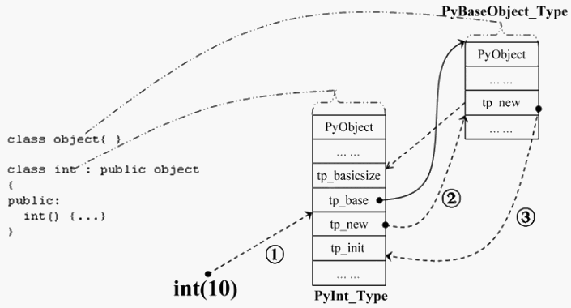
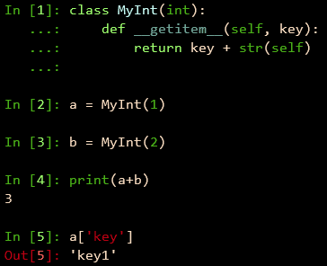
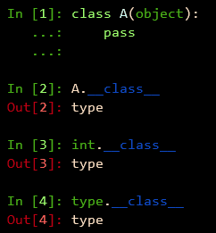
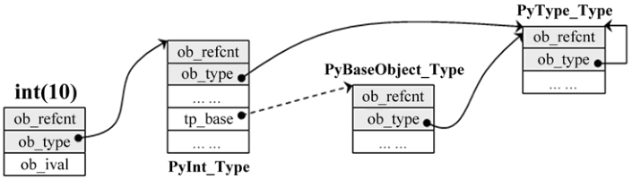
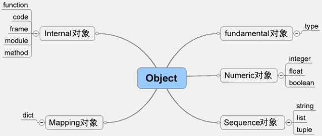

###############################################################################
Chapter 01 - Python 对象初探
###############################################################################

..
    # with overline, for parts
    * with overline, for chapters
    =, for sections
    -, for subsections
    ^, for subsubsections
    ", for paragraphs

.. contents::

*******************************************************************************
1.1 Python 内的对象
*******************************************************************************

对象是数据以及基于这些数据的操作的集合。 在计算机中， 一个对象实际上就是一片被分配的\
内存空间， 这些内存可能是连续的， 也可能是离散的， 这并不重要， 重要的是这片内存在更\
高层次上可以作为一个整体来考虑， 这个整体就是一个对象。 在这片内存中， 存储着一系列的\
数据以及可以对这些数据进行修改或读取操作的一系列代码。

在 Python 中， 对象就是为 C 中的结构体在堆上申请的一块内存， 一般来说， 对象是不能被\
静态初始化的， 而且也不能在栈空间上生存。 唯一的例外就是类型对象， Python 中所有的内\
建的类型对象 （如整数类型对象， 字符串类型对象） 都是被静态初始化的。

在 Python 中， 一个对象一旦被创建， 它在内存中的大小就是不变的了。 这意味着那些需要\
容纳可变长度数据的对象只能在对象内维护一个指向一块可变大小的内存区域的指针。 

1.1.1 Python 对象的基石 - PyObject
===============================================================================

在 Python 中， 所有的东西都是对象， 而所有的对象都拥有一些相同的内容， 这些内容在 \
``PyObject`` 中定义， ``PyObject`` 是整个 Python 对象机制的核心。

.. topic:: [Include/object.h]

    .. code-block:: c

        typedef struct _object {
            PyObject_HEAD
        } PyObject;

这个结构体是 Python 对象机制的核心基石， 从代码中可以看到， Python 对象的秘密都隐藏\
在 ``PyObject_HEAD`` 这个宏中。

.. topic:: [Include/object.h]

    .. code-block:: c

        #ifdef Py_TRACE_REFS
        /* Define pointers to support a doubly-linked list of all live heap objects. */
        #define _PyObject_HEAD_EXTRA		\
            struct _object *_ob_next;	\
            struct _object *_ob_prev;

        #define _PyObject_EXTRA_INIT 0, 0,

        #else
        #define _PyObject_HEAD_EXTRA
        #define _PyObject_EXTRA_INIT
        #endif

        /* PyObject_HEAD defines the initial segment of every PyObject. */
        #define PyObject_HEAD			\
            _PyObject_HEAD_EXTRA		\
            Py_ssize_t ob_refcnt;		\
            struct _typeobject *ob_type;

Release 编译 Python 的时候， 是不会定义符号 ``Py_TRACE_REFS`` 的。 所以在实际发布\
的 Python 中， ``PyObject`` 的定义非常简单： 

.. topic:: [Include/object.h]

    .. code-block:: c

        typedef struct _object {
            Py_ssize_t ob_refcnt;		// 书中是 int ob_refcnt; 对此我有点儿疑惑
            struct _typeobject *ob_type;
        } PyObject;    

在 ``PyObject`` 的定义中， 整型变量 ``ob_refcnt`` (目前不确定是不是整型， 但是书中\
是的) 与 Python 的内存管理机制有关， 它实现了基于引用计数的垃圾搜集机制。 对于某一个\
对象 A， 当有一个新的 ``PyObject *`` 引用该对象时， A 的引用计数应该增加； 而当这\
个 ``PyObject *`` 被删除时， A 的引用计数应该减少。 当 A 的引用计数减少到 0 时， A \
就可以从堆上被删除， 以释放出内存供别的对象使用。

``ob_type`` 是一个指向 ``_typeobject`` 结构体的指针， ``_typeobject`` 结构体对应\
着 Python 内部的一种特殊对象， 用来指定一个对象类型的类型对象。

由此可以看出， 在 Python 中， 对象机制的核心其实非常简单， 一个是引用计数， 一个就是\
类型信息。

在 ``PyObject`` 中定义了每个 Python 对象都必须有的内容， 这些内容将出现在每个 \
Python 对象所占有的内存的最开始的字节中。 例如： 

.. topic:: [Include/intobject.h]

    .. code-block:: c

        typedef struct {
            PyObject_HEAD
            long ob_ival;
        } PyIntObject;

Python 的整数对象中， 除了 ``PyObject``， 还有一个额外的 ``long`` 变量， 整数的值\
就保存在 ``ob_ival`` 中。 同样字符串对象、 list 对象、 dict 对象、 其他对象， 都在 \
``PyObject`` 之外保存了属于自己的特殊信息。

1.1.2 定长对象和变长对象
===============================================================================

整数对象的特殊信息是一个 C 中的整型变量， 无论这个整数对象的值有多大， 都可以保存在这\
个整型变量 (``ob_ival``) 中。 Python 在 ``PyObject`` 对象之外， 还有一个表示这类对\
象的结构体 - ``PyVarObject``:

.. topic:: [Include/object.h]

    .. code-block:: c 

        #define PyObject_VAR_HEAD		\
            PyObject_HEAD			\
            Py_ssize_t ob_size; /* Number of items in variable part */
            // 此处书中是 int ob_size
        
        typedef struct {
            PyObject_VAR_HEAD
        } PyVarObject;

把整数对象这样不包含可变数据的对象称为 "定长对象"， 而字符串对象这样的包含了可变数据\
的对象称为 "变长对象"。 区别在于定长对象的不同对象占用的内存大小是一样的， 而变长对象\
的不同对象占用的内存可能是不一样的。 比如整数对象 "1" 和 "100" 占用的内存大小都是 \
``sizeof(PyIntObject)``， 而字符串对象 "Python" 和 "Ruby" 占用的内存大小就不同了\
。 正是这种区别导致了 ``PyVarObject`` 对象中 ``ob_size`` 的出现。 变长对象通常都是\
容器， ``ob_size`` 这个成员实际上就是指明了变长对象中一共容纳了多少个元素。 注意 \
``ob_size`` 指明的是所容纳元素的个数， 而不是字节的数量。 例如 Python 中最常用的 \
list 就是一个 ``PyVarObject`` 对象， 如果 list 中有 5 个元素， 那么 ``ob_size`` \
的值就是 5。

从 ``PyObject_VAR_HEAD`` 的定义可以看出， ``PyVarObject`` 实际上只是对 \
``PyObject`` 的一个拓展。 因此对于任何一个 ``PyVarObject``， 其所占用的内存， 开始\
部分的字节的意义和 ``PyObject`` 是一样的。 在 Python 内部， 每个对象都拥有相同的对\
象头部， 这使得 Python 中对对象的引用变得非常统一， 只需要用一个 ``PyObject *`` 指\
针就可以引用任意的一个对象， 不论该对象实际是什么对象。

.. figure:: img/pyobject-1-1.png
    :align: center

    图 1-1 不同 Python 对象与 PyObject、PyVarObject 的关系

*******************************************************************************
1.2 类型对象
*******************************************************************************

当在内存中分配空间， 创建对象的时候， 必须要知道申请多大的空间。 显然这不是一个定值\
， 因为不同的对象需要不同的空间。 对象所需的内存空间的大小信息虽然不显见于 \
``PyObject`` 的定义中， 但它却隐身于 ``PyObject`` 中。

实际上， 占用内存空间的大小是对象的一种元信息， 这样的元信息是与对象所属类型密切相关\
的， 因此一定会出现在与对象所对应的类型对象中， 详细考察一下类型对象 ``_typeobject``:

.. topic:: [Include/object.h]

    .. code-block:: c 

        typedef struct _typeobject {
            PyObject_VAR_HEAD
            const char *tp_name; /* For printing, in format "<module>.<name>" */
            Py_ssize_t tp_basicsize, tp_itemsize; /* For allocation */

            /* Methods to implement standard operations */

            destructor tp_dealloc;
            printfunc tp_print;
            getattrfunc tp_getattr;
            setattrfunc tp_setattr;
            cmpfunc tp_compare;
            reprfunc tp_repr;

            /* Method suites for standard classes */

            PyNumberMethods *tp_as_number;
            PySequenceMethods *tp_as_sequence;
            PyMappingMethods *tp_as_mapping;

            /* More standard operations (here for binary compatibility) */

            hashfunc tp_hash;
            ternaryfunc tp_call;
            reprfunc tp_str;
            getattrofunc tp_getattro;
            setattrofunc tp_setattro;

            /* Functions to access object as input/output buffer */
            PyBufferProcs *tp_as_buffer;

            /* Flags to define presence of optional/expanded features */
            long tp_flags;

            const char *tp_doc; /* Documentation string */

            /* Assigned meaning in release 2.0 */
            /* call function for all accessible objects */
            traverseproc tp_traverse;

            /* delete references to contained objects */
            inquiry tp_clear;

            /* Assigned meaning in release 2.1 */
            /* rich comparisons */
            richcmpfunc tp_richcompare;

            /* weak reference enabler */
            Py_ssize_t tp_weaklistoffset;

            /* Added in release 2.2 */
            /* Iterators */
            getiterfunc tp_iter;
            iternextfunc tp_iternext;

            /* Attribute descriptor and subclassing stuff */
            struct PyMethodDef *tp_methods;
            struct PyMemberDef *tp_members;
            struct PyGetSetDef *tp_getset;
            struct _typeobject *tp_base;
            PyObject *tp_dict;
            descrgetfunc tp_descr_get;
            descrsetfunc tp_descr_set;
            Py_ssize_t tp_dictoffset;
            initproc tp_init;
            allocfunc tp_alloc;
            newfunc tp_new;
            freefunc tp_free; /* Low-level free-memory routine */
            inquiry tp_is_gc; /* For PyObject_IS_GC */
            PyObject *tp_bases;
            PyObject *tp_mro; /* method resolution order */
            PyObject *tp_cache;
            PyObject *tp_subclasses;
            PyObject *tp_weaklist;
            destructor tp_del;

        #ifdef COUNT_ALLOCS
            /* these must be last and never explicitly initialized */
            Py_ssize_t tp_allocs;
            Py_ssize_t tp_frees;
            Py_ssize_t tp_maxalloc;
            struct _typeobject *tp_prev;
            struct _typeobject *tp_next;
        #endif
        } PyTypeObject;

在上述 ``_typeobject`` 的定义中包含了许多信息， 主要可以分为 4 类： 

- 类型名， ``tp_name``， 主要是 Python 内部以及调试的时候使用； 

- 创建该类型对象是分配内存空间大小的信息， 即 ``tp_basicsize`` 和 ``tp_itemsize``； 

- 与该类型对象相关联的操作信息（就是诸如 ``tp_print`` 这样的许多的函数指针）；

- 下面将要描述的类型的类型信息。

事实上， 一个 ``PyTypeObject`` 对象就是 Python 中对面向对象理论中 "类" 这个概念的\
实现， 而 ``PyTypeObject`` 也是一个非常复杂的话题， 将在第 2 部分详细剖析构建在 \
``PyTypeObject`` 之上的 Python 的类型和对象体系。 

1.2.1 对象的创建
===============================================================================

Python 创建一个整数对象一般来说会有两种方法： 第一种是通过 Python C API 来创建； 第\
二种是通过类型对象 ``PyInt_Type``。 

Python 的 C API 分成两类， 一类称为范型的 API， 或者称为 AOL (Abstrack Object \
Layer)。 这类 API 都具有诸如 ``PyObject_***`` 的形式， 可以应用在任何 Python 对象\
身上， 比如输出对象的 ``PyObject_Print``， 你可以 ``PyObject_Print(int object)``\
， 也可以 ``PyObject_Print(string object)`` ， API 内部会有一整套机制确定最终调用\
的函数是哪一个。 对于创建一个整数对象， 可以采用如下的表达式： \
``PyObject* intObj = PyObject_New(PyObject, &PyInt_Type)``。

另一类是与类型相关的 API， 或者成为 COL (Concrete Object Layer)。 这类 API 通常只\
作用在某一类型的对象上， 对于每一种内建对象， Python 都提供了这样的一组 API。 对于整\
数对象可以使用如下 API 创建： ``PyObject *intObj = PyInt_FromLong(10)``， 这样就\
创建了一个值为 10 的整数对象。 

不论采用哪种 C API， Python 内部最终都是直接分配内存， 因为 Python 对于内建对象是无\
所不知的。 但是对于用户自定义的类型， 比如通过 ``class A(Object)`` 定义的一个类型 A\
， 如果要创建 A 的实例对象， Python 就不可能事先提供 ``PyA_New`` 这样的 API。 对于\
这种情况， Python 会通过 A 所对应的类型对象创建实例对象。

.. figure:: img/1-2-PyInt_Type.png
    :align: center

    图 1-2 通过 PyInt_Type 创建一个整数对象 （截取自 Python 3.8 IPython）

实际上在 Python 完成运行环境的初始化后， 符号 "int" 就对应着一个表示为 \
``<type 'int'>`` 的对象， 这个对象其实就是 Python 内部的 ``PyInt_Type``。 当我们\
执行 "int(10)" 时就是通过 ``PyInt_Type`` 创建了一个整数对象。

图 1-2 中显示， 在 Python 2.2 之后的 ``new style class`` 中， ``int`` 是一个继承\
自 ``object`` 的类型， 类似于 ``int`` 对应着 Python 内部的 ``PyInt_Type``， \
``Object`` 在 Python 内部则对应着 ``PyBaseObject_Type``。 图 1-3 显示了 ``int`` \
类型在 Python 内部这种继承关系是如何实现的。 

    图 1-3 从 PyInt_Type 创建整数对象

标上序号的虚线箭头代表了创建整数对象的函数调用流程， 首先 ``PyInt_Type`` 中的 \
``tp_new`` 会被调用， 如果这个 ``tp_new`` 为 NULL (真正的 ``PyInt_Type`` 中并不\
为 NULL， 只是举例说明 ``tp_new`` 为 NULL 的情况)， 那么会到 ``tp_base`` 指定的基\
类中去寻找 ``tp_new`` 操作， ``PyBaseObject_Type`` 的 ``tp_new`` 指向了 \
``object_new``。 在 Python 2.2 之后的 ``new style class`` 中， 所有的类都是以 \
``object`` 为基类的， 所以最终会找到一个不为 NULL 的 ``tp_new``。 在 \
``object_new`` 中， 会访问 ``PyInt_Type`` 中记录的 ``tp_basicsize`` 信息， 继而\
完成申请内存的操作。 这个信息记录着一个整数对象应该占用多大内存， 在 Python 源码中\
， 你会看到这个值被设置成了 ``sizeof(PyIntObject)``。 在调用 ``tp_new`` 完成 "创\
建对象" 之后， 流程会转向 ``PyInt_Type`` 的 ``tp_init``， 完成 "初始化对象" 的工作\
。 对应到 C++ 中， ``tp_new`` 可以视为 ``new`` 操作符， 而 ``tp_init`` 则可以视为\
类的构造函数。

1.2.2 对象的行为
===============================================================================

在 ``PyTypeObject`` 中定义了大量对的函数指针， 最终都会指向某个函数， 或者指向 NULL\
。 这些函数指针可以视为类型对象中所定义的操作， 而这些操作直接决定着一个对象在运行时\
所表现的行为。 

如 ``PyTypeObject`` 中的 ``tp_hash`` 指明对于该类型的对象， 如何生成其 Hash 值。 \
可以看到 ``tp_hash`` 是一个 ``hashfunc`` 类型的变量， 在 *object.h* 中， \
``hashfunc`` 实际上是一个函数指针： ``typedef long (*hashfunc)(PyObject *)``。 \
在上一节中看到了 ``tp_new``， ``tp_init`` 是如何决定一个实例对象被创建出来并初始化\
的。 在 ``PyTypeObject`` 中指定的不同的操作信息也正是一种对象区别于另一种对象的关键\
所在。

在这些操作信息中， 有三组非常重要的操作族， 在 ``PyTypeObject`` 中， 它们是 \
``tp_as_number``、 ``tp_as_sequence``、 ``tp_as_mapping``。 它们分别指向 \
``PyNumberMethods``、 ``PySequenceMethods`` 和 ``PyMappingMethods`` 函数族， 可\
以看一下 ``PyNumberMethods`` 函数族： 

.. topic:: [Include/object.h]

    .. code-block:: c 

        typedef struct {
            /* For numbers without flag bit Py_TPFLAGS_CHECKTYPES set, all
            arguments are guaranteed to be of the object's type (modulo
            coercion hacks -- i.e. if the type's coercion function
            returns other types, then these are allowed as well).  Numbers that
            have the Py_TPFLAGS_CHECKTYPES flag bit set should check *both*
            arguments for proper type and implement the necessary conversions
            in the slot functions themselves. */

            binaryfunc nb_add;
            binaryfunc nb_subtract;
            binaryfunc nb_multiply;
            binaryfunc nb_divide;
            binaryfunc nb_remainder;
            binaryfunc nb_divmod;
            ternaryfunc nb_power;
            unaryfunc nb_negative;
            unaryfunc nb_positive;
            unaryfunc nb_absolute;
            inquiry nb_nonzero;
            unaryfunc nb_invert;
            binaryfunc nb_lshift;
            binaryfunc nb_rshift;
            binaryfunc nb_and;
            binaryfunc nb_xor;
            binaryfunc nb_or;
            coercion nb_coerce;
            unaryfunc nb_int;
            unaryfunc nb_long;
            unaryfunc nb_float;
            unaryfunc nb_oct;
            unaryfunc nb_hex;
            /* Added in release 2.0 */
            binaryfunc nb_inplace_add;
            binaryfunc nb_inplace_subtract;
            binaryfunc nb_inplace_multiply;
            binaryfunc nb_inplace_divide;
            binaryfunc nb_inplace_remainder;
            ternaryfunc nb_inplace_power;
            binaryfunc nb_inplace_lshift;
            binaryfunc nb_inplace_rshift;
            binaryfunc nb_inplace_and;
            binaryfunc nb_inplace_xor;
            binaryfunc nb_inplace_or;

            /* Added in release 2.2 */
            /* The following require the Py_TPFLAGS_HAVE_CLASS flag */
            binaryfunc nb_floor_divide;
            binaryfunc nb_true_divide;
            binaryfunc nb_inplace_floor_divide;
            binaryfunc nb_inplace_true_divide;

            /* Added in release 2.5 */
            unaryfunc nb_index;
        } PyNumberMethods;

在 ``PyNumberMethods`` 中， 定义了作为一个数值对象应该支持的操作。 如果一个对象被视\
为数值对象， 那么其对象的类型对象 ``PyInt_Type`` 中， ``tp_as_number.nb_add`` 就\
指定了对该对象进行加法操作时的具体行为。 同样 ``PySequenceMethods`` 和 \
``PyMappingMethods`` 中分别定义了作为一个序列对象和关联对象应该支持的行为， 这两种\
对象的典型例子是 ``list`` 和 ``dict``。

对于一种类型， 可以完全同时定义三个函数族中的所有操作。 即一个对象可以既表现出数值对\
象的特性也可以表现出关联对象的特性。 

    图 1-4  数值对象和关联对象的混合体

看上去 ``a['key']`` 操作是一个类似于 ``dict`` 这样的对象才会支持的操作。 从 \
``int`` 继承出来的 ``MyInt`` 应该自然就是一个数值对象， 但是通过重写 \
``__getitem__`` 这个 Python 中的 special method， 可以视为指定了 ``MyInt`` 在 \
Python 内部对应的 ``PyTypeObject`` 对象的 ``tp_as_mapping.mp_subscript`` 操作。 \
最终 ``MyInt`` 的实例对象可以 "表现" 得像一个关联对象。 归根结底在于 \
``PyTypeObject`` 中允许一种类型同时指定三种不同对象的行为特性。 

1.2.3 类型的类型
===============================================================================

在 ``PyTypeObject`` 定义的最开始， 可以发现 ``PyObject_VAR_HEAD``， 意味着 \
Python 中的类型实际上也是一个对象。 在 Python 中， 任何一个东西都是对象， 而每个对象\
都对应一种类型， 那么类型对象的类型是什么？ 对于其他对象可以通过与其关联的类型对象确\
定其类型， 可以通过 ``PyType_Type`` 来确定一个对象是类型对象: 

.. topic:: [Objects/typeobject.c]

    .. code-block:: c

        PyTypeObject PyType_Type = {
            PyObject_HEAD_INIT(&PyType_Type)
            0,					/* ob_size */
            "type",					/* tp_name */
            sizeof(PyHeapTypeObject),		/* tp_basicsize */
            sizeof(PyMemberDef),			/* tp_itemsize */
            (destructor)type_dealloc,		/* tp_dealloc */
            0,					/* tp_print */
            0,			 		/* tp_getattr */
            0,					/* tp_setattr */
            type_compare,				/* tp_compare */
            (reprfunc)type_repr,			/* tp_repr */
            0,					/* tp_as_number */
            0,					/* tp_as_sequence */
            0,					/* tp_as_mapping */
            (hashfunc)_Py_HashPointer,		/* tp_hash */
            (ternaryfunc)type_call,			/* tp_call */
            0,					/* tp_str */
            (getattrofunc)type_getattro,		/* tp_getattro */
            (setattrofunc)type_setattro,		/* tp_setattro */
            0,					/* tp_as_buffer */
            Py_TPFLAGS_DEFAULT | Py_TPFLAGS_HAVE_GC |
                Py_TPFLAGS_BASETYPE,		/* tp_flags */
            type_doc,				/* tp_doc */
            (traverseproc)type_traverse,		/* tp_traverse */
            (inquiry)type_clear,			/* tp_clear */
            0,					/* tp_richcompare */
            offsetof(PyTypeObject, tp_weaklist),	/* tp_weaklistoffset */
            0,					/* tp_iter */
            0,					/* tp_iternext */
            type_methods,				/* tp_methods */
            type_members,				/* tp_members */
            type_getsets,				/* tp_getset */
            0,					/* tp_base */
            0,					/* tp_dict */
            0,					/* tp_descr_get */
            0,					/* tp_descr_set */
            offsetof(PyTypeObject, tp_dict),	/* tp_dictoffset */
            0,					/* tp_init */
            0,					/* tp_alloc */
            type_new,				/* tp_new */
            PyObject_GC_Del,        		/* tp_free */
            (inquiry)type_is_gc,			/* tp_is_gc */
        };

``PyType_Type`` 在 Python 的类型机制中是一个至关重要的对象， 所有用户自定义 \
``class`` 所对应的 ``PyTypeObject`` 对象都是通过这个对象创建的。 

    图 1-5 PyType_Type 与一般 PyTypeObject 的关系

图 1-5 中一再出现的 ``<type 'type'>`` 就是 Python 内部的 ``PyType_Type``， 它是所\
有 class 的 class， 所以在 Python 中被称为 ``metaclass``。 关于 ``PyType_Type`` \
和 ``metaclass`` 后面详细剖析。

接着来看 ``PyInt_Type`` 是怎么与 ``PyType_Type`` 建立关系的。 在 Python 中， 每个\
对象都将自己的引用计数、 类型信息保存在开始的部分中， 为了方便对这部分内存的初始化， \
Python 提供了有用的宏： 

.. topic:: [Include/object.h]

    .. code-block:: c 

        #ifdef Py_TRACE_REFS
        /* Define pointers to support a doubly-linked list of all live heap objects. */
            #define _PyObject_HEAD_EXTRA		\
                struct _object *_ob_next;	\
                struct _object *_ob_prev;

        #define _PyObject_EXTRA_INIT 0, 0,

        #else
        #define _PyObject_HEAD_EXTRA
        #define _PyObject_EXTRA_INIT
        #endif

Python 2.5 的代码是上述内容，书中的代码如下：

.. topic:: [Include/object.h]

    .. code-block:: c 

        #ifdef Py_TRACE_REFS

            #define _PyObject_EXTRA_INIT 0, 0,

        #else
        
            #define _PyObject_EXTRA_INIT
        #endif

        #define PyObject_HEAD_INIT(type)    \
            _PyObject_EXTRA_INIT    \
            1, type,

回顾一下 ``PyObject`` 和 ``PyVarObject`` 的定义， 初始化的动作就一目了然了。 实际\
上， 这些宏在各种內建类型对象的初始化中被大量地使用着。 

以 ``PyInt_Type`` 为例， 可以更清晰地看到一般的类型对象和这个特立独行的 \
``PyType_Type`` 对象之间的关系： 

.. topic:: [Objects/intobject.c]

    .. code-block:: c 

        PyTypeObject PyInt_Type = {
            PyObject_HEAD_INIT(&PyType_Type)
            0,
            "int",
            sizeof(PyIntObject),
            0,
            (destructor)int_dealloc,		/* tp_dealloc */
            (printfunc)int_print,			/* tp_print */
            0,					/* tp_getattr */
            0,					/* tp_setattr */
            (cmpfunc)int_compare,			/* tp_compare */
            (reprfunc)int_repr,			/* tp_repr */
            &int_as_number,				/* tp_as_number */
            0,					/* tp_as_sequence */
            0,					/* tp_as_mapping */
            (hashfunc)int_hash,			/* tp_hash */
            0,					/* tp_call */
            (reprfunc)int_repr,			/* tp_str */
            PyObject_GenericGetAttr,		/* tp_getattro */
            0,					/* tp_setattro */
            0,					/* tp_as_buffer */
            Py_TPFLAGS_DEFAULT | Py_TPFLAGS_CHECKTYPES |
                Py_TPFLAGS_BASETYPE,		/* tp_flags */
            int_doc,				/* tp_doc */
            0,					/* tp_traverse */
            0,					/* tp_clear */
            0,					/* tp_richcompare */
            0,					/* tp_weaklistoffset */
            0,					/* tp_iter */
            0,					/* tp_iternext */
            int_methods,				/* tp_methods */
            0,					/* tp_members */
            0,					/* tp_getset */
            0,					/* tp_base */
            0,					/* tp_dict */
            0,					/* tp_descr_get */
            0,					/* tp_descr_set */
            0,					/* tp_dictoffset */
            0,					/* tp_init */
            0,					/* tp_alloc */
            int_new,				/* tp_new */
            (freefunc)int_free,           		/* tp_free */
        };

可以通过想象看到一个整数对象在运行是的形象表示， 如图 1-6 所示：

    图 1-6 运行时整数对象及其类型之间的关系

*******************************************************************************
1.3 Python 对象的多态性
*******************************************************************************

通过 ``PyObject`` 和 ``PyTypeObject``， Python 利用 C 语言完成了 C++ 所提供的对象\
的多态的特性。 在 Python 中创建一个对象， 比如 ``PyIntObject`` 对象时， 会分配内存\
， 进行初始化。 然后 Python 内部会用一个 ``PyObject*`` 变量， 而不是通过一个 \
``PyIntObject*`` 变量来保存和维护这个对象。 其他对象与此类似， 所以在 Python 内部各\
个函数之间传递的都是一种范型指针 - ``PyObject*``。 我们并不知道这个指针所指的队形究\
竟是什么类型的， 只能从指针所指对象的 ``ob_type`` 域进行动态判断， 而正是通过这个域\
， Python 实现了多态机制。 

看一下 ``Print`` 函数： 

.. code-block:: c

    void Print(PyObject* object)
    {
        object->ob_type->tp_print(object);
    }

如果传给 ``Print`` 的指针是一个 ``PyIntObject*``， 那么它就会调用 \
``PyIntObject`` 对象对应的类型对象中定义的输出操作， 如果指针是一个 \
``PyStringObject*``， 那么就会调用 ``PyStringObject`` 对象对应的类型对象中定义的输\
出操作。 可以看到， 这里同一个函数在不同情况下表现出不同的行为， 这正是多态的核心所在。 

前文提到的 ``AOL`` 的 C API 正是建立在这种 "多态" 机制上的。 

.. code-block:: c 

    long
    PyObject_Hash(PyObject *v)
    {
        PyTypeObject *tp = v->ob_type;
        if (tp->tp_hash != NULL)
            return (*tp->tp_hash)(v);
        if (tp->tp_compare == NULL && RICHCOMPARE(tp) == NULL) {
            return _Py_HashPointer(v); /* Use address as hash value */
        }
        /* If there's a cmp but no hash defined, the object can't be hashed */
        PyErr_Format(PyExc_TypeError, "unhashable type: '%.200s'",
                v->ob_type->tp_name);
        return -1;
    }

*******************************************************************************
1.4 引用计数
*******************************************************************************

在 C 或 C++ 中， 程序员被赋予了极大的自由， 可以任意申请内存。 但是权力的另一面则对\
应着责任， 程序员必须负责将申请的内存释放， 并释放无效指针。 

现代的开发语言中一般都选择由语言本身负责内存的管理个维护， 即采用了垃圾回收机制， 比\
如 Java 和 C#。 垃圾回收机制使开发人员从维护内存分配和清理的繁重工作中解放出来， 但\
同时也剥夺了程序员与内存亲密接触的机会， 并付出了一定的运行效率作为代价。 Python 同样\
内建了垃圾回收机制， 代替程序员进行繁重的内存管理工作， 而引用计数正是 Python 垃圾回\
收集中的一部分。 

Python 通过对一个对象的引用计数的管理来维护对象在内存中存在与否。 Python 中每个东西\
都是一个对象， 都有一个 ``ob_refcnt`` 变量。 这个变量维护着该对象的引用计数， 从而也\
决定着该对象的创建与消亡。 

在 Python 中， 主要是通过 ``Py_INCREF(op)`` 和 ``PyDECREF(op)`` 两个宏来增加和减\
少一个对象的引用计数。 当一个对象的引用计数减少到 0 后， ``PyDECREF`` 将调用该对象的\
析构函数来释放该对象所占用的内存和系统资源。 这里的 "析构函数" 借用了 C++ 的词汇， \
实际上这个析构动作是通过在对象对应的类型对象中定义的一个函数指针来指定的， 就是 \
``tp_dealloc``。

在 ``ob_refcnt`` 减为 0 后， 将触发对象销毁的事件。 在 Python 的对象体系中来看， 各\
个对象提供了不同的事件处理函数， 而事件的注册动作正是在各个对象对应的类型对象中静态完\
成的。

``PyObject`` 中的 ``ob_refcnt`` 是一个 32 位的整型变量， 实际蕴含着 Python 所做的\
一个假设， 即对一个对象的引用不会超过一个整型变量的最大值。 一般情况下， 如果不是恶意\
代码， 这个假设是成立的。 

需要注意的是， 在 Python 的各个对象中， 类型对象是超越引用计数规则的。 类型对象永远\
不会被析构。 每个对象中指向类型对象的指针被视为类型对象的引用。 

在每个对象创建的时候， Python 提供了一个 ``_Py_NewReference(op)`` 宏来将对象的引用\
计数初始化为 1。 

在 Python 的源代码中可以看到， 在不同的编译选项下 (``Py_REF_DEBUG``， \
``Py_TRACE_REFS``)， 引用计数的宏还要做许多额外的工作。 以下是 Python 最终发行时这\
些宏对应的实际代码

.. topic:: [Include/object.h]

    .. code-block:: c 

        #define _Py_NewReference(op) ((op)->ob_refcnt = 1)

        #define _Py_ForgetReference(op) _Py_INC_TPFREES(op)

        #define _Py_Dealloc(op) ((*(op)->ob_type->tp_dealloc)((PyObject *)(op)))

        #define Py_INCREF(op) ((op)->ob_refcnt++)

        #define Py_DECREF(op)					\
            if (--(op)->ob_refcnt != 0)			\
                ;			\
            else						\
                _Py_Dealloc((PyObject *)(op))

        #define Py_XINCREF(op) if ((op) == NULL) ; else Py_INCREF(op)
        #define Py_XDECREF(op) if ((op) == NULL) ; else Py_DECREF(op)

在每个对象的引用计数减为 0 时， 与该对象对应的析构函数就会被调用， 但是要特别注意的是\
， 调用析构函数并不意味着最终一定会调用 ``free`` 释放内存空间， 频繁地申请和释放内存\
空间会使 Python 的执行效率大打折扣。 一般来说， Python 中大量采用了内存对象池的技术\
， 使用这种技术可以避免频繁申请和释放内存。 因此在析构时， 通常都是将对象占用的空间归\
还到内存池中。 这一点在 Python 内建对象的实现中可以看得一清二楚。 

*******************************************************************************
1.5 Python 对象的分类
*******************************************************************************

将 Python 的对象从概念上大致分为 5 类： 

- **Fundamental** 对象： 类型对象

- **Numeric** 对象： 数值对象

- **Sequence** 对象： 容纳其他对象的序列集合对象

- **Mapping** 对象： 类似于 C++ 中 map 的关联对象

- **Internal** 对象： Python 虚拟机在运行使内部使用的对象

    图 1-7 Python 中对象的分类
