###############################################################################
Chapter 02 - Python 中的整数对象
###############################################################################

.. contents::

在 Python 的所有对象中， 整数对象是最简单的对象。 从对 Python 对象机制的剖析来说， \
整数对象也最容易使读者真实地感受 Python 对象机制的切入点， 因此我们对 Python 内建对\
象的剖析就从这个最简单的整数对象开始。

*******************************************************************************
2.1 初识 PyIntObject 对象
*******************************************************************************

Python 中对 "整数" 这个概念的实现是通过 PyIntObject 对象来完成的。 在上一章初探 \
Python 对象体系时， 我们看到了 "定长对象" 和 "变长对象" 的区别， 除了 "定长对象" \
和 "变长对象" 这种对象的二分法， 根据对象维护数据的可变性可将对象分为 "可变对象 (\
``mutable``)" 和 "不可变对象 (``immutable``)"。 ``PyIntObject`` 对象就是一个不可\
变对象， 也就是创建一个 ``PyIntObject`` 对象之后， 就无法更改该对象的值了。 字符串\
对象也是。

整数对象池是整数对象的缓冲池机制。 在此基础上， 运行时的整数对象并非一个个对立的对象\
， 而是如同自然界的蚂蚁一般， 已经是通过一定的结构联结在一起的庞大的整数对象系统了。 \
而这种面向特定对象的缓冲池机制也是 Python 语言实现时的核心设计策略之一， 几乎所有的内\
建对象， 都会有自己特有的对象池机制。 

接下来看一下静态的整数对象的定义 - ``PyIntObject``： 

.. topic:: [Include/intobject.h]

    .. code-block:: c 

        typedef struct {
            PyObject_HEAD
            long ob_ival;
        } PyIntObject;

``PyIntObject`` 实际上就是对 C 中原生类型 ``long`` 的一个简单包装。 Python 对象中\
与对象相关的元信息实际上都是保存在与对象对应的类型对象中的， 对于 ``PyIntObject`` 的\
类型对象是 ``PyInt_Type``： 

.. topic:: [Objects/intobject.c]

    .. code-block:: c

        PyTypeObject PyInt_Type = {
            PyObject_HEAD_INIT(&PyType_Type)
            0,
            "int",
            sizeof(PyIntObject),
            0,
            (destructor)int_dealloc,		/* tp_dealloc */
            (printfunc)int_print,			/* tp_print */
            0,					/* tp_getattr */
            0,					/* tp_setattr */
            (cmpfunc)int_compare,			/* tp_compare */
            (reprfunc)int_repr,			/* tp_repr */
            &int_as_number,				/* tp_as_number */
            0,					/* tp_as_sequence */
            0,					/* tp_as_mapping */
            (hashfunc)int_hash,			/* tp_hash */
            0,					/* tp_call */
            (reprfunc)int_repr,			/* tp_str */
            PyObject_GenericGetAttr,		/* tp_getattro */
            0,					/* tp_setattro */
            0,					/* tp_as_buffer */
            Py_TPFLAGS_DEFAULT | Py_TPFLAGS_CHECKTYPES |
                Py_TPFLAGS_BASETYPE,		/* tp_flags */
            int_doc,				/* tp_doc */
            0,					/* tp_traverse */
            0,					/* tp_clear */
            0,					/* tp_richcompare */
            0,					/* tp_weaklistoffset */
            0,					/* tp_iter */
            0,					/* tp_iternext */
            int_methods,				/* tp_methods */
            0,					/* tp_members */
            0,					/* tp_getset */
            0,					/* tp_base */
            0,					/* tp_dict */
            0,					/* tp_descr_get */
            0,					/* tp_descr_set */
            0,					/* tp_dictoffset */
            0,					/* tp_init */
            0,					/* tp_alloc */
            int_new,				/* tp_new */
            (freefunc)int_free,           		/* tp_free */
        };

在 ``PyInt_Type`` 中保存了关于 ``PyIntObject`` 对象的丰富元信息， 其中有 \
``PyIntObject`` 对象应该占用的内存大小， ``PyIntObject`` 对象的文档信息， 而更多的\
是 ``PyIntObject`` 对象所支持的操作。 在表 2-1 中， 列出了一些 ``PyIntObject`` 所\
支持的操作：

.. table:: 表 2-1

    =================  =====================================
    操作                  描述
    =================  =====================================
    ``int_dealloc``    ``PyIntObject`` 对象的析构操作
    ``int_free``       ``PyIntObject`` 对象的释放操作
    ``int_repr``       转化成 ``PyStringObject`` 对象
    ``int_hash``       获得 HASH 值
    ``int_print``      打印 ``PyIntObject`` 对象
    ``int_compare``    比较操作
    ``int_as_number``  数值操作集合
    ``int_methods``    成员函数集合
    =================  =====================================

下面这个例子看一下如何比较两个整数对象的大小。 

.. topic:: [Objects/intobject.c]

    .. code-block:: c 

        static int
        int_compare(PyIntObject *v, PyIntObject *w)
        {
            register long i = v->ob_ival;
            register long j = w->ob_ival;
            return (i < j) ? -1 : (i > j) ? 1 : 0;
        }

显然 ``PyIntObject`` 对象的比较操作实际上就是简单地将他所维护的 ``long`` 值进行比较\
。 需要特别注意 ``int_as_number`` 这个域： 

.. topic:: [Objects/intobject.c]

    .. code-block:: c 

        static PyNumberMethods int_as_number = {
            (binaryfunc)int_add,	/*nb_add*/
            (binaryfunc)int_sub,	/*nb_subtract*/
            (binaryfunc)int_mul,	/*nb_multiply*/
            (binaryfunc)int_classic_div, /*nb_divide*/
            (binaryfunc)int_mod,	/*nb_remainder*/
            (binaryfunc)int_divmod,	/*nb_divmod*/
            (ternaryfunc)int_pow,	/*nb_power*/
            (unaryfunc)int_neg,	/*nb_negative*/
            (unaryfunc)int_pos,	/*nb_positive*/
            (unaryfunc)int_abs,	/*nb_absolute*/
            (inquiry)int_nonzero,	/*nb_nonzero*/
            (unaryfunc)int_invert,	/*nb_invert*/
            (binaryfunc)int_lshift,	/*nb_lshift*/
            (binaryfunc)int_rshift,	/*nb_rshift*/
            (binaryfunc)int_and,	/*nb_and*/
            (binaryfunc)int_xor,	/*nb_xor*/
            (binaryfunc)int_or,	/*nb_or*/
            int_coerce,		/*nb_coerce*/
            (unaryfunc)int_int,	/*nb_int*/
            (unaryfunc)int_long,	/*nb_long*/
            (unaryfunc)int_float,	/*nb_float*/
            (unaryfunc)int_oct,	/*nb_oct*/
            (unaryfunc)int_hex, 	/*nb_hex*/
            0,			/*nb_inplace_add*/
            0,			/*nb_inplace_subtract*/
            0,			/*nb_inplace_multiply*/
            0,			/*nb_inplace_divide*/
            0,			/*nb_inplace_remainder*/
            0,			/*nb_inplace_power*/
            0,			/*nb_inplace_lshift*/
            0,			/*nb_inplace_rshift*/
            0,			/*nb_inplace_and*/
            0,			/*nb_inplace_xor*/
            0,			/*nb_inplace_or*/
            (binaryfunc)int_div,	/* nb_floor_divide */
            int_true_divide,	/* nb_true_divide */
            0,			/* nb_inplace_floor_divide */
            0,			/* nb_inplace_true_divide */
            (unaryfunc)int_int,	/* nb_index */
        };

这个 ``PyNumberMethods`` 中定义了一个对象作为数值对象时所有可选的操作信息。 在 \
Python-2.5 中 ``PyNumberMethods`` 中一共有 39 个函数指针， 即其中定义了 39 种可选\
的操作， 包括加法、 减法、 乘法、 模运算等。

在 ``int_as_number`` 中， 确定了对于一个整数对象， 这些数值操作应该如何进行。 当然\
并非所有的操作都要求一定要被实现。 下面看一下加法操作的实现： 

.. topic:: [Include/intobject.h]

    .. code-block:: c 

        // 宏， 牺牲类型安全， 换取执行效率
        #define PyInt_AS_LONG(op) (((PyIntObject *)(op))->ob_ival)

        
.. topic:: [Objects/intobject.c]

    .. code-block:: c 

        #define CONVERT_TO_LONG(obj, lng)		\
            if (PyInt_Check(obj)) {			\
                lng = PyInt_AS_LONG(obj);	\
            }					\
            else {					\
                Py_INCREF(Py_NotImplemented);	\
                return Py_NotImplemented;	\
            }

        static PyObject *
        int_add(PyIntObject *v, PyIntObject *w)
        {
            register long a, b, x;
            CONVERT_TO_LONG(v, a);
            CONVERT_TO_LONG(w, b);
            x = a + b;
            // [1]: 检查加法结果是否溢出
            if ((x^a) >= 0 || (x^b) >= 0)
                return PyInt_FromLong(x);
            return PyLong_Type.tp_as_number->nb_add((PyObject *)v, (PyObject *)w);
        }

``PyIntObject`` 对象所实现的加法操作是直接在其维护的 ``long`` 值上进行的， 在完成加\
法操作后， 代码 [1] 处进行了溢出检查， 如果没有溢出就返回一个新的 ``PyIntObject``\
， 这个 ``PyIntObject`` 所拥有的值正好是加法操作的结果。 

在 Python 的实现中， 对某些会频繁执行的代码， 都会同时提供函数和宏两种版本， 比如上\
文中的 ``PyInt_AS_LONG``， 与之对应的还有一个函数 ``PyInt_AsLong``。 宏版本的 \
``PyInt_AS_LONG`` 可以省去一次函数调用的开销， 但是其牺牲了类型安全， 因为其参数 \
``op`` 完全可以不是一个 ``PyIntObject`` 对象， 而 **intobject.c** 中的函数版 \
``PyInt_AsLong`` 则会多方检查类型安全性， 但是牺牲了执行效率。 

从 ``PyIntObject`` 对象的加法操作的实现可以清晰地看到 ``PyIntObject`` 是一个 \
``immutable`` 的对象， 因为操作完成后， 原来参与操作的任何一个对象都没有发生改变， \
取而代之的是一个全新的 ``PyIntObject`` 对象诞生。 

如果加法结果溢出， 其结果就不是一个 ``PyIntObject`` 对象， 而是一个 \
``PyLongObject`` 对象。 例如： 

.. figure:: img/2-1.png 
    :align: center

    图 2-1 加法溢出的例子

.. figure:: img/2-1-0.png 
    :align: center

    图 2-1-0 Python 3.7.7 版本实际结果

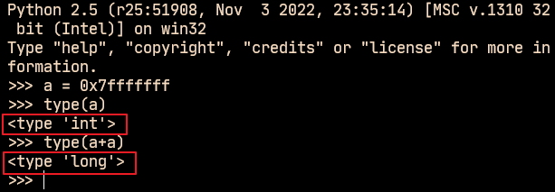

    图 2-1-1 Python 2.5 版本实际结果

另一个有趣的元信息是 ``PyIntObject`` 对象的文档信息， 其维护在 ``int_doc`` 域中。 \
文档无缝地集成在语言中。 可以在 Python 的交互环境下通过 ``PyIntObject`` 对象的 \
``__doc__`` 属性看到 ``int_doc`` 维护的文档： 

.. figure:: img/2-2.png
    :align: center

    图 2-2 整数文档信息

.. topic:: [Include/Python.h]

    .. code-block:: c 

        /* Define macros for inline documentation. */
        #define PyDoc_VAR(name) static char name[]
        #define PyDoc_STRVAR(name,str) PyDoc_VAR(name) = PyDoc_STR(str)
        #ifdef WITH_DOC_STRINGS
        #define PyDoc_STR(str) str
        #else
        #define PyDoc_STR(str) ""
        #endif

.. topic:: [Objects/intobject.c]

    .. code-block:: c 

        PyDoc_STRVAR(int_doc,
        "int(x[, base]) -> integer\n\
        \n\
        Convert a string or number to an integer, if possible.  A floating point\n\
        argument will be truncated towards zero (this does not include a string\n\
        representation of a floating point number!)  When converting a string, use\n\
        the optional base.  It is an error to supply a base when converting a\n\
        non-string. If the argument is outside the integer range a long object\n\
        will be returned instead.");

*******************************************************************************
2.2 PyIntObject 对象的创建和维护
*******************************************************************************

2.2.1 对象创建的 3 种途径
===============================================================================

在上文中已经提到， Python 中创建一个实例对象可以通过 Python 暴露的 C API， 也可以通\
过类型对象完成创建动作。 在 Python 自身的实现中， 几乎都是调用 C API 来创建内建实例\
对象。 而内建对象即便是通过内建类型对象中的 ``tp_new``， ``tp_init`` 操作创建实例对\
象， 实际上最终还是会调用 Python 为特定对象准备的 C API。

在 **intobject.h** 中可以看到， 为了创建 ``PyIntObject`` 对象， Python 提供了 3 \
条途径， 分别从 ``long`` 值， 从字符串以及 ``Py_UNICODE`` 对象生成 \
``PyIntObject`` 对象。  

.. code-block:: c 

    PyAPI_FUNC(PyObject *) PyInt_FromString(char*, char**, int);
    #ifdef Py_USING_UNICODE
    PyAPI_FUNC(PyObject *) PyInt_FromUnicode(Py_UNICODE*, Py_ssize_t, int);
    #endif
    PyAPI_FUNC(PyObject *) PyInt_FromLong(long);

这里只考察从 ``long`` 值生成 ``PyIntObject`` 对象。 因为 ``PyInt_FromString`` \
和 ``PyInt_FromUnicode`` 实际上都是先将字符串或 ``Py_UNICODE`` 对象转换成浮点数\
。 然后再调用 ``PyInt_FromFloat``。 它们不过利用了 Adaptor Pattern 的思想对整数对\
象的核心创建函数 ``PyInt_FromFloat`` 进行了接口转换罢了。 

.. topic:: [Objects/intobject.c]

    .. code-block:: c 

        PyObject *
        PyInt_FromString(char *s, char **pend, int base)
        {
            char *end;
            long x;
            Py_ssize_t slen;
            PyObject *sobj, *srepr;

            if ((base != 0 && base < 2) || base > 36) {
                PyErr_SetString(PyExc_ValueError,
                        "int() base must be >= 2 and <= 36");
                return NULL;
            }

            while (*s && isspace(Py_CHARMASK(*s)))
                s++;
            errno = 0;

            // 将字符串转换为 long 
            if (base == 0 && s[0] == '0') {
                x = (long) PyOS_strtoul(s, &end, base);
                if (x < 0)
                    return PyLong_FromString(s, pend, base);
            }
            else
                x = PyOS_strtol(s, &end, base);
            if (end == s || !isalnum(Py_CHARMASK(end[-1])))
                goto bad;
            while (*end && isspace(Py_CHARMASK(*end)))
                end++;
            if (*end != '\0') {
        bad:
                slen = strlen(s) < 200 ? strlen(s) : 200;
                sobj = PyString_FromStringAndSize(s, slen);
                if (sobj == NULL)
                    return NULL;
                srepr = PyObject_Repr(sobj);
                Py_DECREF(sobj);
                if (srepr == NULL)
                    return NULL;
                PyErr_Format(PyExc_ValueError,
                        "invalid literal for int() with base %d: %s",
                        base, PyString_AS_STRING(srepr));
                Py_DECREF(srepr);
                return NULL;
            }
            else if (errno != 0)
                return PyLong_FromString(s, pend, base);
            if (pend)
                *pend = end;
            return PyInt_FromLong(x);
        }

为了深刻地理解 ``PyIntObject`` 对象的创建过程， 首先必须要深入了解 Python 中整数对\
象在内存中的组织方式。 前面已经提到， 在运行期间， 一个个的整数对象在内存中并不是独立\
存在， 单兵作战的， 而是形成了一个整数对象系统。 我们首先就重点考察一下 Python 中整\
数对象系统的结构。

2.2.2 小整数对象
===============================================================================

在实际的编程中， 数值比较小的整数， 如 1、 2、 29 等可能在程序中非常频繁地使用。 通\
过 For 循环就可以了解小整数为何会有那么频繁的使用场合。 在 Python 中， 所有的对象都\
存活在系统堆上， 如果没有特殊的机制， 对于这些频繁使用的小整数对象， Python 将一次又\
一次地使用 ``malloc`` 在堆上申请空间， 并不厌其烦地一次次 ``free``。 这样的操作不仅\
会大大降低运行效率， 而且会在系统堆上造成大量的内存碎片， 严重影响 Python 的整体性能。 

于是在 Python 中， 对于小整数对象使用了对象池技术。 对象池中的每一个 \
``PyIntObject`` 都能被任意地共享。 

.. topic:: [Objects/intobject.c]

    .. code-block:: c 

        #ifndef NSMALLPOSINTS
            #define NSMALLPOSINTS		257
        #endif
        #ifndef NSMALLNEGINTS
            #define NSMALLNEGINTS		5
        #endif
        #if NSMALLNEGINTS + NSMALLPOSINTS > 0
            /* References to small integers are saved in this array so that they
            can be shared.
            The integers that are saved are those in the range
            -NSMALLNEGINTS (inclusive) to NSMALLPOSINTS (not inclusive).
            */
            static PyIntObject *small_ints[NSMALLNEGINTS + NSMALLPOSINTS];
        #endif

这个毫不起眼的 ``small_ints`` 就是举足轻重的小整数对象的对象池， 准确地说， 是 \
``PyIntObject *`` 池， 不过一般称其为小整数对象池。 在 Python-2.5 中， 将小整数集\
合的范围默认为 ``[-5, 257)``。 可以通过修改 ``NSMALLPOSINTS`` 和 \
``NSMALLNEGINTS`` 重新编译 Python， 从而将这个范围向两端伸展或收缩。 

对于小整数对象， Python 直接将这些整数对应的 ``PyIntObject`` 缓存在内存中， 并将其\
指针存放在 ``small_ints`` 中。

2.2.3 大整数对象
===============================================================================

对于小整数， 在小整数对象池中完全缓存了 ``PyIntObject`` 对象。 而对于其他整数， \
Python 运行环境提供了一块内存空间， 由大整数轮流使用， 这样免去了不断 ``malloc`` 之\
苦， 也在一定程度上考虑了效率问题。 在 Python 中， 有一个 ``PyIntBlock`` 结构， 在\
这基础上， 实现了一个单向列表。 

.. topic:: [Objects/intobject.c]

    .. code-block:: c

        #define BLOCK_SIZE	1000	/* 1K less typical malloc overhead */
        #define BHEAD_SIZE	8	/* Enough for a 64-bit pointer */
        #define N_INTOBJECTS	((BLOCK_SIZE - BHEAD_SIZE) / sizeof(PyIntObject))

        struct _intblock {
            struct _intblock *next;
            PyIntObject objects[N_INTOBJECTS];
        };

        typedef struct _intblock PyIntBlock;

        static PyIntBlock *block_list = NULL;
        static PyIntObject *free_list = NULL;

``PyIntBlock`` 这个结构里维护了一块内存 (``block``)， 其中保存了一些 \
``PyIntObject`` 对象。 从定义中可以看出一个 ``PyIntBlock`` 中维护着 \
``N_INTOBJECTS`` 个对象， 计算后是 82 个。 这里也可以动态调整。 

``PyIntBlock`` 的单向列表通过 ``block_list`` 维护， 每个 ``block`` 中都维护了一\
个 ``PyIntObject`` 数组 - ``objects``， 这就是真正用于存储被缓存的 \
``PyIntObject`` 对象的内存。 Python 使用一个单向链表来管理全部 ``block`` 的 \
``objects`` 中所有的空闲内存， 这个自由内存链表的表头就是 ``free_list``。 最开始时\
， 两个指针都被设置为空指针。

.. figure:: img/2-3.png
    :align: center

    图 2-3 free_list 和 block_list 的初始状态

    .. note::

        注：在此后的图示中， 我们将统一用实线菱尾箭头表示 ``block_list``， 虚线菱尾\
        箭头表示 ``free_list``。

2.2.4 添加和删除
===============================================================================

下面通过 ``PyInt_FromLong`` 进行细致入微的考察， 真实展现一个个 ``PyIntObject`` 对\
象的产生。 

.. topic:: [Objects/intobject.c]

    .. code-block:: c

        PyObject *
        PyInt_FromLong(long ival)
        {
            register PyIntObject *v;
        #if NSMALLNEGINTS + NSMALLPOSINTS > 0
        // [1] ：尝试使用小整数对象池
            if (-NSMALLNEGINTS <= ival && ival < NSMALLPOSINTS) {
                v = small_ints[ival + NSMALLNEGINTS];
                Py_INCREF(v);
        #ifdef COUNT_ALLOCS
                if (ival >= 0)
                    quick_int_allocs++;
                else
                    quick_neg_int_allocs++;
        #endif
                return (PyObject *) v;
            }
        #endif
        // [2]： 为通用整数对象池申请新的内存空间
            if (free_list == NULL) {
                if ((free_list = fill_free_list()) == NULL)
                    return NULL;
            }
            /* Inline PyObject_New */
            // [3] ： (inline) 内联 PyObject_New 的行为
            v = free_list;
            free_list = (PyIntObject *)v->ob_type;
            PyObject_INIT(v, &PyInt_Type);
            v->ob_ival = ival;
            return (PyObject *) v;
        }

``PyIntObject`` 对象的创建通过两步完成 (上述代码是 Python-2.5 代码， 与书中有出入)： 

.. topic:: [Objects/intobject.c]

    .. code-block:: c

        PyObject *
        PyInt_FromLong(long ival)
        {
            register PyIntObject *v;
        #if NSMALLNEGINTS + NSMALLPOSINTS > 0
        // [1] ：尝试使用小整数对象池
            if (-NSMALLNEGINTS <= ival && ival < NSMALLPOSINTS) {
                v = small_ints[ival + NSMALLNEGINTS];
                Py_INCREF(v);
                return (PyObject *) v;
            }
        #endif
        // [2]： 为通用整数对象池申请新的内存空间
            if (free_list == NULL) {
                if ((free_list = fill_free_list()) == NULL)
                    return NULL;
            }
            /* Inline PyObject_New */
            // [3] ： (inline) 内联 PyObject_New 的行为
            v = free_list;
            free_list = (PyIntObject *)v->ob_type;
            PyObject_INIT(v, &PyInt_Type);
            v->ob_ival = ival;
            return (PyObject *) v;
        }

- 如果小整数对象池机制被激活， 则尝试使用小整数对象池； 

- 如果不能使用小整数对象池， 则使用通用的整数对象池。

2.2.4.1 使用小整数对象池
-------------------------------------------------------------------------------

如果 ``NSMALLNEGINTS + NSMALLPOSINTS > 0``， Python 认为小整数对象池机制被激活， \
``PyInt_FromLong`` 会首先在 [1] 处检查传入的 ``long`` 值是否属于小整数范围， 如果\
是小整数， 只需要返回小整数对象池中的对应的对象就可以了。 

如果小整数对象池机制没有被激活， 或传入的 ``long`` 值不是小整数， Python 就会转向由 \
``block_list`` 维护的通用整数对象池。 

2.2.4.2 创建通用整数对象池
-------------------------------------------------------------------------------

首次调用 ``PyInt_FromLong`` 时， ``free_list`` 为 ``NULL``， 这时 Python 会在 \
[2] 处调用 ``fill_free_list`` 创建新的 ``block``， 从而创建新的空闲内存。 Python \
对 ``fill_free_list`` 的调用不光会发生在 ``PyInt_FromLong`` 的首次调用时， 在 \
Python 运行期间， 只要所有 ``block`` 的空闲内存被使用完， 就会导致 ``free_list`` \
变为 ``NULL``， 从而在下一次 ``PyInt_FromLong`` 的调用时激发对 \
``fill_free_list`` 的调用。 

.. topic:: [Objects/intobject.c]

    .. code-block:: c 

        static PyIntObject *
        fill_free_list(void)
        {
            PyIntObject *p, *q;
            /* Python's object allocator isn't appropriate for large blocks. */
            // [1]: 申请大小为 sizeof(PyIntBlock) 的内存空间，并链接到已有的 block_list 中
            p = (PyIntObject *) PyMem_MALLOC(sizeof(PyIntBlock));
            if (p == NULL)
                return (PyIntObject *) PyErr_NoMemory();
            ((PyIntBlock *)p)->next = block_list;
            block_list = (PyIntBlock *)p;
            /* Link the int objects together, from rear to front, then return
            the address of the last int object in the block. */
            // [2]: 将PyIntBlock 中的 PyIntObject 数组--objects--转变成单向链表
            p = &((PyIntBlock *)p)->objects[0];
            q = p + N_INTOBJECTS;
            while (--q > p)
                q->ob_type = (struct _typeobject *)(q-1);
            q->ob_type = NULL;
            return p + N_INTOBJECTS - 1;
        }

在 ``fill_free_list`` 中， 会首先在 [1] 处申请一个新的 ``PyIntBlock`` 结构。 如\
图 2-4。  

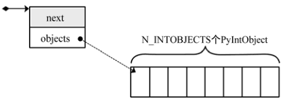

注意: 图中的虚线并表示指针关系， 虚线表示 ``objects`` 的更详细的表示方式。 

这时 ``block`` 中的 ``objects`` 还仅仅是一个 ``PyIntObject`` 对象的数组， 然后 \
Python 将 ``objects`` 中的所有 ``PyIntObject`` 对象通过指针依次连接起来， 从而将数\
组变成一个单向链表， 这就是 [2] 处的行为。 从 ``objects`` 数组最后一个元素开始链接\
， 在链接过程中， Python 使用了 ``PyObject`` 中的 ``ob_type`` 指针作为链接指针。 

图 2-5 展示了 [2] 处的链表转换动作完成之后的 ``block``， 其中用虚线箭头展示了 [2] \
开始时 p 和 q 的初始状态。 当链表转换完成之后， ``free_list`` 也出现在它该出现的位\
置。 从 ``free_list`` 开始， 沿着 ``ob_type`` 指针， 就可以遍历刚刚创建的 \
``PyIntBlock`` 中所有空闲的为 ``PyIntBlock`` 准备的内存了。 

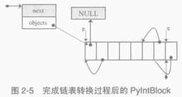

当一个 ``block`` 中还有剩余的内存没有被一个 ``PyIntBlock`` 占用时， \
``free_list`` 就不会指向 ``NULL``。 这种情况下调用 ``PyInt_FromLong`` 不会申请新\
的 ``block``。 只有当所有 ``block`` 中的内存都被占用了， ``PyInt_FromLong`` 才会\
再次调用 ``fill_free_list`` 申请新的空间， 为新的 ``PyIntObject`` 创建新的家园。 

Python 通过 ``block_list`` 维护整个整数对象的通用对象池。 新创建的 ``block`` 必须\
加入到 ``block_list`` 所维护的链表中， 这个动作在 [1] 处完成。 图 2-6 显示了两次申\
请 ``block`` 后 ``block_list`` 所维护的链表的情况。 ``block_list`` 始终指向最新创\
建的 ``PyIntBlock`` 对象。

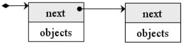

2.2.4.3 使用通用整数对象池
-------------------------------------------------------------------------------

在 ``PyInt_FromLong`` 中， 必要的空间申请之后， Python 会从当前有 ``free_list`` \
所维护的自由内存链表中划出一块， 并在这块内存上创建所需要的新的 ``PyIntObject`` 对象\
， 同时还会对 ``PyIntObject`` 对象完成必要的初始化工作。 Python 还将调整 \
``free_list`` 指针， 使其指向下一块还没有被使用的内存。 

在图 2-6 中， 两个 ``PyIntBlock`` 处于同一个链表中， 但是每个 ``PyIntBlock`` 中至\
关重要的存放 ``PyIntObject`` 对象的 ``objects`` 却是分离的， 这样的结构存在着隐患： 

现有两个 ``PyIntBlock`` 对象， *PyIntBlock1* 和 *PyIntBlock2*， *PyIntBlock1* 中\
的 ``objects`` 已经被 ``PyIntObject`` 对象填满， 而 *PyIntBlock2* 中的 \
``object`` 只填充了一部分。 所以现在 ``free_list`` 指针指向的是 \
``PyIntBlock2.objects`` 中空闲的内存块。 假设现在 ``PyIntBlock1.objects`` 中的一\
个 ``PyIntObject`` 对象被删除了， 这意味着 *PyIntBlock1* 中出现了一块空闲的内存， \
那么下次创建新的 ``PyIntObject`` 对象时应该使用 *PyIntBlock1* 中的这块内存。 倘若\
不然， 就意味着所有的内存只能使用一次， 这跟内存泄漏也没什么区别了。 

实际上， 不同 ``PyIntBlock`` 对象的 ``objects`` 中空闲的内存块是被链接在一起的， \
形成了一个单向链表， 指向表头的指针正是 ``free_list``。 不同 ``PyIntBlock`` 中的空\
闲内存块是在 ``PyIntObject`` 对象被销毁的时候被链接在一起的。 

在 Python 对象机制中， 每个对象都有一个引用计数与之相关联， 当这个引用计数减为 0 时\
， 就意味着这个世上再也没有谁需要它了， 于是 Python 会负责将这个对象销毁。 Python 中\
不同对象在销毁时会进行不同的动作， 销毁动作在与对象对应的类型对象中被定义， 这个关键\
的操作就是类型对象中的 ``tp_dealloc``。 看一下 ``PyIntObject`` 对象的 \
``tp_dealloc`` 操作： 

.. topic:: [Objects/intobject.c]

    .. code-block:: c 

        static void
        int_dealloc(PyIntObject *v)
        {
            if (PyInt_CheckExact(v)) {
                v->ob_type = (struct _typeobject *)free_list;
                free_list = v;
            }
            else
                v->ob_type->tp_free((PyObject *)v);
        }

由 ``block_list`` 维护的 ``PyIntBlock`` 链表中的内存实际上是所有的大整数对象共同分\
享的。 当一个 ``PyIntObject`` 对象被销毁时， 它所占用的内存并不会被释放， 而是继续\
被 Python 保留着。 但是这块内存在整数对象被销毁后变为了自由内存， 将来可供别的 \
``PyIntObject`` 使用， 所以 Python 应该将其链入了 ``free_list`` 所维护的自由内存\
链表。 ``int_dealloc`` 完成的就是这么一个简单的指针维护工作。 这些动作是在销毁的对象\
确实是一个 ``PyIntObject`` 对象时发生的。 如果删掉的对象是一个整数的派生类的对象， \
那么 ``int_dealloc`` 不做任何动作， 只是简单地调用派生类型中指定的 ``tp_free``。

在图 2-7 中相继创建和删除 ``PyIntObject`` 对象， 并展示了内存中的 ``PyIntObject`` \
对象以及 ``free_list`` 指针的变化情况。 在实际 Python 行为中， 创建 2，3，4 这样的\
整数对象， 使用的实际上是 ``small_ints`` 这样的小整数对象池， 在这里仅仅是为了展示通\
用整数对象池的动态变化， 没有考虑实际使用的内存。 

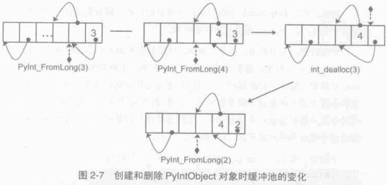

不同 ``PyIntBlock`` 对象中空闲内存的互联也是在 ``int_dealloc`` 被调用时实现的 （白\
色表示空闲内存）： 

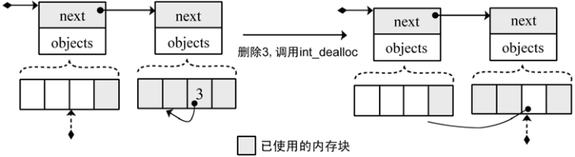

当一个整数对象的引用计数变为 0 时， 就会被 Python 回收， 但是在 ``int_dealloc`` 中\
， 仅仅是将该整数对象的内存重新加入到自由内存链表中。 也就是说， 在 ``int_dealloc`` \
中， 永远不会向系统堆交换任何内存。 一旦系统堆中某块内存被 Python 申请用于整数对象\
， 那么这块内存在 Python 结束之前永远不会被释放。 

2.2.5 小整数对象池的初始化
===============================================================================

小整数对象池 ``small_ints`` 维护的只是 ``PyIntObject`` 的指针， 完成小整数对象的创\
建和初始化的函数是 ``_PyInt_Init``。

.. topic:: [Objects/intobject.c]

    .. code-block:: c 

        int
        _PyInt_Init(void)
        {
            PyIntObject *v;
            int ival;
        #if NSMALLNEGINTS + NSMALLPOSINTS > 0
            for (ival = -NSMALLNEGINTS; ival < NSMALLPOSINTS; ival++) {
                    if (!free_list && (free_list = fill_free_list()) == NULL)
                    return 0;
                /* PyObject_New is inlined */
                v = free_list;
                free_list = (PyIntObject *)v->ob_type;
                PyObject_INIT(v, &PyInt_Type);
                v->ob_ival = ival;
                small_ints[ival + NSMALLNEGINTS] = v;
            }
        #endif
            return 1;
        }

从小整数的创建过程中可以看到， 这些小整数对象也是生存在 ``block_list`` 所维护的内存\
上。 在 Python 初始化的时候， ``_PyInt_Init`` 被调用， 内存被申请， 小整数对象被创\
建。

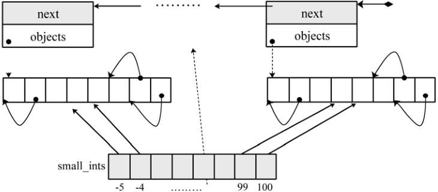

*******************************************************************************
2.3 Hack PyIntObject
*******************************************************************************

来修改 ``int_print`` 行为， 使其打印关于 ``block_list`` 和 ``free_list`` 的信息\
， 以及小整数缓冲池的信息： 

.. topic:: [Objects/intobject.c]

    .. code-block:: c 

        static int
        int_print(PyIntObject *v, FILE *fp, int flags)
            /* flags -- not used but required by interface */
        {
            fprintf(fp, "%ld", v->ob_ival);
            return 0;
        }

        // [修改后]

        static int values[10];
        static int refcounts[10];
        static int int_print(PyIntObject *v, FILE *fp, int flags)
        {
            PyIntObject* intObjectPtr;
            PyIntBlock *p = block_list;
            PyIntBlock *last = NULL;
            int count = 0;
            int i;

            while (p!= NULL)
            {
                ++count;
                last = p;
                p = p->next;
            }

            intObjectPtr = last->objects;
            intObjectPtr += N_INTOBJECTS - 1;
            printf(" address @%p\n", v);

            for (i=0; i<10; ++i, --intObjectPtr)
            {
                values[i] = intObjectPtr->ob_ival;
                refcounts[i] = intObjectPtr->ob_refcnt;
            }
            printf("  value : ");
            for (i=0; i<8; ++i)
            {
                printf("%d\t", values[i]);
            }
            printf("\n");

            printf("  refcnt : ");
            for (i=0; i<8; ++i)
            {
                printf("%d\t", refcounts[i]);
            }
            printf("\n");

            printf(" block_list count : %d\n", count);
            printf(" free_list : %p\n", free_list);

            return 0;
        }

在初始化小整数缓冲池时， 对于 ``block_list`` 及每个 ``PyIntBlock`` 的 ``objects``\
， 都是从后往前开始填充的， 所以在初始化完成后， ``-5`` 应该在最后一个 \
``PyIntBlock`` 对象的 ``objects`` 内最后一块内存， 需要顺藤摸瓜一直找到最后一块内存\
才能观察从 ``-5`` 到 ``4`` 这 10 个小整数。 

创建一个 ``PyIntObject`` 对象 ``-9999``， 从图中可以看到， 小整数对象被 Python 自\
身使用多次。 

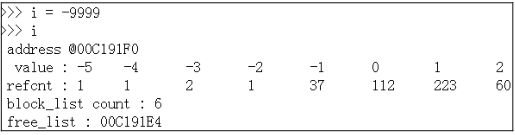

现在的 ``free_list`` 指向地址为 ``00C191E4`` 的内存， 根据对 ``PyIntObject`` 的分\
析， 那么下一个 ``PyIntObject`` 会在这个地址安身立命。 再创建两个 ``PyIntObject`` \
对象， 值分别为 ``-12345``：

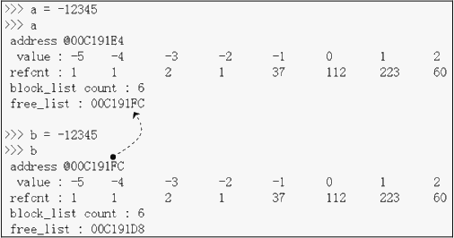

从图示可以看到 a 的地址正是创建 i 后 ``free_list`` 所指向的地址， 而 b 的地址也正是\
创建 a 后 ``free_list`` 所指的地址。 虽然 a 和 b 的值都是一样的， 但是他们确实是两\
个完全没有关系的 ``PyIntObject`` 对象， 这点儿可以从内存地址上看清楚。 

现在删除 b， 结果如下：

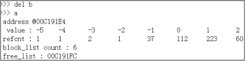

删除 b 后， ``free_list`` 回退到 a 创建后 ``free_list`` 的位置， 这点儿与之前的分\
析是一致的。 

最后看一下小整数对象的监控， 连续两次创建 ``PyIntObject`` 对象 ``-5``， 结果如图所\
示：

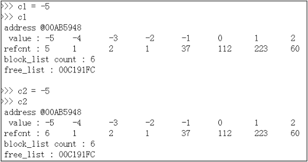

可以看到， 两次创建的 ``PyIntObject`` 对象 c1 和 c2 的地址都是 ``00AB5948``， 这证\
明它们实际上是同一个对象。 同时可以看到小整数对象池中 ``-5`` 的引用计数发生了变化， \
这证明 c1 和 c2 实际上都是指向这个对象。 此外 ``free_list`` 没有发生任何变化， 与分\
析相符。
