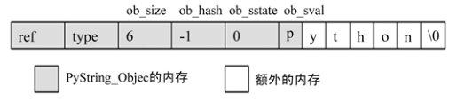

###############################################################################
Chapter 03 - Python 中的字符串对象
###############################################################################

.. contents::

再对 ``PyIntObject`` 的分析中， Python 中具有不可变长度数据的对象 （定长对象）。 \
在 Python 中， 还大量存在着另一种对象， 即具有可变长度数据的对象 （变长对象）。 与定\
长对象不同， 变长对象维护的数据的长度在对象定义时是不知道的。 

整数对象 ``PyIntObject`` 其维护的数据的长度在对象定义时就已经确定了， 是一个 C 中 \
``long`` 变量的长度； 而可变对象维护的数据的长度只能在对象创建时才能确定， 例如只能\
在创建一个字符串或一个列表时才知道它们所维护的数据的长度， 在此之前， 一无所知。

在变长对象中， 实际上还可以分为可变对象和不可变对象。 可变对象维护的数据在对象被创建\
后还能变化， 比如一个 ``list`` 被创建后， 可以向其中添加元素或删除对象， 这些操作都\
会改变其维护的数据； 而不可变对象所维护的数据在对象创建之后就不能在改变了， 比如 \
Python 中的 ``string`` 和 ``tuple``， 它们都不支持添加或删除操作。 

*******************************************************************************
3.1 ``PyStringObject`` 与 ``PyString_Type``
*******************************************************************************

在 Python 中， ``PyStringObject`` 是对字符串对象的实现。 ``PyStringObject`` 是一\
个拥有可变长度内存的对象。 对于两个不同的 ``PyStringObject`` 对象， 其内部所需的保\
存字符串内容的内存空间显然是不同的。 同时 ``PyStringObject`` 对象是一个不变对象。 \
当创建了一个 ``PyStringObject`` 对象之后， 该对象内部维护的字符串就不能在被改变了\
。 这一特点使得 ``PyStringObject`` 对象可作为 ``dict`` 的键值， 但也使得一些字符串\
操作的效率大大降低， 比如多个字符串的连接。 ``PyStringObject`` 对象定义： 

.. topic:: [Include/stringonject.h]

    .. code-block:: c  

        typedef struct {
            PyObject_VAR_HEAD
            long ob_shash;
            int ob_sstate;
            char ob_sval[1];

            /* Invariants:
            *     ob_sval contains space for 'ob_size+1' elements.
            *     ob_sval[ob_size] == 0.
            *     ob_shash is the hash of the string or -1 if not computed yet.
            *     ob_sstate != 0 iff the string object is in stringobject.c's
            *       'interned' dictionary; in this case the two references
            *       from 'interned' to this object are *not counted* in ob_refcnt.
            */
        } PyStringObject;

在 ``PyStringObject`` 的定义中可以看到， 在 ``PyStringObject`` 的头部实际上是一\
个 ``PyObject_VAR_HEAD``， 其中有一个 ``ob_size`` 变量保存着对象中维护的可变长度内\
存的大小。 虽然在 ``PyStringObject`` 的定义中， ``ob_sval`` 实际上是作为一个字符指\
针指向一段内存的， 这段内存保存着这个字符串对象所维护的实际字符串， 显然这段内存不会\
只是一个字节。 这段内存的实际长度（字节）， 正是有 ``ob_size`` 维护的， 这个机制是 \
Python 中所有变长对象的实现机制。 

同 C 中的字符串一样， ``PyStringObject`` 内部维护的字符串在末尾必须以 '\0' 结尾， \
但是由于字符串的实际长度是由 ``ob_size`` 维护的， 所以 ``PyStringObject`` 表示的字\
符串对象中间是可能出现字符 '\0' 的， 这与 C 语言不同， 因为在 C 中， 只要遇到了字符 \
'\0' 就认为一个字符串结束了， 所以实际上， ``ob_sval`` 指向的是一段长度为 \
``ob_size + 1`` 个字节的内存， 而且必须满足 ``ob_sval[ob_size] == '\0'``。

``PyStringObject`` 中的 ``ob_shash`` 变量的作用是缓存该对象的 hash 值， 这样避免每\
一次都重新计算该字符串对象的 hash 值。 如果一个 ``PyStringObject`` 对象还没有别计算\
过 hash 值， 那么 ``ob_shash`` 的初始值是 ``-1``。 在后面 ``dict`` 中， 这个 \
hash 将会发挥巨大的作用。 计算一个字符串对象的 hash 值时， 采用如下算法： 

.. topic:: [Objects/stringobject.c]

    .. code-block:: c

        static long
        string_hash(PyStringObject *a)
        {
            register Py_ssize_t len;
            register unsigned char *p;
            register long x;

            if (a->ob_shash != -1)
                return a->ob_shash;
            len = a->ob_size;
            p = (unsigned char *) a->ob_sval;
            x = *p << 7;
            while (--len >= 0)
                x = (1000003*x) ^ *p++;
            x ^= a->ob_size;
            if (x == -1)
                x = -2;
            a->ob_shash = x;
            return x;
        }

``PyStringObject`` 对象的 ``ob_sstate`` 变量标记了该对象是否已经过 intern 机制的\
处理， 关于 ``PyStringObject`` 的 intern 机制， 在后面会详细介绍， 在 Python 源码\
中的注释显示， 预存字符串的 hash 值和这里的 intern 机制将 Python 虚拟机的执行效率提\
升了 20%。

下面列出了 ``PyStringObject`` 对应的类型对象 - ``PyString_Type``：

.. topic:: [Objects/stringobject.c]

    .. code-block:: c    

        PyTypeObject PyString_Type = {
            PyObject_HEAD_INIT(&PyType_Type)
            0,
            "str",
            sizeof(PyStringObject),
            sizeof(char),
            string_dealloc, 			/* tp_dealloc */
            (printfunc)string_print, 		/* tp_print */
            0,					/* tp_getattr */
            0,					/* tp_setattr */
            0,					/* tp_compare */
            string_repr, 				/* tp_repr */
            &string_as_number,			/* tp_as_number */
            &string_as_sequence,			/* tp_as_sequence */
            &string_as_mapping,			/* tp_as_mapping */
            (hashfunc)string_hash, 			/* tp_hash */
            0,					/* tp_call */
            string_str,				/* tp_str */
            PyObject_GenericGetAttr,		/* tp_getattro */
            0,					/* tp_setattro */
            &string_as_buffer,			/* tp_as_buffer */
            Py_TPFLAGS_DEFAULT | Py_TPFLAGS_CHECKTYPES |
                Py_TPFLAGS_BASETYPE,		/* tp_flags */
            string_doc,				/* tp_doc */
            0,					/* tp_traverse */
            0,					/* tp_clear */
            (richcmpfunc)string_richcompare,	/* tp_richcompare */
            0,					/* tp_weaklistoffset */
            0,					/* tp_iter */
            0,					/* tp_iternext */
            string_methods,				/* tp_methods */
            0,					/* tp_members */
            0,					/* tp_getset */
            &PyBaseString_Type,			/* tp_base */
            0,					/* tp_dict */
            0,					/* tp_descr_get */
            0,					/* tp_descr_set */
            0,					/* tp_dictoffset */
            0,					/* tp_init */
            0,					/* tp_alloc */
            string_new,				/* tp_new */
            PyObject_Del,	                	/* tp_free */
        };

在 ``PyStringObject`` 的类型对象中， ``tp_itemsize`` 被设置为 ``sizeof(char)``\
， 即一个字节。 对于 Python 中的任何一种变长对象， ``tp_itemsize`` 这个域是必须设置\
的， ``tp_itemsize`` 指明了由变长对象保存的元素 (item) 的单位长度， 所谓单位长度即\
是指单一一个元素在内存中的长度。 这个 ``tp_itemsize`` 和 ``ob_size`` 共同决定了应\
该额外申请的内存总大小是多少。 ``tp_as_number``、 ``tp_as_sequence``、 \
``tp_as_mapping`` 三个域都被设置了， 表示 ``PyStringObject`` 对数值操作， 序列操作\
和映射操作都支持。 

*******************************************************************************
3.2 创建 ``PyStringObject`` 对象
*******************************************************************************

Python 提供了两条路径， 从 C 中原生的字符串创建 ``PyStringObject`` 对象。 先看一下\
最一般的 ``PyString_FromString``。  

.. topic:: [Objects/stringobject.c]
    
    .. code-block:: C

        PyObject *
        PyString_FromString(const char *str)
        {
            register size_t size;
            register PyStringObject *op;

            assert(str != NULL);
            size = strlen(str);
            if (size > PY_SSIZE_T_MAX) {
                PyErr_SetString(PyExc_OverflowError,
                    "string is too long for a Python string");
                return NULL;
            }
            if (size == 0 && (op = nullstring) != NULL) {
        #ifdef COUNT_ALLOCS
                null_strings++;
        #endif
                Py_INCREF(op);
                return (PyObject *)op;
            }
            if (size == 1 && (op = characters[*str & UCHAR_MAX]) != NULL) {
        #ifdef COUNT_ALLOCS
                one_strings++;
        #endif
                Py_INCREF(op);
                return (PyObject *)op;
            }

            /* Inline PyObject_NewVar */
            op = (PyStringObject *)PyObject_MALLOC(sizeof(PyStringObject) + size);
            if (op == NULL)
                return PyErr_NoMemory();
            PyObject_INIT_VAR(op, &PyString_Type, size);
            op->ob_shash = -1;
            op->ob_sstate = SSTATE_NOT_INTERNED;
            Py_MEMCPY(op->ob_sval, str, size+1);
            /* share short strings */
            if (size == 0) {
                PyObject *t = (PyObject *)op;
                PyString_InternInPlace(&t);
                op = (PyStringObject *)t;
                nullstring = op;
                Py_INCREF(op);
            } else if (size == 1) {
                PyObject *t = (PyObject *)op;
                PyString_InternInPlace(&t);
                op = (PyStringObject *)t;
                characters[*str & UCHAR_MAX] = op;
                Py_INCREF(op);
            }
            return (PyObject *) op;
        }

        // 上述代码是 Python 2.5 源码，以下是书中的代码

        PyObject *
        PyString_FromString(const char *str)
        {
            register size_t size;
            register PyStringObject *op;

            // [1]: 判断字符串长度
            size = strlen(str);
            if (size > PY_SSIZE_T_MAX) {
                return NULL;
            }

            // [2]: 处理 NULL string
            if (size == 0 && (op = nullstring) != NULL) {
                return (PyObject *)op;
            }

            // [3]: 处理字符
            if (size == 1 && (op = characters[*str & UCHAR_MAX]) != NULL) {
                return (PyObject *)op;
            }

            /* Inline PyObject_NewVar */
            // [4]: 创建新的 PyStringObject 对象， 并初始化
            op = (PyStringObject *)PyObject_MALLOC(sizeof(PyStringObject) + size);
            PyObject_INIT_VAR(op, &PyString_Type, size);
            op->ob_shash = -1;
            op->ob_sstate = SSTATE_NOT_INTERNED;
            Py_MEMCPY(op->ob_sval, str, size+1);
            /* share short strings */
            if (size == 0) {
                PyObject *t = (PyObject *)op;
                PyString_InternInPlace(&t);
                op = (PyStringObject *)t;
                nullstring = op;
                Py_INCREF(op);
            } else if (size == 1) {
                PyObject *t = (PyObject *)op;
                PyString_InternInPlace(&t);
                op = (PyStringObject *)t;
                characters[*str & UCHAR_MAX] = op;
                Py_INCREF(op);
            }
            return (PyObject *) op;
        }

显然传给 ``PyString_FromString`` 的参数必须是一个指向 NUL ('\0') 结尾的字符串指针\
。 在从一个原生字符串创建 ``PyStringObject`` 时， 首先 [1] 处检查该字符数组的长度\
， 如果长度大于了 ``PY_SSIZE_T_MAX``， Python 将不会创建对应的 \
``PyStringObject`` 对象。 ``PY_SSIZE_T_MAX`` 是一个与平台相关的值， 在 Win32 系统\
下， 该值为 ``2 147 483 647``， 即 2GB。 

在 [2] 处， 检查传入的字符串是否是一个空串， 对于空串， Python 并不是每次都会创建相\
应的 ``PyStringObject``。 Python 运行时有一个 ``PyStringObject`` 对象指针 \
``nullstring`` 专门负责处理空的字符数组。 如果第一次在一个空字符串基础上创建 \
``PyStringObject``， 由于 ``nullstring`` 指针被初始化为 ``NULL``， 所以 Python \
会为这个空字符建立一个 ``PyStringObject`` 对象， 将这个 ``PyStringObject`` 对象通\
过 intern 机制进行共享， 然后将 ``nullstring`` 指向这个被共享的对象。 如果在以后 \
Python 检查到需要为一个空字符串创建 ``PyStringObject`` 对象， 这时 \
``nullstring`` 已经存在了， 就直接返回 ``nullstring`` 的引用。

如果不是创建空字符串对象， 接下来的进行的动作就是申请内存， 创建 \
``PyStringObject`` 对象。 [4] 处申请的内存除了 ``PyStringObject`` 的内存， 还有为\
字符数组内的元素申请的额外内存。 然后将 hash 缓存值设为 ``-1``， 将 intern 标志设\
为 ``SSTATE_NOT_INTERNED``。 最后将参数 ``str`` 指向字符数组内的字符拷贝到 \
``PyStringObject`` 所维护的空间中， 在拷贝的过程中， 将字符数组最后的 '\0' 字符也拷\
贝了。 假如对字符数组 "Python" 建立 ``PyStringObject`` 对象， 那么对象建立完成后在\
内存中的状态如图： 

在 ``PyString_FromString`` 之外， 还有一条创建 ``PyStringObject`` 对象的途径 - \
``PyString_FromStringAndSize``:

.. topic:: [Objects/stringobject.c]

    .. code-block:: c 

        //[书中的代码]

        PyObject* PyString_FromStringAndSize(const char *str, Py_ssize_t size)
        {
            register PyStringObject *op;
            // 处理 null string
            if (size == 0 && (op = nullstring) != NULL) {
                return (PyObject *)op;
            }
            // 处理字符
            if (size == 1 && str != NULL &&
                (op = characters[*str & UCHAR_MAX]) != NULL)
            {
                return (PyObject *)op;
            }
            // 创建新的 PyStringObject 对象， 并初始化
            /* Inline PyObject_NewVar */
            op = (PyStringObject *)PyObject_MALLOC(sizeof(PyStringObject) + size);
            if (op == NULL)
                return PyErr_NoMemory();
            PyObject_INIT_VAR(op, &PyString_Type, size);
            op->ob_shash = -1;
            op->ob_sstate = SSTATE_NOT_INTERNED;
            if (str != NULL)
                Py_MEMCPY(op->ob_sval, str, size);
            op->ob_sval[size] = '\0';
            /* share short strings */
            if (size == 0) {
                PyObject *t = (PyObject *)op;
                PyString_InternInPlace(&t);
                op = (PyStringObject *)t;
                nullstring = op;
                Py_INCREF(op);
            } else if (size == 1 && str != NULL) {
                PyObject *t = (PyObject *)op;
                PyString_InternInPlace(&t);
                op = (PyStringObject *)t;
                characters[*str & UCHAR_MAX] = op;
                Py_INCREF(op);
            }
            return (PyObject *) op;
        }

        //[代码包中的代码]    

        PyObject *
        PyString_FromStringAndSize(const char *str, Py_ssize_t size)
        {
            register PyStringObject *op;
            assert(size >= 0);
            if (size == 0 && (op = nullstring) != NULL) {
        #ifdef COUNT_ALLOCS
                null_strings++;
        #endif
                Py_INCREF(op);
                return (PyObject *)op;
            }
            if (size == 1 && str != NULL &&
                (op = characters[*str & UCHAR_MAX]) != NULL)
            {
        #ifdef COUNT_ALLOCS
                one_strings++;
        #endif
                Py_INCREF(op);
                return (PyObject *)op;
            }

            /* Inline PyObject_NewVar */
            op = (PyStringObject *)PyObject_MALLOC(sizeof(PyStringObject) + size);
            if (op == NULL)
                return PyErr_NoMemory();
            PyObject_INIT_VAR(op, &PyString_Type, size);
            op->ob_shash = -1;
            op->ob_sstate = SSTATE_NOT_INTERNED;
            if (str != NULL)
                Py_MEMCPY(op->ob_sval, str, size);
            op->ob_sval[size] = '\0';
            /* share short strings */
            if (size == 0) {
                PyObject *t = (PyObject *)op;
                PyString_InternInPlace(&t);
                op = (PyStringObject *)t;
                nullstring = op;
                Py_INCREF(op);
            } else if (size == 1 && str != NULL) {
                PyObject *t = (PyObject *)op;
                PyString_InternInPlace(&t);
                op = (PyStringObject *)t;
                characters[*str & UCHAR_MAX] = op;
                Py_INCREF(op);
            }
            return (PyObject *) op;
        }

``PyString_FromStringAndSize`` 的操作过程和 ``PyString_FromString`` 一般无二， \
只是有一点， ``PyString_FromString`` 传入的参数必须是以 NUL ('\0') 结尾的字符数组\
的指针， 而 ``PyString_FromStringAndSize`` 没有这样的要求， 因为通过传入的 \
``size`` 参数就可以确定需要拷贝的字符的个数。

