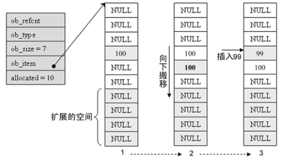
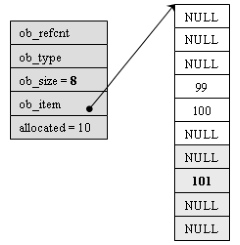
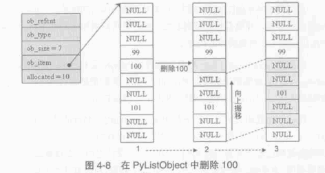
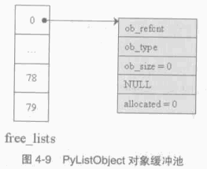
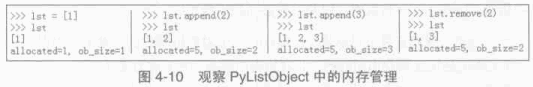
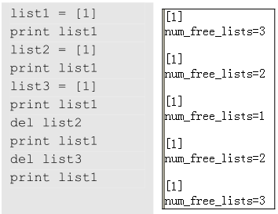

###############################################################################
Chapter 04 - Python 中的 List 对象
###############################################################################

.. contents:: 

*******************************************************************************
4.1 ``PyListObject`` 对象
*******************************************************************************

``PyListObject`` 是 Python 提供的对列表的抽象， 与 STL 中的 ``vector`` 神似。 

``PyListObject`` 对象可以有效地支持元素的插入、 添加、 删除等操作， 在 Python 的列\
表中， 无一例外存放的都是 ``PyObject*`` 指针。 因此可以这样看待 Python 中的 \
``PyListObject : vector<PyObject*>``。 

``PyListObject`` 是一个变长对象， 因为不同的 ``list`` 中存储的元素个数会是不同的。 \
与 ``PyStringObject`` 不同的是， ``PyListObject`` 对象支持插入删除等操作， 可以在\
运行时动态调整它所维护的内存和元素， 是一个可变对象。 ``PyListObject`` 定义如下： 

.. topic:: [Include/listobject.h]

    .. code-block:: c 

        typedef struct {
            PyObject_VAR_HEAD
            /* Vector of pointers to list elements.  list[0] is ob_item[0], etc. */
            PyObject **ob_item;
            // ob_item 为指向元素列表的指针 ， 实际上 ， python 中的 list[0] 就是 
            // ob_item[0]
            /* ob_item contains space for 'allocated' elements.  The number
            * currently in use is ob_size.
            * Invariants:
            *     0 <= ob_size <= allocated
            *     len(list) == ob_size
            *     ob_item == NULL implies ob_size == allocated == 0
            * list.sort() temporarily sets allocated to -1 to detect mutations.
            *
            * Items must normally not be NULL, except during construction when
            * the list is not yet visible outside the function that builds it.
            */
            Py_ssize_t allocated;   //书中为 int allocated;
        } PyListObject;

``PyListObject`` 的头部是一个 ``PyObject_VAR_HEAD``， 随后是一个类型为 \
``PyObject**`` 的 ``ob_item``， 这个指针和紧接着的 ``allocated`` 数值正是维护元素\
列表 (``PyObject*`` 列表) 的关键。 指针指向了元素列表所在的内存块的首地址， 而 \
``allocated`` 中则维护了当前列表中可容纳元素的总数。 

``PyObject_VAR_HEAD`` 中的 ``ob_size`` 和 ``allocated`` 都与 ``PyListObject`` \
对象的内存管理有关， ``PyListObject`` 所采用的内存管理策略和 C++ 中 ``vector`` 采\
取的内存管理策略是一样的。 并不是存多少东西就申请对应大小的内存， 每次需要申请内存的\
时候， ``PyListObject`` 总会申请一大块内存， 其大小记录在 ``allocated`` 中， 而其\
中实际被是用了的内存的数量则记录在 ``ob_size`` 中。 如一个能容纳 10 个元素的 \
``PyListObject`` 对象已经装入 5 个元素， 那么其 ``ob_size`` 为 5， \
``allocated`` 为 10。

一个 ``PyListObject`` 对象一定存在下列关系：

.. code-block:: c

    0 <= ob_size <= allocated
    len(list) == ob_size
    ob_item == NULL 意味着 ob_size == allocated == 0

*******************************************************************************
4.2 PyListObject 对象的创建与维护
*******************************************************************************

4.2.1 创建对象
===============================================================================

Python 只提供了唯一的途径去创建一个列表 - ``PyList_New``。 这个函数接受一个 \
``size`` 参数， 运行可以创建一个 ``PyListObject`` 对象的同时指定该列表初始的元素个\
数。 仅仅指定了元素的个数， 并没有指定元素是什么。 看一下创建过程。 

.. topic:: [Objects/listobject.c]

    .. code-block:: c 

        PyObject *
        PyList_New(Py_ssize_t size)
        {
            PyListObject *op;
            size_t nbytes;

            if (size < 0) {
                PyErr_BadInternalCall();
                return NULL;
            }
            // [1] : 内存数量计算 ， 溢出检查
            nbytes = size * sizeof(PyObject *);
            /* Check for overflow */
            if (nbytes / sizeof(PyObject *) != (size_t)size)
                return PyErr_NoMemory();
            
            // [2] : 为 PyListObject 对象申请空间
            if (num_free_lists) {
                // 缓冲池可用
                num_free_lists--;
                op = free_lists[num_free_lists];
                _Py_NewReference((PyObject *)op);
            } else {
                // 缓冲池不可用
                op = PyObject_GC_New(PyListObject, &PyList_Type);
                if (op == NULL)
                    return NULL;
            }

            // [3] : 为 PyListObject 对象中维护的元素列表申请空间
            if (size <= 0)
                op->ob_item = NULL;
            else {
                op->ob_item = (PyObject **) PyMem_MALLOC(nbytes);
                if (op->ob_item == NULL) {
                    Py_DECREF(op);
                    return PyErr_NoMemory();
                }
                memset(op->ob_item, 0, nbytes);
            }
            op->ob_size = size;
            op->allocated = size;
            _PyObject_GC_TRACK(op);
            return (PyObject *) op;
        }

在 [1] 处会计算需要使用的内存总量， 因为 ``PyList_New`` 指定的仅仅是元素个数， 而不\
是元素实际将占用的内存空间。 在此 Python 会检查指定的元素个数是否会大到使所需内存数量\
产生溢出的程度， 如果会产生溢出， 那么 Python 不会进行任何动作。 

接着就是 Python 对列表对象的创建动作。 Python 中的列表对象实际上是分为两部分的， 一\
是 ``PyListObject`` 对象本身， 二是 ``PyListObject`` 对象维护的元素列表。 这是两块\
分离的内存， 它们通过 ``ob_item`` 建立联系。 

[2] 处创建新的 ``PyListObject`` 对象时， 使用了 Python 对象级缓冲池技术。 创建 \
``PyListObject`` 对象时， 首先检查缓冲池 ``free_lists`` 中是否有可用的对象， 如有\
则直接使用该可用对象。 如果缓冲池中所有对象都不可用， 会通过 ``PyObject_GC_New`` 在\
系统堆中申请内存， 创建新的 ``PyListObject`` 对象。 ``PyObject_GC_New`` 除了申请\
内存， 还会为 Python 中的自动垃圾收集机制做准备工作， 在这里只需将它看做 \
``malloc`` 即可。 在 Python 2.5 中， 默认情况下 ``free_lists`` 中最多会维护 80 \
个 ``PyListObject`` 对象。

.. code-block:: c 

    /* Empty list reuse scheme to save calls to malloc and free */
    #define MAXFREELISTS 80
    static PyListObject *free_lists[MAXFREELISTS];
    static int num_free_lists = 0;

当 Python 创建新的 ``PyListObject`` 对象之后， [3] 处会立即根据调用 \
``PyList_New`` 时传递的 ``size`` 参数创建 ``PyListObject`` 对象所维护的元素列表\
。 在创建的 ``PyListObject*`` 列表中， 每个元素都会被初始化为 NULL 值。 

完成 ``PyListObject`` 对象及其维护的列表创建后， Python 会调整 ``PyListObject`` \
对象， 用于维护元素列表中元素数量的 ``ob_size`` 和 ``allocated`` 变量。 

[2] 处提及的 ``PyListObject`` 对象缓冲池实际上有个奇特的地方。 在 ``free_lists`` \
中缓存的只是 ``PyListObject*``， 那么这个缓冲池例的 ``PyListObject*`` 究竟指向什么\
地方？ 或者这些 ``PyListObject*`` 指向的 ``PyListObject`` 对象是何时何地被创建的？

4.2.2 设置元素
===============================================================================

在第一个 ``PyListObject`` 创建的时候， 这时的 ``num_free_lists`` 是 0， 所以 [2] \
处会绕过对象缓冲池， 转而调用 ``PyObject_GC_New`` 在系统堆创建一个新的 \
``PyListObject`` 对象， 假设创建的 ``PyListObject`` 对象是包含 6 个元素的 \
``PyListObject``， 即通过 ``PyList_New(6)`` 来创建 ``PyListObject`` 对象， 在 \
``PyList_New`` 完成之后， 第一个 ``PyListObject`` 对象的情形如图 4-1：

.. figure:: img/4-1.png
    :align: center

注意 Python 交互环境或 .py 源文件中创建一个 ``list`` 时， 内存中的 \
``PyListObject`` 对象中元素列表中的元素不可能是 NULL。 这里只是为了演示元素列表的变\
化。

把一个整数对象 100 放到第 4 个位置上去， 即 ``list[3] = 100``

.. topic:: [Objects/listobject.c]

    .. code-block:: c 

        int
        PyList_SetItem(register PyObject *op, register Py_ssize_t i,
                    register PyObject *newitem)
        {
            register PyObject *olditem;
            register PyObject **p;
            if (!PyList_Check(op)) {
                Py_XDECREF(newitem);
                PyErr_BadInternalCall();
                return -1;
            }
            // [1]: 索引检查
            if (i < 0 || i >= ((PyListObject *)op) -> ob_size) {
                Py_XDECREF(newitem);
                PyErr_SetString(PyExc_IndexError,
                        "list assignment index out of range");
                return -1;
            }
            // [2]: 设置元素
            p = ((PyListObject *)op) -> ob_item + i;
            olditem = *p;
            *p = newitem;
            Py_XDECREF(olditem);
            return 0;
        }

Python 中运行 ``list[3] = 100`` 时， 在 Python 内部就是调用 ``PyList_SetItem`` \
完成的。 首先会进行类型检查， 随后在 [1] 处， 会进行索引的有效性检查。 当类型检查和索\
引有效性检查都顺利通过后， [2] 处将待加入的 ``PyObject*`` 指针放到特定的位置， 然后\
调整引用计数， 将这个位置原来存放的对象的引用计数减 1。 ``olditem`` 很可能会是 NULL\
， 比如向一个新创建的 ``PyListObject`` 对象加入元素， 就会碰到这样的情况， 所以这里\
必须使用 ``Py_XDECREF``。

.. figure:: img/4-2.png
    :align: center

4.2.3 插入元素
===============================================================================

设置元素和插入元素的动作是不同的， 设置元素不会导致 ``ob_item`` 指向的内存发生变化\
， 而插入元素的动作可能会导致 ``ob_item`` 指向的内存发生变化。 如图它们的区别： 

.. figure:: img/4-3.png
    :align: center

``lst[3] = 100`` 就是上节讨论的设置元素的动作， 而 ``lst.insert(3, 99)`` 则是插入\
元素动作， 从图中看到这个插入动作导致了元素列表的内存变化。 

.. topic:: [Objects/listobject.c]

    .. code-block:: c 

        int
        PyList_Insert(PyObject *op, Py_ssize_t where, PyObject *newitem)
        {
            // 类型检查
            if (!PyList_Check(op)) {
                PyErr_BadInternalCall();
                return -1;
            }
            return ins1((PyListObject *)op, where, newitem);
        }

        static int
        ins1(PyListObject *self, Py_ssize_t where, PyObject *v)
        {
            Py_ssize_t i, n = self->ob_size;
            PyObject **items;
            if (v == NULL) {
                PyErr_BadInternalCall();
                return -1;
            }
            if (n == PY_SSIZE_T_MAX) {
                PyErr_SetString(PyExc_OverflowError,
                    "cannot add more objects to list");
                return -1;
            }
            // [1]: 调整列表容量
            if (list_resize(self, n+1) == -1)
                return -1;
            // [2]: 确定插入点
            if (where < 0) {
                where += n;
                if (where < 0)
                    where = 0;
            }
            if (where > n)
                where = n;
            // [3]: 插入元素
            items = self->ob_item;
            for (i = n; --i >= where; )
                items[i+1] = items[i];
            Py_INCREF(v);
            items[where] = v;
            return 0;
        }

Python 内部通过调用 ``PyList_Insert`` 来完成元素的插入动作， 而 \
``PyList_Insert`` 实际上调用了 Python 内部的 ins1。 在 ins1 中为了完成元素的插入工\
作， 必须首先保证一个条件得到满足， ``PyListObject`` 对象必须有足够的内存来容纳插入\
的元素。 [1] 处调用了 ``list_resize`` 函数来保证该条件一定能成立。 这个函数改变了 \
``PyListObject`` 所维护的 ``PyObject*`` 列表的大小。

.. topic:: [Objects/listobject.c]

    .. code-block:: c 

        static int
        list_resize(PyListObject *self, Py_ssize_t newsize)
        {
            PyObject **items;
            size_t new_allocated;
            Py_ssize_t allocated = self->allocated;

            /* Bypass realloc() when a previous overallocation is large enough
            to accommodate the newsize.  If the newsize falls lower than half
            the allocated size, then proceed with the realloc() to shrink the list.
            */
            // 不需要重新申请内存
            if (allocated >= newsize && newsize >= (allocated >> 1)) {
                assert(self->ob_item != NULL || newsize == 0);
                self->ob_size = newsize;
                return 0;
            }

            /* This over-allocates proportional to the list size, making room
            * for additional growth.  The over-allocation is mild, but is
            * enough to give linear-time amortized behavior over a long
            * sequence of appends() in the presence of a poorly-performing
            * system realloc().
            * The growth pattern is:  0, 4, 8, 16, 25, 35, 46, 58, 72, 88, ...
            */
            // 计算重新申请的内存大小
            new_allocated = (newsize >> 3) + (newsize < 9 ? 3 : 6) + newsize;
            if (newsize == 0)
                new_allocated = 0;
            // 拓展列表
            items = self->ob_item;
            if (new_allocated <= ((~(size_t)0) / sizeof(PyObject *)))
                PyMem_RESIZE(items, PyObject *, new_allocated);
                // 最终调用 C 中的 realloc
            else
                items = NULL;
            if (items == NULL) {
                PyErr_NoMemory();
                return -1;
            }
            self->ob_item = items;
            self->ob_size = newsize;
            self->allocated = new_allocated;
            return 0;
        }

在调整 ``PyListObject`` 对象所维护的列表的内存时， Python 分两种情况处理： 

- ``newsize < allocated && newsize > allocated/2``: 简单调整 ``ob_size`` 值； 

- 其他情况， 调用 ``realloc`` 重新分配空间。 

在第二种情况下， 当 ``newsize < allocated/2`` 时， Python 会通过 ``realloc`` 来\
收缩列表的内存空间。

将 ``PyListObject`` 的空间调整后， 函数 ins1 在实际插入元素之前还需在 [2] 处确定元\
素的插入点。 Python 的 ``list`` 操作灵活， 支持负值索引， 比如一个 n 个元素的 \
``list``: ``lst[n]``， 那么 lst[-1] 就是 lst[n-1]。 

在确定了插入的位置之后， [3] 处开始搬动元素， 将插入点之后的所有元素向下挪动一个位置\
， 这样在插入点就能空出一个位置来。 一旦搬移元素的工作完成， 实际上就大功告成了， 想\
插入的元素就又容身之地了。 

值得注意的是， 通过与 vector 类似的内存管理机制， ``PyListObject`` 的 \
``allocated`` 已经变成 10 了， 而 ``ob_size`` 却只有 7。

在 Python 中， list 还有另一个被广泛使用的插入操作 ``append``。 与上面的插入操作类\
似： 

.. topic:: [Objects/listobject.c]

    .. code-block:: c 

        // Python 提供的 C API
        int
        PyList_Append(PyObject *op, PyObject *newitem)
        {
            if (PyList_Check(op) && (newitem != NULL))
                return app1((PyListObject *)op, newitem);
            PyErr_BadInternalCall();
            return -1;
        }

        // 与 append 对对应的 C 函数
        static PyObject *
        listappend(PyListObject *self, PyObject *v)
        {
            if (app1(self, v) == 0)
                Py_RETURN_NONE;
            return NULL;
        }

        static int
        app1(PyListObject *self, PyObject *v)
        {
            Py_ssize_t n = PyList_GET_SIZE(self);

            assert (v != NULL);
            if (n == PY_SSIZE_T_MAX) {
                PyErr_SetString(PyExc_OverflowError,
                    "cannot add more objects to list");
                return -1;
            }

            if (list_resize(self, n+1) == -1)
                return -1;

            Py_INCREF(v);
            PyList_SET_ITEM(self, n, v);  // 设置操作
            return 0;
        }

在进行 append 动作的时候， 添加的元素是添加在第 ``ob_size + 1`` 个位置上的 (即 \
``list[ob_size]`` 处)， 而不是第 ``allocated`` 个位置上。 

在 app1 中调用 ``list_resize`` 时， 由于 ``newsize(8)`` 在 5 和 10 之间， 所以不\
需要在分配内存空间了。 直接将 101 放置到第 8 个位置上即可。 

4.2.4 删除元素
===============================================================================

对于一个容器而言， 创建、 设置、 插入和删除操作是必需的。 

.. figure:: img/4-6.png
    :align: center

    图 4-6 删除元素的例子

当 Python 执行 ``lst.remove(3)`` 时， ``PyListObject`` 中的 ``listremove`` 操作\
会被激活：

.. topic:: [Objects/listobject.c]

    .. code-block:: c 

        static PyObject *
        listremove(PyListObject *self, PyObject *v)
        {
            Py_ssize_t i;

            for (i = 0; i < self->ob_size; i++) {
                // 比较 list 中的元素与待删除的元素 v
                int cmp = PyObject_RichCompareBool(self->ob_item[i], v, Py_EQ);
                if (cmp > 0) {
                    if (list_ass_slice(self, i, i+1,
                            (PyObject *)NULL) == 0)
                        Py_RETURN_NONE;
                    return NULL;
                }
                else if (cmp < 0)
                    return NULL;
            }
            PyErr_SetString(PyExc_ValueError, "list.remove(x): x not in list");
            return NULL;
        }

在遍历 ``PyListObject`` 中所有元素的过程中， 将待删除的元素与 ``PyListObject`` 中\
的每个元素一一进行比较， 比较操作通过 ``PyObject_RichCompareBool`` 完成， 如果其返\
回值大于 0， 则表示列表中的某个元素与待删除的元素匹配。 一旦在列表中发现匹配的元素， \
Python 会立即调用 ``list_ass_slice`` 删除该元素。 其函数原型如下： 

.. topic:: [Objects/listobject.c]

    .. code-block:: c 

        static int
        list_ass_slice(PyListObject *a, Py_ssize_t ilow, Py_ssize_t ihigh, PyObject *v)
        {
            /* Because [X]DECREF can recursively invoke list operations on
            this list, we must postpone all [X]DECREF activity until
            after the list is back in its canonical shape.  Therefore
            we must allocate an additional array, 'recycle', into which
            we temporarily copy the items that are deleted from the
            list. :-( */
            PyObject *recycle_on_stack[8];
            PyObject **recycle = recycle_on_stack; /* will allocate more if needed */
            PyObject **item;
            PyObject **vitem = NULL;
            PyObject *v_as_SF = NULL; /* PySequence_Fast(v) */
            Py_ssize_t n; /* # of elements in replacement list */
            Py_ssize_t norig; /* # of elements in list getting replaced */
            Py_ssize_t d; /* Change in size */
            Py_ssize_t k;
            size_t s;
            int result = -1;	/* guilty until proved innocent */
        #define b ((PyListObject *)v)
            if (v == NULL)
                n = 0;
            else {
                if (a == b) {
                    /* Special case "a[i:j] = a" -- copy b first */
                    v = list_slice(b, 0, b->ob_size);
                    if (v == NULL)
                        return result;
                    result = list_ass_slice(a, ilow, ihigh, v);
                    Py_DECREF(v);
                    return result;
                }
                v_as_SF = PySequence_Fast(v, "can only assign an iterable");
                if(v_as_SF == NULL)
                    goto Error;
                n = PySequence_Fast_GET_SIZE(v_as_SF);
                vitem = PySequence_Fast_ITEMS(v_as_SF);
            }
            if (ilow < 0)
                ilow = 0;
            else if (ilow > a->ob_size)
                ilow = a->ob_size;

            if (ihigh < ilow)
                ihigh = ilow;
            else if (ihigh > a->ob_size)
                ihigh = a->ob_size;

            norig = ihigh - ilow;
            assert(norig >= 0);
            d = n - norig;
            if (a->ob_size + d == 0) {
                Py_XDECREF(v_as_SF);
                return list_clear(a);
            }
            item = a->ob_item;
            /* recycle the items that we are about to remove */
            s = norig * sizeof(PyObject *);
            if (s > sizeof(recycle_on_stack)) {
                recycle = (PyObject **)PyMem_MALLOC(s);
                if (recycle == NULL) {
                    PyErr_NoMemory();
                    goto Error;
                }
            }
            memcpy(recycle, &item[ilow], s);

            if (d < 0) { /* Delete -d items */
                memmove(&item[ihigh+d], &item[ihigh],
                    (a->ob_size - ihigh)*sizeof(PyObject *));
                list_resize(a, a->ob_size + d);
                item = a->ob_item;
            }
            else if (d > 0) { /* Insert d items */
                k = a->ob_size;
                if (list_resize(a, k+d) < 0)
                    goto Error;
                item = a->ob_item;
                memmove(&item[ihigh+d], &item[ihigh],
                    (k - ihigh)*sizeof(PyObject *));
            }
            for (k = 0; k < n; k++, ilow++) {
                PyObject *w = vitem[k];
                Py_XINCREF(w);
                item[ilow] = w;
            }
            for (k = norig - 1; k >= 0; --k)
                Py_XDECREF(recycle[k]);
            result = 0;
        Error:
            if (recycle != recycle_on_stack)
                PyMem_FREE(recycle);
            Py_XDECREF(v_as_SF);
            return result;
        #undef b
        }

``list_ass_slice`` 实际上并不是一个专用于删除操作的函数， 它的完整功能如下：

- ``a[ilow:ihigh] = v if v != NULL``.

- ``del a[ilow:ihigh] if v == NULL``.

它实际上有着 ``replace`` 和 ``remove`` 两种语义， 决定使用哪种语义的是最后一个参数 \
v 决定。

.. figure:: img/4-7.png
    :align: center

    图 4-7 list_ass_slice 的不同语义

当执行 ``l[1:3] = ['a', 'b']`` 时， Python 内部就调用了 ``list_ass_slice``， 而\
其参数为 ``ilow=1``， ``ihigh=3``， ``v=['a', 'b']``。

而当 ``list_ass_slice`` 的参数 v 为 NULL 时， Python 会将默认的 ``replace`` 语义\
替换为 ``remove`` 语义， 删除 ``[ilow, ihigh]`` 范围内的元素， 正是 \
``listremove`` 期望的动作。 

在 ``list_ass_slice`` 中， 当进行元素的删除动作时， 实际上时通过 ``memmove`` 简单\
地搬移内存实现的。 当调用 ``list`` 的 ``remove`` 操作删除 ``list`` 中的元素时， 一\
定会触发内存搬移的动作。

*******************************************************************************
4.3 PyListObject 对象缓冲池
*******************************************************************************

``free_lists`` 中所缓冲的 ``PyListObject`` 对象是在一个 ``PyListObject`` 被销毁\
的过程中。 

.. code-block:: c 

    static void
    list_dealloc(PyListObject *op)
    {
        Py_ssize_t i;
        PyObject_GC_UnTrack(op);
        Py_TRASHCAN_SAFE_BEGIN(op)
        // [1]: 销毁 PyListObject 对象维护的元素列表
        if (op->ob_item != NULL) {
            /* Do it backwards, for Christian Tismer.
            There's a simple test case where somehow this reduces
            thrashing when a *very* large list is created and
            immediately deleted. */
            i = op->ob_size;
            while (--i >= 0) {
                Py_XDECREF(op->ob_item[i]);
            }
            PyMem_FREE(op->ob_item);
        }
        // [2]: 释放 PyListObject 自身
        if (num_free_lists < MAXFREELISTS && PyList_CheckExact(op))
            free_lists[num_free_lists++] = op;
        else
            op->ob_type->tp_free((PyObject *)op);
        Py_TRASHCAN_SAFE_END(op)
    }

在创建一个新的 ``list`` 时， 过程实际分为两步， 首先创建 ``PyListObject`` 对象， \
然后创建 ``PyListObject`` 对象所维护的元素列表。 相应的销毁一个 ``list`` 首先销毁 \
``PyListObject`` 对象维护的元素列表， 然后释放 ``PyListObject`` 对象自身。 

[1] 处的工作是为了 ``list`` 中的每个原始改变其引用计数， 然后释放内存； [2] 处 \
``PyListObject`` 对象的缓冲池出现了。 在删除 ``PyListObject`` 自身时， Python 会\
检查 ``free_lists``， 检查其中缓存的 ``PyListObject`` 的数量是否已经满了。 如未满\
， 将该待删除的 ``PyListObject`` 对象放到缓冲池中， 以备后用。 

在 Python 启动时空荡荡的缓冲池都是被本应该死去的 ``PyListObject`` 对象给填充了， 在\
创建新的 ``PyListObject`` 的时候， Python 会优先唤醒这些已经 "死去" 的 \
``PyListObject``。 需要注意的是， 这里缓存的仅仅是 ``PyListObject`` 对象， 没有这\
个对象曾经拥有的 ``PyObject*`` 元素列表， 因为它们的引用计数已经减少了， 这些指针所\
指的对象不再被 ``PyListObject`` 所给予的那个引用计数所束缚。 ``PyListObject`` 如果\
继续维护一个指向这些指针的列表， 就可能产生空悬指针的问题。 所以 ``PyObject*`` 列表\
占用的空间必须还给系统。 

图中显示了如果删除前面创建的那个 ``list``， ``PyListObject`` 对象的缓冲池示意图。 

在 Python 下一次创建新的 ``list`` 时， 这个 ``PyListObject`` 对象将重新被唤醒， 重\
新分配 ``PyObject*`` 元素列表占用的内存， 重新拥抱新的对象。 

*******************************************************************************
4.4 Hack PyListObject 
*******************************************************************************

在 ``PyListObject`` 的输出操作 ``list_print`` 中， 添加如下代码， 以观察 \
``PyListObject`` 对内存的管理：

.. code-block:: c 

    printf("\nallocated=%d, ob_size=%d\n", op->allocated, op->ob_size);

观察结果如图所示。

首先创建一个包含一个元素的 ``list``， 这时 ``ob_size`` 和 ``allocated`` 都是 1。 \
``list`` 中用有的所有内存空间都已经使用完毕， 下一次插入元素就一定会调整 ``list`` \
的内存空间。 

在 ``list`` 末尾追加元素 2， 调整内存空间的动作发生了。 ``allocated`` 变成了 5， \
而 ``ob_size`` 则变成了 2，  继续在 ``list`` 末尾追加 3、 4、 5， 在追加了元素 5 \
之后， ``list`` 所拥有的内存空间又被使用完了， 下一次再追加或插入元素时， 内存空间调\
整的动作又会再一次发生。 如果在追加元素 3 之后就删除元素 2， 可以看到 ``ob_size`` 发\
生了变化， 而 ``allocated`` 则不发生变化， 它始终如一地维护着当前 ``list`` 所拥有的\
全部内存数量。

观察 ``PyListObject`` 对象的创建和删除对于 Python 维护的 ``PyListObject`` 对象缓\
冲池的影响。 

为消除 Python 交互环境执行时对 ``PyListObject`` 对象缓冲池的影响， 通过执行 py 脚\
本文件来观察。 从图中可以看到， 当创建新的 ``PyListObject`` 对象时， 如果缓冲池中有\
可用的 ``PyListObject`` 对象， 则会使用缓冲池中的对象； 而销毁一个 \
``PyListObject`` 对象时， 确实将这个对象放到缓冲池中。 
