###############################################################################
Chapter 05 - Python 中的 Dict 对象
###############################################################################

.. contents::

元素和元素之间通常可能存在某种联系， 这种联系是本来好不相关的两个元素被捆绑在一起， \
而别的元素则被排斥在外。 为了刻画这种对应关系， 现代编程语言通常都在语言级或标准库中\
提供某种关联式的容器。 关联式的容器中存储着一对对符合该容器所代表的关联规则的元素对\
。 其中的元素通常是以键 (key) 或值 (value) 的形式存在。 

关联容器的设计总会极大地关注键的搜索效率， 因为通常使用关联容器都是希望根据手中已有的\
某个元素来快速获得与之有关系的另一个元素。 一般而言， 关联容器的实现都会基于设计良好\
的数据结构。 如 C++ 的 STL 中的 map 就是一种关联容器， map 的实现基于 ``RB-tree`` \
(红黑树)。 ``RB-tree`` 是一种平衡二元树， 能提供良好的搜索效率， 理论上搜索时间复杂\
度为 ``O(logN)``。 

Python 提供了关联式容器， 即 ``PyDictObject`` 对象 (也称 ``dict``)。 与 map 不同\
的是， ``PyDictObject`` 对搜索的效率要求极其苛刻， 这也是因为 ``PyDictObject`` 对\
象在 Python 本身的实现中被大量采用。 如 Python 会通过 ``PyDictObject`` 来建立执行 \
Python 字节码的运行环境， 其中会存放变量名和变量值的元素对， 通过查找变量名获得变量\
值。 因此 ``PyDictObject`` 没有如 map 一样采用平衡二元树， 而是采用了散列表 (hash \
table)， 因此理论上， 在最优情况下， 散列表能提供 O(1) 复杂度的搜索效率。 

*******************************************************************************
5.1 散列表概述
*******************************************************************************

散列表是通过一定的函数将需搜索的键值映射为一个整数， 将这个整数视为索引值去访问某片连\
续的内存区域。 例如有 10 个整数 1， 2， ...， 10， 其依次对应 a， b， ...， j。 申\
请一块连续内存， 并依次存储 a， b， ...， j：

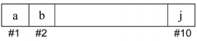

    图 5-1 散列表的例子

当需要寻找与 2 对应的字母时， 只需通过一定的函数将其映射为整数， 可以使用这样的映射函\
数 ``f(n) = n``， 那么 2 的映射值就是 2。 然后访问这片连续内存的第二个位置， 就能得\
到与 2 对应的字母 b。 

对散列表这种数据结构的采用是以加速键的搜索过程为终极目标的， 于是将原始映射为整数的过\
程对于 Python 中 ``dict`` 的实现就显得尤为关键。 用于映射的函数称为散列函数 (hash \
function)， 而映射后的值称为元素的散列值 (hash value)。 在散列表的实现中， 所选择的\
散列函数的优劣将直接决定所实现的散列表的搜索效率的高低。 

在使用散列表的过程中， 不同的对象经过散列函数的作用， 可能被映射为相同的散列值。 而且\
随着需要存储的数据的增多， 这样的冲突就会发生得越来越频繁。 散列冲突是散列技术与生俱\
来的问题。 这里需要提到散列表中与散列冲突相关的概念 - 装载率。 装载率是散列表中已使用\
空间和总空间的比值。 如果散列表一共可以容纳 10 个元素， 而当前已经装入了 6 个元素， \
那么装载率就是 6/10。 研究表明， 当散列表的装载率大于 2/3 时， 散列冲突发生得概率就\
会大大增加。 

解决散列冲突的方法： 开链法， 这是 SGI STL 中的 hash table 所采用的方法， 而 \
Python 中所采用的是开放定址法。

当产生散列冲突时， Python 会通过一个二次探测函数 f， 计算下一个候选位置 addr， 如果 \
addr 可用， 则可将待插入元素放到位置 addr； 如果位置 addr 不可用， 则 Python 会再\
次使用探测函数 f， 获得下一个候选位置， 如此不断探测总会找到一个可用位置。

通过多次探测函数 f， 从一个位置出发就可以一次到达多个位置， 这些位置就形成了一个 "\
**冲突探测链**" (或简称 **探测序列**)。 当需要删除某条探测链上的某个元素时， 问题就\
产生了， 假如这条链的首元素位置为 a， 尾元素的位置为 c， 现在需要删除中间的某个位置 \
b 上的元素。 如果直接将位置 b 上的元素删除， 则会导致探测链的断裂， 造成严重后果。 

想象一下， 在下次的搜索位置 c 的元素时， 会从位置 a 开始， 通过探测函数， 沿着探测链\
一步一步向位置 c 靠近， 但是在到达位置 b 时， 发现这个位置上的元素不属于这个探测链\
， 因此探测函数会以为探测链到此结束， 导致不能到达位置 c， 自然不能搜索到位置 c 上的\
元素， 所以结果是搜索失败。 而实际上待搜索元素确实存在于散列表中。

所以在采用开放定址的冲突解决策略的散列表中， 删除某条探测链上的元素时不能进行真正的删\
除， 而是进行一种 "**伪删除**" 操作， 必须要让该元素还存在于探测链上， 担当承前启后\
的重任。 

*******************************************************************************
5.2 PyDictObject
*******************************************************************************

5.2.1 关联容器的 entry
===============================================================================

将关联容器中的一个 (key， val) 元素对称为一个 entry 或 slot。 在 Python 中一个 \
entry 的定义如下：

.. topic:: [Include/dictobject.h]

    .. code-block:: c 

        typedef struct {
            /* Cached hash code of me_key.  Note that hash codes are C longs.
            * We have to use Py_ssize_t instead because dict_popitem() abuses
            * me_hash to hold a search finger.
            */
            Py_ssize_t me_hash;
            PyObject *me_key;
            PyObject *me_value;
        } PyDictEntry;

可以看到在 ``PyDictObject`` 中确实存放的都是 ``PyObject*``， 这也是 Python 中的 \
``dict`` 什么都能装得下的原因， 因为在 Python 中， 无论什么东西归根结底都是一个 \
``PyObject`` 对象。 

在 ``PyDictEntry`` 中， ``me_hash`` 域存储的是 ``me_key`` 的散列值， 利用一个域来\
记录这个散列值可以避免每次查询的时候都要重新计算一遍散列值。

在 Python 中一个 ``PyDictObject`` 对象生存变化的过程中， 其中的 entry 会在不同的状\
态间转换。 ``PyDictObject`` 中 entry 可以在 3 种状态间转换： **Unused** 态、 \
**Active** 态和 **Dummy** 态。

- 当一个 entry 的 ``me_key`` 和 ``me_value`` 都是 NULL 时， entry 处于 \
  **Unused** 态。 **Unused** 态表明目前该 entry 中并没有存储 (key ， value) 对， \
  而且在此之前， 也没有存储过它们。 每个 entry 在初始化的时候都会处于这种状态， 而且\
  只有在 **Unused** 态下， entry 的 ``me_key`` 域才会为 NULL。

- 当 entry 中存储一个 (key， value) 对时， entry 便转换到了 **Active** 态。 在 \
  **Active** 态下， ``me_key`` 和 ``me_value`` 都不能为 NULL。 更进一步地说， \
  ``me_key`` 不能是 dummy 对象。 

- 当 entry 中存储的 (key， value) 对被删除后， entry 的状态不能直接从 **Active** \
  态转为 **Unused** 态， 否则会导致冲突探测链的中断。 相反 entry 中的 ``me_key`` \
  将指向 dummy 对象， entry 进入 **Dummy** 态， 这就是 "伪删除" 技术。 当 Python \
  沿着某条冲突链搜索时， 如果发现一个 entry 处于 **Dummy** 态， 说明目前该 entry \
  虽然是无效的， 但是其后的 entry 可能是有效的， 是应该搜索的。 这样就保证了冲突探测\
  链的连续性。

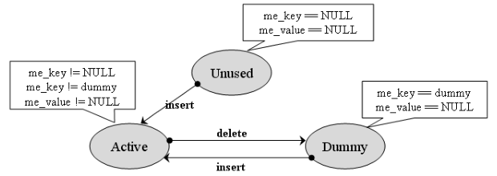

    图 5-2 PyDictObject 中 entry 的状态转换图

5.2.2 关联容器的实现
===============================================================================

在 Python 中关联容器是通过 ``PyDictObject`` 对象来实现的。 而一个 \
``PyDictObject`` 对象实际上是一大堆 entry 的集合， 总控这些集合的结构如下： 

.. topic:: [Include/dictobject.h]

    .. code-block:: c 

        #define PyDict_MINSIZE 8
        typedef struct _dictobject PyDictObject;
        struct _dictobject {
            PyObject_HEAD
            Py_ssize_t ma_fill;  /* # Active + # Dummy */
            Py_ssize_t ma_used;  /* # Active */

            /* The table contains ma_mask + 1 slots, and that's a power of 2.
            * We store the mask instead of the size because the mask is more
            * frequently needed.
            */
            Py_ssize_t ma_mask;

            /* ma_table points to ma_smalltable for small tables, else to
            * additional malloc'ed memory.  ma_table is never NULL!  This rule
            * saves repeated runtime null-tests in the workhorse getitem and
            * setitem calls.
            */
            PyDictEntry *ma_table;
            PyDictEntry *(*ma_lookup)(PyDictObject *mp, PyObject *key, long hash);
            PyDictEntry ma_smalltable[PyDict_MINSIZE];
        };

从注释中可以清楚看到 ``ma_fill`` 域中维护着从 ``PyDictObject`` 对象创建开始直到现\
在， 曾经及正处于 **Active** 态的 entry 个数， 而 ``ma_used`` 则维护者当前正处于 \
**Active** 态的 entry 的数量。 

在 ``PyDictObject`` 定义的最后， 有一个名为 ``ma_smalltable`` 的 \
``PyDictEntry`` 数组。 这个数组意味着当创建一个 ``PyDictObject`` 对象时， 至少有 \
``PyDict_MINSIZE`` 个 entry 被同时创建。 在 **dictobject.h** 中， 这个值被设定为 \
8， 这个值被认为是通过大量的实验得出的最佳值。 既不会太浪费内存空间， 又能很好地满足 \
Python 内部大量使用 ``PyDictObject`` 的环境需求， 不需要在使用的过程中再次调用 \
``malloc`` 申请内存空间。

``PyDictObject`` 中的 ``ma_table`` 域是关联对象的关键所在， 这个类型为 \
``PyDictEntry*`` 的变量指向一片作为 ``PyDictEntry`` 集合的内存的开始位置。 当一个 \
``PyDictObject`` 对象是一个比较小的 ``dict`` 时， 即 entry 数量少于 8 个， \
``ma_table`` 域将指向 ``ma_smalltable`` 这个与生俱来的 8 个 entry 的起始地址。 \
当 ``PyDictObject`` 中 entry 数量大于 8 个时， Python 认为是一个大 ``dict`` 将会\
申请额外的内存空间， 并将 ``ma_table`` 指向这块空间。 无论何时 ``ma_table`` 域都不\
会为 NULL， 总是有效的。 

下图分别显示了 Python 中的 "大" ， "小" 两种 dict:

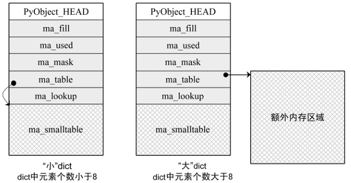

    图 5-3 PyDictObject 中 ma_table 的两种可能状态

最后 ``PyDictObject`` 中的 ``ma_mask`` 实际上记录了一个 ``PyDictObject`` 对象中\
所拥有的 entry 的数量。 

*******************************************************************************
5.3 PyDictObject 的创建和维护
*******************************************************************************

5.3.1 PyDictObject 对象创建
===============================================================================

Python 内部通过 ``PyDict_New`` 来创建一个新的 ``dict`` 对象。 

.. code-block:: c 

    typedef PyDictEntry dictentry;
    typedef PyDictObject dictobject;

    #define INIT_NONZERO_DICT_SLOTS(mp) do {				\
      (mp)->ma_table = (mp)->ma_smalltable;				\
      (mp)->ma_mask = PyDict_MINSIZE - 1;				\
        } while(0)

    #define EMPTY_TO_MINSIZE(mp) do {					\
      memset((mp)->ma_smalltable, 0, sizeof((mp)->ma_smalltable));	\
      (mp)->ma_used = (mp)->ma_fill = 0;				\
      INIT_NONZERO_DICT_SLOTS(mp);					\
        } while(0)

    PyObject *
    PyDict_New(void)
    {
      register dictobject *mp;
      //[1] : 自动创建 dummy 对象
      if (dummy == NULL) { /* Auto-initialize dummy */
        dummy = PyString_FromString("<dummy key>");
        if (dummy == NULL)
          return NULL;
    #ifdef SHOW_CONVERSION_COUNTS
        Py_AtExit(show_counts);
    #endif
      }
      if (num_free_dicts) {
        // [2]: 使用缓冲池
        mp = free_dicts[--num_free_dicts];
        assert (mp != NULL);
        assert (mp->ob_type == &PyDict_Type);
        _Py_NewReference((PyObject *)mp);
        if (mp->ma_fill) {
          EMPTY_TO_MINSIZE(mp);
        }
        assert (mp->ma_used == 0);
        assert (mp->ma_table == mp->ma_smalltable);
        assert (mp->ma_mask == PyDict_MINSIZE - 1);
      } else {
        // [3]: 创建 PyDictObject 对象
        mp = PyObject_GC_New(dictobject, &PyDict_Type);
        if (mp == NULL)
          return NULL;
        EMPTY_TO_MINSIZE(mp);
      }
      mp->ma_lookup = lookdict_string;
    #ifdef SHOW_CONVERSION_COUNTS
      ++created;
    #endif
      _PyObject_GC_TRACK(mp);
      return (PyObject *)mp;
    }

第一次调用 ``PyDict_New`` 时， 在代码 [1] 处会创建前文中的 dummy 对象。 它是一个 \
``PyStringObject`` 对象， 实际上用来作为一种指示标志， 表明该 entry 曾被使用过， \
且探测序列下一个位置的 entry 有可能是有效的， 从而防止探测序列中断。 

从 ``num_free_dicts`` 可以看出 Python 中 ``dict`` 的实现同样适用了缓冲池。 

如果 ``PyDictObject`` 对象的缓冲池不可用， 那么 Python 将首先从系统堆中为新的 \
``PyDictObject`` 对象申请合适的内存空间， 然后通过两个宏完成对新生的 \
``PyDictObject`` 对象的初始化工作：

- ``EMPTY_TO_MINSIZE``: 将 ``ma_smalltable`` 清零， 同时设置 ``ma_size`` 和 \
  ``ma_fill``， 当然在一个 ``PyDictObject`` 对象刚被创建的时候， 这两个变量都应该\
  是 0。

- ``INIT_NONZERO_DICT_SLOTS``: 将 ``ma_table`` 指向 ``ma_smalltable``， 并设置 \
  ``ma_mask`` 为 7。

``ma_mask`` 的初始化值为 ``PyDict_MINSIZE - 1``， 确实与一个 ``PyDictObject`` 对\
象中的 entry 的数量有关。 在创建过程的最后， 将 ``lookdict_string`` 赋给 \
``ma_lookup``。 正是 ``ma_lookup`` 指向了 ``PyDictObject`` 在 entry 集合中搜索某\
一特定 entry 时需要进行的动作， 在 ``ma_lookup`` 中包含了散列函数和发生冲突时二次探\
测函数的具体实现， 它是 ``PyDictObject`` 的搜索策略。 

5.3.2 PyDictObject 中的元素搜索
===============================================================================

Python 为 ``PyDictObject`` 对象提供了两种搜索策略， ``lookdict`` 和 \
``lookdict_string``。 实际上这两种策略使用的是相同的算法， ``lookdict_string`` 只\
是 ``lookdict`` 的一种针对 ``PyStringObject`` 对象的特殊形式。 \
``PyStringObject`` 对象作为 ``PyDictObject`` 对象中 entry 的键在 Python 中很广泛\
， 所以 ``lookdict_string`` 也就成为 ``PyDictObject`` 创建时默认采用的搜索策略。 

首先分析一下通用搜索策略 ``lookdict``， 一旦清晰地了解了通用搜索策略， \
``lookdict_string`` 也就一目了然。 

.. topic:: 代码清单 5-2 [Objects/dictobject.c]

    .. code-block:: c 

        static dictentry *
        lookdict(dictobject *mp, PyObject *key, register long hash)
        {
            register size_t i;
            register size_t perturb;
            register dictentry *freeslot;
            register size_t mask = (size_t)mp->ma_mask;
            dictentry *ep0 = mp->ma_table;
            register dictentry *ep;
            register int cmp;
            PyObject *startkey;
            // [1]: 散列， 定位冲突探测链的第一个entry
            i = (size_t)hash & mask;
            ep = &ep0[i];

            // [2]:
            // 1. entry处于 Unused 态
            // 2. entry中的key与待搜索的key匹配
            if (ep->me_key == NULL || ep->me_key == key)
                return ep;

            // [3]: 第一个 entry 处于 Dummy 态 ， 设置 freeslot
            if (ep->me_key == dummy)
                freeslot = ep;
            else {
                // [4]： 检查 Active 态 entry 
                if (ep->me_hash == hash) {
                startkey = ep->me_key;
                cmp = PyObject_RichCompareBool(startkey, key, Py_EQ);
                if (cmp < 0)
                    return NULL;
                if (ep0 == mp->ma_table && ep->me_key == startkey) {
                    if (cmp > 0)
                    return ep;
                }
                else {
                    /* The compare did major nasty stuff to the
                    * dict:  start over.
                    * XXX A clever adversary could prevent this
                    * XXX from terminating.
                    */
                    return lookdict(mp, key, hash);
                }
                }
                freeslot = NULL;
            }

            /* In the loop, me_key == dummy is by far (factor of 100s) the
                least likely outcome, so test for that last. */
            for (perturb = hash; ; perturb >>= PERTURB_SHIFT) {
                i = (i << 2) + i + perturb + 1;
                ep = &ep0[i & mask];
                if (ep->me_key == NULL)
                return freeslot == NULL ? ep : freeslot;
                if (ep->me_key == key)
                return ep;
                if (ep->me_hash == hash && ep->me_key != dummy) {
                startkey = ep->me_key;
                cmp = PyObject_RichCompareBool(startkey, key, Py_EQ);
                if (cmp < 0)
                    return NULL;
                if (ep0 == mp->ma_table && ep->me_key == startkey) {
                    if (cmp > 0)
                    return ep;
                }
                else {
                    /* The compare did major nasty stuff to the
                    * dict:  start over.
                    * XXX A clever adversary could prevent this
                    * XXX from terminating.
                    */
                    return lookdict(mp, key, hash);
                }
                }
                else if (ep->me_key == dummy && freeslot == NULL)
                freeslot = ep;
            }
        }

这里列出的只是 Python 对冲突链上第一个 entry 所进行的动作。 ``PyDictObject`` 中维\
护的 entry 的数量是有限的， 而传入 ``lookdict`` 中的 key 的 hash 值却并不一定会在\
这个范围内， 所以这就要求 ``lookdict`` 将 hash 值映射到某个 entry 上去。 \
``lookdict`` 采取的策略很简单， 直接将 hash 值与 entry 的数量做一个与操作， 结果自\
然落到 entry 的数量之下。 代码 [1] 处实现了这个过程， 由于 ``ma_mask`` 会被用来进行\
大量的与操作， 所以这个与 entry 数量相关的变量被命名为 ``ma_mask`` 而不是 \
``ma_size``。 

无论是 ``lookdict_string`` 还是 ``lookdict`` 都不会返回 NULL， 如果在 \
``PyDictObject`` 中搜索不到待查找的 key， 同样会返回一个 entry， 这个 entry 的 \
``me_value`` 为 NULL。 这个 entry 指示搜索失败， 而且该 entry 是一个空闲的 entry\
， 马上就可以被 Python 所使用。 

在搜索的过程中， 代码 [3] 处所操纵的 ``freeslot`` 是一个重要的变量。 如果在探测链中\
的某个位置上， entry 处于 **Dummy** 态， 那么如果在这个序列中搜索不成功， 就会返回\
这个处于 **Dummy** 态的 entry。 处于 **Dummy** 态的 entry 其 ``me_value`` 是为 \
NULL， 所以这个返回结果指示了搜索失败； 同时返回的 entry 也是一个可以立即被使用的 \
entry， 因为 **Dummy** 态的 entry 并没有维护一个有效的 (key， value) 对。 这个 \
``freeslot`` 是用来指向探测链序列中第一个处于 **Dummy** 态的 entry， 如果搜索失败 \
``freeslot`` 就会提供一个指示失败并立即可用的 entry。 如果探测链序列中并没有 \
**Dummy** 态 entry， 搜索失败时一定是在一个处于 **Unused** 态的 entry 上结束搜索过\
程的， 这时会返回这个处于 **Unused** 态的 entry， 同样是一个能指示失败且立即可用的 \
entry。 

在 Python 的 ``dict`` 中， "相同" 实际上包含两层含义： 

1. 引用相同；

#. 值相同。

``dict`` 正是建立在这两层含义之上的。 引用相同是指两个符号引用的是内存中的同一个地址\
， 这个检查是代码 [2] 处的 ``ep->me_key == key`` 所完成的； 而所谓的值相同是说两\
个 ``PyObject*`` 指针实际上指向了不同的对象， 即内存中的不同的位置， 但是两个对象的\
值相同。

例如在整数对象中， 小整数对象是共享的， 而大整数对象并不是共享的， 当多次创建相同的大\
整数时， 虽然值相同但创建的是不同的对象：

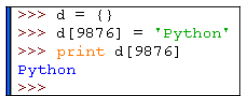

    图 5-4 在 dict 中搜索整数

这里出现了两个整数对象 9876，在第三行调用 ``print d[9876]`` 时，Python 会首先到 d \
中搜索键为 9876 的 entry。 显然， 在 ``lookdict`` 中， 代码清单 5-2 的代码 [2] 处\
的引用相同检查是不会成功的， 但这并不意味着该 entry 不存在， 因为在图 5-4 中可以看到\
， 这个 entry 明明是存在的。 这就是 “值相同” 这条规则存在的意义。

在 ``lookdict`` 中， 代码清单 5-2 的代码 [4] 处完成了两个 key 的值检查。 值检查的\
过程首先会检查两个对象的 hash 值是否相同， 如果不相同， 则其值也一定不相同， 不用再\
继续下去了； 而如果 hash 值相等， 那么 Python 将通过 \
``PyObject_RichCompareBool`` 进行比较， 其原型为： 

.. topic:: [Objects/object.c]

    .. code-block:: c

        /* Return -1 if error; 1 if v op w; 0 if not (v op w). */
        int
        PyObject_RichCompareBool(PyObject *v, PyObject *w, int op)
        {
            PyObject *res;
            int ok;

            /* Quick result when objects are the same.
            Guarantees that identity implies equality. */
            if (v == w) {
            if (op == Py_EQ)
                return 1;
            else if (op == Py_NE)
                return 0;
            }

            res = PyObject_RichCompare(v, w, op);
            if (res == NULL)
            return -1;
            if (PyBool_Check(res))
            ok = (res == Py_True);
            else
            ok = PyObject_IsTrue(res);
            Py_DECREF(res);
            return ok;
        }

这是 Python 提供的一个相当典型的比较操作， 可以自己指定比较操作的类型， 当 \
``(v op w)`` 成立时， 返回 1； 当 ``(v op w)`` 不成立时， 返回 0； 如果在比较中发\
生错误， 则返回 -1。 在代码清单 5-2 的 [4] 处， ``lookdict`` 指定了 ``Py_EQ``， \
这将指示 ``PyObject_RichCompareBool`` 进行相等比较操作。

总结一下 ``lookdict`` 中进行第一次检查时所进行的主要动作， 如代码清单 5-2 中的代码 \
[1]、 [2]、 [3]、 [4] 所示。

[1] 根据 hash 值获得 entry 的索引， 这是冲突探测链上第一个 entry 的索引。

[2] 在两种情况下， 搜索结束：
  - entry 处于 Unused 态， 表明冲突探测链搜索完成， 搜索失败；
  - ``ep->me_key == key``， 表明 entry 的 key 与待搜索的 key 匹配， 搜索成功。

[3] 若当前 entry 处于 **Dummy** 态， 设置 freeslot。

[4] 检查 **Active** 态 entry 中的 key 与待查找的 key 是否“值相同”， 若成立， 搜索\
成功。

根据 hash 值获得的冲突探测链上第一个 entry 与待查找的元素的比较。 实际上， 由于 \
entry 对应于某一个散列值， 几乎都有一个冲突探测链与之对应， 所以现在只是考察了所有候\
选 entry 中的第一个 entry， 万里长征仅仅迈出了第一步。

如果冲突探测链上第一个 entry 的 key 与待查找的 key 不匹配， 那么很自然地， \
``lookdict`` 会沿着探测链， 顺藤摸瓜， 依次比较探测链上的 entry 与待查找的 key \
（见代码清单 5-3）。

.. topic:: 代码清单 5-3 [Objects/dictobject.c]

    .. code-block:: c

        static dictentry *
        lookdict(dictobject *mp, PyObject *key, register long hash)
        {
            register size_t i;
            register size_t perturb;
            register dictentry *freeslot;
            register size_t mask = (size_t)mp->ma_mask;
            dictentry *ep0 = mp->ma_table;
            register dictentry *ep;
            register int cmp;
            PyObject *startkey;

            i = (size_t)hash & mask;
            ep = &ep0[i];
            if (ep->me_key == NULL || ep->me_key == key)
                return ep;

            if (ep->me_key == dummy)
                freeslot = ep;
            else {
                if (ep->me_hash == hash) {
                    startkey = ep->me_key;
                    cmp = PyObject_RichCompareBool(startkey, key, Py_EQ);
                    if (cmp < 0)
                        return NULL;
                    if (ep0 == mp->ma_table && ep->me_key == startkey) {
                        if (cmp > 0)
                            return ep;
                    }
                    else {
                        /* The compare did major nasty stuff to the
                        * dict:  start over.
                        * XXX A clever adversary could prevent this
                        * XXX from terminating.
                        */
                        return lookdict(mp, key, hash);
                    }
                }
                freeslot = NULL;
            }

            /* In the loop, me_key == dummy is by far (factor of 100s) the
                least likely outcome, so test for that last. */
            //[5]：寻找探测链上下一个 entry
            for (perturb = hash; ; perturb >>= PERTURB_SHIFT) {
                i = (i << 2) + i + perturb + 1;
                ep = &ep0[i & mask];
                //[6]：到达 Unused 态 entry，搜索失败
                if (ep->me_key == NULL)
                    return freeslot == NULL ? ep : freeslot;
                //[7]：检查“引用相同”是否成立
                if (ep->me_key == key)
                    return ep;
                //[8]：检查“值相同”是否成立
                if (ep->me_hash == hash && ep->me_key != dummy) {
                    startkey = ep->me_key;
                    cmp = PyObject_RichCompareBool(startkey, key, Py_EQ);
                    if (cmp < 0)
                        return NULL;
                    if (ep0 == mp->ma_table && ep->me_key == startkey) {
                        if (cmp > 0)
                            return ep;
                    }
                    else {
                        /* The compare did major nasty stuff to the
                        * dict:  start over.
                        * XXX A clever adversary could prevent this
                        * XXX from terminating.
                        */
                        return lookdict(mp, key, hash);
                    }
                }
                //[9]: 设置 freeslot
                else if (ep->me_key == dummy && freeslot == NULL)
                    freeslot = ep;
            }
        }

上文已经清楚地了解了 ``lookdict`` 检查冲突探测链上的第一个 entry 时所进行的动作， \
其实对探测链上的其他 entry 也将进行同样的动作， 对第一个 entry 和其他 entry 的检查\
本质上是一样的， 我们看一看在遍历探测链时发生 ``lookdict`` 所进行的操作， 如代码清\
单 5-3 中的[5]、[6]、[7]、[8]、[9]所示。

[5] 根据 Python 所采用的探测函数， 获得探测链中的下一个待检查的 entry。

[6] 检查到一个 **Unused** 态 entry， 表明搜索失败， 这时有两种结果：
  - 如果 ``freeslot`` 不为空， 则返回 ``freeslot`` 所指 entry；
  - 如果 ``freeslot`` 为空， 则返回该 ``Unused`` 态 entry。

[7] 检查 entry 中的 key 与待查找的 key 是否符合 “引用相同” 规则。

[8] 检查 entry 中的 key 与待查找的 key 是否符合 “值相同” 规则。

[9] 在遍历过程中，如果发现 **Dummy** 态 entry， 且 ``freeslot`` 未设置， 则设置 \
``freeslot``。

需要特别注意的是， 如果搜索成功， 那么 ``ep`` 一定指向一个有效的 entry， 直接返回这\
个 entry 即可； 如果搜索失败， 那么此时 ``ep`` 指向一个 **Unused** 态的 entry， 不\
能直接返回该 entry， 因为有可能在遍历的过程中， 已经发现了一个 **Dummy** 态 entry\
， 这个 entry 实际是一个空闲的 entry， 可以被 Python 使用， 所以在代码清单 5-3 的 \
[6] 处， 我们会检查当前 ``freeslot`` 是否已经被设置， 如果被设置， 则不会返回 \
**Dummy** 态 entry， 而是需要返回 ``freeslot`` 所指向的 entry。

到这里， 我们已经清晰地了解了 ``PyDictObject`` 中的搜索策略， 现在可以来看一看 \
Python 在 ``PyDict_New`` 中为 ``PyDictObject`` 对象提供的默认搜索策略了 （见代码\
清单 5-4）。

.. topic:: 代码清单 5-4 [Objects/dictobject.c]
    
    .. code-block:: c

        static dictentry *
        lookdict_string(dictobject *mp, PyObject *key, register long hash)
        {
            register size_t i;
            register size_t perturb;
            register dictentry *freeslot;
            register size_t mask = (size_t)mp->ma_mask;
            dictentry *ep0 = mp->ma_table;
            register dictentry *ep;

            /* Make sure this function doesn't have to handle non-string keys,
            including subclasses of str; e.g., one reason to subclass
            strings is to override __eq__, and for speed we don't cater to
            that here. */

            // [0]：选择搜索策略
            if (!PyString_CheckExact(key)) {
        #ifdef SHOW_CONVERSION_COUNTS
                ++converted;
        #endif
                mp->ma_lookup = lookdict;
                return lookdict(mp, key, hash);
            }
            //搜索第一阶段：检查冲突链上第一个 entry
            //[1]：散列，定位冲突探测链的第一个 entry
            i = hash & mask;
            ep = &ep0[i];
            //[2]：
            //1. entry 处于 Unused 态
            //2. entry 中的 key 与待搜索的 key 匹配
            if (ep->me_key == NULL || ep->me_key == key)
                return ep;
            //[3]：第一个 entry 处于 Dummy 态，设置 freeslot
            if (ep->me_key == dummy)
                freeslot = ep;
            else {
                //[4]: 检查 Active 态 entry
                if (ep->me_hash == hash && _PyString_Eq(ep->me_key, key))
                    return ep;
                freeslot = NULL;
            }

            /* In the loop, me_key == dummy is by far (factor of 100s) the
            least likely outcome, so test for that last. */
            //搜索第二阶段：遍历冲突链，检查每一个 entry
            for (perturb = hash; ; perturb >>= PERTURB_SHIFT) {
                i = (i << 2) + i + perturb + 1;
                ep = &ep0[i & mask];
                if (ep->me_key == NULL)
                    return freeslot == NULL ? ep : freeslot;
                if (ep->me_key == key
                    || (ep->me_hash == hash
                        && ep->me_key != dummy
                    && _PyString_Eq(ep->me_key, key)))
                    return ep;
                if (ep->me_key == dummy && freeslot == NULL)
                    freeslot = ep;
            }
        }

正如前面所说， ``lookdict_string`` 是一种有条件限制的搜索策略。 \
``lookdict_string`` 背后有一个假设， 即待搜索的 ``key`` 是一个 \
``PyStringObject`` 对象。 只有在这种假设成立的情况下， ``lookdict_string`` 才会被\
使用。 需要特别注意的是， 这里只对需要搜索的 ``key`` 进行了假设， 没有对参与搜索的 \
``dict`` 做出任何的假设。 这就意味着， 即使参与搜索的 ``dict`` 中所有 entry 的 \
``key`` 都是 ``PyIntObject`` 对象， 只要待搜索的 ``key`` 是 ``PyStringObject`` \
对象， 都会采用 ``lookdict_string`` 进行搜索， ``_PyString_Eq`` 将保证能正确处理\
非 ``PyStringObject*`` 参数。

在代码清单 5-4 的 [0] 处， ``lookdict_string`` 首先会对这种假设进行确定， 检查需要\
搜索的 ``key`` 是否严格对应一个 ``PyStringObject`` 对象， 只有在检查通过后， 才会\
进行下面的动作； 如果检查不通过， 那么就会转向 ``PyDictObject`` 中的通用搜索策略 \
``lookdict``。

``lookdict_string`` 实际上就是一个 ``lookdict`` 对于 ``PyStringDict`` 对象的优化\
版本。  在 ``lookdict`` 中有许多捕捉错误并处理错误的代码， 因为 ``lookdict`` 面对\
的是 ``PyObject*``， 所以会出现很多意外情况。 而在 ``lookdict_string`` 中， 完全没\
有了这些处理错误的代码。 而另一方面， 在 ``lookdict`` 中， 使用的是非常通用的 \
``PyObject_RichCompareBool``， 而 ``lookdict_string`` 使用的是 ``_PyString_Eq``\
， 要简单很多， 这些因素使得 ``lookdict_string`` 的搜索效率要比 ``lookdict`` 高很\
多。

Python 自身大量使用了 ``PyDictObject`` 对象， 用来维护一个名字空间中变量名和变量值\
之间的对应关系， 或是用来在为函数传递参数时维护参数名与参数值的对应关系。 这些对象几\
乎都是用 ``PyStringObject`` 对象作为 entry 中的 key， 所以 ``lookdict_string`` \
的意义就显得非常重要了， 它对 Python 整体的运行效率都有着重要的影响。

5.3.3 插入与删除
===============================================================================

``PyDictObject`` 对象中元素的插入动作建立在搜索的基础之上， 理解了 \
``PyDictObject`` 对象中的搜索策略， 对于插入动作也就很容易理解了 （见代码清单 5-5）。

.. topic:: 代码清单 5-5 [Objects/dictobject.c]
    
    .. code-block:: c

        static int
        insertdict(register dictobject *mp, PyObject *key, long hash, PyObject *value)
        {
            PyObject *old_value;
            register dictentry *ep;
            typedef PyDictEntry *(*lookupfunc)(PyDictObject *, PyObject *, long);

            assert(mp->ma_lookup != NULL);
            ep = mp->ma_lookup(mp, key, hash);
            if (ep == NULL) {
                Py_DECREF(key);
                Py_DECREF(value);
                return -1;
            }
            //[1]：搜索成功
            if (ep->me_value != NULL) {
                old_value = ep->me_value;
                ep->me_value = value;
                Py_DECREF(old_value); /* which **CAN** re-enter */
                Py_DECREF(key);
            }
            //[2]：搜索失败
            else {
                if (ep->me_key == NULL)
                    mp->ma_fill++;
                else {
                    assert(ep->me_key == dummy);
                    Py_DECREF(dummy);
                }
                ep->me_key = key;
                ep->me_hash = (Py_ssize_t)hash;
                ep->me_value = value;
                mp->ma_used++;
            }
            return 0;
        }

前面提到， 搜索操作在成功时， 返回相应的处于 **Active** 态的 entry， 而在搜索失败时\
会返回两种不同的结果： 一是处于 **Unused** 态的 entry； 二是处于 **Dummy** 态的 \
entry。 那么插入操作对应不同的 entry， 所需要进行的动作显然也是不一样的。 对于 \
**Active** 的 entry， 只需要简单地替换 ``me_value`` 值就可以了； 而对于 \
**Unused** 或 **Dummy** 的 entry， 则需要完整地设置 ``me_key``， ``me_hash`` 和 \
``me_value``。 在 ``insertdict`` 中， 正是根据搜索的结果采取了不同的动作， 如代码\
清单 5-5 中的 [1]、 [2] 所示。

[1] 搜索成功， 返回处于 **Active** 的 entry， 直接替换 ``me_value``；

[2] 搜索失败， 返回 **Unused** 或 **Dummy** 的 entry， 完整设置 ``me_key``、 \
``me_hash`` 和 ``me_value``。

在 Python 中， 对 ``PyDictObject`` 对象插入或设置元素有两种情况， 如下面的代码所示：

.. code-block:: python

    d = {}
    d[1] = 1
    d[1] = 2

第二行 Python 代码是在 ``PyDictObject`` 对象中没有这个 entry 的情况下插入元素， 第\
三行是在 ``PyDictObject`` 对象中已经有这个 entry 的情况下重新设置元素。 可以看到， \
``insertdict`` 完全可以适应这两种情况， 在 ``insertdict`` 中， 代码清单 5-5 的 \
[2] 处理第二行 Python 代码， 代码清单 5-5 的 [1] 处理第三行 Python 代码。 实际上\
， 这两行 Python 代码也确实都调用了 ``insertdict``。

当这两行设置 ``PyDictObject`` 对象元素的 Python 代码被 Python 虚拟机执行时， 并不\
是直接就调用 ``insertdict``， 因为观察代码可以看到， ``insertdict`` 需要一个 hash \
值作为调用参数， 那这个 hash 值是在什么地方获得的呢？ 实际上， 在调用 \
``insertdict`` 之前， 还会调用 ``PyDict_SetItem`` （见代码清单 5-6）。

.. topic:: 代码清单 5-6 [Objects/dictobject.c]

    .. code-block:: c

        int
        PyDict_SetItem(register PyObject *op, PyObject *key, PyObject *value)
        {
            register dictobject *mp;
            register long hash;
            register Py_ssize_t n_used;

            if (!PyDict_Check(op)) {
                PyErr_BadInternalCall();
                return -1;
            }
            assert(key);
            assert(value);
            mp = (dictobject *)op;
            //[1]：计算 hash 值
            if (PyString_CheckExact(key)) {
                hash = ((PyStringObject *)key)->ob_shash;
                if (hash == -1)
                    hash = PyObject_Hash(key);
            }
            else {
                hash = PyObject_Hash(key);
                if (hash == -1)
                    return -1;
            }
            //[2]：插入(key, value)元素对
            assert(mp->ma_fill <= mp->ma_mask);  /* at least one empty slot */
            n_used = mp->ma_used;
            Py_INCREF(value);
            Py_INCREF(key);
            if (insertdict(mp, key, hash, value) != 0)
                return -1;
            /* If we added a key, we can safely resize.  Otherwise just return!
            * If fill >= 2/3 size, adjust size.  Normally, this doubles or
            * quaduples the size, but it's also possible for the dict to shrink
            * (if ma_fill is much larger than ma_used, meaning a lot of dict
            * keys have been * deleted).
            *
            * Quadrupling the size improves average dictionary sparseness
            * (reducing collisions) at the cost of some memory and iteration
            * speed (which loops over every possible entry).  It also halves
            * the number of expensive resize operations in a growing dictionary.
            *
            * Very large dictionaries (over 50K items) use doubling instead.
            * This may help applications with severe memory constraints.
            */
            //[3]：必要时调整 dict 的内存空间
            if (!(mp->ma_used > n_used && mp->ma_fill*3 >= (mp->ma_mask+1)*2))
                return 0;
            return dictresize(mp, (mp->ma_used > 50000 ? 2 : 4) * mp->ma_used);
        }

在 ``PyDict_SetItem`` 中， 会首先在代码清单 5-6 的 [1] 处获得 key 的 hash 值， 在\
上面的例子中， 也就是一个 ``PyIntObject`` 对象 1 的 hash 值。 然后代码清单 [2] 处\
通过 ``insertdict`` 进行元素的插入或设置。

``PyDict_SetItem`` 在插入或设置元素的动作结束之后， 并不会草草返回了事。 接下来它会\
检查是否需要改变 ``PyDictObject`` 内部 ``ma_table`` 所维护的内存区域的大小， 在以\
后的叙述中将这块内存称为 "table"。 那么什么时候需要改变 table 的大小呢？ 在前面说过\
， 如果 table 的装载率大于 2/3 时， 后续的插入动作遭遇到冲突的可能性会非常大。 所以\
装载率是否大于或等于 2/3 就是判断是否需要改变 table 大小的准则。

上述代码中的:

.. code-block:: c

    if (!(mp->ma_used > n_used && mp->ma_fill*3 >= (mp->ma_mask+1)*2))
        return 0;

经过转换， 实际上可以得到：

.. code-block:: c

    (mp->ma_fill)/(mp->ma_mask+1) >= 2/3

这个等式左边的表达式正是装载率。 然而装载率只是判定是否需要改变 table 大小的一个标准\
， 还有另一个标准是在 ``insertdict`` 的过程中， 是否使用了一个处于 **Unused** 态\
或 **Dummy** 态的 entry。 前面说过在搜索失败时， 会返回一个 **Dummy** 态或 \
**Unused** 态的 entry， ``insertdict`` 会对这个 entry 进行填充。 只有当这种情况发\
生并且装载率超标时， 才会进行改变 table 大小的动作。 而判断在 ``insertdict`` 的过程\
中是否填充了 **Unused** 态或 **Dummy** 态 entry， 是通过下面的条件判断完成的：

.. code-block:: c

    mp->ma_used > n_used

其中的 ``n_used`` 就是进行 ``insertdict`` 操作之前的 ``mp->ma_used``。 通过观察 \
``mp->ma_used`` 是否改变， 就可以知道是否有 **Unused** 态或 **Dummy** 态的 entry \
被填充。 在改变 table 时， 并不一定是增加 table 的大小， 同样也可能是减小 table 的\
大小。 更改 table 的大小时， 新的 table 的空间为：

.. code-block:: c

    mp->ma_used*(mp->ma_used>50000 ? 2 : 4)

如果一个 ``PyDictObject`` 对象的 table 中只有几个 entry 处于 **Active** 态， 而大\
多数 entry 都处于 **Dummy** 态， 那么改变 table 大小的结果显然就是减小了 table 的\
空间大小。

在确定新的 table 的大小时， 通常选用的策略是新的 table 中 entry 的数量是现在 \
table 中 **Active** 态 entry 数量的 4 倍， 选用 4 倍是为了使 table 中处于 \
**Active** 态的 entry 的分布更加稀疏， 减少插入元素时的冲突概率。 当然这是以内存空\
间为代价的。 由于机器的内存是有限的， Python 总不能在任何时候都要求 4 倍空间， 所以\
当 table 中 **Active** 态的 entry 数量非常大时， Python 只会要求 2 倍的空间， 这次\
又是以执行速度来交换内存空间。 Python 2.5 将这个 “非常大” 的标准划定在 50000。 如此\
一来， 各得其所， 万事大吉。

至于具体改变 table 大小的重任， 则交到了 ``dictresize`` 一人的肩上 （见代码清单 \
5-7）。

.. topic:: 代码清单 5-7 [Objects/dictobject.c]

    .. code-block:: c

        static int
        dictresize(dictobject *mp, Py_ssize_t minused)
        {
            Py_ssize_t newsize;
            dictentry *oldtable, *newtable, *ep;
            Py_ssize_t i;
            int is_oldtable_malloced;
            dictentry small_copy[PyDict_MINSIZE];

            assert(minused >= 0);

            /* Find the smallest table size > minused. */
            //[1]：确定新的 table 的大小
            for (newsize = PyDict_MINSIZE;
                newsize <= minused && newsize > 0;
                newsize <<= 1)
                ;
            if (newsize <= 0) {
                PyErr_NoMemory();
                return -1;
            }

            /* Get space for a new table. */
            oldtable = mp->ma_table;
            assert(oldtable != NULL);
            is_oldtable_malloced = oldtable != mp->ma_smalltable;

            //[2]: 新的 table 可以使用 mp->ma_smalltable
            if (newsize == PyDict_MINSIZE) {
                /* A large table is shrinking, or we can't get any smaller. */
                newtable = mp->ma_smalltable;
                if (newtable == oldtable) {
                    if (mp->ma_fill == mp->ma_used) {
                        /* No dummies, so no point doing anything. */
                        //没有任何 Dummy 态 entry,直接返回
                        return 0;
                    }
                    /* We're not going to resize it, but rebuild the
                    table anyway to purge old dummy entries.
                    Subtle:  This is *necessary* if fill==size,
                    as lookdict needs at least one virgin slot to
                    terminate failing searches.  If fill < size, it's
                    merely desirable, as dummies slow searches. */
                    assert(mp->ma_fill > mp->ma_used);
                    //将旧 table 拷贝，进行备份
                    memcpy(small_copy, oldtable, sizeof(small_copy));
                    oldtable = small_copy;
                }
            }
            //[3]: 新的 table 不能使用 mp->ma_smalltable，需要在系统堆上申请
            else {
                newtable = PyMem_NEW(dictentry, newsize);
                if (newtable == NULL) {
                    PyErr_NoMemory();
                    return -1;
                }
            }

            /* Make the dict empty, using the new table. */
            assert(newtable != oldtable);
            //[4]：设置新 table
            mp->ma_table = newtable;
            mp->ma_mask = newsize - 1;
            memset(newtable, 0, sizeof(dictentry) * newsize);
            mp->ma_used = 0;
            i = mp->ma_fill;
            mp->ma_fill = 0;

            /* Copy the data over; this is refcount-neutral for active entries;
            dummy entries aren't copied over, of course */
            //[5]：处理旧 table 中的 entry：
            // 1、Active 态 entry，搬移到新 table 中
            // 2、Dummy 态 entry，调整 key 的引用计数，丢弃该 entry
            for (ep = oldtable; i > 0; ep++) {
                if (ep->me_value != NULL) {	/* active entry */
                    --i;
                    insertdict_clean(mp, ep->me_key, (long)ep->me_hash,
                            ep->me_value);
                }
                else if (ep->me_key != NULL) {	/* dummy entry */
                    --i;
                    assert(ep->me_key == dummy);
                    Py_DECREF(ep->me_key);
                }
                /* else key == value == NULL:  nothing to do */
            }
            //[6]：必要时释放旧 table 所维护的内存空间
            if (is_oldtable_malloced)
                PyMem_DEL(oldtable);
            return 0;
        }

在改变 dict 的内存空间时所发生的动作， 如代码清单 5-7 中的 [1]、 [2]、 [3]、 [4]\
、 [5]、 [6] 所示。

[1] ``dictresize`` 首先会确定新的 table 的大小， 很显然， 这个大小一定要大于传入的\
参数 ``minused``， 这个 ``minused`` 在前面已经看到了， 这是 Python 在调用 \
``dictresize`` 时要求 ``dictresize`` 必须保证的内存空间， 只许超出， 不许偷工减料\
。 ``dictresize`` 从 8 开始， 以指数方式增加大小， 直到超过了 ``minused`` 为止。 \
所以实际上新的 table 的大小在大多数情况下至少是原来 table 中 **Active** 态 entry \
数量的 4 倍。

[2]、 [3] 如果在代码清单 5-7 的 [1] 中获得的新的 table 大小为 8， 则不需要在堆上分\
配空间， 直接使用 ``ma_smalltable`` 就可以了； 否则， 则需要在堆上分配空间。

[4] 对新的 table 进行初始化， 并调整原来 ``PyDictObject`` 对象中用于维护 table 使\
用情况的变量。

[5] 对原来 table 中的非 **Unused** 态 entry 进行处理。 对于 **Active** 态 entry\
， 显然需要将其插入到新的 table 中， 这个动作由前面考察过的 ``insertdict`` 完成； \
而对于 **Dummy** 态的 entry， 则将该 entry 丢弃， 当然要调整 entry 中 key 的引用计\
数。 之所以能将 **Dummy** 态 entry 丢弃， 是因为 **Dummy** 态 entry 存在的唯一理由\
就是为了不使搜索时的探测链中断。 现在所有 **Active** 态的 entry 都重新依次插入新的 \
table 中， 它们会形成一条新的探测序列， 不再需要这些 **Dummy** 态的 entry 了。

[6] 如果之前旧的 table 指向了一片系统堆中的内存空间， 那么我们还需要释放这片内存空间\
， 防止内存泄露。

现在， 利用我们对 ``PyDictObject`` 的认识， 想象一下从 ``table`` 中删除一个元素应\
该怎样操作呢？

.. topic:: [Objects/dictobject.c]

    .. code-block:: c

        int
        PyDict_DelItem(PyObject *op, PyObject *key)
        {
            register dictobject *mp;
            register long hash;
            register dictentry *ep;
            PyObject *old_value, *old_key;

            if (!PyDict_Check(op)) {
                PyErr_BadInternalCall();
                return -1;
            }
            assert(key);
            //[1]：获得 hash 值
            if (!PyString_CheckExact(key) ||
                (hash = ((PyStringObject *) key)->ob_shash) == -1) {
                hash = PyObject_Hash(key);
                if (hash == -1)
                    return -1;
            }
            //[2]：搜索 entry
            mp = (dictobject *)op;
            ep = (mp->ma_lookup)(mp, key, hash);
            if (ep == NULL)
                return -1;
            if (ep->me_value == NULL) {
                PyErr_SetObject(PyExc_KeyError, key);
                return -1;
            }
            //[3]：删除 entry 所维护的元素，将 entry 的状态转为 dummy 态
            old_key = ep->me_key;
            Py_INCREF(dummy);
            ep->me_key = dummy;
            old_value = ep->me_value;
            ep->me_value = NULL;
            mp->ma_used--;
            Py_DECREF(old_value);
            Py_DECREF(old_key);
            return 0;
        }

流程非常清晰， 先计算 hash 值， 然后搜索相应的 entry， 最后删除 entry 中维护的元素\
， 并将 entry 从 **Active** 态变换为 **Dummy** 态， 同时还将调整 \
``PyDictObject`` 对象中维护 table 使用情况的变量。

5.3.4 操作示例
===============================================================================

下面用一个简单的例子来动态地展示对 ``PyDictObject`` 中 **table** 的维护过程， 需要\
提醒的是， 这里采用的散列函数和探测函数都与 Python 中 ``PyDictObject`` 实际采用的策\
略不同， 这里只是从观念上展示对 **table** 的维护过程。 在下面的图中， **白色背景**\
元素代表 **Unused** 态 entry， **灰色背景**元素为 **Active** 态， **交叉图饰**背\
景元素为 **Dummy** 态。

假如 **table** 中有 10 个 entry， 散列函数为 ``HASH(x) = x mod 10``， 冲突解决方\
案采用线性探测， 且探测函数为 ``x = x + 1``。 假设向 **table** 中依次加入了以下元素\
对： (4, 4), (14, 14), (24, 24), (34, 34)， 则加入元素后的 entry 的 dict 如图 \
5-5 所示：

    图 5-5 插入与删除示例图之一

现在删除元素对 (14, 14)， 位置 #5 处的 entry 将从 **Active** 态进入 **Dummy** 态\
。 然后向 table 中插入新的元素对 (104, 104)， 则在搜索的过程中， 由于原来位置 #5 处\
维护 14 的 entry 现在处于 **Dummy** 态， 所以 ``freeslots`` 会指向这个可用的 \
entry， 如图 5-6 所示：

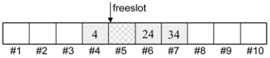

    图 5-6 插入与删除示例图之二

搜索完成后， 填充 ``freeslot`` 所指向的 entry， 其结果如图 5-7 所示：

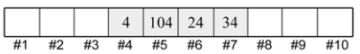

    图 5-7 插入与删除示例图之三

然后再向 table 中插入元素对 (14, 14)， 这时由于探测序列上已经没有 **Dummy** 态的 \
entry 了， 所以最后返回的 ep 会指向一个处于 **Unused** 态的 entry， 如图 5-8 所示：

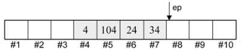

    图 5-8 插入与删除示例图之四

最后插入元素对（14，14），结果如图 5-9 所示：

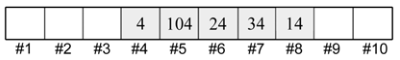

    图 5-9 插入与删除示例图之五

*******************************************************************************
5.4 PyDictObject 对象缓冲池
*******************************************************************************

前面提到， 在 ``PyDictObject`` 的实现机制中， 同样使用了缓冲池的技术。 现在来看看 \
``PyDictObject`` 对象的缓冲池：

.. topic:: [dictobject.c]

    .. code-block:: c

        /* Dictionary reuse scheme to save calls to malloc, free, and memset */
        #define MAXFREEDICTS 80
        static PyDictObject *free_dicts[MAXFREEDICTS];
        static int num_free_dicts = 0;

实际上， ``PyDictObject`` 中使用的这个缓冲池机制与 ``PyListObject`` 中使用的缓冲池\
机制是一样的。 开始时， 这个缓冲池里什么都没有， 直到第一个 ``PyDictObject`` 被销毁\
时， 这个缓冲池才开始接纳被缓冲的 ``PyDictObject`` 对象 （见代码清单 5-8）。

.. topic:: 代码清单 5-8 [dictobject.c]

    .. code-block:: c

        static void
        dict_dealloc(register dictobject *mp)
        {
            register dictentry *ep;
            Py_ssize_t fill = mp->ma_fill;
            PyObject_GC_UnTrack(mp);
            Py_TRASHCAN_SAFE_BEGIN(mp)
            //[1]：调整 dict 中对象的引用计数
            for (ep = mp->ma_table; fill > 0; ep++) {
                if (ep->me_key) {
                    --fill;
                    Py_DECREF(ep->me_key);
                    Py_XDECREF(ep->me_value);
                }
            }
            //[2] ：释放从系统堆中申请的内存空间
            if (mp->ma_table != mp->ma_smalltable)
                PyMem_DEL(mp->ma_table);
            //[3] ：将被销毁的 PyDictObject 对象放入缓冲池
            if (num_free_dicts < MAXFREEDICTS && mp->ob_type == &PyDict_Type)
                free_dicts[num_free_dicts++] = mp;
            else
                mp->ob_type->tp_free((PyObject *)mp);
            Py_TRASHCAN_SAFE_END(mp)
        }   

和 ``PyListObject`` 中缓冲池的机制一样， 缓冲池中只保留了 ``PyDictObject`` 对象。 \
如果 ``PyDictObject`` 对象中 ``ma_table`` 维护的是从系统堆申请的内存空间， 那么 \
Python 将释放这块内存空间， 归还给系统堆。 而如果被销毁的 ``PyDictObject`` 中的 \
**table** 实际上并没有从系统堆中申请， 而是指向 ``PyDictObject`` 固有的 \
``ma_smalltable``， 那么只需要调整 ``ma_smalltable`` 中的对象引用计数就可以了。

在创建新的 ``PyDictObject`` 对象时， 如果在缓冲池中有可以使用的对象， 则直接从缓冲\
池中取出使用， 而不需要再重新创建：

.. topic:: [dictobject.c]

    .. code-block:: c

        PyObject *
        PyDict_New(void)
        {
            register dictobject *mp;
            if (dummy == NULL) { /* Auto-initialize dummy */
                dummy = PyString_FromString("<dummy key>");
                if (dummy == NULL)
                    return NULL;
        #ifdef SHOW_CONVERSION_COUNTS
                Py_AtExit(show_counts);
        #endif
            }
            if (num_free_dicts) {
                mp = free_dicts[--num_free_dicts];
                assert (mp != NULL);
                assert (mp->ob_type == &PyDict_Type);
                _Py_NewReference((PyObject *)mp);
                if (mp->ma_fill) {
                    EMPTY_TO_MINSIZE(mp);
                }
                assert (mp->ma_used == 0);
                assert (mp->ma_table == mp->ma_smalltable);
                assert (mp->ma_mask == PyDict_MINSIZE - 1);
            } else {
                mp = PyObject_GC_New(dictobject, &PyDict_Type);
                if (mp == NULL)
                    return NULL;
                EMPTY_TO_MINSIZE(mp);
            }
            mp->ma_lookup = lookdict_string;
        #ifdef SHOW_CONVERSION_COUNTS
            ++created;
        #endif
            _PyObject_GC_TRACK(mp);
            return (PyObject *)mp;
        }

*******************************************************************************
5.5 Hack PyDictObject
*******************************************************************************

现在可以根据对 ``PyDictObject`` 的了解， 在 Python 源代码中添加代码， 动态而真实地\
观察 Python 运行时 ``PyDictObject`` 的一举一动了。

我们首先来观察， 在 ``insertdict`` 发生之后， ``PyDictObject`` 对象中 **table** \
的变化情况。 由于 Python 内部大量地使用 ``PyDictObject``， 所以对 ``insertdict`` \
的调用会非常频繁， 成千上万的 ``PyDictObject`` 对象会排着长队来依次使用 \
``insertdict``。 如果只是简单地输出， 我们立刻就会被淹没在输出信息中。 所以我们需要\
一套机制来确保当 ``insertdict`` 发生在某一特定的 ``PyDictObject`` 对象身上时， 才\
会输出信息。 这个 ``PyDictObject`` 对象当然是我们自己创建的对象， 必须使它有区别于 \
Python 内部使用的 ``PyDictObject`` 对象的特征。 这个特征， 在这里， 我把它定义为 \
``PyDictObject`` 包含 "PR" 的 ``PyStringObject`` 对象， 当然， 你也可以选用自己的\
特征串。 如果在 ``PyDictObject`` 中找到了这个对象， 则输出信息：

.. code-block:: c

    static void ShowDictObject(dictobject* dictObject)
    {
        dictentry* entry = dictObject->ma_table;
        int count = dictObject->ma_mask+1;
        int i;
        //输出 key
        printf(" key : ");
        for(i = 0; i < count; ++i) {
            PyObject* key = entry->me_key;
            PyObject* value = entry->me_value;
            if(key == NULL) {
                printf("NULL");
            }
            else {
                if(PyString_Check(key)) {
                    if(PyString_AsString(key)[0] == '<') {
                        printf("dummy");
                    }
                    else {
                        (key->ob_type)->tp_print(key, stdout, 0);
                    }
                }
                else{
                    (key->ob_type)->tp_print(key, stdout, 0);
                }
            }
            printf("\t");
            ++entry;
        }
        //输出 value
        printf("\nvalue : ");
        entry = dictObject->ma_table;
        for(i = 0; i < count; ++i) {
            PyObject* key = entry->me_key;
            PyObject* value = entry->me_value;
            if(value == NULL) {
                printf("NULL");
            }
            else {
                (key->ob_type)->tp_print(value, stdout, 0);
            }
            printf("\t");
            ++entry;
        }
        printf("\n");
    }

    static int
    insertdict(register dictobject *mp, PyObject *key, long hash, PyObject *value)
    {
        PyObject *old_value;
        register dictentry *ep;
        typedef PyDictEntry *(*lookupfunc)(PyDictObject *, PyObject *, long);

        assert(mp->ma_lookup != NULL);
        ep = mp->ma_lookup(mp, key, hash);
        if (ep == NULL) {
            Py_DECREF(key);
            Py_DECREF(value);
            return -1;
        }
        if (ep->me_value != NULL) {
            old_value = ep->me_value;
            ep->me_value = value;
            Py_DECREF(old_value); /* which **CAN** re-enter */
            Py_DECREF(key);
        }
        else {
            if (ep->me_key == NULL)
                mp->ma_fill++;
            else {
                assert(ep->me_key == dummy);
                Py_DECREF(dummy);
            }
            ep->me_key = key;
            ep->me_hash = (Py_ssize_t)hash;
            ep->me_value = value;
            mp->ma_used++;
        }
        {
            dictentry *p; 
            long strHash; 
            PyObject* str = PyString_FromString("PR"); 
            strHash = PyObject_Hash(str); 
            p = mp->ma_lookup(mp, str, strHash); 
            if(p->me_value != NULL && (key->ob_type)->tp_name[0] == 'i') 
            { 
                PyIntObject* intObject = (PyIntObject*)key; 
                printf("insert %d\n", intObject->ob_ival); 
                ShowDictObject(mp); 
            } 
        }
        return 0;
    }

对于 ``PyDictObject`` 对象， 依次插入 9 和 17， 根据 ``PyDictObject`` 选用的 \
hash 策略， 这两个数会产生冲突， 9 的 hash 结果为 1， 而 17 经过再次探测后， 会获\
得 hash 结果为 7。 图 5-10 中的前两个结果显示了这个过程。

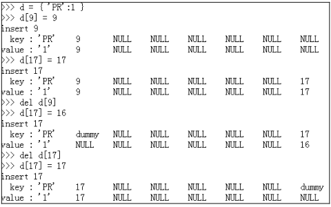

    图 5-10 dict 变动时 table 的变化情况

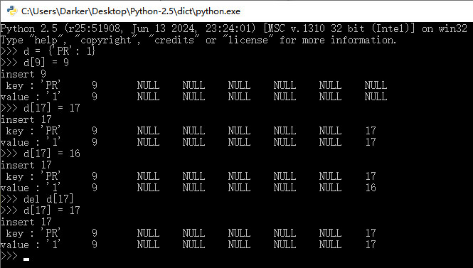

    图 5-10-1 dict 变动时 table 的变化情况 on Win 10

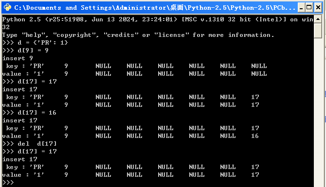

    图 5-10-1 dict 变动时 table 的变化情况 on Win XP

.. note:: 

    下面的两幅图是我真实运行情况， 确实没有 dummy 状态的出现， 很迷惑。

