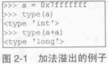
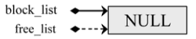

##############################################################################
Python 源码阅读系列 3
##############################################################################

.. contents::

******************************************************************************
第 2 章  Python 中的整数对象
******************************************************************************

2.1 初识 PyIntObject 对象
==============================================================================

承接上文 静态的整数对象的定义 - PyIntObject 代码段 。 

PyIntObject 实际上就是对 C 中原生类型 long 的一个简单包装 。 Python 对象中与对象相\
关的元信息实际上都是保存在与对象对应的类型对象中的 ， 对于 PyIntObject 的类型对象是 \
PyInt_Type ： 

.. code-block:: c

    [Objects/intobject.c]

    PyTypeObject PyInt_Type = {
        PyObject_HEAD_INIT(&PyType_Type)
        0,
        "int",
        sizeof(PyIntObject),
        0,
        (destructor)int_dealloc,		/* tp_dealloc */
        (printfunc)int_print,			/* tp_print */
        0,					/* tp_getattr */
        0,					/* tp_setattr */
        (cmpfunc)int_compare,			/* tp_compare */
        (reprfunc)int_repr,			/* tp_repr */
        &int_as_number,				/* tp_as_number */
        0,					/* tp_as_sequence */
        0,					/* tp_as_mapping */
        (hashfunc)int_hash,			/* tp_hash */
            0,					/* tp_call */
            (reprfunc)int_repr,			/* tp_str */
        PyObject_GenericGetAttr,		/* tp_getattro */
        0,					/* tp_setattro */
        0,					/* tp_as_buffer */
        Py_TPFLAGS_DEFAULT | Py_TPFLAGS_CHECKTYPES |
            Py_TPFLAGS_BASETYPE,		/* tp_flags */
        int_doc,				/* tp_doc */
        0,					/* tp_traverse */
        0,					/* tp_clear */
        0,					/* tp_richcompare */
        0,					/* tp_weaklistoffset */
        0,					/* tp_iter */
        0,					/* tp_iternext */
        int_methods,				/* tp_methods */
        0,					/* tp_members */
        0,					/* tp_getset */
        0,					/* tp_base */
        0,					/* tp_dict */
        0,					/* tp_descr_get */
        0,					/* tp_descr_set */
        0,					/* tp_dictoffset */
        0,					/* tp_init */
        0,					/* tp_alloc */
        int_new,				/* tp_new */
        (freefunc)int_free,           		/* tp_free */
    };

PyIntObject 支持的操作：

==============   ============================
操作              描述
==============   ============================
int_dealloc       PyIntObject 对象的析构操作
int_free          PyIntObject 对象的释放操作
int_repr          转化成 PyStringObject 对象
int_hash          获得 HASH 值
int_print         打印 PyIntObject 对象
int_compare       比较操作
int_as_number     数值操作集合
int_methods       成员函数集合
==============   ============================

下面这个例子看一下如何比较两个整数对象的大小 。 

.. code-block:: c 

    [Objects/intobject.c]

    static int
    int_compare(PyIntObject *v, PyIntObject *w)
    {
        register long i = v->ob_ival;
        register long j = w->ob_ival;
        return (i < j) ? -1 : (i > j) ? 1 : 0;
    }

显然 PyIntObject 对象的比较操作实际上就是简单地将他所维护的 long 值进行比较 。 需要\
特别注意 int_as_number 这个域 ： 

.. code-block:: c 

    [Objects/intobject.c]

    static PyNumberMethods int_as_number = {
        (binaryfunc)int_add,	/*nb_add*/
        (binaryfunc)int_sub,	/*nb_subtract*/
        (binaryfunc)int_mul,	/*nb_multiply*/
        (binaryfunc)int_classic_div, /*nb_divide*/
        (binaryfunc)int_mod,	/*nb_remainder*/
        (binaryfunc)int_divmod,	/*nb_divmod*/
        (ternaryfunc)int_pow,	/*nb_power*/
        (unaryfunc)int_neg,	/*nb_negative*/
        (unaryfunc)int_pos,	/*nb_positive*/
        (unaryfunc)int_abs,	/*nb_absolute*/
        (inquiry)int_nonzero,	/*nb_nonzero*/
        (unaryfunc)int_invert,	/*nb_invert*/
        (binaryfunc)int_lshift,	/*nb_lshift*/
        (binaryfunc)int_rshift,	/*nb_rshift*/
        (binaryfunc)int_and,	/*nb_and*/
        (binaryfunc)int_xor,	/*nb_xor*/
        (binaryfunc)int_or,	/*nb_or*/
        int_coerce,		/*nb_coerce*/
        (unaryfunc)int_int,	/*nb_int*/
        (unaryfunc)int_long,	/*nb_long*/
        (unaryfunc)int_float,	/*nb_float*/
        (unaryfunc)int_oct,	/*nb_oct*/
        (unaryfunc)int_hex, 	/*nb_hex*/
        0,			/*nb_inplace_add*/
        0,			/*nb_inplace_subtract*/
        0,			/*nb_inplace_multiply*/
        0,			/*nb_inplace_divide*/
        0,			/*nb_inplace_remainder*/
        0,			/*nb_inplace_power*/
        0,			/*nb_inplace_lshift*/
        0,			/*nb_inplace_rshift*/
        0,			/*nb_inplace_and*/
        0,			/*nb_inplace_xor*/
        0,			/*nb_inplace_or*/
        (binaryfunc)int_div,	/* nb_floor_divide */
        int_true_divide,	/* nb_true_divide */
        0,			/* nb_inplace_floor_divide */
        0,			/* nb_inplace_true_divide */
        (unaryfunc)int_int,	/* nb_index */
    };

这个 PyNumberMethods 中定义了一个对象作为数值对象时所有可选的操作信息 。 再 Python \
2.5 中 PyNumberMethods 中一共有 39 个函数指针 ， 即其中定义了 39 种可选的操作 ， \
包括加法 、 减法 、 乘法 、 模运算等 。

在 int_as_number 中 ， 确定了对于一个整数对象 ， 这些数值操作应该如何进行 。 当然 \
， 并非所有的操作都要求一定要被实现 。 下面看一下加法操作的实现 ： 

.. code-block:: c 

    [Include/intobject.h]

    // 宏， 牺牲类型安全， 换取执行效率
    #define PyInt_AS_LONG(op) (((PyIntObject *)(op))->ob_ival)

    [Objects/intobject.c]

    #define CONVERT_TO_LONG(obj, lng)		\
        if (PyInt_Check(obj)) {			\
            lng = PyInt_AS_LONG(obj);	\
        }					\
        else {					\
            Py_INCREF(Py_NotImplemented);	\
            return Py_NotImplemented;	\
        }

    static PyObject *
    int_add(PyIntObject *v, PyIntObject *w)
    {
        register long a, b, x;
        CONVERT_TO_LONG(v, a);
        CONVERT_TO_LONG(w, b);
        x = a + b;
        // [1]: 检查加法结果是否溢出
        if ((x^a) >= 0 || (x^b) >= 0)
            return PyInt_FromLong(x);
        return PyLong_Type.tp_as_number->nb_add((PyObject *)v, (PyObject *)w);
    }

PyIntObject 对象所实现的加法操作是直接在其维护的 long 值上进行的 ， 在完成加法操作\
后 ， 代码中进行了溢出检查 ， 如果没有溢出就返回一个新的 PyIntObject ， 这个 \
PyIntObject 所拥有的值正好是加法操作的结果 。 

在 Python 的实现中 ， 对某些会频繁执行的代码 ， 都会同时提供函数和宏两种版本 ， 比\
如上文中的 PyInt_AS_LONG ， 与之对应的还有一个函数 PyInt_AsLong 。 宏版本的 \
PyInt_AS_LONG 可以省去一次函数调用的开销 ， 但是其牺牲了类型安全 ， 因为其参数 op \
完全可以不是一个 PyIntObject 对象 ， 而 intobject.c 中的函数版 PyInt_AsLong 则会\
多方检查类型安全性 ， 但是牺牲了执行效率 。 

从 PyIntObject 对象的加法操作的实现可以清晰地看到 PyIntObject 是一个 immutable 的\
对象 ， 因为操作完成后 ， 原来参与操作的任何一个对象都没有发生改变 ， 取而代之的是一\
个全新的 PyIntObject 对象诞生 。 

如果加法结果溢出 ， 其结果就不是一个 PyIntObject 对象 ， 而是一个 PyLongObject 对\
象 。 例如 ： 

图 2-1 加法溢出的例子

.. image:: img/2-1-0.png 

图 2-1-0 Python 3.7.7 版本实际结果

另一个有趣的元信息是 PyIntObject 对象的文档信息 ， 其维护在 int_doc 域中 。 文档无\
缝地集成在语言中 。 可以在 Python 的交互环境下通过 PyIntObject 对象的 __doc__ 属\
性看到 int_doc 维护的文档 ： 

.. image:: img/2-2.png

图 2-2 整数文档信息

.. code-block:: c 

    [Include/Python.h]

    /* Define macros for inline documentation. */
    #define PyDoc_VAR(name) static char name[]
    #define PyDoc_STRVAR(name,str) PyDoc_VAR(name) = PyDoc_STR(str)
    #ifdef WITH_DOC_STRINGS
    #define PyDoc_STR(str) str
    #else
    #define PyDoc_STR(str) ""
    #endif

    [Objects/intobject.c]

    PyDoc_STRVAR(int_doc,
    "int(x[, base]) -> integer\n\
    \n\
    Convert a string or number to an integer, if possible.  A floating point\n\
    argument will be truncated towards zero (this does not include a string\n\
    representation of a floating point number!)  When converting a string, use\n\
    the optional base.  It is an error to supply a base when converting a\n\
    non-string. If the argument is outside the integer range a long object\n\
    will be returned instead.");

2.2 PyIntObject 对象的创建和维护
==============================================================================

2.2.1 对象创建的 3 种途径
------------------------------------------------------------------------------

在 Python 自身的实现中 ， 几乎都是调用 C API 来创建内建实例对象 。 而内建对象即便是\
通过内建类型对象中的 tp_new ， tp_init 操作创建实例对象 ， 实际上最终还是会调用 \
Python 为特定对象准备的 C API 。

在 intobject.h 中可以看到 ， 为了创建 PyIntObject 对象 ， Python 提供了 3 条途径 \
， 分别从 long 值 ， 从字符串以及 Py_UNICODE 对象生成 PyIntObject 对象 。  

.. code-block:: c 

    PyAPI_FUNC(PyObject *) PyInt_FromString(char*, char**, int);
    #ifdef Py_USING_UNICODE
    PyAPI_FUNC(PyObject *) PyInt_FromUnicode(Py_UNICODE*, Py_ssize_t, int);
    #endif
    PyAPI_FUNC(PyObject *) PyInt_FromLong(long);

只考察从 long 值生成 PyIntObject 对象 。 因为 PyInt_FromString 和 \
PyInt_FromUnicode 实际上都是先将字符串或 Py_UNICODE 对象转换成浮点数 。 然后再调\
用 PyInt_FromFloat 。 它们不过利用了 Adaptor Pattern 的思想对整数对象的核心创建\
函数 PyInt_FromFloat 进行了接口转换罢了 。 

.. code-block:: c 

    PyObject *
    PyInt_FromString(char *s, char **pend, int base)
    {
        char *end;
        long x;
        Py_ssize_t slen;
        PyObject *sobj, *srepr;

        if ((base != 0 && base < 2) || base > 36) {
            PyErr_SetString(PyExc_ValueError,
                    "int() base must be >= 2 and <= 36");
            return NULL;
        }

        while (*s && isspace(Py_CHARMASK(*s)))
            s++;
        errno = 0;

        // 将字符串转换为 long 
        if (base == 0 && s[0] == '0') {
            x = (long) PyOS_strtoul(s, &end, base);
            if (x < 0)
                return PyLong_FromString(s, pend, base);
        }
        else
            x = PyOS_strtol(s, &end, base);
        if (end == s || !isalnum(Py_CHARMASK(end[-1])))
            goto bad;
        while (*end && isspace(Py_CHARMASK(*end)))
            end++;
        if (*end != '\0') {
    bad:
            slen = strlen(s) < 200 ? strlen(s) : 200;
            sobj = PyString_FromStringAndSize(s, slen);
            if (sobj == NULL)
                return NULL;
            srepr = PyObject_Repr(sobj);
            Py_DECREF(sobj);
            if (srepr == NULL)
                return NULL;
            PyErr_Format(PyExc_ValueError,
                    "invalid literal for int() with base %d: %s",
                    base, PyString_AS_STRING(srepr));
            Py_DECREF(srepr);
            return NULL;
        }
        else if (errno != 0)
            return PyLong_FromString(s, pend, base);
        if (pend)
            *pend = end;
        return PyInt_FromLong(x);
    }

2.2.2 小整数对象
------------------------------------------------------------------------------

在实际的编程中 ， 数值比较小的整数 ， 如 1 、 2 、 29 等可能在程序中非常频繁地使用 \
。 通过 For 循环就可以了解小整数为何会有那么频繁的使用场合 。 在 Python 中 ， 所有\
的对象都存活偶在系统堆上 ， 如果没有特殊的机制 ， 对于这些频繁使用的小整数对象 ， \
Python 将一次又一次地使用 malloc 在堆上申请空间 ， 并不厌其烦地一次次 free 。 这样\
的操作不仅会大大降低运行效率 ， 而且会在系统堆上造成大量的内存碎片 ， 严重影响 Python \
的整体性能 。 

于是在 Python 中 ， 对于小整数对象使用了对象池技术 。 对象池中的每一个 PyIntObject \
都能被任意地共享 。 

.. code-block:: c 

    [Objects/intobject.c]

    #ifndef NSMALLPOSINTS
        #define NSMALLPOSINTS		257
    #endif
    #ifndef NSMALLNEGINTS
        #define NSMALLNEGINTS		5
    #endif
    #if NSMALLNEGINTS + NSMALLPOSINTS > 0
        /* References to small integers are saved in this array so that they
        can be shared.
        The integers that are saved are those in the range
        -NSMALLNEGINTS (inclusive) to NSMALLPOSINTS (not inclusive).
        */
        static PyIntObject *small_ints[NSMALLNEGINTS + NSMALLPOSINTS];
    #endif

这个毫不起眼的 small_ints 就是举足轻重的小整数对象的对象池 ， 准确地说 ， 是 \
PyIntObject * 池 ， 不过一般称其为小整数对象池 。 在 Python 2.5 中 ， 将小整数集\
合的范围默认为 [-5, 257) 。 可以通过修改 NSMALLPOSINTS 和 NSMALLNEGINTS 重新编译 \
Python ， 从而将这个范围向两端伸展或收缩 。 

2.2.3 大整数对象
------------------------------------------------------------------------------

对于小整数 ， 在小整数对象池中完全缓存了 PyIntObject 对象 。 而对于其他整数 ， \
Python 运行环境提供了一块内存空间 ， 由大整数轮流使用 ， 这样免去了不断 malloc 之\
苦 ， 也在一定程度上考虑了效率问题 。 在 Python 中 ， 有一个 PyIntBlock 结构 ， \
在这基础上 ， 实现了一个单向列表 。 

.. code-block:: c

    [Objects/intobject.c]

    #define BLOCK_SIZE	1000	/* 1K less typical malloc overhead */
    #define BHEAD_SIZE	8	/* Enough for a 64-bit pointer */
    #define N_INTOBJECTS	((BLOCK_SIZE - BHEAD_SIZE) / sizeof(PyIntObject))

    struct _intblock {
        struct _intblock *next;
        PyIntObject objects[N_INTOBJECTS];
    };

    typedef struct _intblock PyIntBlock;

    static PyIntBlock *block_list = NULL;
    static PyIntObject *free_list = NULL;

PyIntBlock 这个结构里维护了一块内存 (block) ， 其中保存了一些 PyIntObject 对象 。 \
从定义中可以看出一个 PyIntBlock 中维护着 N_INTOBJECTS 个对象 ， 计算后是 82 个 。 \
这里也可以动态调整 。 

PyIntBlock 的单向列表通过 block_list 维护 ， 每个 block 中都维护了一个 \
PyIntObject 数组 - objects ， 这就是真正用于存储被缓存的 PyIntObject 对象的内存 \
。 Python 使用一个单向链表来管理全部 block 的 objects 中所有的空闲内存 ， 这个自由\
内存链表的表头就是 free_list 。 最开始时 ， 两个指针都被设置为空指针 。

2.2.4 添加和删除
------------------------------------------------------------------------------

下面通过 PyInt_FromLong 进行细致入微的考察 ， 真实展现一个个 PyIntObject 对象的产\
生 。 

.. code-block:: c

    [Objects/intobject.c]

    PyObject *
    PyInt_FromLong(long ival)
    {
        register PyIntObject *v;
    #if NSMALLNEGINTS + NSMALLPOSINTS > 0
    // [1] ：尝试使用小整数对象池
        if (-NSMALLNEGINTS <= ival && ival < NSMALLPOSINTS) {
            v = small_ints[ival + NSMALLNEGINTS];
            Py_INCREF(v);
    #ifdef COUNT_ALLOCS
            if (ival >= 0)
                quick_int_allocs++;
            else
                quick_neg_int_allocs++;
    #endif
            return (PyObject *) v;
        }
    #endif
    // [2]： 为通用整数对象池申请新的内存空间
        if (free_list == NULL) {
            if ((free_list = fill_free_list()) == NULL)
                return NULL;
        }
        /* Inline PyObject_New */
        // [3] ： (inline) 内联 PyObject_New 的行为
        v = free_list;
        free_list = (PyIntObject *)v->ob_type;
        PyObject_INIT(v, &PyInt_Type);
        v->ob_ival = ival;
        return (PyObject *) v;
    }

PyIntObject 对象的创建通过两步完成 (上述代码是 Python 2.5 代码 ， 与书中有出入) ： 

.. code-block::

    [Objects/intobject.c]

    PyObject *
    PyInt_FromLong(long ival)
    {
        register PyIntObject *v;
    #if NSMALLNEGINTS + NSMALLPOSINTS > 0
    // [1] ：尝试使用小整数对象池
        if (-NSMALLNEGINTS <= ival && ival < NSMALLPOSINTS) {
            v = small_ints[ival + NSMALLNEGINTS];
            Py_INCREF(v);
            return (PyObject *) v;
        }
    #endif
    // [2]： 为通用整数对象池申请新的内存空间
        if (free_list == NULL) {
            if ((free_list = fill_free_list()) == NULL)
                return NULL;
        }
        /* Inline PyObject_New */
        // [3] ： (inline) 内联 PyObject_New 的行为
        v = free_list;
        free_list = (PyIntObject *)v->ob_type;
        PyObject_INIT(v, &PyInt_Type);
        v->ob_ival = ival;
        return (PyObject *) v;
    }

- 如果小整数对象池机制被激活 ， 则尝试使用小整数对象池 ； 

- 如果不能使用小整数对象池 ， 则使用通用的整数对象池 。

2.2.4.1 使用小整数对象池
^^^^^^^^^^^^^^^^^^^^^^^^^^^^^^^^^^^^^^^^^^^^^^^^^^^^^^^^^^^^^^^^^^^^^^^^^^^^^^

如果 NSMALLNEGINTS + NSMALLPOSINTS > 0 ， Python 认为小整数对象池机制被激活 ， \
PyInt_FromLong 会首先在 [1] 处检查传入的 long 值是否属于小整数范围 ， 如果是小整数 \
， 只需要返回小整数对象池中的对应的对象就可以了 。 

如果小整数对象池机制没有被激活 ， 或传入的 long 值不是小整数 ， Python 就会转向由 \
block_list 维护的通用整数对象池 。 

2.2.4.2 创建通用整数对象池
^^^^^^^^^^^^^^^^^^^^^^^^^^^^^^^^^^^^^^^^^^^^^^^^^^^^^^^^^^^^^^^^^^^^^^^^^^^^^^

首次调用 PyInt_FromLong 时 ， free_list 为 NULL ， 这时 Python 会在 [2] 处调用 \
fill_free_list 创建新的 block ， 从而创建新的空闲内存 。 Python 对 fill_free_list \
的调用不光会发生在 PyInt_FromLong 的首次调用时 ， 在 Python 运行期间 ， 只要所有 \
block 的空闲内存被使用完 ， 就会导致 free_list 变为 NULL ， 从而在下一次 \
PyInt_FromLong 的调用时激发对 fill_free_list 的调用 。 

未完待续...