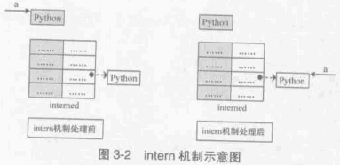
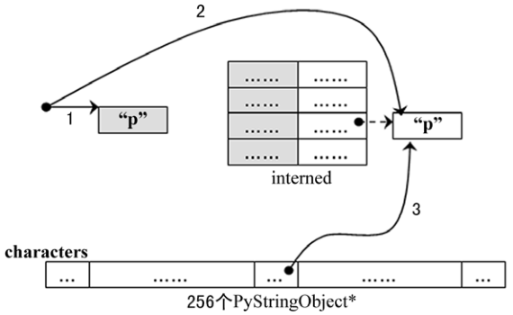

##############################################################################
Python 源码阅读系列 5
##############################################################################

.. contents::

******************************************************************************
第 3 章  Python 中的字符串对象
******************************************************************************

3.3 字符串对象的 intern 机制
==============================================================================

无论是 PyString_FromString 还是 PyString_FromStringAndSize ， 当字符数组的长度为 \
0 或 1 时 ， 需要进行一个特别的动作 ： PyString_InternInPlace 。 就是前文中提到的 \
intern 机制 。

.. code-block:: c 

    [Objects/stringobject.c]

    PyObject *
    PyString_FromString(const char *str)
    {
        register size_t size;
        register PyStringObject *op;

        // [1]: 判断字符串长度
        size = strlen(str);
        if (size > PY_SSIZE_T_MAX) {
            return NULL;
        }

        // [2]: 处理 NULL string
        if (size == 0 && (op = nullstring) != NULL) {
            return (PyObject *)op;
        }

        // [3]: 处理字符
        if (size == 1 && (op = characters[*str & UCHAR_MAX]) != NULL) {
            return (PyObject *)op;
        }

        /* Inline PyObject_NewVar */
        // [4]: 创建新的 PyStringObject 对象， 并初始化
        op = (PyStringObject *)PyObject_MALLOC(sizeof(PyStringObject) + size);
        PyObject_INIT_VAR(op, &PyString_Type, size);
        op->ob_shash = -1;
        op->ob_sstate = SSTATE_NOT_INTERNED;
        Py_MEMCPY(op->ob_sval, str, size+1);
        /* share short strings */
        // intern (共享) 长度较短的 PyStringObject 对象
        if (size == 0) {
            PyObject *t = (PyObject *)op;
            PyString_InternInPlace(&t);
            op = (PyStringObject *)t;
            nullstring = op;
            Py_INCREF(op);
        } else if (size == 1) {
            PyObject *t = (PyObject *)op;
            PyString_InternInPlace(&t);
            op = (PyStringObject *)t;
            characters[*str & UCHAR_MAX] = op;
            Py_INCREF(op);
        }
        return (PyObject *) op;
    }

PyStringObject 对象的 intern 机制的目的是 ： 对于被 intern 之后的字符串 ， 比如 \
"Ruby" ， 在整个 Python 的运行期间 ， 系统中都只有唯一的一个与字符串 "Ruby" 对应的 \
PyStringObject 对象 。 这样当判断两个 PyStringObject 对象是否相同时 ， 如果他们都\
被 intern 了 ， 那么只需要简单地检查它们对应的 PyObject* 是否相同即可 。 这个机制既\
节省了空间 ， 又简化了对 PyStringObject 对象的比较 。 PyString_InternInPlace 负责\
完成对一个对象进行 intern 操作的函数 。

.. code-block:: c

    //[Objects/stringobject.c]

    void
    PyString_InternInPlace(PyObject **p)
    {
        register PyStringObject *s = (PyStringObject *)(*p);
        PyObject *t;
        if (s == NULL || !PyString_Check(s))
            Py_FatalError("PyString_InternInPlace: strings only please!");
        /* If it's a string subclass, we don't really know what putting
        it in the interned dict might do. */
        if (!PyString_CheckExact(s))
            return;
        if (PyString_CHECK_INTERNED(s))
            return;
        if (interned == NULL) {
            interned = PyDict_New();
            if (interned == NULL) {
                PyErr_Clear(); /* Don't leave an exception */
                return;
            }
        }
        t = PyDict_GetItem(interned, (PyObject *)s);
        if (t) {
            Py_INCREF(t);
            Py_DECREF(*p);
            *p = t;
            return;
        }

        if (PyDict_SetItem(interned, (PyObject *)s, (PyObject *)s) < 0) {
            PyErr_Clear();
            return;
        }
        /* The two references in interned are not counted by refcnt.
        The string deallocator will take care of this */
        s->ob_refcnt -= 2;
        PyString_CHECK_INTERNED(s) = SSTATE_INTERNED_MORTAL;
    }

    //[上述代码是代码包中的代码，下面的是书中的代码]

    void
    PyString_InternInPlace(PyObject **p)
    {
        register PyStringObject *s = (PyStringObject *)(*p);
        PyObject *t;
        // 对 PyStringObject 进行类型和状态检查
        if (!PyString_CheckExact(s))
            return;
        if (PyString_CHECK_INTERNED(s))
            return;
        // 创建记录经 intern 机制处理后的 PyStringObject 的 dict
        if (interned == NULL) {
            interned = PyDict_New();
        }
        // [1] : 检查 PyStringObject 对象 S 是否存在对应的 intern 后的 PyStringObject 对象
        t = PyDict_GetItem(interned, (PyObject *)s);
        if (t) {
            // 注意这里对引用计数的调整
            Py_INCREF(t);
            Py_DECREF(*p);
            *p = t;
            return;
        }

        // [2] : 在 interned 中记录检查 PyStringObject 对象 S 
        PyDict_SetItem(interned, (PyObject *)s, (PyObject *)s);

        /* The two references in interned are not counted by refcnt.
        The string deallocator will take care of this */
        // [3] : 注意这里对引用计数的调整
        s->ob_refcnt -= 2;
        // [4] : 调整 S 中的 intern 状态标志
        PyString_CHECK_INTERNED(s) = SSTATE_INTERNED_MORTAL;
    }

PyString_InternInPlace 首先会进行一系列的检查， 其中包括：

- 检查传入的对象是否是一个 PyStringObject 对象 ， intern 机制只能应用在 \
  PyStringObject 对象上 ， 甚至对于他的派生类对象系统都不会应用 intern 机制 。 

- 检查传入的 PyStringObject 对象是否已经被 intern 机制处理过了 ， Python 不会对同\
  一个 PyStringObject 对象进行一次以上的 intern 操作 。 

intern 机制的核心在于 interned ， interned 在 stringobject.c 中被定义为 ： \
`static PyObject *interned` 。

在代码中 interned 实际指向的是 PyDict_New 创建的一个对象 。 PyDict_New 实际上创建\
了一个 PyDictObject 对象 ， 即 Python 中常用的 dict 。 可以看作是 C++ 中的 map \
， 即 map<PyObject*, PyObject*> 。 C++ 我不懂，先记下笔记 。 

interned 机制的关键就是在系统中有一个 key value 映射关系的集合 ， 集合的名称叫做 \
interned 。 其中记录着被 intern 机制处理过的 PyStringObject 对象 。 当对一个 \
PyStringObject 对象 a 应用 intern 机制时 ， 首先会在 interned 这个 dict 中检查是\
否有满足以下条件的对象 b ： b 中维护的原生字符串与 a 相同 。 如果确实存在对象 b ， \
那么指向 a 的 PyObject 指针会指向 b ， 而 a 的引用计数减 1 ， 而 a 只是一个被临时\
创建的对象 。 如果 interned 中不存在这样的 b ， 那么就在 [2] 处将 a 记录到 \
interned 中 。 

下图展示了如果 interned 中存在这样的对象 b ， 再对 a 进行 intern 操作时， 原本指\
向 a 的 PyObject* 指针的变化 ： 

对于被 intern 机制处理的 PyStringObject 对象 ， Python 采用了特殊的引用计数机制 \
。 在将一个 PyStringObject 对象 a 的 PyObject 指针作为 key 和 value 添加到 \
interned 中时 PyDictObject 对象会通过这两个指针对 a 的引用计数进行两次加 1 的操作 \
。 但是 Python 的设计者规定在 interned 中 a 的指针不能被视为对象 a 的有效引用 ， \
因为如果是有效引用的话 ， 那么 a 的引用计数在 Python 结束之前永远不能为 0 ， 因为 \
interned 中至少有两个指针引用了 a ， 那么删除 a 就永远不可能了 。

因此 interned 中的指针不能作为 a 的有效引用 。 这就是代码中 [3] 处会将引用计数减 \
2 的原因 。 在 A 的引用计数在某个时刻减为 0 之后 ， 系统将会销毁对象 a ， 同时会在 \
interned 中删除指向 a 的指针 ， 在 string_dealloc 代码中得到验证 ： 

.. code-block:: c 

    [Objects/stringobject.c]

    static void
    string_dealloc(PyObject *op)
    {
        switch (PyString_CHECK_INTERNED(op)) {
            case SSTATE_NOT_INTERNED:
                break;

            case SSTATE_INTERNED_MORTAL:
                /* revive dead object temporarily for DelItem */
                op->ob_refcnt = 3;
                if (PyDict_DelItem(interned, op) != 0)
                    Py_FatalError(
                        "deletion of interned string failed");
                break;

            case SSTATE_INTERNED_IMMORTAL:
                Py_FatalError("Immortal interned string died.");

            default:
                Py_FatalError("Inconsistent interned string state.");
        }
        op->ob_type->tp_free(op);
    }

Python 在创建一个字符串的时候 ， 会首先在 interned 中检查是否已经有改字符串对应的 \
PyStringObject 对象了 ， 如有 ， 则不用创建新的 。 这样会节省内存空间 ， 但是 \
Python 并不是在创建 PyStringObject 时就通过 interned 实现了节省空间的目的 。 事实\
上 ， 从 PyString_FromString 中可以看到 ， 无论如何 ， 一个合法的 PyStringObject \
对象是会被创建的 ， 同样 ， PyString_InternInPlace 也只对 PyStringObject 起作用 \
。 Python 始终会为字符串 s 创建 PyStringObject 对象 ， 尽管 s 中维护的原生字符数组\
在 interned 中已经有一个与之对应的 PyStringObject 对象了 。 而 intern 机制是在 s \
被创建后才起作用的 ， 通常 Python 在运行时创建了一个 PyStringObject 对象 temp 后 \
， 基本上都会调用 PyString_InternInPlace 对 temp 进行处理 ， intern 机制会减少 \
temp 的引用计数 ， temp 对象会由于引用计数减为 0 而被销毁 。 

Python 提供了一个以 char* 为参数的 intern 机制相关的函数用来直接对 C 原生字符串上\
做 intern 操作 ： 

.. code-block:: c 

    PyObject *
    PyString_InternFromString(const char *cp)
    {
        PyObject *s = PyString_FromString(cp);
        if (s == NULL)
            return NULL;
        PyString_InternInPlace(&s);
        return s;
    }

临时对象仍然被创建出来 ， 实际上 ， 在 Python 中 ， 必须创建一个临时的 \
PyStringObject 对象来完成 interne 操作 。 因为 PyDictObject 必须以 PyObject * 指\
针作为键 。 

实际上 ， 被 intern 机制处理后的 PyStringObject 对象分为两类 ， 一类处于 \
SSTATE_INTERNED_IMMORTAL 状态 ， 而另一类则处于 SSTATE_INTERNED_MORTAL 状态 ， \
这两种状态的区别在 string_dealloc 中可以清晰地看到 ， 显然 \
SSTATE_INTERNED_IMMORTAL 状态的 PyStringObject 对象是永远不会被销毁的 ， 它将与 \
Python 虚拟机共存 ， 即同年同月同日死 。 

PyString_InternInPlace 只能创建 SSTATE_INTERNED_MORTAL 状态的 PyStringObject 对\
象 ， 如果想创建 SSTATE_INTERNED_IMMORTAL 状态的对象 ， 必须通过另一个接口 ， 在调\
用 PyString_InternInPlace 后 ， 强制改变 PyStringObject 的 intern 状态 。 

.. code-block:: c 

    void
    PyString_InternImmortal(PyObject **p)
    {
        PyString_InternInPlace(p);
        if (PyString_CHECK_INTERNED(*p) != SSTATE_INTERNED_IMMORTAL) {
            PyString_CHECK_INTERNED(*p) = SSTATE_INTERNED_IMMORTAL;
            Py_INCREF(*p);
        }
    }

3.4 字符缓冲池
==============================================================================

Python 为 PyStringObject 中的一个字节的字符对应的 PyStringObject 对象也设计了一个\
对象池 characters :

.. code-block:: c 

    [Objects/stringobject.c]

    static PyStringObject *characters[UCHAR_MAX + 1];

UCHAR_MAX 是在系统头文件中定义的常量 ， 这是一个平台相关的常量 ， 在 Win32 平台下 ： 

.. code-block:: c 

    #define UCHAR_MAX    0xff   

这个被定义在 C 语言的 limits.h 头文件中 。 

在 Python 的整数对象体系中 ， 小整数的缓冲池是在 Python 初始化的时候被创建的 ， 而\
字符串对象体系中的字符缓冲池则是以静态变量的形式存在 。 在 Python 初始化完成之后 ， \
缓冲池中的所有 PyStringObject 指针都为空 。 

创建一个 PyStringObject 对象时 ， 无论是通过调用 PyString_FromString 还是通过调用\
PyString_FromStringAndSize ， 若字符串实际就一个字符 ， 则会进行如下操作 ： 

.. code-block:: c 

    PyObject *
    PyString_FromStringAndSize(const char *str, Py_ssize_t size)
    {
        ...
        else if (size == 1 && str != NULL) {
            PyObject *t = (PyObject *)op;
            PyString_InternInPlace(&t);
            op = (PyStringObject *)t;
            characters[*str & UCHAR_MAX] = op;
            Py_INCREF(op);
        }
        return (PyObject *) op;
    }

先对所创建的字符串 (字符) 对象进行 intern 操作 ， 在将 intern 的结果缓存到字符缓冲\
池 characters 中 。 图 3-3 演示了缓存一个字符到对应的 PyStringObject 对象的过程 。

3 条带有标号的曲线既代表指针 ， 有代表进行操作的顺序 ： 

1. 创建 PyStringObject 对象 <string p> ；

2. 对对象 <string p> 进行 intern 操作 ；

3. 将对象 <string p> 缓存至字符串缓冲池中 。 

在创建 PyStringObject 时 ， 会首先检查所要创建的是否是一个字符对象 ， 然后检查字符\
缓冲池中是否包含这个字符的字符对象的缓冲 ， 若有直接返回这个缓冲对象即可 ：

.. code-block:: c 

    [Objects/stringobject.c]

    PyObject *
    PyString_FromStringAndSize(const char *str, Py_ssize_t size)
    {
        register PyStringObject *op;
        ...
        if (size == 1 && str != NULL &&
            (op = characters[*str & UCHAR_MAX]) != NULL)
        {
            return (PyObject *)op;
        }

       ...
    }

3.5 PyStringObject 效率相关问题
==============================================================================

Python 的字符串连接时严重影响 Python 程序执行效率 ， Python 通过 "+" 进行字符串连\
接的方法极其低下 ， 根源在于 Python 中的 PyStringObject 对象是一个不可变对象 。 这\
意味着进行字符串连接时 ， 必须创建一个新的 PyStringObject 对象 。 这样如果要连接 N \
个 PyStringObject 对象 ， 就必须进行 N - 1 次的内存申请及搬运工作 。 

推荐的做法是通过利用 PyStringObject 对象的 join 操作来对存储在 list 或 tuple 中的\
一组 PyStringObject 对象进行连接操作 ， 这样只需分配一次内存 ， 执行效率大大提高 。 

未完待续 ...
