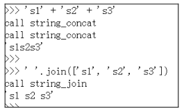
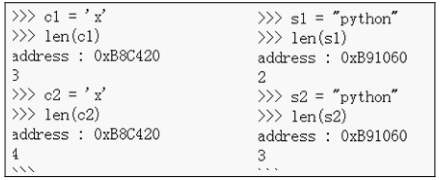
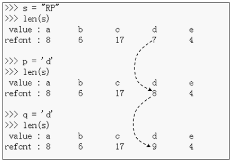
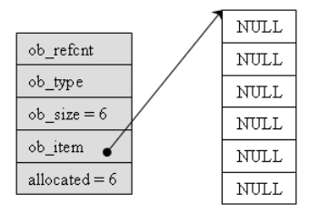
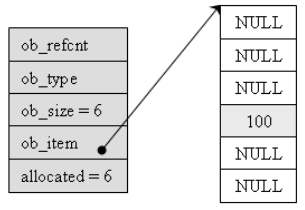
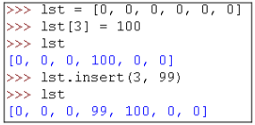

##############################################################################
Python 源码阅读系列 6
##############################################################################

.. contents::

******************************************************************************
第 3 章  Python 中的字符串对象
******************************************************************************

3.5 PyStringObject 效率相关问题
==============================================================================

承接上文字符串连接 。

通过 "+" 操作符对字符串进行连接时 ， 会调用 string_concat 函数 ：

.. code-block:: c 

    static PyObject *
    string_concat(register PyStringObject *a, register PyObject *bb)
    {
        register Py_ssize_t size;
        register PyStringObject *op;
        if (!PyString_Check(bb)) {
    #ifdef Py_USING_UNICODE
            if (PyUnicode_Check(bb))
                return PyUnicode_Concat((PyObject *)a, bb);
    #endif
            PyErr_Format(PyExc_TypeError,
                    "cannot concatenate 'str' and '%.200s' objects",
                    bb->ob_type->tp_name);
            return NULL;
        }
    #define b ((PyStringObject *)bb)
        /* Optimize cases with empty left or right operand */
        if ((a->ob_size == 0 || b->ob_size == 0) &&
            PyString_CheckExact(a) && PyString_CheckExact(b)) {
            if (a->ob_size == 0) {
                Py_INCREF(bb);
                return bb;
            }
            Py_INCREF(a);
            return (PyObject *)a;
        }
        // 计算字符串连接后的长度 size 
        size = a->ob_size + b->ob_size;
        if (size < 0) {
            PyErr_SetString(PyExc_OverflowError,
                    "strings are too large to concat");
            return NULL;
        }
        
        /* Inline PyObject_NewVar */
        // 创建新的 PyStringObject 对象 ， 其维护的用于存储字符的内存长度为 size
        op = (PyStringObject *)PyObject_MALLOC(sizeof(PyStringObject) + size);
        if (op == NULL)
            return PyErr_NoMemory();
        PyObject_INIT_VAR(op, &PyString_Type, size);
        op->ob_shash = -1;
        op->ob_sstate = SSTATE_NOT_INTERNED;
        // 将 a 和 b 中的字符拷贝到新建的 PyStringObject 中 
        Py_MEMCPY(op->ob_sval, a->ob_sval, a->ob_size);
        Py_MEMCPY(op->ob_sval + a->ob_size, b->ob_sval, b->ob_size);
        op->ob_sval[size] = '\0';
        return (PyObject *) op;
    #undef b
    }

对于任意两个 PyStringObject 对象的连接 ， 就会进行一次内存申请的动作 。 而如果利用 \
PyStringObject 对象的 join 操作 ， 则会进行如下的动作 (假设是对 list 中的 \
PyStringObject 对象进行连接) ：

.. code-block:: c  

    static PyObject *
    string_join(PyStringObject *self, PyObject *orig)
    {
        char *sep = PyString_AS_STRING(self);
        // 假设调用 "abc".join(list) ， 那么 self 就是 "abc" 对应的 PyStringObject 
        // 对象 ， 所以 seplen 中存储着 abc 的长度 。 
        const Py_ssize_t seplen = PyString_GET_SIZE(self);
        PyObject *res = NULL;
        char *p;
        Py_ssize_t seqlen = 0;
        size_t sz = 0;
        Py_ssize_t i;
        PyObject *seq, *item;

        seq = PySequence_Fast(orig, "");
        if (seq == NULL) {
            return NULL;
        }
        
        // 获取 list 中 PyStringObject 对象的个数， 保存在 seqlen 中
        seqlen = PySequence_Size(seq);
        if (seqlen == 0) {
            Py_DECREF(seq);
            return PyString_FromString("");
        }
        if (seqlen == 1) {
            item = PySequence_Fast_GET_ITEM(seq, 0);
            if (PyString_CheckExact(item) || PyUnicode_CheckExact(item)) {
                Py_INCREF(item);
                Py_DECREF(seq);
                return item;
            }
        }

        /* There are at least two things to join, or else we have a subclass
        * of the builtin types in the sequence.
        * Do a pre-pass to figure out the total amount of space we'll
        * need (sz), see whether any argument is absurd, and defer to
        * the Unicode join if appropriate.
        */
        // 遍历 list 中每个字符串 ， 累加获得 连接 list 中所有字符串后的长度
        for (i = 0; i < seqlen; i++) {
            const size_t old_sz = sz;
            // seq为python 中的 list 对象 ， 这里获取其中第 i 个字符串 。
            item = PySequence_Fast_GET_ITEM(seq, i);
            if (!PyString_Check(item)){
    #ifdef Py_USING_UNICODE
                if (PyUnicode_Check(item)) {
                    /* Defer to Unicode join.
                    * CAUTION:  There's no gurantee that the
                    * original sequence can be iterated over
                    * again, so we must pass seq here.
                    */
                    PyObject *result;
                    result = PyUnicode_Join((PyObject *)self, seq);
                    Py_DECREF(seq);
                    return result;
                }
    #endif
                PyErr_Format(PyExc_TypeError,
                        "sequence item %zd: expected string,"
                        " %.80s found",
                        i, item->ob_type->tp_name);
                Py_DECREF(seq);
                return NULL;
            }
            sz += PyString_GET_SIZE(item);
            if (i != 0)
                sz += seplen;
            if (sz < old_sz || sz > PY_SSIZE_T_MAX) {
                PyErr_SetString(PyExc_OverflowError,
                    "join() result is too long for a Python string");
                Py_DECREF(seq);
                return NULL;
            }
        }

        /* Allocate result space. */
        // 创建长度为 sz 的 PyStringObject 对象 
        res = PyString_FromStringAndSize((char*)NULL, sz);
        if (res == NULL) {
            Py_DECREF(seq);
            return NULL;
        }

        /* Catenate everything. */
        // 将 list 中的字符串拷贝到新创建的 PyStringObject 对象中 
        p = PyString_AS_STRING(res);
        for (i = 0; i < seqlen; ++i) {
            size_t n;
            item = PySequence_Fast_GET_ITEM(seq, i);
            n = PyString_GET_SIZE(item);
            Py_MEMCPY(p, PyString_AS_STRING(item), n);
            p += n;
            if (i < seqlen - 1) {
                Py_MEMCPY(p, sep, seplen);
                p += seplen;
            }
        }

        Py_DECREF(seq);
        return res;
    }

执行 join 操作时 ， 会先统计 list 中共有多少个 PyStringObject 对象 ， 并统计这些 \
PyStringObject 对象所维护的字符串一共的长度 ， 然后申请内存 ， 将 list 中所有的 \
PyStringObject 对象维护的字符串都拷贝到新开辟的内存空间中 。 这里只进行了一次内存申\
请就完成了 N 个 PyStringObject 对象的连接操作 。 相比于 "+" 提升了效率 。

通过在 string_concat 和 string_join 中添加输出代码 ， 可以清晰看到两种字符串连接的\
的区别 ：

3.6 Hack PyStringObject
==============================================================================

对 PyStringObject 对象的运行时的行为进行两项观察 。 首先观察 intern 机制 ， 在 \
Python Interactive 环境中 ， 创建一个 PyStringObject 对象后 ， 会对这个 \
PyStringObject 对象进行 intern 操作 ， 因此期望内容相同的 PyStringObject 对象在 \
intern 后应该是同一个对象 ， 观察结果 ：

通过在 string_length 中添加打印地址和引用计数的代码 ， 可以在 Python 运行期间获得\
每一个 PyStringObject 对象的地址及引用计数 (在 address 下一行输出的不是字符串的长\
度信息 ， 已将其更换为引用计数信息) 。 归于一般的字符串及单个字符 ， intern 机制最终\
会使不同的 PyStringObject* 指针指向相同的对象 。 

观察进行缓冲处理的字符对象 ， 同样在 string_length 中添加代码 ， 打印出缓冲池中从 \
a 到 e 的字符对象的引用计数信息 。 为了避免执行 len() 对引用计数的影响 ， 不会对 a \
到 e 的字符对象调用 len 操作 ， 而是对另外的 PyStringObject 对象调用 len 操作 ： 

.. code-block:: c 

    static Py_ssize_t
    string_length(PyStringObject *a)
    {
        return a->ob_size;
    }

上述代码是 string_length 函数的原始代码 ， 修改为如下 ：

.. code-block:: c 

    static void ShowCharacter()
    {
        char chA = 'a';
        PyStringObject** posA = characters + (unsigned short)chA;
        int i;
        char value[5];
        int refcnts[5];
        for (i=0; i<5; ++i)
        {
            PyStringObject* strObj = posA[i];
            value[i] = strObj->ob_sval[0];
            refcnts[i] = strObj->ob_refcnt;
        }
        printf(" value: ");
        for (i=0;i<5;++i)
        {
            printf("%c\t", value[i]);
        }
        printf("\nrefcnt: ");
        for (i=0;i<5;++i)
        {
            printf("%d\t", refcnts[i]);
        }
        printf("\n");
    }

图 3-6 展示了观察的结果 ， 在创建字符对象时 ， Python 确实只使用了缓冲池里的对象 ， \
没有创建新的对象 。 

******************************************************************************
第 4 章  Python 中的 List 对象
******************************************************************************

PyListObject 是 Python 提供的对列表的抽象 ， 与 STL 中的 vector 神似 。 

4.1 PyListObject 对象
==============================================================================

PyListObject 对象可以有效地支持元素的插入 、 添加 、 删除等操作 ， 在 Python 的列\
表中 ， 无一例外存放的都是 PyObject* 指针 。 因此可以这样看待 Python 中的 \
PyListObject : vector<PyObject*> 。 

PyListObject 是一个变长对象 ， 因为不同的 list 中存储的元素个数会是不同的 。 与 \
PyStringObject 不同的是 ， PyListObject 对象支持插入删除等操作 ， 可以在运行时动态\
调整它所维护的内存和元素 ， 是一个可变对象 。 PyListObject 定义如下 ： 

.. code-block:: c 

    [Include/listobject.h]

    typedef struct {
        PyObject_VAR_HEAD
        /* Vector of pointers to list elements.  list[0] is ob_item[0], etc. */
        PyObject **ob_item;
        // ob_item 为指向元素列表的指针 ， 实际上 ， python 中的 list[0] 就是 
        // ob_item[0]
        /* ob_item contains space for 'allocated' elements.  The number
        * currently in use is ob_size.
        * Invariants:
        *     0 <= ob_size <= allocated
        *     len(list) == ob_size
        *     ob_item == NULL implies ob_size == allocated == 0
        * list.sort() temporarily sets allocated to -1 to detect mutations.
        *
        * Items must normally not be NULL, except during construction when
        * the list is not yet visible outside the function that builds it.
        */
        Py_ssize_t allocated;   //书中为 int allocated;
    } PyListObject;

PyListObject 的头部是一个 PyObject_VAR_HEAD ， 随后是一个类型为 PyObject** 的 \
ob_item ， 这个指针和紧接着的 allocated 数值正是维护元素列表 (PyObject* 列表) 的\
关键 。 指针指向了元素列表所在的内存块的首地址 ， 而 allocated 中则维护了当前列表中\
可容纳元素的总数 。 

PyObject_VAR_HEAD 中的 ob_size 和 allocated 都与 PyListObject 对象的内存管理有\
关 ， PyListObject 所采用的内存管理策略和 C++ 中 vector 采取的内存管理策略是一样\
的 。 并不是存多少东西就申请对应大小的内存 ， 每次需要申请内存的时候 ， \
PyListObject 总会申请一大块内存 ， 其大小记录在 allocated 中 ， 而其中实际被是用\
了的内存的数量则记录在 ob_size 中 。 如一个能容纳 10 个元素的 PyListObject 对象已\
经装入 5 个元素 ， 那么其 ob_size 为 5 ， allocated 为 10 。

一个 PyListObject 对象一定存在下列关系 ：

::

    0 <= ob_size <= allocated
    len(list) == ob_size
    ob_item == NULL 意味着 ob_size == allocated == 0

4.2 PyListObject 对象的创建与维护
==============================================================================

4.2.1 创建对象
------------------------------------------------------------------------------

Python 只提供了唯一的途径去创建一个列表 -- PyList_New 。 这个函数接受一个 size 参\
数 ， 运行可以创建一个 PyListObject 对象的同时指定该列表初始的元素个数 。 仅仅指定\
了元素的个数 ， 并没有指定元素是什么 。 看一下创建过程 。 

.. code-block:: c 

    [Objects/listobject.c]

    PyObject *
    PyList_New(Py_ssize_t size)
    {
        PyListObject *op;
        size_t nbytes;

        if (size < 0) {
            PyErr_BadInternalCall();
            return NULL;
        }
        // [1] : 内存数量计算 ， 溢出检查
        nbytes = size * sizeof(PyObject *);
        /* Check for overflow */
        if (nbytes / sizeof(PyObject *) != (size_t)size)
            return PyErr_NoMemory();
        
        // [2] : 为 PyListObject 对象申请空间
        if (num_free_lists) {
            // 缓冲池可用
            num_free_lists--;
            op = free_lists[num_free_lists];
            _Py_NewReference((PyObject *)op);
        } else {
            // 缓冲池不可用
            op = PyObject_GC_New(PyListObject, &PyList_Type);
            if (op == NULL)
                return NULL;
        }

        // [3] : 为 PyListObject 对象中维护的元素列表申请空间
        if (size <= 0)
            op->ob_item = NULL;
        else {
            op->ob_item = (PyObject **) PyMem_MALLOC(nbytes);
            if (op->ob_item == NULL) {
                Py_DECREF(op);
                return PyErr_NoMemory();
            }
            memset(op->ob_item, 0, nbytes);
        }
        op->ob_size = size;
        op->allocated = size;
        _PyObject_GC_TRACK(op);
        return (PyObject *) op;
    }

在 [1] 处会计算需要使用的内存总量 ， 因为 PyList_New 指定的仅仅是元素个数 ， 而不是\
元素实际将占用的内存空间 。 在此 Python 会检查指定的元素个数是否会大到使所需内存数量\
产生溢出的程度 ， 如果会产生溢出 ， 那么 Python 不会进行任何动作 。 

接着就是 Python 对列表对象的创建动作 。 Python 中的列表对象实际上是分为两部分的 ， \
一是 PyListObject 对象本身 ， 二是 PyListObject 对象维护的元素列表 。 这是两块分离\
的内存 ， 它们通过 ob_item 建立联系 。 

[2] 处创建新的 PyListObject 对象时 ， 使用了 Python 对象级缓冲池技术 。 创建 \
PyListObject 对象时 ， 首先检查缓冲池 free_lists 中是否有可用的对象 ， 如有则直接\
使用该可用对象 。 如果缓冲池中所有对象都不可用 ， 会通过 PyObject_GC_New 在系统堆\
中申请内存 ， 创建新的 PyListObject 对象 。 PyObject_GC_New 除了申请内存 ， 还会\
为 Python 中的自动垃圾收集机制做准备工作 ， 在这里只需将它看做 malloc 即可 。 在 \
Python 2.5 中 ， 默认情况小 ， free_lists 中最多会维护 80 个 PyListObject 对象 。

.. code-block:: c 

    /* Empty list reuse scheme to save calls to malloc and free */
    #define MAXFREELISTS 80
    static PyListObject *free_lists[MAXFREELISTS];
    static int num_free_lists = 0;

当 Python 创建新的 PyListObject 对象之后 ， [3] 处会立即根据调用 PyList_New 时传\
递的 size 参数创建 PyListObject 对象所维护的元素列表 。 在创建的 PyListObject* 列\
表中 ， 每个元素都会被初始化为 NULL 值 。 

完成 PyListObject 对象及其维护的列表创建后 ， Python 会调整 PyListObject 对象 ， \
用于维护元素列表中元素数量的 ob_size 和 allocated 变量 。 

[2] 处提及的 PyListObject 对象缓冲池实际上有个奇特的地方 。 在 free_lists 中缓存的\
只是 PyListObject* ， 那么这个缓冲池例的 PyListObject* 究竟指向什么地方 ？ 或者这\
些 PyListObject* 指向的 PyListObject 对象是何时何地被创建的 ？

4.2.2 设置元素
------------------------------------------------------------------------------

在第一个 PyListObject 创建的时候 ， 这时的 num_free_lists 是 0 ， 所以 [2] 处会绕\
过对象缓冲池 ， 转而调用 PyObject_GC_New 在系统堆创建一个新的 PyListObject 对象 ， \
假设创建的 PyListObject 对象是包含 6 个元素的 PyListObject ， 即通过 \
PyList_New(6) 来创建 PyListObject 对象 ， 在 PyList_New 完成之后 ， 第一个 \
PyListObject 对象的情形如图 4-1 ：

注意 ， Python 交互环境或 .py 源文件中创建一个 list 时 ， 内存中的 PyListObject \
对象中元素列表中的元素不可能是 NULL 。 这里只是为了演示元素列表的变化 。

把一个整数对象 100 放到第 4 个位置上去 ， 即 list[3] = 100

.. code-block:: c 

    [Objects/listobject.c]

    int
    PyList_SetItem(register PyObject *op, register Py_ssize_t i,
                register PyObject *newitem)
    {
        register PyObject *olditem;
        register PyObject **p;
        if (!PyList_Check(op)) {
            Py_XDECREF(newitem);
            PyErr_BadInternalCall();
            return -1;
        }
        // [1]: 索引检查
        if (i < 0 || i >= ((PyListObject *)op) -> ob_size) {
            Py_XDECREF(newitem);
            PyErr_SetString(PyExc_IndexError,
                    "list assignment index out of range");
            return -1;
        }
        // [2]: 设置元素
        p = ((PyListObject *)op) -> ob_item + i;
        olditem = *p;
        *p = newitem;
        Py_XDECREF(olditem);
        return 0;
    }

Python 中运行 list[3] = 100 时 ， 在 Python 内部就是调用 PyList_SetItem 完成的 \
。 首先会进行类型检查 ， 随后在 [1] 处 ， 会进行索引的有效性检查 。 当类型检查和索引\
有效性检查都顺利通过后 ， [2] 处将待加入的 PyObject* 指针放到特定的位置 ， 然后调整\
引用计数 ， 将这个位置原来存放的对象的引用计数减 1 。 olditem 很可能会是 NULL ， 比\
如向一个新创建的 PyListObject 对象加入元素 ， 就会碰到这样的情况 ， 所以这里必须使\
用 Py_XDECREF 。

4.2.3 插入元素
------------------------------------------------------------------------------

设置元素和插入元素的动作是不同的 ， 设置元素不会导致 ob_item 指向的内存发生变化 ， \
而插入元素的动作可能会导致 ob_item 指向的内存发生变化 。 如图它们的区别 ： 

lst[3] = 100 就是上节讨论的设置元素的动作 ， 而 lst.insert(3, 99) 则是插入元素动\
作 ， 从途中看到 ， 这个插入动作导致了元素列表的内存变化 。 \

.. code-block:: c 

    [Objects/listobject.c]

    int
    PyList_Insert(PyObject *op, Py_ssize_t where, PyObject *newitem)
    {
        // 类型检查
        if (!PyList_Check(op)) {
            PyErr_BadInternalCall();
            return -1;
        }
        return ins1((PyListObject *)op, where, newitem);
    }

    static int
    ins1(PyListObject *self, Py_ssize_t where, PyObject *v)
    {
        Py_ssize_t i, n = self->ob_size;
        PyObject **items;
        if (v == NULL) {
            PyErr_BadInternalCall();
            return -1;
        }
        if (n == PY_SSIZE_T_MAX) {
            PyErr_SetString(PyExc_OverflowError,
                "cannot add more objects to list");
            return -1;
        }
        // [1]: 调整列表容量
        if (list_resize(self, n+1) == -1)
            return -1;
        // [2]: 确定插入点
        if (where < 0) {
            where += n;
            if (where < 0)
                where = 0;
        }
        if (where > n)
            where = n;
        // [3]: 插入元素
        items = self->ob_item;
        for (i = n; --i >= where; )
            items[i+1] = items[i];
        Py_INCREF(v);
        items[where] = v;
        return 0;
    }

未完待续 ...