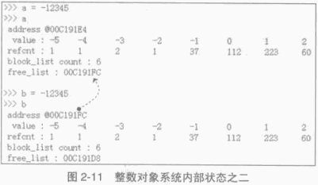
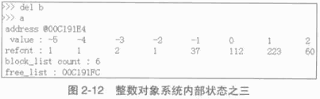

##############################################################################
Python 源码阅读系列 4
##############################################################################

.. contents::

******************************************************************************
第 2 章  Python 中的整数对象
******************************************************************************

2.2 PyIntObject 对象的创建和维护
==============================================================================

2.2.4 添加和删除
------------------------------------------------------------------------------

2.2.4.2 创建通用整数对象池
^^^^^^^^^^^^^^^^^^^^^^^^^^^^^^^^^^^^^^^^^^^^^^^^^^^^^^^^^^^^^^^^^^^^^^^^^^^^^^

.. code-block:: c 

    [Objects/intobject.c]

    static PyIntObject *
    fill_free_list(void)
    {
        PyIntObject *p, *q;
        /* Python's object allocator isn't appropriate for large blocks. */
        // [1]: 申请大小为 sizeof(PyIntBlock) 的内存空间，并链接到已有的 block_list 中
        p = (PyIntObject *) PyMem_MALLOC(sizeof(PyIntBlock));
        if (p == NULL)
            return (PyIntObject *) PyErr_NoMemory();
        ((PyIntBlock *)p)->next = block_list;
        block_list = (PyIntBlock *)p;
        /* Link the int objects together, from rear to front, then return
        the address of the last int object in the block. */
        // [2]: 将PyIntBlock 中的 PyIntObject 数组--objects--转变成单向链表
        p = &((PyIntBlock *)p)->objects[0];
        q = p + N_INTOBJECTS;
        while (--q > p)
            q->ob_type = (struct _typeobject *)(q-1);
        q->ob_type = NULL;
        return p + N_INTOBJECTS - 1;
    }

在 fill_free_list 中 ， 会首先在 [1] 处申请一个新的 PyIntBlock 结构 。 如图 2-4 。  

.. image:: img/2-4.png

注意 : 图中的虚线并表示指针关系 ， 虚线表示 objects 的更详细的表示方式 。 

这时 block 中的 objects 还仅仅是一个 PyIntObject 对象的数组 ， 然后 Python 将 \
objects 中的所有 PyIntObject 对象通过指针依次连接起来 ， 从而将数组变成一个单向链\
表 ， 这就是 [2] 处的行为 。 从 objects 数组最后一个元素开始链接 ， 在链接过程中 \
， Python 使用了 PyObject 中的 ob_type 指针作为链接指针 。 

图 2-5 展示了 [2] 处的链表转换动作完成之后的 block ， 其中用虚线箭头展示了 [2] 开始\
时 p 和 q 的初始状态 。 当链表转换完成之后 ， free_list 也出现在它该出现的位置 。 \
从 free_list 开始 ， 沿着 ob_type 指针 ， 就可以遍历刚刚创建的 PyIntBlock 中所有空\
闲的为 PyIntBlock 准备的内存了 。 

.. image:: img/2-5.png

当一个 block 中还有剩余的内存没有被一个 PyIntBlock 占用时 ， free_list 就不会指向 \
NULL 。 这种情况下调用 PyInt_FromLong 不会申请新的 block 。 只有当所有 block 中的\
内存都被占用了 ， PyInt_FromLong 才会再次调用 fill_free_list 申请新的空间 ， 为新\
的 PyIntObject 创建新的家园 。 

Python 通过 block_list 维护整个整数对象的通用对象池 。 新创建的 block 必须加入到 \
block_list 所维护的链表中 ， 这个动作在 [1] 处完成 。 图 2-6 显示了两次申请 block \
后 block_list 所维护的链表的情况 。 block_list 始终指向最新创建的 PyIntBlock 对象 。

.. image:: img/2-6.png

2.2.4.3 使用通用整数对象池
^^^^^^^^^^^^^^^^^^^^^^^^^^^^^^^^^^^^^^^^^^^^^^^^^^^^^^^^^^^^^^^^^^^^^^^^^^^^^^

在 PyInt_FromLong 中 ， 必要的空间申请之后 ， Python 会从当前有 free_list 所维护\
的自由内存链表中划出一块 ， 并在这块内存上创建所需要的新的 PyIntObject 对象 ， 同时 \
， 还会对 PyIntObject 对象完成必要的初始化工作 。 Python 还将调整 free_list 指针 \
， 使其指向下一块还没有被使用的内存 。 

在图 2-6 中 ， 两个 PyIntBlock 处于同一个链表中 ， 但是每个 PyIntBlock 中至关重要\
的存放 PyIntObject 对象的 objects 却是分离的 ， 这样的结构存在着隐患 ： 

现有两个 PyIntBlock 对象 ， PyIntBlock1 和 PyIntBlock2 ， PyIntBlock1 中的 \
objects 已经被 PyIntObject 对象填满 ， 而 PyIntBlock2 中的 object 只填充了一部分 \
。 所以现在 free_list 指针指向的是 PyIntBlock2.objects 中空闲的内存块 。 假设现在 \
PyIntBlock1.objects 中的一个 PyIntObject 对象被删除了 ， 这意味着 PyIntBlock1 中\
出现了一块空闲的内存 ， 那么下次创建新的 PyIntObject 对象时应该使用 PyIntBlock1 中\
的这块内存 。 倘若不然 ， 就意味着所有的内存只能使用一次 ， 这跟内存泄漏也没什么区别\
了 。 

实际上 ， 不同 PyIntBlock 对象的 objects 中空闲的内存块是被链接在一起的 ， 形成了一\
个单向链表 ， 指向表头的指针正是 free_list 。 不同 PyIntBlock 中的空闲内存块是在 \
PyIntObject 对象被销毁的时候被链接在一起的 。 

在 Python 对象机制中 ， 每个对象都有一个引用计数与之相关联 ， 当这个引用计数减为 0 \
时 ， 就意味着这个世上再也没有谁需要它了 ， 于是 Python 会负责将这个对象销毁 。 \
Python 中不同对象在销毁时会进行不同的动作 ， 销毁动作在与对象对应的类型对象中被定义 \
， 这个关键的操作就是类型对象中的 tp_dealloc 。 看一下 PyIntObject 对象的 \
tp_dealloc 操作 ： 

.. code-block:: c 

    [Objects/intobject.c]

    static void
    int_dealloc(PyIntObject *v)
    {
        if (PyInt_CheckExact(v)) {
            v->ob_type = (struct _typeobject *)free_list;
            free_list = v;
        }
        else
            v->ob_type->tp_free((PyObject *)v);
    }

由 block_list 维护的 PyIntBlock 链表中的内存实际上是所有的大整数对象共同分享的 。 \
当一个 PyIntObject 对象被销毁时 ， 它所占用的内存并不会被释放 ， 而是继续被 Python \
保留着 。 但是这块内存在整数对象被销毁后变为了自由内存 ， 将来可供别的 PyIntObject \
使用 ， 所以 Python 应该将其链入了 free_list 所维护的自由内存链表 。 int_dealloc \
完成的就是这么一个简单的指针维护工作 。 这些动作是在销毁的对象确实是一个 PyIntObject \
对象时发生的 。 如果删掉的对象是一个整数的派生类的对象 ， 那么 int_dealloc 不做任何\
动作 ， 只是简单地调用派生类型中指定的 tp_free 。

在图 2-7 中相继创建和删除 PyIntObject 对象 ， 并展示了内存中的 PyIntObject 对象以\
及 free_list 指针的变化情况 。 在实际 Python 行为中 ， 创建 2，3，4 这样的整数对象 \
， 使用的实际上是 small_ints 这样的小整数对象池 ， 在这里仅仅是为了展示通用整数对象\
池的动态变化 ， 没有考虑实际使用的内存 。 

.. image:: img/2-7.png

不同 PyIntBlock 对象中空闲内存的互联也是在 int_dealloc 被调用时实现的 （白色表示空\
闲内存） ： 

.. image:: img/2-8.png

当一个整数对象的引用计数变为 0 时 ， 就会被 Python 回收 ， 但是在 int_dealloc 中 \
， 仅仅是将该整数对象的内存重新加入到自由内存链表中 。 也就是说 ， 在 int_dealloc \
中 ， 永远不会向系统堆交换任何内存 。 一旦系统堆中某块内存被 Python 申请用于整数对\
象 ， 那么这块内存在 Python 结束之前永远不会被释放 。 

2.2.5 小整数对象池的初始化
------------------------------------------------------------------------------

小整数对象池 small_ints 维护的只是 PyIntObject 的指针 ， 完成小整数对象的创建和初\
始化的函数是 _PyInt_Init 。

.. code-block:: c 

    [Objects/intobject.c]

    int
    _PyInt_Init(void)
    {
        PyIntObject *v;
        int ival;
    #if NSMALLNEGINTS + NSMALLPOSINTS > 0
        for (ival = -NSMALLNEGINTS; ival < NSMALLPOSINTS; ival++) {
                if (!free_list && (free_list = fill_free_list()) == NULL)
                return 0;
            /* PyObject_New is inlined */
            v = free_list;
            free_list = (PyIntObject *)v->ob_type;
            PyObject_INIT(v, &PyInt_Type);
            v->ob_ival = ival;
            small_ints[ival + NSMALLNEGINTS] = v;
        }
    #endif
        return 1;
    }

从小整数的创建过程中可以看到 ， 这些小整数对象也是生存在 block_list 所维护的内存上 \
。 在 Python 初始化的时候 ， _PyInt_Init 被调用 ， 内存被申请 ， 小整数对象被创建 。

.. image:: img/2-9.png

2.3 Hack PyIntObject
==============================================================================

来修改 int_print 行为 ， 使其打印关于 block_list 和 free_list 的信息 ， 以及小整\
数缓冲池的信息 ： 

.. code-block:: c 

    [Objects/intobject.c]

    static int
    int_print(PyIntObject *v, FILE *fp, int flags)
        /* flags -- not used but required by interface */
    {
        fprintf(fp, "%ld", v->ob_ival);
        return 0;
    }

    [修改后]

    static int values[10];
    static int refcounts[10];
    static int int_print(PyIntObject *v, FILE *fp, int flags)
    {
        PyIntObject* intObjectPtr;
        PyIntBlock *p = block_list;
        PyIntBlock *last = NULL;
        int count = 0;
        int i;

        while (p!= NULL)
        {
            ++count;
            last = p;
            p = p->next;
        }

        intObjectPtr = last->objects;
        intObjectPtr += N_INTOBJECTS - 1;
        printf(" address @%p\n", v);

        for (i=0; i<10; ++i, --intObjectPtr)
        {
            values[i] = intObjectPtr->ob_ival;
            refcounts[i] = intObjectPtr->ob_refcnt;
        }
        printf("  value : ");
        for (i=0; i<8; ++i)
        {
            printf("%d\t", values[i]);
        }
        printf("\n");

        printf("  refcnt : ");
        for (i=0; i<8; ++i)
        {
            printf("%d\t", refcounts[i]);
        }
        printf("\n");

        printf(" block_list count : %d\n", count);
        printf(" free_list : %p\n", free_list);

        return 0;
    }

在初始化小整数缓冲池时 ， 对于 block_list 及每个 PyIntBlock 的 objects ， 都是从\
后往前开始填充的 ， 所以在初始化完成后 ， -5 应该在最后一个 PyIntBlock 对象的 \
objects 内最后一块内存 ， 需要顺藤摸瓜一直找到最后一块内存才能观察从 -5 到 4 这 10 \
个小整数 。 

创建一个 PyIntObject 对象 -9999 ， 从图中可以看到 ， 小整数对象被 Python 自身使用\
多次 。 

.. image:: img/2-10.png

现在的 free_list 指向地址为 00C191E4 的内存 ， 根据对 PyIntObject 的分析 ， 那么\
下一个 PyIntObject 会在这个地址安身立命 。 再创建两个 PyIntObject 对象 ， 值分别\
为 -12345 ：

从图示可以看到 a 的地址正是创建 i 后 free_list 所指向的地址 ， 而 b 的地址也正是创\
建 a 后 free_list 所指的地址 。 虽然 a 和 b 的值都是一样的 ， 但是他们确实是两个完\
全没有关系的 PyIntObject 对象 ， 这点儿可以从内存地址上看清楚 。 

现在删除 b ， 结果如下 ：

删除 b 后 ， free_list 回退到 a 创建后 free_list 的位置 ， 这点儿与之前的分析是一\
致的 。 

最后看一下小整数对象的监控 ， 连续两次创建 PyIntObject 对象 -5 ， 结果如图所示 ：

.. image:: img/2-13.png

可以看到 ， 两次创建的 PyIntObject 对象 c1 和 c2 的地址都是 00AB5948 ， 这证明它\
们实际上是同一个对象 。 同时 ， 可以看到小整数对象池中 -5 的引用计数发生了变化 ， 这\
证明 c1 和 c2 实际上都是指向这个对象 。 此外 ， free_list 没有发生任何变化 ， 与分\
析相符 。

******************************************************************************
第 3 章  Python 中的字符串对象
******************************************************************************

再对 PyIntObject 的分析中 ， Python 中具有不可变长度数据的对象 （定长对象） 。 在 \
Python 中 ， 还大量存在着另一种对象 ， 即具有可变长度数据的对象 （变长对象） 。 与定\
长对象不同 ， 变长对象维护的数据的长度在对象定义时是不知道的 。 

整数对象 PyIntObject 其维护的数据的长度在对象定义时就已经确定了 ， 是一个 C 中 long \
变量的长度 ； 而可变对象维护的数据的长度只能在对象创建时才能确定 ， 例如只能在创建一\
个字符串或一个列表时才知道它们所维护的数据的长度 ， 在此之前 ， 一无所知 。

在变长对象中 ， 实际上还可以分为可变对象和不可变对象 。 可变对象维护的数据在对象被创\
建后还能变化 ， 比如一个 list 被创建后 ， 可以向其中添加元素或删除对象 ， 这些操作都\
会改变其维护的数据 ； 而不可变对象所维护的数据在对象创建之后就不能在改变了 ， 比如 \
Python 中的 string 和 tuple ， 它们都不支持添加或删除操作 。 

3.1 PyStringObject 与 PyString_Type
==============================================================================

在 Python 中 ， PyStringObject 是对字符串对象的实现 。 PyStringObject 是一个拥有\
可变长度内存的对象 。 对于两个不同的 PyStringObject 对象 ， 其内部所需的保存字符串\
内容的内存空间显然是不同的 。 同时 ， PyStringObject 对象是一个不变对象 。 当创建了\
一个 PyStringObject 对象之后 ， 该对象内部维护的字符串就不能在被改变了 。 这一特点\
使得 PyStringObject 对象可作为 dict 的键值 ， 但也使得一些字符串操作的效率大大降低 \
， 比如多个字符串的连接 。 PyStringObject 对象定义 ： 

.. code-block:: c  

    [Include/stringonject.h]

    typedef struct {
        PyObject_VAR_HEAD
        long ob_shash;
        int ob_sstate;
        char ob_sval[1];

        /* Invariants:
        *     ob_sval contains space for 'ob_size+1' elements.
        *     ob_sval[ob_size] == 0.
        *     ob_shash is the hash of the string or -1 if not computed yet.
        *     ob_sstate != 0 iff the string object is in stringobject.c's
        *       'interned' dictionary; in this case the two references
        *       from 'interned' to this object are *not counted* in ob_refcnt.
        */
    } PyStringObject;

在 PyStringObject 的定义中可以看到 ， 在 PyStringObject 的头部实际上是一个 \
PyObject_VAR_HEAD ， 其中有一个 ob_size 变量保存着对象中维护的可变长度内存的大小 \
。 虽然在 PyStringObject 的定义中 ， ob_sval 实际上是作为一个字符指针指向一段内存\
的 ， 这段内存保存着这个字符串对象所维护的实际字符串 ， 显然这段内存不会只是一个字节 \
。 这段内存的实际长度（字节） ， 正是有 ob_size 维护的 ， 这个机制是 Python 中所有\
变长对象的实现机制 。 

同 C 中的字符串一样 ， PyStringObject 内部维护的字符串在末尾必须以 '\0' 结尾 ， 但\
是由于字符串的实际长度是由 ob_size 维护的 ， 所以 PyStringObject 表示的字符串对象\
中间是可能出现字符 '\0' 的 ， 这与 C 语言不同 ， 因为在 C 中 ， 只要遇到了字符 \
'\0' 就认为一个字符串结束了 ， 所以实际上 ， ob_sval 指向的是一段长度为 ob_size \
+ 1 个字节的内存 ， 而且必须满足 ob_sval[ob_size] == '\0' 。

PyStringObject 中的 ob_shash 变量的作用是缓存该对象的 hash 值 ， 这样避免每一次都\
重新计算该字符串对象的 hash 值 。 如果一个 PyStringObject 对象还没有别计算过 hash \
值 ， 那么 ob_shash 的初始值是 -1 。 在后面 dict 中 ， 这个 hash 将会发挥巨大的作\
用 。 计算一个字符串对象的 hash 值时 ， 采用如下算法 ： 

.. code-block:: c

    [Objects/stringobject.c]

    static long
    string_hash(PyStringObject *a)
    {
        register Py_ssize_t len;
        register unsigned char *p;
        register long x;

        if (a->ob_shash != -1)
            return a->ob_shash;
        len = a->ob_size;
        p = (unsigned char *) a->ob_sval;
        x = *p << 7;
        while (--len >= 0)
            x = (1000003*x) ^ *p++;
        x ^= a->ob_size;
        if (x == -1)
            x = -2;
        a->ob_shash = x;
        return x;
    }

PyStringObject 对象的 ob_sstate 变量标记了该对象是否已经过 intern 机制的处理 ， \
关于 PyStringObject 的 intern 机制 ， 在后面会详细介绍 ， 在 Python 源码中的注释\
显示 ， 预存字符串的 hash 值和这里的 intern 机制将 Python 虚拟机的执行效率提升了 \
20% 。

下面列出了 PyStringObject 对应的类型对象 - PyString_Type ：

.. code-block:: c

    [Objects/stringobject.c]

    PyTypeObject PyString_Type = {
        PyObject_HEAD_INIT(&PyType_Type)
        0,
        "str",
        sizeof(PyStringObject),
        sizeof(char),
        string_dealloc, 			/* tp_dealloc */
        (printfunc)string_print, 		/* tp_print */
        0,					/* tp_getattr */
        0,					/* tp_setattr */
        0,					/* tp_compare */
        string_repr, 				/* tp_repr */
        &string_as_number,			/* tp_as_number */
        &string_as_sequence,			/* tp_as_sequence */
        &string_as_mapping,			/* tp_as_mapping */
        (hashfunc)string_hash, 			/* tp_hash */
        0,					/* tp_call */
        string_str,				/* tp_str */
        PyObject_GenericGetAttr,		/* tp_getattro */
        0,					/* tp_setattro */
        &string_as_buffer,			/* tp_as_buffer */
        Py_TPFLAGS_DEFAULT | Py_TPFLAGS_CHECKTYPES |
            Py_TPFLAGS_BASETYPE,		/* tp_flags */
        string_doc,				/* tp_doc */
        0,					/* tp_traverse */
        0,					/* tp_clear */
        (richcmpfunc)string_richcompare,	/* tp_richcompare */
        0,					/* tp_weaklistoffset */
        0,					/* tp_iter */
        0,					/* tp_iternext */
        string_methods,				/* tp_methods */
        0,					/* tp_members */
        0,					/* tp_getset */
        &PyBaseString_Type,			/* tp_base */
        0,					/* tp_dict */
        0,					/* tp_descr_get */
        0,					/* tp_descr_set */
        0,					/* tp_dictoffset */
        0,					/* tp_init */
        0,					/* tp_alloc */
        string_new,				/* tp_new */
        PyObject_Del,	                	/* tp_free */
    };

在 PyStringObject 的类型对象中 ， tp_itemsize 被设置为 sizeof(char) ， 即一个字\
节 。 对于 Python 中的任何一种变长对象 ， tp_itemsize 这个域是必须设置的 ， \
tp_itemsize 指明了由变长对象保存的元素 (item) 的单位长度 ， 所谓单位长度即是指单一\
一个元素在内存中的长度 。 这个 tp_itemsize 和 ob_size 共同决定了应该额外申请的内存\
总大小是多少 。 tp_as_number 、 tp_as_sequence 、 tp_as_mapping 三个域都被设置了 \
， 表示 PyStringObject 对数值操作 ， 序列操作和映射操作都支持 。 

3.2 创建 PyStringObject 对象
==============================================================================

Python 提供了两条路径 ， 从 C 中原生的字符串创建 PyStringObject 对象 。 先看一下最\
一般的 PyString_FromString 。  

.. code-block:: C

    // [Objects/stringobject.c]

    PyObject *
    PyString_FromString(const char *str)
    {
        register size_t size;
        register PyStringObject *op;

        assert(str != NULL);
        size = strlen(str);
        if (size > PY_SSIZE_T_MAX) {
            PyErr_SetString(PyExc_OverflowError,
                "string is too long for a Python string");
            return NULL;
        }
        if (size == 0 && (op = nullstring) != NULL) {
    #ifdef COUNT_ALLOCS
            null_strings++;
    #endif
            Py_INCREF(op);
            return (PyObject *)op;
        }
        if (size == 1 && (op = characters[*str & UCHAR_MAX]) != NULL) {
    #ifdef COUNT_ALLOCS
            one_strings++;
    #endif
            Py_INCREF(op);
            return (PyObject *)op;
        }

        /* Inline PyObject_NewVar */
        op = (PyStringObject *)PyObject_MALLOC(sizeof(PyStringObject) + size);
        if (op == NULL)
            return PyErr_NoMemory();
        PyObject_INIT_VAR(op, &PyString_Type, size);
        op->ob_shash = -1;
        op->ob_sstate = SSTATE_NOT_INTERNED;
        Py_MEMCPY(op->ob_sval, str, size+1);
        /* share short strings */
        if (size == 0) {
            PyObject *t = (PyObject *)op;
            PyString_InternInPlace(&t);
            op = (PyStringObject *)t;
            nullstring = op;
            Py_INCREF(op);
        } else if (size == 1) {
            PyObject *t = (PyObject *)op;
            PyString_InternInPlace(&t);
            op = (PyStringObject *)t;
            characters[*str & UCHAR_MAX] = op;
            Py_INCREF(op);
        }
        return (PyObject *) op;
    }

    // 上述代码是 Python 2.5 源码，以下是书中的代码

    PyObject *
    PyString_FromString(const char *str)
    {
        register size_t size;
        register PyStringObject *op;

        // [1]: 判断字符串长度
        size = strlen(str);
        if (size > PY_SSIZE_T_MAX) {
            return NULL;
        }

        // [2]: 处理 NULL string
        if (size == 0 && (op = nullstring) != NULL) {
            return (PyObject *)op;
        }

        // [3]: 处理字符
        if (size == 1 && (op = characters[*str & UCHAR_MAX]) != NULL) {
            return (PyObject *)op;
        }

        /* Inline PyObject_NewVar */
        // [4]: 创建新的 PyStringObject 对象， 并初始化
        op = (PyStringObject *)PyObject_MALLOC(sizeof(PyStringObject) + size);
        PyObject_INIT_VAR(op, &PyString_Type, size);
        op->ob_shash = -1;
        op->ob_sstate = SSTATE_NOT_INTERNED;
        Py_MEMCPY(op->ob_sval, str, size+1);
        /* share short strings */
        if (size == 0) {
            PyObject *t = (PyObject *)op;
            PyString_InternInPlace(&t);
            op = (PyStringObject *)t;
            nullstring = op;
            Py_INCREF(op);
        } else if (size == 1) {
            PyObject *t = (PyObject *)op;
            PyString_InternInPlace(&t);
            op = (PyStringObject *)t;
            characters[*str & UCHAR_MAX] = op;
            Py_INCREF(op);
        }
        return (PyObject *) op;
    }

未完待续...